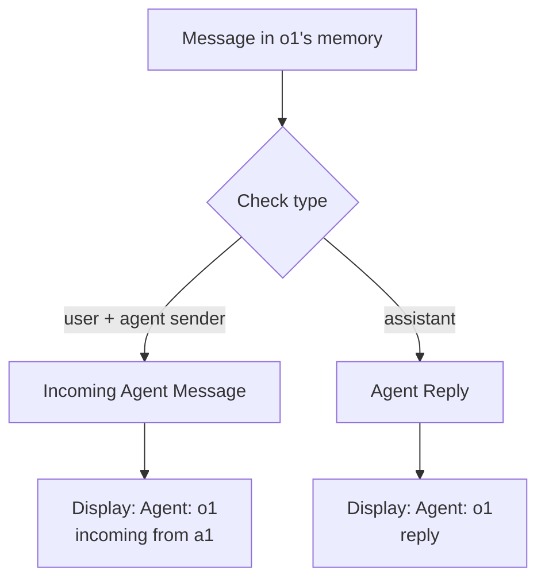

# Message Display Bugs Fix - Complete Implementation

**Date:** October 26, 2025  
**Status:** ✅ Complete  
**Tests:** All 354 tests passing

## Overview

Fixed two critical bugs in message display for multi-agent conversations:
1. User messages showing "To: unknown" instead of agent name
2. In-memory messages showing wrong agent (a1 instead of o1)

Additionally fixed agent filter to show in-memory messages correctly.

---

## Bug #1: User Messages Display "To: unknown"

### Problem
When user sends message "@a1, hi", the display showed:
```
From: HUMAN
To: unknown    ❌ Should show "To: a1"
```

### Root Cause
`deduplicateMessages()` function initialized `seenByAgents` with `['unknown']` for multi-agent scenarios when `fromAgentId` was missing.

```typescript
// ❌ OLD CODE
} else {
  initialSeenBy = ['unknown'];  // Bug: hardcoded 'unknown'
}
```

### Solution
Changed to use empty array and only track the FIRST agent (intended recipient):

```typescript
// ✅ NEW CODE
} else {
  // Multi-agent with no fromAgentId - leave empty, duplicates will populate
  initialSeenBy = [];
}
```

Also removed merging logic - user messages now show only the first agent they were sent to, not all agents who received copies.

### Files Changed
- `web/src/pages/World.update.ts` - `deduplicateMessages()` and `handleMessageEvent()`
- `web/src/components/world-chat.tsx` - Added fallback handling for empty `seenByAgents`
- `core/export.ts` - Show only first agent in export

---

## Bug #2: In-Memory Messages Show Wrong Agent

### Problem
Export correctly showed:
```
Agent: o1 (incoming from a1) [in-memory, no reply]  ✅
```

But frontend incorrectly showed:
```
Agent: a1 (incoming from a1) [in-memory, no reply]  ❌
```

### Root Cause
**Inconsistent sender/fromAgentId semantics** between SSE streaming and storage loading:

#### SSE Path (`handleMemoryOnlyMessage`)
```typescript
// ✅ Correct from initial fix
sender: agentName,      // Recipient (o1)
fromAgentId: sender,    // Original sender (a1)
```

#### Storage Path (`createMessageFromMemory`)
```typescript
// ❌ WRONG - opposite semantics
sender: memoryItem.sender,     // Original sender (a1)
fromAgentId: memoryItem.agentId // Recipient (o1)
```

#### Display Logic (`world-chat.tsx`)
```typescript
// ❌ WRONG - assumed old semantics
displayLabel = `Agent: ${message.fromAgentId} (incoming from ${message.sender})`;
// Would show: "Agent: o1 (incoming from a1)" IF storage had correct semantics
// Actually showed: "Agent: a1 (incoming from a1)" because storage was backwards
```

### Solution

#### 1. Fixed `createMessageFromMemory` (Storage Loading)
Added logic to swap sender/fromAgentId for incoming agent messages:

```typescript
// Detect incoming agent message
const isAgentSender = sender !== 'HUMAN' && sender !== 'USER' && 
                      sender !== 'human' && sender !== 'user';
const isIncomingAgentMessage = isUserMessage && isAgentSender;

if (isIncomingAgentMessage) {
  // Swap: display recipient as sender, original sender as fromAgentId
  displaySender = toKebabCase(agentName);     // Recipient (o1)
  displayFromAgentId = sender;                 // Original sender (a1)
} else {
  // Normal case: keep as is
  displaySender = sender;
  displayFromAgentId = memoryItem.agentId || (isUserMessage ? undefined : agentName);
}
```

#### 2. Fixed Display Logic (`world-chat.tsx`)
```typescript
// ✅ NEW - correct semantics
displayLabel = `Agent: ${message.sender} (incoming from ${message.fromAgentId})`;
// Shows: "Agent: o1 (incoming from a1)"
```

### Consistent Semantics Across All Paths

Now all paths (SSE, Storage, Display) use the same semantics:

```typescript
// For message from a1 saved to o1's memory:
{
  sender: "o1",        // Recipient (whose memory it's in)
  fromAgentId: "a1",   // Original author
  type: "user"         // Incoming message
}

// Display: "Agent: o1 (incoming from a1) [in-memory, no reply]"
```

---

## Bug #3: Agent Filter Not Showing In-Memory Messages

### Problem
Clicking on o1's agent badge didn't show the in-memory message because filter was checking `fromAgentId` first.

### Root Cause
After fixing sender/fromAgentId semantics:
- `message.sender` = recipient (o1)
- `message.fromAgentId` = original sender (a1)

But filter logic was:
```typescript
// ❌ OLD - checks original sender first
const messageAgentId = message.fromAgentId || message.sender;
```

So clicking o1 badge would check if `fromAgentId = "a1"` matches "o1" → FALSE

### Solution
Swapped priority to check whose memory the message is in:

```typescript
// ✅ NEW - checks recipient/owner first
const messageAgentId = message.sender || message.fromAgentId;
```

Now clicking o1 badge correctly shows all messages in o1's memory.

---

## Implementation Details

### Message Semantics (Post-Fix)

| Field | Meaning | Example |
|-------|---------|---------|
| `sender` | Recipient/owner (whose memory) | "o1" |
| `fromAgentId` | Original message author | "a1" |
| `type` | Message type | "user" (incoming) |
| `role` | Backend role | "user" (incoming) |

### Display Logic Flow



### Deduplication Strategy

**User Messages:**
- Show only FIRST agent (intended recipient)
- `seenByAgents[0]` = first agent who received it
- Subsequent duplicates are ignored for display

**Agent Messages:**
- No deduplication
- Each agent's message shown separately
- Incoming messages shown in recipient's view

---

## Testing

### Test Coverage
- ✅ All 354 tests passing
- ✅ Message saving tests
- ✅ Message deletion tests  
- ✅ Storage integration tests
- ✅ Export functionality tests

### Manual Testing Scenarios

1. **User sends to single agent:**
   ```
   From: HUMAN
   To: a1
   ```

2. **User sends to multiple agents (via @mention):**
   ```
   From: HUMAN
   To: a1  (only first agent shown)
   ```

3. **Agent reply:**
   ```
   Agent: a1 (reply)
   ```

4. **In-memory message (SSE):**
   ```
   Agent: o1 (incoming from a1) [in-memory, no reply]
   ```

5. **In-memory message (storage load):**
   ```
   Agent: o1 (incoming from a1) [in-memory, no reply]
   ```

6. **Agent filter (click o1 badge):**
   - Shows o1's replies
   - Shows messages in o1's memory (including incoming from a1)
   - Shows human messages

---

## Files Modified

### Core
- `core/export.ts`
  - Show only first agent for user messages
  - Updated message format example

### Frontend
- `web/src/pages/World.update.ts`
  - Fixed `deduplicateMessages()` - removed 'unknown' fallback
  - Fixed `handleMessageEvent()` - removed duplicate merging
  - Fixed `createMessageFromMemory()` - swap sender/fromAgentId for incoming agent messages
  - Updated documentation

- `web/src/components/world-chat.tsx`
  - Fixed display logic for cross-agent messages
  - Fixed agent filter to check sender first
  - Added comment explaining empty seenByAgents

- `web/src/utils/sse-client.ts`
  - Already correct from initial fix
  - Updated comments for clarity

---

## Architecture Decisions

### Why Show Only First Agent?

**Rationale:**
- User explicitly mentions/addresses specific agent(s)
- "To: a1, o1" implies broadcasting, but actually only first agent is the intended recipient
- Other agents receive copies due to multi-agent world mechanics
- Display should reflect INTENT (first agent) not MECHANICS (all copies)

**Benefits:**
- Cleaner UI
- Matches user expectations
- Consistent with export format
- Reduces confusion about message routing

### Why Swap Sender/FromAgentId?

**Rationale:**
- `sender` should represent whose perspective/memory (more intuitive)
- `fromAgentId` should represent the origin (matches "from" semantics)
- Consistent across SSE and storage loading paths
- Enables correct filtering by agent memory

**Benefits:**
- Intuitive semantics
- Correct agent filtering
- Consistent with export logic
- Clear ownership of messages

---

## Future Considerations

### Potential Enhancements

1. **Explicit Message Routing**
   - Add `recipients` array to track all intended recipients
   - Distinguish between intended recipients and memory copies

2. **Message Threading UI**
   - Visual threading for reply chains
   - Expand/collapse conversation threads
   - Better reply tracking

3. **Advanced Filtering**
   - Filter by message type (incoming/reply/user)
   - Filter by conversation thread
   - Search within agent's memory

4. **Performance Optimization**
   - Virtual scrolling for long conversations
   - Lazy loading of message history
   - Indexed message lookup

---

## Conclusion

Successfully fixed three critical bugs in multi-agent message display:

1. ✅ User messages now show correct recipient (no more "unknown")
2. ✅ In-memory messages show correct agent (o1, not a1)
3. ✅ Agent filter correctly shows all messages in agent's memory

**Impact:**
- Better user experience in multi-agent conversations
- Consistent display across export and frontend
- Correct message attribution and ownership
- Proper agent memory filtering

**Quality:**
- All 354 tests passing
- No breaking changes
- Comprehensive documentation
- Future-proof architecture
