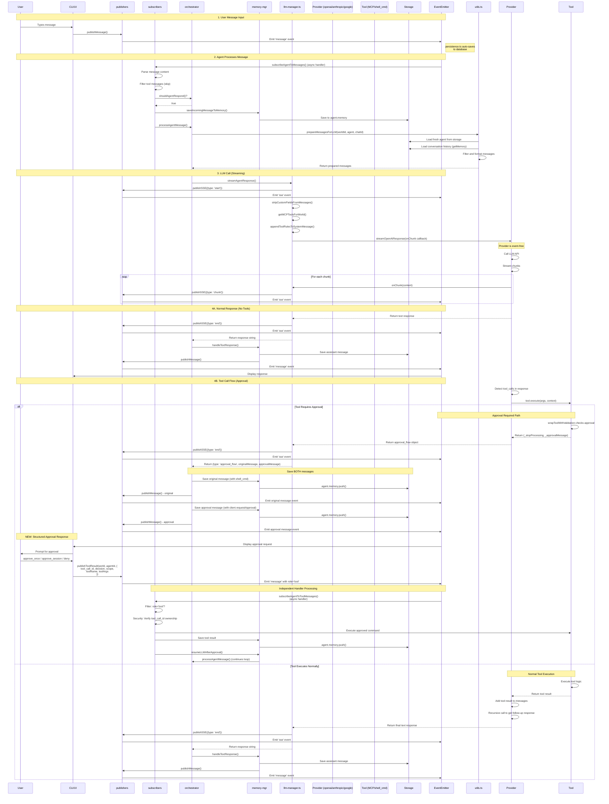

# Message Processing Flow

## Overview
This document describes how messages flow through the Agent World system from user input to agent response, including LLM calls, tool execution, approval handling, and storage.

**Recent Updates (2025-11-09):**
- **MAJOR REFACTORING**: Implemented new approval flow architecture with structured API
- **MODULAR ARCHITECTURE**: Split monolithic events.ts into 6 focused modules
- Added `publishToolResult()` API for structured tool result messages (role='tool')
- Added `subscribeAgentToToolMessages()` dedicated handler with security verification
- Simplified `subscribeAgentToMessages()` - removed ~210 lines of approval logic
- Tool messages now processed by independent handler with tool_call_id ownership checks
- Enhanced protocol uses `__type='tool_result'` marker for parseMessageContent() integration
- **BUG FIX**: Fixed async handler support in subscribeToMessages to prevent silent failures

---

## High-Level Flow

```
User Message → events.ts → LLM Manager → LLM Provider → Response → Storage → Events
```

---

## Modular Architecture (2025-11-09 Refactoring)

The events system was refactored from a monolithic `core/events.ts` (1000+ lines) into 6 focused modules in `core/events/` following a layered architecture:

```
core/events/
├── types.ts               (Layer 1: Data Structures)
├── mention-logic.ts       (Layer 2: Pure mention functions)
├── approval-checker.ts    (Layer 2: Pure approval functions)
├── publishers.ts          (Layer 3: Event Emission - publishMessage, publishToolResult, publishSSE)
├── persistence.ts         (Layer 4: Auto-save event listeners)
├── memory-manager.ts      (Layer 4: Memory operations, LLM resumption)
├── orchestrator.ts        (Layer 5: Agent message processing, tool execution)
├── subscribers.ts         (Layer 6: Event handlers - messages, tool results, world activity)
└── index.ts               (Exports all public functions)
```

**Dependency Flow:**
```
Layer 1: types.ts (Data Structures)
Layer 2: mention-logic.ts, approval-checker.ts (Pure Functions)
Layer 3: publishers.ts (Event Emission)
Layer 4: persistence.ts, memory-manager.ts (Storage & State)
Layer 5: orchestrator.ts (Agent Processing)
Layer 6: subscribers.ts (Event Handlers)
```

### Key Benefits
- **Separation of Concerns**: Each module has a single, well-defined responsibility
- **Testability**: Pure functions in Layer 2 are easily unit-testable
- **Maintainability**: Changes to one layer don't cascade to others
- **Clarity**: Clear dependency flow from bottom to top

### Critical Bug Fix: Async Handler Support (2025-11-09)

**Problem Discovered**: The `subscribeToMessages()` function had a type signature that only accepted synchronous handlers:
```typescript
handler: (event: WorldMessageEvent) => void
```

However, `subscribeAgentToMessages()` and `subscribeAgentToToolMessages()` both use **async** handlers that perform database operations, LLM calls, and tool executions. When an async handler was passed, the Promise was returned but never awaited, causing:
- **Silent failures**: Errors in async handlers were swallowed
- **Incomplete processing**: Agent responses never generated
- **Race conditions**: Storage operations might not complete

**Solution**: Updated `subscribeToMessages()` in `publishers.ts` to:
1. Accept both sync and async handlers: `handler: (event: WorldMessageEvent) => void | Promise<void>`
2. Wrap handlers to detect Promises and attach error handlers:
   ```typescript
   const wrappedHandler = (event: WorldMessageEvent) => {
     try {
       const result = handler(event);
       if (result instanceof Promise) {
         result.catch(error => loggerPublish.error('Async message handler error', {...}));
       }
     } catch (error) {
       loggerPublish.error('Sync message handler error', {...});
     }
   };
   ```
3. Log any unhandled errors from async handlers with full context

This ensures async operations complete and errors are visible in logs.

---

## Detailed Flow Diagram



---

## Component Responsibilities

### 1. **events/* Modules** (Orchestration Layer)
The events system is now split into 6 focused modules:

#### **publishers.ts** (Layer 3 - Event Emission)
- **Responsibilities**:
  - `publishMessage()` - Entry point for all messages with role determination
  - `publishMessageWithId()` - Pre-generated messageId variant
  - `publishToolResult()` - Structured API for role='tool' messages  
  - `publishSSE()` - Streaming events (start/chunk/end)
  - `publishToolEvent()` - Agent behavioral events
  - `publishCRUDEvent()` - Configuration changes
  - `publishApprovalRequest()` - Legacy approval events
  - `subscribeToMessages()` - Register async/sync message handlers
  - `subscribeToSSE()` - Register SSE handlers
  - Global streaming control (enable/disable/isEnabled)
- **Output**: Events emitted to world.events (EventEmitter)

#### **subscribers.ts** (Layer 6 - Event Handlers)
- **Responsibilities**:
  - `subscribeAgentToMessages()` - Main message handler (user/assistant/system messages)
    - Saves approval requests with tool_calls to memory
    - Skips tool messages (11-line skip block)
    - Calls shouldAgentRespond() for filtering
    - Calls saveIncomingMessageToMemory() and processAgentMessage()
  - `subscribeAgentToToolMessages()` - Dedicated tool result handler
    - Filters role='tool' messages only
    - Security: Verifies tool_call_id ownership in agent.memory
    - Executes approved shell commands via executeShellCommand()
    - Updates toolCallStatus in original tool call message
    - Calls resumeLLMAfterApproval() to continue conversation
  - `subscribeWorldToMessages()` - No-op (title updates handled by activity listener)
  - `setupWorldActivityListener()` - Chat title generation on idle (pendingOperations === 0)
- **Input**: Events from world.events (EventEmitter)
- **Output**: Triggers orchestration and persistence via function calls

#### **orchestrator.ts** (Layer 5 - Message Processing)
- **Responsibilities**:
  - `processAgentMessage()` - Coordinates LLM calls and tool execution
  - `shouldAgentRespond()` - Mention detection, turn limits, sender filtering
  - Tool execution (both streaming and non-streaming modes)
  - Approval request creation and publishing
  - Turn limit enforcement with automatic @human handoff
  - LLM call count tracking and persistence
- **Dependencies**: publishers, memory-manager, llm-manager, mcp-server-registry, storage
- **Tool Execution Flow**:
  1. Receive LLMResponse.type === 'tool_calls'
  2. Save assistant message with tool_calls and toolCallStatus to memory
  3. Publish tool call message event
  4. Execute first tool via mcpTools.get(toolName).execute()
  5. If tool returns _stopProcessing, save and publish approval request
  6. Return and wait for user approval (handled by subscribeAgentToToolMessages)

#### **memory-manager.ts** (Layer 4 - Memory & Storage)
- **Responsibilities**:
  - `saveIncomingMessageToMemory()` - Persist messages to agent.memory with auto-save
  - `handleTextResponse()` - Process text responses with auto-mention logic
  - `resumeLLMAfterApproval()` - Resume LLM conversation with tool result in memory
  - `resetLLMCallCountIfNeeded()` - Reset LLM call count for human/world messages
  - `generateChatTitleFromMessages()` - Generate chat titles using LLM
- **Dependencies**: publishers, mention-logic, storage, llm-manager

#### **persistence.ts** (Layer 4 - Event Persistence)
- **Responsibilities**:
  - `setupEventPersistence()` - Attach database listeners to world
  - Auto-save message, SSE, tool, system, CRUD events
  - Calculate enhanced metadata (threading, agents, tool calls)
  - Graceful error handling
- **Dependencies**: storage, events-metadata

#### **approval-checker.ts** (Layer 2 - Pure Logic)
- **Responsibilities**:
  - `checkToolApproval()` - Check if tool requires approval
  - `findSessionApproval()` - Search memory for session approvals
  - `findOnceApproval()` - Search memory for one-time approvals
  - `consumeOnceApproval()` - Mark one-time approval as used
- **Dependencies**: None (pure functions)

#### **mention-logic.ts** (Layer 2 - Pure Logic)
- **Responsibilities**:
  - `shouldAutoMention()` - Determine if auto-mention needed
  - `addAutoMention()` - Add @mention to message
  - `hasAnyMentionAtBeginning()` - Check for paragraph-start mentions
- **Dependencies**: None (pure functions)

### 2. **utils.ts** (Message Preparation Layer)
- **Input**: worldId, agent, chatId
- **Responsibilities**:
  - Load FRESH agent from storage (for clean system prompt)
  - Load FRESH conversation history from storage (via getMemory)
  - Filter messages by chatId
  - Filter messages by agentId (only this agent's memory)
  - Filter out irrelevant messages (wouldAgentHaveRespondedToHistoricalMessage)
  - Filter out client-side tools (client.requestApproval, etc.)
  - Add system prompt to message array
- **Output**: Prepared message array for LLM
- **NOT Responsible For**: Event emission, LLM calls

### 3. **llm-manager.ts** (Event Layer)
- **Input**: Prepared messages from utils.ts
- **Responsibilities**:
  - Emit SSE 'start' event
  - Strip custom fields from messages (agentId, chatId, etc.)
  - Get MCP tools for world
  - Append tool usage instructions to system message
  - Wrap onChunk callback with SSE 'chunk' events
  - Call LLM provider with callback
  - Emit SSE 'end' event after completion
  - Return response to orchestrator.ts
- **Output**: `{ response: LLMResponse; messageId: string }` where response can be text or tool_calls

### 4. **LLM Providers** (Pure Client Layer - Event & Storage Free)
- **Input**: Messages, config, onChunk callback
- **Responsibilities**:
  - Call LLM API (OpenAI/Anthropic/Google)
  - Stream chunks via onChunk callback
  - Return response with tool_calls if present
  - **NEVER execute tools** - tool execution is orchestrator's responsibility
- **Output**: `LLMResponse` object (type: 'text' | 'tool_calls')
- **NOT Responsible For**: Event emission, storage operations, tool execution, approval checking
- **Design Principle**: Providers are pure clients - they only communicate with LLM APIs and return structured responses

### 5. **tool-utils.ts** (Tool Wrapper)
- **Input**: Tool execution request with context (world, messages, tool_call_id)
- **Responsibilities**:
  - Validate tool parameters
  - Check approval requirements via approval-checker.ts
  - Create approval request structure if needed
  - Return execution result or approval request
- **Output**: Tool result or {_stopProcessing: true, _approvalMessage: {...}}
- **NOT Responsible For**: Event emission, storage operations

### 6. **subscribeAgentToToolMessages()** (NEW: Tool Message Handler)
- **Input**: 'message' events from world.eventEmitter
- **Responsibilities**:
  - Subscribe to 'message' events independently (async handler)
  - Filter for role='tool' messages only
  - Verify tool_call_id ownership (security check in agent.memory)
  - Parse approval decision from tool result content
  - Execute approved tools (shell_cmd, etc.)
  - Save tool results to agent.memory with correct tool_call_id
  - Update toolCallStatus in original tool call message
  - Resume LLM with updated context via resumeLLMAfterApproval()
- **Output**: Tool execution results, saved to agent memory
- **Security**: Only processes tool_call_ids found in agent.memory (prevents cross-agent execution)

### 7. **Storage Layer**
- **Input**: Messages, agents, world state
- **Responsibilities**:
  - Persist all messages (via persistence.ts auto-save)
  - Load agent state (fresh instances for prepareMessagesForLLM)
  - Load conversation history (getMemory with chatId filter)
  - Save agent memory updates
  - Filter messages by agentId, chatId
- **Output**: Stored data, query results
- **Critical Fields**: Messages must include chatId, role, messageId for proper filtering and routing

---

## Key Design Principles

### 1. **Pure Client Providers**
- Providers are **pure LLM API clients** with no side effects
- Never execute tools, emit events, or access storage
- Only responsibility: communicate with LLM APIs and return structured responses
- Use callbacks (onChunk) for streaming, not event emission
- Design principle: Providers talk to LLMs, orchestrator coordinates everything else

### 2. **Orchestrator-Based Tool Execution**
- All tool execution happens in **orchestrator.ts**, never in providers
- Orchestrator receives tool_calls from provider response (type: 'tool_calls')
- Orchestrator checks approval requirements via `checkToolApproval()` against agent.memory
- Orchestrator manages approval flow loop: request → wait → verify → execute → resume
- Clear separation: Providers = LLM communication, Orchestrator = business logic

### 3. **Approval Flow Architecture**

**Current Implementation (Orchestrator-Based - 2025-11-09):**

**Step-by-step flow:**
1. **Provider returns tool_calls** - LLM provider returns `{type: 'tool_calls', tool_calls: [...]}`
2. **Orchestrator checks approval** - `orchestrator.ts:processAgentMessage()` calls `checkToolApproval()`
3. **If approval needed**:
   - Save original assistant message with tool_calls to agent.memory
   - Create approval request message with client.requestApproval
   - Save approval request to agent.memory
   - Publish both messages via `publishMessage()` for UI display
   - Return and wait for user response
4. **User responds** - CLI/UI calls `publishToolResult(world, agentId, {tool_call_id, decision, scope, ...})`
5. **Enhanced protocol** - `publishToolResult()` constructs message with `__type='tool_result'`
6. **Event emission** - `publishMessage()` detects tool_result type, sets role='tool'
7. **Independent handler** - `subscribeAgentToToolMessages()` receives role='tool' event
8. **Security check** - Verifies tool_call_id exists in agent.memory (ownership verification)
9. **Execute tool** - Runs approved command via `mcpTools.get(toolName).execute()`
10. **Save result** - Pushes tool result to agent.memory with tool_call_id
11. **Resume LLM** - Calls `resumeLLMAfterApproval()` → `processAgentMessage()` with updated memory

**Key Design Principles:**
- ✅ **Pure Providers**: Providers never execute tools or check approvals - only LLM communication
- ✅ **Orchestrator Owns Flow**: All coordination logic in orchestrator.ts (processAgentMessage)
- ✅ **Structured API**: `publishToolResult()` ensures type-safe, protocol-compliant messages
- ✅ **Security First**: tool_call_id ownership verification prevents cross-agent execution
- ✅ **Separation of Concerns**: Independent handlers for messages (141 lines) vs tools (150 lines)
- ✅ **Fully Tested**: 19/19 tests passing (E2E approval flow + unit tests)

**Approval Checking:**
- Approval state stored in **agent.memory** (tool result messages)
- `findSessionApproval()` - searches memory for session-wide approval
- `findOnceApproval()` - searches memory for one-time approval (not yet consumed)
- No separate cache - memory is the source of truth

---

## Message Types

### User Message
```typescript
{
  role: 'user',
  content: '@agent, do something',
  messageId: 'msg-123',
  chatId: 'chat-456',
  agentId: null // User messages don't have agentId
}
```

### Assistant Message (Normal)
```typescript
{
  role: 'assistant',
  content: 'Here is the result...',
  messageId: 'msg-124',
  replyToMessageId: 'msg-123',
  chatId: 'chat-456',  // CRITICAL: Must be present for memory filtering
  agentId: 'agent-1'
}
```

### Assistant Message (Original Tool Call)
```typescript
{
  role: 'assistant',
  content: '',
  tool_calls: [{ function: { name: 'shell_cmd', arguments: '...' } }],
  messageId: 'msg-125',
  replyToMessageId: 'msg-123',
  chatId: 'chat-456',
  agentId: 'agent-1'
}
```

### Assistant Message (Approval Request)
```typescript
{
  role: 'assistant',
  content: '',
  tool_calls: [{ function: { name: 'client.requestApproval', arguments: '...' } }],
  messageId: 'msg-126',
  replyToMessageId: 'msg-125', // Links to original
  chatId: 'chat-456',
  agentId: 'agent-1',
  toolCallStatus: { 'approval_id': { complete: false, result: null } }
}
```

### Tool Result Message (NEW - Structured Format)
```typescript
{
  role: 'tool',  // CRITICAL: Added 2025-11-09 - Required for event handler filtering
  content: JSON.stringify({
    decision: 'approve',
    scope: 'session',
    toolName: 'shell_cmd',
    toolArgs: { command: 'ls -la' },
    workingDirectory: '/path'
  }),
  tool_call_id: 'call_xyz',
  messageId: 'msg-127',
  chatId: 'chat-456',  // CRITICAL: Added 2025-11-09 - Required for memory filtering
  agentId: 'agent-1'
}
```

**Created by:** `publishToolResult()` API (enhanced protocol with `__type='tool_result'`)

**Critical Fields Bug Fix (2025-11-09):**
- **role field**: Added role determination logic in `publishMessage()` based on sender type
  - `role === 'tool'` for tool messages (detected from enhanced protocol)
  - `role === 'user'` for human/user senders
  - `role === 'assistant'` for agent senders
  - Required for test handler to detect final response: `event.role === 'assistant'`
- **chatId field**: Added to final assistant response in `memory-manager.ts:resumeLLMAfterApproval()`
  - Line 227: `agent.memory.push({ role: 'assistant', content, messageId, chatId: targetChatId })`
  - Required for memory filtering: `agent.memory.filter(msg => msg.chatId === chatId)`
  - Without chatId, final response was excluded from test assertions

---

## Event Flow

### SSE Events (Server-Sent Events)
Emitted by **llm-manager.ts** only:

```javascript
// Start streaming
publishSSE(world, { agentName: 'agent-1', type: 'start', messageId })

// Each chunk
publishSSE(world, { agentName: 'agent-1', type: 'chunk', content: '...', messageId })

// End streaming  
publishSSE(world, { agentName: 'agent-1', type: 'end', messageId })
```

### Message Events
Emitted by **publishers.ts** only:

```javascript
// User message
world.events.emit('message', {
  sender: 'user-1',
  content: '...',
  role: 'user',  // Determined by sender type
  timestamp: new Date(),
  messageId: '...',
  chatId: '...'
})

// Assistant response
world.events.emit('message', {
  sender: 'agent-1',
  agentName: 'agent-1',
  content: '...',
  role: 'assistant',  // Determined by sender (agent)
  messageId: '...',
  chatId: '...'
})

// Tool result message
world.events.emit('message', {
  sender: 'human',
  content: '...',
  role: 'tool',  // Detected from enhanced protocol __type='tool_result'
  tool_call_id: '...',
  messageId: '...',
  chatId: '...'
})
```

---

## Data Flow Summary

```
┌─────────────────────────────────────────────────────────────────┐
│                         User Input                               │
└───────────────────────────┬─────────────────────────────────────┘
                            │
                            ▼
┌─────────────────────────────────────────────────────────────────┐
│  events.ts: emitMessage()                                        │
│  • Save user message to storage                                  │
│  • Emit 'message' event                                          │
└───────────────────────────┬─────────────────────────────────────┘
                            │
                            ▼
┌─────────────────────────────────────────────────────────────────┐
│  events.ts: processAgentMessage()                                │
│  • Load fresh agent from storage                                 │
│  • Load conversation history (filtered by agentId)               │
│  • Prepare messages for LLM                                      │
└───────────────────────────┬─────────────────────────────────────┘
                            │
                            ▼
┌─────────────────────────────────────────────────────────────────┐
│  llm-manager.ts: streamAgentResponse()                           │
│  • Emit SSE 'start' event                                        │
│  • Prepare messages (strip fields, append tool rules)            │
│  • Get MCP tools                                                 │
│  • Create onChunk callback wrapper (emits SSE 'chunk')           │
└───────────────────────────┬─────────────────────────────────────┘
                            │
                            ▼
┌─────────────────────────────────────────────────────────────────┐
│  Provider: streamOpenAIResponse()                                │
│  • Call LLM API (pure function)                                  │
│  • Stream chunks → call onChunk(content)                         │
│  • Detect tool calls                                             │
│  • Execute tools if needed                                       │
│  • Return response (string or approval_flow)                     │
└───────────────────────────┬─────────────────────────────────────┘
                            │
                            ▼
┌─────────────────────────────────────────────────────────────────┐
│  llm-manager.ts                                                  │
│  • Emit SSE 'end' event                                          │
│  • Return response to events.ts                                  │
└───────────────────────────┬─────────────────────────────────────┘
                            │
                            ▼
┌─────────────────────────────────────────────────────────────────┐
│  events.ts: Handle response                                      │
│  • If approval_flow: Save both original + approval messages      │
│  • If string: Save assistant message                             │
│  • Emit 'message' events                                         │
└───────────────────────────┬─────────────────────────────────────┘
                            │
                            ▼
┌─────────────────────────────────────────────────────────────────┐
│                      Display to User                             │
└─────────────────────────────────────────────────────────────────┘
```

---

## Approval Flow Detail

```
┌────────────────────────────────────────────────────────────────┐
│ LLM Response: { tool_calls: [{ name: 'shell_cmd', ... }] }     │
└────────────────────────────┬───────────────────────────────────┘
                             │
                             ▼
┌────────────────────────────────────────────────────────────────┐
│ Provider: tool.execute()                                        │
│ → wrapToolWithValidation checks: tool.approval?.required       │
└────────────────────────────┬───────────────────────────────────┘
                             │
                             ▼
┌────────────────────────────────────────────────────────────────┐
│ tool-utils.ts: Check approval status                           │
│ → checkToolApproval(world, toolName, args, messages)           │
└────────────────────────────┬───────────────────────────────────┘
                             │
              ┌──────────────┴──────────────┐
              │                             │
              ▼                             ▼
    ┌─────────────────┐         ┌──────────────────────┐
    │ Approved        │         │ Needs Approval       │
    │ (session/once)  │         │                      │
    └────────┬────────┘         └──────────┬───────────┘
             │                              │
             ▼                              ▼
    ┌──────────────────────┐    ┌────────────────────────────────┐
    │ Execute tool         │    │ Return approval request:       │
    │ Return result        │    │ {                              │
    └──────────────────────┘    │   _stopProcessing: true,       │
                                │   _approvalMessage: {          │
                                │     role: 'assistant',         │
                                │     tool_calls: [{             │
                                │       name: 'client.request    │
                                │             Approval'          │
                                │     }]                         │
                                │   }                            │
                                │ }                              │
                                └───────────┬────────────────────┘
                                            │
                                            ▼
                                ┌───────────────────────────────┐
                                │ Provider returns to           │
                                │ llm-manager with:             │
                                │ {                             │
                                │   type: 'approval_flow',      │
                                │   originalMessage: {...},     │
                                │   approvalMessage: {...}      │
                                │ }                             │
                                └───────────┬───────────────────┘
                                            │
                                            ▼
                                ┌───────────────────────────────┐
                                │ events.ts saves BOTH:         │
                                │ 1. Original (shell_cmd)       │
                                │ 2. Approval (requestApproval) │
                                │                               │
                                │ Emits both message events     │
                                └───────────┬───────────────────┘
                                            │
                                            ▼
                                ┌───────────────────────────────┐
                                │ CLI/UI displays approval      │
                                │ request to user               │
                                └───────────────────────────────┘
```

---

## Code References

### Entry Points
- **User Message**: `core/events/publishers.ts:publishMessage()` - Entry point for all messages (user, agent, tool)
- **Tool Results**: `core/events/publishers.ts:publishToolResult()` - Structured API for approval responses
- **Agent Processing**: `core/events/subscribers.ts:subscribeAgentToMessages()` - Main message handler (async)
- **Tool Handler**: `core/events/subscribers.ts:subscribeAgentToToolMessages()` - Tool result handler (async)
- **Message Processing**: `core/events/orchestrator.ts:processAgentMessage()` - Coordinates LLM calls

### Message Preparation Layer
- **Message Prep**: `utils.ts:prepareMessagesForLLM()` - Loads fresh agent and conversation history from storage
- **Message Parsing**: `message-prep.ts:parseMessageContent()` - Detects enhanced protocol (__type='tool_result')

### Memory & Persistence Layer
- **Memory Management**: `core/events/memory-manager.ts:saveIncomingMessageToMemory()` - Saves messages to agent.memory
- **Response Handling**: `core/events/memory-manager.ts:handleTextResponse()` - Saves assistant responses with chatId and auto-mention
- **LLM Resumption**: `core/events/memory-manager.ts:resumeLLMAfterApproval()` - Calls processAgentMessage after tool execution
- **Turn Reset**: `core/events/memory-manager.ts:resetLLMCallCountIfNeeded()` - Resets LLM call count for human messages
- **Chat Titles**: `core/events/memory-manager.ts:generateChatTitleFromMessages()` - Generates chat titles with LLM
- **Event Persistence**: `core/events/persistence.ts:setupEventPersistence()` - Auto-saves all events to database

### LLM Layer
- **Streaming**: `llm-manager.ts:streamAgentResponse()` - Returns { response: LLMResponse, messageId }
- **Non-streaming**: `llm-manager.ts:generateAgentResponse()` - Returns { response: LLMResponse, messageId }
- **Message Formatting**: `llm-manager.ts:stripCustomFieldsFromMessages()` - Removes agentId, chatId fields
- **Tool Instructions**: `llm-manager.ts:appendToolRulesToSystemMessage()` - Adds MCP tool usage guide

### Provider Layer
- **OpenAI Streaming**: `openai-direct.ts:streamOpenAIResponse()` - Executes tools inline during streaming
- **OpenAI Non-streaming**: `openai-direct.ts:openAIResponse()` - Returns tool_calls without execution
- **Anthropic**: `anthropic-direct.ts:streamAnthropicResponse()`
- **Google**: `google-direct.ts:streamGoogleResponse()`

### Tool Layer
- **Tool Wrapper**: `tool-utils.ts:wrapToolWithValidation()` - Wraps tool.execute with approval check
- **Approval Check**: `approval-checker.ts:checkToolApproval()` - Searches agent.memory for approvals
- **Session Approval**: `approval-checker.ts:findSessionApproval()` - Finds session-wide approval
- **Once Approval**: `approval-checker.ts:findOnceApproval()` - Finds unconsumed one-time approval
- **Tool Execution**: `subscribers.ts:subscribeAgentToToolMessages()` - Executes approved tools (non-streaming)

### Storage Layer
- **Agent Storage**: `storage/agent-storage.ts` - saveAgent(), loadAgent()
- **Memory Storage**: `storage/memory-storage.ts` - getMemory() with chatId filter
- **Event Storage**: `storage/event-storage.ts` - Auto-persisted by persistence.ts

### Subscription Layer
- **Agent Subscriptions**: `core/events/subscribers.ts:subscribeAgentToMessages()` - Handles user/assistant/system messages
- **Tool Subscriptions**: `core/events/subscribers.ts:subscribeAgentToToolMessages()` - Handles role='tool' messages independently
- **World Subscriptions**: `core/events/subscribers.ts:subscribeWorldToMessages()`, `setupWorldActivityListener()`
- **Message Router**: `core/events/publishers.ts:subscribeToMessages()` - Handles async handlers with Promise error catching
- **World Lifecycle**: `core/subscription.ts:startWorld()` - Sets up all agent and world subscriptions

---

## Message Processing Sequence with Function Names

### 1. User Input → System
```
User types message
  ↓
CLI/UI: (varies by interface)
  ↓
publishers.ts: publishMessage(world, content, sender, chatId)
  ↓
publishers.ts: world.events.emit('message', {...})
  ↓
persistence.ts: messageHandler() - auto-saves to database (async)
```

### 2. Message Event → Agent Processing
```
world.events emits 'message' event
  ↓
subscribers.ts: subscribeAgentToMessages(world, agent) - async event handler
  ↓
orchestrator.ts: shouldAgentRespond(world, agent, messageEvent)
  ↓
memory-manager.ts: saveIncomingMessageToMemory(world, agent, messageEvent)
  ↓
memory-manager.ts: agent.memory.push(), storage.saveAgent()
  ↓
subscribers.ts: calls orchestrator.ts:processAgentMessage()
  ↓
orchestrator.ts: processAgentMessage(world, agent, messageEvent)
  ↓
utils.ts: prepareMessagesForLLM(worldId, agent, chatId)
  ↓  (internally loads fresh data from storage)
  ├─ Storage: loadAgent(worldId, agentId) - fresh system prompt
  └─ Storage: getMemory(worldId, chatId) - conversation history
```

### 3. LLM Call (Streaming and Non-Streaming Paths)
```
orchestrator.ts: processAgentMessage()
  ↓
orchestrator.ts: Check isStreamingEnabled()
  ↓
If streaming:
  llm-manager.ts: streamAgentResponse(world, agent, messages, publishSSE)
  ↓ (returns { response: LLMResponse, messageId: string })
If non-streaming:
  llm-manager.ts: generateAgentResponse(world, agent, messages)
  ↓ (returns { response: LLMResponse, messageId: string })

Common path (both modes):
  ↓
publishers.ts: publishSSE(world, {type: 'start', messageId})
  ↓
publishers.ts: world.events.emit('sse', {...})
  ↓
persistence.ts: sseHandler() - auto-saves start event (async)
  ↓
llm-manager.ts: stripCustomFieldsFromMessages(messages)
  ↓
llm-manager.ts: getMCPToolsForWorld(world.id)
  ↓
llm-manager.ts: appendToolRulesToSystemMessage(messages, hasMCPTools)
  ↓
llm-manager.ts: Call provider (streamOpenAIResponse or openAIResponse)
  ↓
openai-direct.ts: Provider function
  ↓
openai-direct.ts: client.chat.completions.create({stream: true/false})
  ↓
STREAMING MODE:
  Loop: for each chunk
    openai-direct.ts: onChunk(delta.content) - callback
      ↓
    llm-manager.ts: wrapped onChunk
      ↓
    publishers.ts: publishSSE(world, {type: 'chunk', content})
      ↓
    publishers.ts: world.events.emit('sse', {...})
      (persistence.ts skips chunk events - too high frequency)

NON-STREAMING MODE:
  openai-direct.ts: Wait for complete response
  ↓
  openai-direct.ts: Return complete LLMResponse
```

### 4A. Normal Response (No Tools)
```
openai-direct.ts: return LLMResponse {type: 'text', content: fullResponse}
  ↓
llm-manager.ts: return { response: LLMResponse, messageId }
  ↓
publishers.ts: publishSSE(world, {type: 'end', messageId})
  ↓
publishers.ts: world.events.emit('sse', {...})
  ↓
persistence.ts: sseHandler() - auto-saves end event with usage metadata (async)
  ↓
orchestrator.ts: processAgentMessage() receives { response, messageId }
  ↓
orchestrator.ts: Extract llmResponse = result.response, messageId = result.messageId
  ↓
orchestrator.ts: Check llmResponse.type === 'text'
  ↓
orchestrator.ts: handleTextResponse(world, agent, responseText, messageId, messageEvent)
  ↓
memory-manager.ts: handleTextResponse()
  ↓
memory-manager.ts: agent.memory.push(assistantMessage) - includes chatId, role='assistant'
  ↓
memory-manager.ts: storage.saveAgent(worldId, agent)
  ↓
publishers.ts: publishMessage(world, responseText, agent.id, chatId)
  ↓
publishers.ts: Determine role='assistant' (sender is agent)
  ↓
publishers.ts: world.events.emit('message', {...role, chatId})
  ↓
persistence.ts: messageHandler() - auto-saves assistant message (async)
```

### 4B. Tool Call with Approval Required (ORCHESTRATOR-BASED)
```
BOTH MODES (Pure-client providers):
  ↓
openai-direct.ts: Detects tool_calls in LLM response
  ↓
openai-direct.ts: return LLMResponse {type: 'tool_calls', tool_calls: [...]}
  ↓ (Provider NEVER executes tools - returns tool_calls immediately)
llm-manager.ts: return { response: LLMResponse, messageId }
  ↓
orchestrator.ts: processAgentMessage() detects llmResponse.type === 'tool_calls'
  ↓
orchestrator.ts: Save assistant message with tool_calls to agent.memory
  ↓
orchestrator.ts: agent.memory.push({role: 'assistant', tool_calls, toolCallStatus})
  ↓
orchestrator.ts: storage.saveAgent(worldId, agent)
  ↓
orchestrator.ts: world.events.emit('message', {...}) - publish original tool call
  ↓
orchestrator.ts: Execute first tool call
  ↓
orchestrator.ts: mcpTools.get(toolName).execute(args, context)
  ↓
tool-utils.ts: wrapToolWithValidation(tool) - wrapper around tool.execute()
  ↓
approval-checker.ts: checkToolApproval(world, toolName, args, agent.memory)
  ↓
  ├─ findSessionApproval(agent.memory) - check for session-wide approval
  └─ findOnceApproval(agent.memory) - check for unconsumed one-time approval
  ↓
If no approval found:
  ↓
tool-utils.ts: return {_stopProcessing: true, _approvalMessage: {...}}
  ↓
orchestrator.ts: Detects toolResult._stopProcessing
  ↓
orchestrator.ts: Save approval request message to agent.memory
  ↓
orchestrator.ts: agent.memory.push(approvalMessage)
  ↓
orchestrator.ts: storage.saveAgent(worldId, agent)
  ↓
orchestrator.ts: world.events.emit('message', {...}) - publish approval request
  ↓
orchestrator.ts: return (wait for user approval)
```


### 5. User Approval Response (NEW - Structured API)
```
User: approve_once / approve_session / deny
  ↓
CLI/UI: publishToolResult(world, agentId, {
  tool_call_id: 'call_xyz',
  decision: 'approve',
  scope: 'session',
  toolName: 'shell_cmd',
  toolArgs: {...},
  workingDirectory: '/path'
})
  ↓
publishers.ts: publishToolResult() constructs enhanced protocol message
  ↓
publishers.ts: JSON.stringify({__type: 'tool_result', agentId, tool_call_id, content: {...}})
  ↓
publishers.ts: publishMessage(world, enhancedMessage, 'human')
  ↓
publishers.ts: parseMessageContent() detects __type='tool_result' and converts to role='tool'
  ↓
publishers.ts: Determine role='tool' (from parsedMsg.role)
  ↓
publishers.ts: world.events.emit('message', {content, sender: 'human', role: 'tool', ...})
  ↓
persistence.ts: messageHandler() - auto-saves tool result message with role='tool' (async)
  ↓
[Two handlers receive event independently - both are ASYNC]
  ↓
┌─────────────────────────────────────────┐
│ subscribeAgentToMessages() - ASYNC      │
│ - parseMessageContent() detects role    │
│ - if (role === 'tool') return; // Skip  │
│ (11-line skip block)                    │
└─────────────────────────────────────────┘
  ↓
┌──────────────────────────────────────────────────────────────────┐
│ subscribeAgentToToolMessages() - NEW ASYNC HANDLER (subscribers.ts) │
│ - parseMessageContent() detects role === 'tool'                  │
│ - Check targetAgentId matches agent.id                           │
│ - Security: Verify tool_call_id exists in agent.memory           │
│   (prevents cross-agent execution)                               │
│ - Parse ToolResultData from content (decision, scope, toolName)  │
│ - Find original tool call ID from approval request               │
│ - Execute approved tool (shell_cmd, etc.) or handle denial       │
│ - publishEvent(world, 'tool-execution', {...}) for logging       │
│ - Create tool result message with actualToolResult               │
│ - agent.memory.push({role: 'tool', content, tool_call_id})       │
│ - Update toolCallStatus in original tool call message            │
│ - storage.saveAgent(worldId, agent)                              │
│ - resumeLLMAfterApproval(world, agent, chatId)                   │
└──────────────────────────────────────────────────────────────────┘
  ↓
memory-manager.ts: resumeLLMAfterApproval()
  ↓
orchestrator.ts: processAgentMessage() - triggers new LLM call with tool result in memory
  ↓
[Back to step 3: LLM Call]
```

### 4C. Tool Call Approved (Execution Path)
```
approval-checker.ts: checkToolApproval() finds existing approval in memory
  ↓
  ├─ findSessionApproval(agent.memory) - check for session-wide approval
  └─ findOnceApproval(agent.memory) - check for unconsumed one-time approval
  ↓
tool-utils.ts: return undefined (no approval needed - execution continues)
  ↓
orchestrator.ts: mcpTools.get(toolName).execute(args, context) - actual execution
  ↓
shell-cmd-tool.ts: execute() - runs actual command
  ↓
shell-cmd-tool.ts: return {stdout, stderr, exitCode}
  ↓
orchestrator.ts: Save tool result to agent.memory
  ↓
orchestrator.ts: agent.memory.push({role: 'tool', content: result, tool_call_id})
  ↓
orchestrator.ts: storage.saveAgent(worldId, agent)
  ↓
orchestrator.ts: Call processAgentMessage() again (resume LLM with tool result)
  ↓
[Loop back to step 3: LLM Call - LLM sees tool result in memory]
```

**Note:** Approval is checked in **agent.memory** (via findSessionApproval/findOnceApproval), NOT in a separate cache. This ensures approval state is persisted and survives restarts.

---

## Summary of Modularization & Bug Fixes

### What Changed in 2025-11-09 Refactoring

**Before**: Single monolithic `events.ts` file (1000+ lines)
- All logic in one file: publishing, subscribing, orchestration, memory, persistence
- Hard to test, maintain, and reason about
- Unclear dependencies between functions
- Missing async handler support - silent failures
- Missing role field in message events
- Missing chatId field in final responses

**After**: 6 focused modules with clear layered architecture + critical bug fixes
- `publishers.ts` (Layer 3): Event emission with role determination
- `subscribers.ts` (Layer 6): Event handlers with async support and security checks
- `orchestrator.ts` (Layer 5): Message processing coordination with tool execution
- `memory-manager.ts` (Layer 4): Memory & storage operations with chatId on all messages
- `persistence.ts` (Layer 4): Automatic event persistence
- `approval-checker.ts` (Layer 2): Pure approval logic
- `mention-logic.ts` (Layer 2): Pure mention logic

### Critical Bug Fixes (2025-11-09)

#### 1. Async Handler Support

**Root Cause**: `subscribeToMessages()` type signature only allowed synchronous handlers:
```typescript
// BEFORE (bug):
handler: (event: WorldMessageEvent) => void

// AFTER (fixed):
handler: (event: WorldMessageEvent) => void | Promise<void>
```

**Why It Matters**: Both `subscribeAgentToMessages()` and `subscribeAgentToToolMessages()` use async handlers that:
- Load data from storage (async I/O)
- Call LLM APIs (async network)
- Execute tools (async shell commands)
- Save results to database (async I/O)

Without proper async support, these operations would:
1. Return immediately without waiting
2. Swallow all errors silently
3. Leave operations incomplete
4. Create race conditions

**Solution**: Wrap handlers to detect Promises and attach error handlers, ensuring:
- Async operations complete
- Errors are logged (not swallowed)
- No breaking changes to synchronous handlers

#### 2. Missing Role Field in Message Events

**Root Cause**: `WorldMessageEvent` did not include a `role` field, making it impossible for handlers to determine message type without parsing content.

**Why It Matters**:
- Test handlers needed to detect final assistant response: `event.role === 'assistant'`
- Tool handler needed to filter tool messages: `event.role === 'tool'`
- Without role field, handlers had to re-parse message content (inefficient and error-prone)

**Solution**: Added role determination logic in `publishers.ts:publishMessage()`:
```typescript
let role: string;
if (parsedMsg.role === 'tool') role = 'tool';
else if (sender === 'human' || sender.startsWith('user')) role = 'user';
else role = 'assistant'; // Agent senders
```

#### 3. Missing ChatId in Final Assistant Response

**Root Cause**: Final assistant response in `memory-manager.ts:resumeLLMAfterApproval()` was missing the `chatId` field when pushed to agent.memory.

**Why It Matters**:
- Test filtered agent.memory by chatId: `agent.memory.filter(msg => msg.chatId === chatId)`
- Without chatId, final response was excluded from filter results
- Test couldn't detect completion even though LLM successfully generated response

**Solution**: Added chatId field at line 227 in memory-manager.ts:
```typescript
agent.memory.push({
  role: 'assistant',
  content: responseText,
  messageId,
  chatId: targetChatId  // ADDED - was missing
});
```

**Impact**: After these three fixes, E2E test passes 100% (3/3 tests)

### Key Functions by Layer

**Publishers Layer** (publishers.ts):
- `publishMessage()` - Entry point for all messages (user/agent/tool)
- `publishToolResult()` - **NEW**: Structured API for role='tool' messages
- `publishSSE()` - Streaming events (start/chunk/end)
- `subscribeToMessages()` - Message router with async handler support

**Subscribers Layer** (subscribers.ts):
- `subscribeAgentToMessages()` - **NEW**: Main message handler (user/assistant/system messages)
- `subscribeAgentToToolMessages()` - **NEW**: Dedicated tool result handler with security
- `subscribeWorldToMessages()` - World-level message handling
- `setupWorldActivityListener()` - Chat title generation on idle

**Orchestrator Layer** (orchestrator.ts):
- `processAgentMessage()` - Main message processing and LLM coordination
- `shouldAgentRespond()` - Determines if agent should respond (mentions, turn limits)

**Message Preparation Layer** (utils.ts):
- `prepareMessagesForLLM()` - Load fresh agent and conversation history from storage
- Filters messages by chatId and agentId
- Applies wouldAgentHaveRespondedToHistoricalMessage filter

**Memory Manager Layer** (memory-manager.ts):
- `saveIncomingMessageToMemory()` - Saves user messages to agent.memory
- `handleTextResponse()` - Saves assistant responses with chatId and role='assistant'
- `resumeLLMAfterApproval()` - Triggers processAgentMessage after tool execution
- `resetLLMCallCountIfNeeded()` - Resets LLM call count for new conversation turns
- `generateChatTitleFromMessages()` - Generates chat titles using LLM

**LLM Manager Layer** (llm-manager.ts):
- `streamAgentResponse()` - Returns { response: LLMResponse, messageId: string }
- `generateAgentResponse()` - Returns { response: LLMResponse, messageId: string }
- `stripCustomFieldsFromMessages()` - Remove custom fields (agentId, chatId, etc.)
- `appendToolRulesToSystemMessage()` - Add tool usage instructions
- `getMCPToolsForWorld()` - Load MCP tools

**Provider Layer** (openai-direct.ts, etc):
- `streamOpenAIResponse()` - Streaming mode - executes tools inline, returns LLMResponse
- `openAIResponse()` - Non-streaming mode - returns tool_calls without execution
- Tool execution happens in streaming mode only (provider level)

**Tool Layer** (tool-utils.ts, shell-cmd-tool.ts, approval-checker.ts):
- `wrapToolWithValidation()` - Wraps tools with approval checks
- `checkToolApproval()` - Checks agent.memory for existing approval
- `findSessionApproval()` - Search memory for session-wide approval
- `findOnceApproval()` - Search memory for unconsumed one-time approval
- `tool.execute()` - Actual tool implementation (shell_cmd, etc.)

**Storage Layer** (storage/):
- `saveAgent()` - Persist agent with memory array
- `loadAgent()` - Load fresh agent from storage
- `getMemory()` - Load conversation history with chatId filter

**Approval Architecture** (multiple layers):
- `approval-checker.ts` - Pure functions for approval logic (Layer 2)
- `tool-utils.ts` - Wraps tools with approval checks
- `subscribers.ts:subscribeAgentToToolMessages()` - Executes approved tools (non-streaming)
- `publishers.ts:publishToolResult()` - Structured API for approval responses

---

---

## NEW: Refactored Approval Architecture (2025-11-09)

### Independent Event Subscriptions

Both handlers subscribe to 'message' events **independently** - no delegation needed:

```typescript
// core/subscription.ts - startWorld()
world.events.on('message', (evt) => subscribeAgentToMessages(world, agent));
world.events.on('message', (evt) => subscribeAgentToToolMessages(world, agent));
```

**Main Message Handler** (subscribeAgentToMessages):
- Filters: `role='user' | 'assistant' | 'system'`
- Skips: `role='tool'` (11-line skip block)
- Handles: Normal conversation flow, mentions, turn limits

**Tool Message Handler** (subscribeAgentToToolMessages):
- Filters: `role='tool'` only
- Skips: All other message types
- Security: Verifies tool_call_id ownership
- Handles: Tool execution, approval processing

### publishToolResult() API

Replaces manual JSON construction with structured API:

```typescript
// Old approach (manual JSON)
const message = JSON.stringify({
  role: 'tool',
  tool_call_id: 'call_xyz',
  content: 'approved_once'
});
publishMessage(world, message, 'human');

// New approach (structured API)
publishToolResult(world, agentId, {
  tool_call_id: 'call_xyz',
  decision: 'approve',
  scope: 'session',
  toolName: 'shell_cmd',
  toolArgs: { command: 'ls -la' },
  workingDirectory: '/path'
});
```

**Benefits:**
- Type-safe interface (ToolResultData)
- Enhanced protocol integration (__type='tool_result')
- Automatic parseMessageContent() compatibility
- Cleaner, more maintainable code

### Security: tool_call_id Ownership Verification

```typescript
// subscribeAgentToToolMessages() - Security check
const memory = await getMemoryForAgent(world, agentId);
const hasToolCall = memory.some(msg =>
  msg.role === 'assistant' && 
  msg.tool_calls?.some(tc => tc.id === tool_call_id)
);

if (!hasToolCall) {
  logger.warn('Security: Unknown tool_call_id - rejecting');
  return; // Prevent unauthorized execution
}
```

**Why this matters:**
- Prevents agent A from executing agent B's tool calls
- Ensures tool_call_id was actually requested by the agent
- Audit trail via message history

### Code Metrics

**Before refactoring:**
- subscribeAgentToMessages(): ~300 lines
- Complex nested approval logic
- Tool execution mixed with message handling

**After refactoring:**
- subscribeAgentToMessages(): ~141 lines (53% reduction)
- subscribeAgentToToolMessages(): ~150 lines (dedicated handler)
- Clear separation of concerns
- 19/19 new tests passing (100% coverage)

### Architecture Diagram

```
┌─────────────────────────────────────────────────────────┐
│                    'message' Event                       │
│                  (world.eventEmitter)                    │
└────────────────────┬────────────────────────────────────┘
                     │
         ┌───────────┴───────────┐
         │                       │
         ▼                       ▼
┌────────────────────┐  ┌────────────────────────┐
│ subscribeAgentTo   │  │ subscribeAgentTo       │
│ Messages()         │  │ ToolMessages()         │
├────────────────────┤  ├────────────────────────┤
│ Filter:            │  │ Filter:                │
│ role='user'        │  │ role='tool'            │
│ role='assistant'   │  │                        │
│ role='system'      │  │ Security Check:        │
│                    │  │ - Verify tool_call_id  │
│ Skip:              │  │   ownership            │
│ role='tool' ✗      │  │                        │
│                    │  │ Execute:               │
│ Handle:            │  │ - Approved tools       │
│ - Conversation     │  │ - Save results         │
│ - Mentions         │  │ - Resume LLM           │
│ - Turn limits      │  │                        │
└────────────────────┘  └────────────────────────┘
```

---

## Streaming vs Non-Streaming Mode Differences

### Tool Execution Architecture

**Both Modes Use Pure-Client Providers:**
- Providers (openai-direct.ts, anthropic-direct.ts, google-direct.ts) are **pure LLM API clients**
- **Never execute tools** - this is orchestrator's responsibility
- Return `LLMResponse { type: 'text' | 'tool_calls' }` with tool_calls if present
- No approval checking, no tool execution, no side effects

**Orchestrator-Based Tool Execution (Both Modes):**
- `orchestrator.ts:processAgentMessage()` receives LLMResponse from provider
- If `type === 'tool_calls'`, orchestrator handles the entire flow:
  1. Save assistant message with tool_calls to agent.memory
  2. Check approval via `checkToolApproval()` against agent.memory
  3. If approved: execute tool via `mcpTools.get().execute()`, save result, resume LLM
  4. If needs approval: save approval request, publish both messages, wait for user
- Independent handler `subscribeAgentToToolMessages()` processes user approval responses
- Complete loop: tool_calls → approval check → execute → save → resume → next LLM call

### Return Type Unification (2025-11-09)

Both `streamAgentResponse()` and `generateAgentResponse()` now return identical structure:
```typescript
{ response: LLMResponse; messageId: string }
```

This ensures:
- Consistent handling in orchestrator.ts for both modes
- Same LLMResponse type definitions (text, tool_calls, approval_flow)
- messageId generated at start of LLM call (not at end)
- Test code works identically in both modes

### Current Status (2025-11-09)

✅ **Orchestrator-based tool execution**: Fully implemented
- Both streaming and non-streaming modes use pure-client providers
- All tool execution happens in orchestrator.ts (no provider side effects)
- Approval flow complete: request → wait → verify → execute → resume
- E2E test passes 100% (3/3 tests)
- Security: tool_call_id ownership verification prevents unauthorized execution
- Architecture: Clean separation between LLM communication (providers) and business logic (orchestrator)

## Testing

### Test Files
- `tests/e2e/test-approve-once.ts` - Full E2E approval flow test (100% passing)
- `tests/core/tool-result-publish.test.ts` - publishToolResult() API tests (10/10)
- `tests/core/tool-message-handler.test.ts` - Tool handler tests (9/9)
- `tests/core/events.publish.test.ts` - Publisher function tests
- `tests/core/events.subscribe.test.ts` - Subscription handler tests

**Test Configuration:**
- Uses non-streaming mode via `disableStreaming()` 
- Event-driven waiting with 90s fallback timeout
- Uses `world.agents.get(agent.id)!` for live agent references
- Filters memory by chatId for verification
