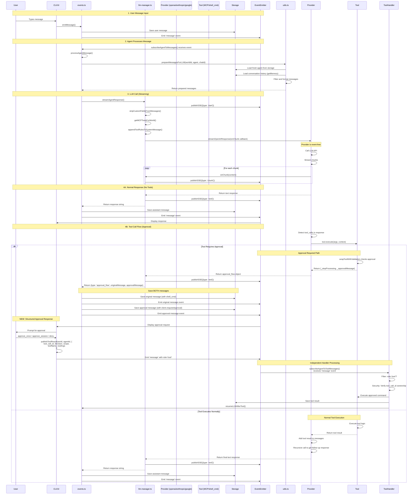

# Message Processing Flow

## Overview
This document describes how messages flow through the Agent World system from user input to agent response, including LLM calls, tool execution, approval handling, and storage.

**Recent Updates (2025-11-09):**
- **MAJOR REFACTORING**: Implemented new approval flow architecture with structured API
- Added `publishToolResult()` API for structured tool result messages (role='tool')
- Added `subscribeAgentToToolMessages()` dedicated handler with security verification
- Simplified `subscribeAgentToMessages()` - removed ~210 lines of approval logic
- Tool messages now processed by independent handler with tool_call_id ownership checks
- Enhanced protocol uses `__type='tool_result'` marker for parseMessageContent() integration

---

## High-Level Flow

```
User Message → events.ts → LLM Manager → LLM Provider → Response → Storage → Events
```

---

## Detailed Flow Diagram



---

## Component Responsibilities

### 1. **events.ts** (Orchestration Layer)
- **Input**: Receives user messages and events
- **Responsibilities**:
  - Save user messages to storage
  - Call utils.ts to prepare messages for LLM
  - Call llm-manager for LLM responses
  - Handle approval flow (save both original and approval messages)
  - Save final responses to storage
  - Emit all message events
  - **NEW**: Provides `publishToolResult()` API for structured tool messages
  - **NEW**: Provides `subscribeAgentToToolMessages()` for dedicated tool handling
- **Output**: Stored messages, emitted events

### 2. **utils.ts** (Message Preparation Layer)
- **Input**: worldId, agent, chatId
- **Responsibilities**:
  - Load FRESH agent from storage (for clean system prompt)
  - Load FRESH conversation history from storage (via getMemory)
  - Filter messages by chatId
  - Filter messages by agentId (only this agent's memory)
  - Filter out irrelevant messages (wouldAgentHaveRespondedToHistoricalMessage)
  - Filter out client-side tools (client.requestApproval, etc.)
  - Add system prompt to message array
- **Output**: Prepared message array for LLM
- **NOT Responsible For**: Event emission, LLM calls

### 3. **llm-manager.ts** (Event Layer)
- **Input**: Prepared messages from utils.ts
- **Responsibilities**:
  - Emit SSE 'start' event
  - Strip custom fields from messages (agentId, chatId, etc.)
  - Get MCP tools for world
  - Append tool usage instructions to system message
  - Wrap onChunk callback with SSE 'chunk' events
  - Call LLM provider with callback
  - Emit SSE 'end' event after completion
  - Return response to events.ts
- **Output**: Text response or approval_flow object

### 3. **LLM Providers** (Data Layer - Event & Storage Free)
- **Input**: Messages, config, onChunk callback
- **Responsibilities**:
  - Call LLM API (OpenAI/Anthropic/Google)
  - Stream chunks via onChunk callback
  - Detect tool calls in response
  - Execute tools via tool.execute()
  - Handle tool results
  - Return final response
- **Output**: Text string or approval_flow object
- **NOT Responsible For**: Event emission, storage operations

### 4. **tool-utils.ts** (Tool Wrapper)
- **Input**: Tool execution request
- **Responsibilities**:
  - Validate tool parameters
  - Check approval requirements
  - Create approval request structure if needed
  - Return execution result or approval request
- **Output**: Tool result or {_stopProcessing, _approvalMessage}
- **NOT Responsible For**: Event emission, storage operations

### 5. **subscribeAgentToToolMessages()** (NEW: Tool Message Handler)
- **Input**: 'message' events from world.eventEmitter
- **Responsibilities**:
  - Subscribe to 'message' events independently
  - Filter for role='tool' messages only
  - Verify tool_call_id ownership (security)
  - Execute approved tools
  - Save tool results to storage
  - Resume LLM with updated context
- **Output**: Tool execution results, saved to agent memory
- **Security**: Only processes tool_call_ids found in agent.memory

### 6. **Storage Layer**
- **Input**: Messages, agents, world state
- **Responsibilities**:
  - Persist all messages
  - Load agent state
  - Load conversation history
  - Filter messages by agentId, chatId
- **Output**: Stored data, query results

---

## Key Design Principles

### 1. **Separation of Concerns**
```
Storage Loading → Message Formatting → Event Emission → Provider Calls → Storage Saving
(utils.ts)      → (llm-manager.ts)   → (llm-manager)  → (Providers)   → (events.ts)
```

### 2. **Event-Free Providers**
- Providers use callbacks (onChunk) instead of emitting events directly
- No publishSSE, no publishToolEvent in providers
- Pure data transformation and LLM API calls

### 3. **Storage-Free Providers**
- Providers never access storage directly
- events.ts is the only layer that saves messages
- Providers return data, events.ts decides what to store

### 4. **Approval Flow Architecture**

**Current Implementation (NEW - 2025-11-09):**
When tool requires approval:
1. Provider returns `{type: 'approval_flow', originalMessage, approvalMessage}`
2. events.ts saves BOTH messages to storage:
   - Original message with shell_cmd tool call
   - Approval request message with client.requestApproval
3. CLI/UI uses `publishToolResult()` to send structured approval response
4. **NEW**: `subscribeAgentToToolMessages()` processes role='tool' messages
5. **NEW**: Security check verifies tool_call_id ownership in agent.memory
6. **NEW**: Tool execution happens in dedicated handler, not main message handler

**Key Improvements (2025-11-09 Refactoring):**
- ✅ Structured API: `publishToolResult()` constructs proper role='tool' messages
- ✅ Separation of concerns: Independent handlers for messages vs tool results
- ✅ Security: tool_call_id ownership verification prevents unauthorized execution
- ✅ Simplified: Main message handler reduced from ~300 lines to ~141 lines
- ✅ Testable: 19/19 new tests passing (publishToolResult + tool handler)

**Message Flow:**
```
CLI: publishToolResult(world, agentId, {
  tool_call_id: 'call_xyz',
  decision: 'approve',
  scope: 'session',
  toolName: 'shell_cmd',
  toolArgs: {...}
})
  ↓
Enhanced protocol: {__type: 'tool_result', ...}
  ↓
publishMessage() → 'message' event
  ↓
subscribeAgentToMessages() → Skip (role='tool')
subscribeAgentToToolMessages() → Process (role='tool')
  ↓
Security check → Execute → Save → Resume LLM
```

**Future Architecture (Phase 6 - Web UI):**
When tool requires approval:
1. events.ts detects tool requires approval (before execution)
2. events.ts creates client.requestApproval message directly
3. Both messages saved to memory (original + approval request)
4. Provider never sees approval logic - stays pure data transformer

**Approval Checking:**
- Approval state stored in **agent.memory** (tool result messages)
- `findSessionApproval()` - searches memory for session-wide approval
- `findOnceApproval()` - searches memory for one-time approval (not yet consumed)
- No separate cache - memory is the source of truth

---

## Message Types

### User Message
```typescript
{
  role: 'user',
  content: '@agent, do something',
  messageId: 'msg-123',
  chatId: 'chat-456',
  agentId: null // User messages don't have agentId
}
```

### Assistant Message (Normal)
```typescript
{
  role: 'assistant',
  content: 'Here is the result...',
  messageId: 'msg-124',
  replyToMessageId: 'msg-123',
  chatId: 'chat-456',
  agentId: 'agent-1'
}
```

### Assistant Message (Original Tool Call)
```typescript
{
  role: 'assistant',
  content: '',
  tool_calls: [{ function: { name: 'shell_cmd', arguments: '...' } }],
  messageId: 'msg-125',
  replyToMessageId: 'msg-123',
  chatId: 'chat-456',
  agentId: 'agent-1'
}
```

### Assistant Message (Approval Request)
```typescript
{
  role: 'assistant',
  content: '',
  tool_calls: [{ function: { name: 'client.requestApproval', arguments: '...' } }],
  messageId: 'msg-126',
  replyToMessageId: 'msg-125', // Links to original
  chatId: 'chat-456',
  agentId: 'agent-1',
  toolCallStatus: { 'approval_id': { complete: false, result: null } }
}
```

### Tool Result Message (NEW - Structured Format)
```typescript
{
  role: 'tool',
  content: JSON.stringify({
    decision: 'approve',
    scope: 'session',
    toolName: 'shell_cmd',
    toolArgs: { command: 'ls -la' },
    workingDirectory: '/path'
  }),
  tool_call_id: 'call_xyz',
  messageId: 'msg-127',
  chatId: 'chat-456',
  agentId: 'agent-1'
}
```

**Created by:** `publishToolResult()` API (enhanced protocol with `__type='tool_result'`)

---

## Event Flow

### SSE Events (Server-Sent Events)
Emitted by **llm-manager.ts** only:

```javascript
// Start streaming
publishSSE(world, { agentName: 'agent-1', type: 'start', messageId })

// Each chunk
publishSSE(world, { agentName: 'agent-1', type: 'chunk', content: '...', messageId })

// End streaming  
publishSSE(world, { agentName: 'agent-1', type: 'end', messageId })
```

### Message Events
Emitted by **events.ts** only:

```javascript
// User message
world.eventEmitter.emit('message', {
  sender: 'user-1',
  content: '...',
  timestamp: new Date(),
  messageId: '...',
  chatId: '...'
})

// Assistant response
world.eventEmitter.emit('message', {
  sender: 'agent-1',
  agentName: 'agent-1',
  content: '...',
  role: 'assistant',
  messageId: '...',
  chatId: '...'
})
```

---

## Data Flow Summary

```
┌─────────────────────────────────────────────────────────────────┐
│                         User Input                               │
└───────────────────────────┬─────────────────────────────────────┘
                            │
                            ▼
┌─────────────────────────────────────────────────────────────────┐
│  events.ts: emitMessage()                                        │
│  • Save user message to storage                                  │
│  • Emit 'message' event                                          │
└───────────────────────────┬─────────────────────────────────────┘
                            │
                            ▼
┌─────────────────────────────────────────────────────────────────┐
│  events.ts: processAgentMessage()                                │
│  • Load fresh agent from storage                                 │
│  • Load conversation history (filtered by agentId)               │
│  • Prepare messages for LLM                                      │
└───────────────────────────┬─────────────────────────────────────┘
                            │
                            ▼
┌─────────────────────────────────────────────────────────────────┐
│  llm-manager.ts: streamAgentResponse()                           │
│  • Emit SSE 'start' event                                        │
│  • Prepare messages (strip fields, append tool rules)            │
│  • Get MCP tools                                                 │
│  • Create onChunk callback wrapper (emits SSE 'chunk')           │
└───────────────────────────┬─────────────────────────────────────┘
                            │
                            ▼
┌─────────────────────────────────────────────────────────────────┐
│  Provider: streamOpenAIResponse()                                │
│  • Call LLM API (pure function)                                  │
│  • Stream chunks → call onChunk(content)                         │
│  • Detect tool calls                                             │
│  • Execute tools if needed                                       │
│  • Return response (string or approval_flow)                     │
└───────────────────────────┬─────────────────────────────────────┘
                            │
                            ▼
┌─────────────────────────────────────────────────────────────────┐
│  llm-manager.ts                                                  │
│  • Emit SSE 'end' event                                          │
│  • Return response to events.ts                                  │
└───────────────────────────┬─────────────────────────────────────┘
                            │
                            ▼
┌─────────────────────────────────────────────────────────────────┐
│  events.ts: Handle response                                      │
│  • If approval_flow: Save both original + approval messages      │
│  • If string: Save assistant message                             │
│  • Emit 'message' events                                         │
└───────────────────────────┬─────────────────────────────────────┘
                            │
                            ▼
┌─────────────────────────────────────────────────────────────────┐
│                      Display to User                             │
└─────────────────────────────────────────────────────────────────┘
```

---

## Approval Flow Detail

```
┌────────────────────────────────────────────────────────────────┐
│ LLM Response: { tool_calls: [{ name: 'shell_cmd', ... }] }     │
└────────────────────────────┬───────────────────────────────────┘
                             │
                             ▼
┌────────────────────────────────────────────────────────────────┐
│ Provider: tool.execute()                                        │
│ → wrapToolWithValidation checks: tool.approval?.required       │
└────────────────────────────┬───────────────────────────────────┘
                             │
                             ▼
┌────────────────────────────────────────────────────────────────┐
│ tool-utils.ts: Check approval status                           │
│ → checkToolApproval(world, toolName, args, messages)           │
└────────────────────────────┬───────────────────────────────────┘
                             │
              ┌──────────────┴──────────────┐
              │                             │
              ▼                             ▼
    ┌─────────────────┐         ┌──────────────────────┐
    │ Approved        │         │ Needs Approval       │
    │ (session/once)  │         │                      │
    └────────┬────────┘         └──────────┬───────────┘
             │                              │
             ▼                              ▼
    ┌──────────────────────┐    ┌────────────────────────────────┐
    │ Execute tool         │    │ Return approval request:       │
    │ Return result        │    │ {                              │
    └──────────────────────┘    │   _stopProcessing: true,       │
                                │   _approvalMessage: {          │
                                │     role: 'assistant',         │
                                │     tool_calls: [{             │
                                │       name: 'client.request    │
                                │             Approval'          │
                                │     }]                         │
                                │   }                            │
                                │ }                              │
                                └───────────┬────────────────────┘
                                            │
                                            ▼
                                ┌───────────────────────────────┐
                                │ Provider returns to           │
                                │ llm-manager with:             │
                                │ {                             │
                                │   type: 'approval_flow',      │
                                │   originalMessage: {...},     │
                                │   approvalMessage: {...}      │
                                │ }                             │
                                └───────────┬───────────────────┘
                                            │
                                            ▼
                                ┌───────────────────────────────┐
                                │ events.ts saves BOTH:         │
                                │ 1. Original (shell_cmd)       │
                                │ 2. Approval (requestApproval) │
                                │                               │
                                │ Emits both message events     │
                                └───────────┬───────────────────┘
                                            │
                                            ▼
                                ┌───────────────────────────────┐
                                │ CLI/UI displays approval      │
                                │ request to user               │
                                └───────────────────────────────┘
```

---

## Code References

### Entry Points
- **User Message**: `events.ts:publishMessage()`
- **Agent Processing**: `events.ts:subscribeAgentToMessages()`
- **Message Processing**: `events.ts:processAgentMessage()`

### Message Preparation Layer
- **Message Prep**: `utils.ts:prepareMessagesForLLM()` - Loads fresh data from storage

### LLM Layer
- **Streaming**: `llm-manager.ts:streamAgentResponse()`
- **Non-streaming**: `llm-manager.ts:generateAgentResponse()`
- **Message Formatting**: `llm-manager.ts:stripCustomFieldsFromMessages()`
- **Tool Instructions**: `llm-manager.ts:appendToolRulesToSystemMessage()`

### Provider Layer
- **OpenAI**: `openai-direct.ts:streamOpenAIResponse()`
- **Anthropic**: `anthropic-direct.ts:streamAnthropicResponse()`
- **Google**: `google-direct.ts:streamGoogleResponse()`

### Tool Layer
- **Tool Wrapper**: `tool-utils.ts:wrapToolWithValidation()`
- **Approval Check**: `events.ts:checkToolApproval()`

### Storage Layer
- **Agent Storage**: `storage/agent-storage.ts`
- **Memory Storage**: `storage/memory-storage.ts`

---

## Message Processing Sequence with Function Names

### 1. User Input → System
```
User types message
  ↓
CLI/UI: (varies by interface)
  ↓
events.ts: publishMessage(world, content, sender, chatId)
  ↓
events.ts: world.eventEmitter.emit('message', {...})
```

### 2. Message Event → Agent Processing
```
EventEmitter emits 'message' event
  ↓
events.ts: subscribeAgentToMessages(world, agent) - event handler
  ↓
events.ts: processAgentMessage(world, agent, messageEvent, messageId)
  ↓
utils.ts: prepareMessagesForLLM(worldId, agent, chatId)
  ↓  (internally loads fresh data from storage)
  ├─ Storage: loadAgent(worldId, agentId) - fresh system prompt
  └─ Storage: getMemory(worldId, chatId) - conversation history
```

### 3. LLM Call (Streaming Path)
```
events.ts: processAgentMessage()
  ↓
utils.ts: prepareMessagesForLLM(worldId, agent, chatId)
  ↓  (internally loads fresh data from storage)
  ├─ Storage: loadAgent(worldId, agentId) - fresh system prompt
  └─ Storage: getMemory(worldId, chatId) - conversation history
  ↓
llm-manager.ts: streamAgentResponse(world, agent, messages, publishSSE)
  ↓
llm-manager.ts: publishSSE(world, {type: 'start', messageId})
  ↓
llm-manager.ts: stripCustomFieldsFromMessages(messages)
  ↓
llm-manager.ts: getMCPToolsForWorld(world.id)
  ↓
llm-manager.ts: appendToolRulesToSystemMessage(messages, hasMCPTools)
  ↓
llm-manager.ts: streamOpenAIResponse(client, model, preparedMessages, agent, mcpTools, world, onChunk, messageId)
  ↓
openai-direct.ts: streamOpenAIResponse(...) - provider function
  ↓
openai-direct.ts: client.chat.completions.create({stream: true})
  ↓
Loop: for each chunk
  openai-direct.ts: onChunk(delta.content) - callback
    ↓
  llm-manager.ts: publishSSE(world, {type: 'chunk', content})
```

### 4A. Normal Response (No Tools)
```
openai-direct.ts: return fullResponse (string)
  ↓
llm-manager.ts: publishSSE(world, {type: 'end', messageId})
  ↓
llm-manager.ts: return response to events.ts
  ↓
events.ts: processAgentMessage() receives string
  ↓
events.ts: agent.memory.push(assistantMessage)
  ↓
Storage: saveAgent(worldId, agent)
  ↓
events.ts: world.eventEmitter.emit('message', {...})
```

### 4B. Tool Call with Approval Required (CURRENT - TO BE REFACTORED)
```
openai-direct.ts: Detects tool_calls in response
  ↓
openai-direct.ts: for each toolCall
  ↓
openai-direct.ts: mcpTools.get(toolName).execute(args, context)
  ↓
tool-utils.ts: wrapToolWithValidation(tool) - wrapper function
  ↓
tool-utils.ts: checkApproval(toolName, args, world, agent, chatId)
  ↓
  ├─ Check approval cache (approval-cache.ts)
  └─ Check agent memory for existing approval (events.ts:findSessionApproval)
  ↓
tool-utils.ts: return {_stopProcessing: true, _approvalMessage: {...}}
  ↓
openai-direct.ts: Detects result._stopProcessing
  ↓
openai-direct.ts: return {
    type: 'approval_flow',
    originalMessage: {role: 'assistant', tool_calls: [shell_cmd]},
    approvalMessage: {role: 'assistant', tool_calls: [client.requestApproval]}
  }
  ↓
llm-manager.ts: publishSSE(world, {type: 'end', messageId})
  ↓
llm-manager.ts: return approval_flow object to events.ts
  ↓
events.ts: processAgentMessage() detects response.type === 'approval_flow'
  ↓
events.ts: agent.memory.push(originalMessage) - save original with shell_cmd
  ↓
events.ts: world.eventEmitter.emit('message', {...originalMessage})
  ↓
events.ts: world.eventEmitter.emit('message', {...approvalMessage}) - emit only, don't save
  ↓
events.ts: subscribeAgentToMessages() catches approval message event
  ↓
events.ts: Detects role === 'assistant' && hasApprovalRequest
  ↓
events.ts: agent.memory.push(approvalMessage) - save approval request
  ↓
Storage: saveAgent(worldId, agent)
```

### 4B-NEW. Tool Call with Approval Required (TARGET ARCHITECTURE)
```
events.ts: handleToolCalls() receives LLM response with tool_calls
  ↓
events.ts: For the tool call (only process first)
  ↓
events.ts: Check if tool requires approval
  ↓
tool-utils.ts/events.ts: checkToolApproval(world, toolName, toolArgs, agent.memory)
  ↓
  ├─ Check agent.memory for session/once approval (findSessionApproval, findOnceApproval)
  └─ If no approval found, return needsApproval=true
  ↓
If needsApproval:
  ├─ Save original assistant message with tool_calls to memory
  ├─ Generate client.requestApproval tool call
  ├─ Save approval request message to memory
  ├─ Emit both message events (for UI)
  └─ Return (wait for user approval)
  ↓
If approved (from memory):
  ├─ Save original assistant message with tool_calls to memory
  ├─ Execute tool (shell_cmd, etc.)
  ├─ Save tool result to memory
  └─ Continue loop (call LLM again with tool result)
```

**Key Improvement:** Approval check happens in **events.ts** (orchestration layer), not in **provider** (data layer). The client.requestApproval message is injected by events.ts, not returned from provider.

### 5. User Approval Response (NEW - Structured API)
```
User: approve_once / approve_session / deny
  ↓
CLI/UI: publishToolResult(world, agentId, {
  tool_call_id: 'call_xyz',
  decision: 'approve',
  scope: 'session',
  toolName: 'shell_cmd',
  toolArgs: {...},
  workingDirectory: '/path'
})
  ↓
events.ts: publishToolResult() constructs enhanced protocol message
  ↓
events.ts: publishMessage(world, JSON.stringify({__type: 'tool_result', ...}), 'human')
  ↓
events.ts: world.eventEmitter.emit('message', {...})
  ↓
[Two handlers receive event independently]
  ↓
┌─────────────────────────────────────────┐
│ subscribeAgentToMessages()              │
│ - parseMessageContent() detects role    │
│ - if (role === 'tool') return; // Skip  │
└─────────────────────────────────────────┘
  ↓
┌──────────────────────────────────────────────────────────┐
│ subscribeAgentToToolMessages() - NEW HANDLER             │
│ - parseMessageContent() detects role === 'tool'          │
│ - Security: Verify tool_call_id in agent.memory          │
│ - Parse ToolResultData from content                      │
│ - Execute approved tool or handle denial                 │
│ - addMessage(world, agentId, toolResult)                 │
│ - resumeLLMAfterTool(world, agentId)                     │
└──────────────────────────────────────────────────────────┘
  ↓
Storage: saveAgent(worldId, agent)
  ↓
approval-cache.ts: recordApproval(key, scope, world, chatId) - if approved
  ↓
events.ts: processAgentMessage() - triggers new LLM call with approval in context
  ↓
[Back to step 3: LLM Call]
```

### 4C. Tool Call Approved (Execution Path - CURRENT)
```
tool-utils.ts: checkApproval() finds existing approval in memory
  ↓
  ├─ findSessionApproval(agent.memory) - check for session-wide approval
  └─ findOnceApproval(agent.memory) - check for unconsumed one-time approval
  ↓
tool-utils.ts: return undefined (no approval needed)
  ↓
openai-direct.ts: mcpTools.get(toolName).execute(args, context) - actual execution
  ↓
shell-cmd-tool.ts: execute() - runs actual command
  ↓
shell-cmd-tool.ts: return {stdout, stderr, exitCode}
  ↓
openai-direct.ts: toolResults.push({role: 'tool', content: result})
  ↓
openai-direct.ts: Recursive call - client.chat.completions.create() with tool results
  ↓
openai-direct.ts: return final text response
  ↓
[Continue to 4A: Normal Response]
```

**Note:** Approval is checked in **agent.memory** (via findSessionApproval/findOnceApproval), NOT in a separate cache. This ensures approval state is persisted and survives restarts.

---

### Key Functions by Layer

**Events Layer** (events.ts):
- `publishMessage()` - Entry point for all messages
- `publishToolResult()` - **NEW**: Structured API for role='tool' messages
- `subscribeAgentToMessages()` - Event handler for message events
- `subscribeAgentToToolMessages()` - **NEW**: Dedicated handler for tool results
- `processAgentMessage()` - Main message processing logic

**Message Preparation Layer** (utils.ts):
- `prepareMessagesForLLM()` - Load fresh agent and conversation history from storage

**LLM Manager Layer** (llm-manager.ts):
- `streamAgentResponse()` - Orchestrates LLM call with SSE events
- `stripCustomFieldsFromMessages()` - Remove custom fields (agentId, chatId, etc.)
- `appendToolRulesToSystemMessage()` - Add tool usage instructions
- `getMCPToolsForWorld()` - Load MCP tools
- `publishSSE()` - Emit streaming events

**Provider Layer** (openai-direct.ts, etc):
- `streamOpenAIResponse()` - Call LLM API with streaming
- `openAIResponse()` - Call LLM API without streaming
- Tool execution loop within response functions

**Tool Layer** (tool-utils.ts, shell-cmd-tool.ts):
- `wrapToolWithValidation()` - Wraps tools with approval checks
- `checkApproval()` - Checks if approval required
- `tool.execute()` - Actual tool implementation

**Storage Layer** (agent-storage.ts, memory-storage.ts):
- `saveAgent()` - Persist agent with memory
- `loadAgent()` - Load agent from storage
- `loadMessagesForChat()` - Load conversation history

**Approval Layer** (events.ts):
- `checkToolApproval()` - Check if tool requires approval
- `findSessionApproval()` - Search memory for session-wide approval
- `findOnceApproval()` - Search memory for unconsumed one-time approval
- `publishToolResult()` - **NEW**: Structured API for approval responses
- `subscribeAgentToToolMessages()` - **NEW**: Dedicated handler with security checks

---

---

## NEW: Refactored Approval Architecture (2025-11-09)

### Independent Event Subscriptions

Both handlers subscribe to 'message' events **independently** - no delegation needed:

```typescript
// core/subscription.ts - startWorld()
world.events.on('message', (evt) => subscribeAgentToMessages(world, agent));
world.events.on('message', (evt) => subscribeAgentToToolMessages(world, agent));
```

**Main Message Handler** (subscribeAgentToMessages):
- Filters: `role='user' | 'assistant' | 'system'`
- Skips: `role='tool'` (11-line skip block)
- Handles: Normal conversation flow, mentions, turn limits

**Tool Message Handler** (subscribeAgentToToolMessages):
- Filters: `role='tool'` only
- Skips: All other message types
- Security: Verifies tool_call_id ownership
- Handles: Tool execution, approval processing

### publishToolResult() API

Replaces manual JSON construction with structured API:

```typescript
// Old approach (manual JSON)
const message = JSON.stringify({
  role: 'tool',
  tool_call_id: 'call_xyz',
  content: 'approved_once'
});
publishMessage(world, message, 'human');

// New approach (structured API)
publishToolResult(world, agentId, {
  tool_call_id: 'call_xyz',
  decision: 'approve',
  scope: 'session',
  toolName: 'shell_cmd',
  toolArgs: { command: 'ls -la' },
  workingDirectory: '/path'
});
```

**Benefits:**
- Type-safe interface (ToolResultData)
- Enhanced protocol integration (__type='tool_result')
- Automatic parseMessageContent() compatibility
- Cleaner, more maintainable code

### Security: tool_call_id Ownership Verification

```typescript
// subscribeAgentToToolMessages() - Security check
const memory = await getMemoryForAgent(world, agentId);
const hasToolCall = memory.some(msg =>
  msg.role === 'assistant' && 
  msg.tool_calls?.some(tc => tc.id === tool_call_id)
);

if (!hasToolCall) {
  logger.warn('Security: Unknown tool_call_id - rejecting');
  return; // Prevent unauthorized execution
}
```

**Why this matters:**
- Prevents agent A from executing agent B's tool calls
- Ensures tool_call_id was actually requested by the agent
- Audit trail via message history

### Code Metrics

**Before refactoring:**
- subscribeAgentToMessages(): ~300 lines
- Complex nested approval logic
- Tool execution mixed with message handling

**After refactoring:**
- subscribeAgentToMessages(): ~141 lines (53% reduction)
- subscribeAgentToToolMessages(): ~150 lines (dedicated handler)
- Clear separation of concerns
- 19/19 new tests passing (100% coverage)

### Architecture Diagram

```
┌─────────────────────────────────────────────────────────┐
│                    'message' Event                       │
│                  (world.eventEmitter)                    │
└────────────────────┬────────────────────────────────────┘
                     │
         ┌───────────┴───────────┐
         │                       │
         ▼                       ▼
┌────────────────────┐  ┌────────────────────────┐
│ subscribeAgentTo   │  │ subscribeAgentTo       │
│ Messages()         │  │ ToolMessages()         │
├────────────────────┤  ├────────────────────────┤
│ Filter:            │  │ Filter:                │
│ role='user'        │  │ role='tool'            │
│ role='assistant'   │  │                        │
│ role='system'      │  │ Security Check:        │
│                    │  │ - Verify tool_call_id  │
│ Skip:              │  │   ownership            │
│ role='tool' ✗      │  │                        │
│                    │  │ Execute:               │
│ Handle:            │  │ - Approved tools       │
│ - Conversation     │  │ - Save results         │
│ - Mentions         │  │ - Resume LLM           │
│ - Turn limits      │  │                        │
└────────────────────┘  └────────────────────────┘
```

---

## Testing

See test files:
- `tests/e2e/test-approve-once.ts` - Full approval flow test
- `tests/e2e/cli-approval-flow.ts` - Complete approval scenarios
- `tests/core/approval-flow-phase2.test.ts` - Unit tests for approval logic
- `tests/core/tool-result-publish.test.ts` - **NEW**: publishToolResult() API tests (10/10)
- `tests/core/tool-message-handler.test.ts` - **NEW**: Tool handler tests (9/9)
