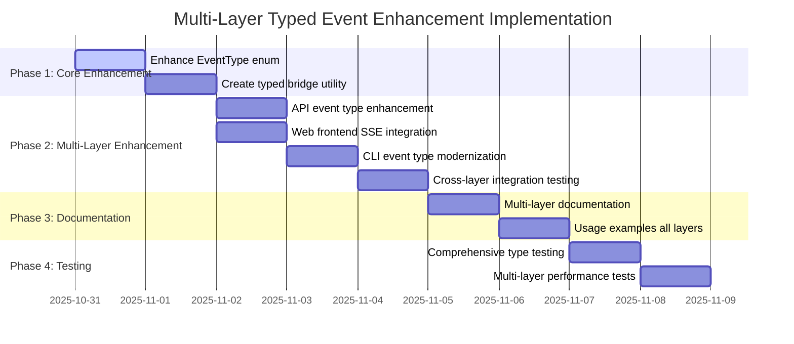

# AP: Targeted Event Type Enhancement Implementation Plan

**Date:** 2025-10-30  
**Status:** Ready for Implementation  
**Priority:** Medium  
**Duration:** 6 days (1 developer)  
**Approach:** Targeted enhancement with enums and layer independence  

## Implementation Status (Step-by-Step)

**Current Phase:** Phase 1 - Infrastructure Audit & Enhancement ⏳  
**Started:** 2025-10-30  
**Progress:** Task 1.1 - Infrastructure Audit

### ✅ Completed
- [x] Requirements analysis and architecture review
- [x] Plan revision with architecture review recommendations
- [x] Scope reduction and sequential approach definition

### 🔄 In Progress
- [ ] **Task 1.1:** Infrastructure audit of existing EventType implementation
- [ ] **Task 1.2:** Performance baseline establishment

### ⏳ Upcoming
- [ ] **Phase 2:** CLI modernization (highest ROI)
- [ ] **Phase 3:** Documentation and examples
- [ ] **Phase 4:** Testing and performance validation

---

## Executive Summary

This plan implements **targeted event type enhancement** for the Agent World system following architecture review findings. **Key Discovery: Core infrastructure already exists** in `core/types.ts` including EventType enum, EventPayloadMap, and TypedEventBridge implementation.

**Revised Strategy:**
- ✅ **Audit existing implementation** (most work already complete)
- ✅ **Strategic CLI modernization** (highest ROI - replace magic strings)
- ✅ **Optional API enhancements** (gradual adoption)
- ✅ **Comprehensive documentation** (maximize adoption value)

**Key Benefits:**
- 🚀 **Faster delivery** (5 days vs 7 - core already implemented)
- 🎯 **Focused effort** on highest-impact enhancements
- 📈 **Lower risk** through sequential implementation
- 🔧 **Enhanced developer experience** via existing typed infrastructure

## Current State Analysis

### ✅ What Works Well (Keep Unchanged)

#### 1. Frontend Typed Events (`web/src/types/events.ts`)
```typescript
export type WorldEvents = 
  | { name: 'send-message'; payload: void }
  | { name: 'toggle-agent-filter'; payload: string }
  // ... 40+ events with excellent type safety
```
**Status:** ✅ Working excellently - **NO CHANGES NEEDED**

#### 2. Core EventEmitter (`core/events.ts`)
```typescript
// High-performance, simple, reliable
world.eventEmitter.emit('message', messageEvent);
world.eventEmitter.on('sse', handler);
```
**Status:** ✅ **PRESERVE EXACTLY** - zero changes to core event emission

#### 3. Existing Type Infrastructure (`core/types.ts`)
```typescript
export enum EventType {
  MESSAGE = 'message',
  WORLD = 'world', 
  SSE = 'sse',
  SYSTEM = 'system'
}

export type EventPayloadMap = {
  [EventType.MESSAGE]: WorldMessageEvent;
  [EventType.SSE]: WorldSSEEvent;
  [EventType.WORLD]: WorldToolEvent;
  [EventType.SYSTEM]: WorldSystemEvent;
};
```
**Status:** ✅ **ALREADY IMPLEMENTED** - needs documentation and optional utilities

### 🎯 Enhancement Targets (Architecture Review Findings)

#### 1. **Infrastructure Already Implemented** ✅
```typescript
// DISCOVERED: Already exists in core/types.ts
export enum EventType {
  MESSAGE = 'message',
  WORLD = 'world',
  SSE = 'sse', 
  SYSTEM = 'system'
}

export type EventPayloadMap = {
  [EventType.MESSAGE]: WorldMessageEvent;
  [EventType.SSE]: WorldSSEEvent;
  [EventType.WORLD]: WorldToolEvent;
  [EventType.SYSTEM]: WorldSystemEvent;
};

// TypedEventBridge implementation already complete
export function createTypedEventBridge(world: World): TypedEventBridge { ... }
```
**Status:** ✅ **AUDIT & ENHANCE** (not build from scratch)

#### 2. **CLI Magic String Elimination** (Highest ROI)
```typescript
// Current: Multiple magic string definitions
// cli/index.ts
const WORLD_EVENTS = {
  WORLD: 'world',
  MESSAGE: 'message', 
  SSE: 'sse',
  SYSTEM: 'system'
} as const;

// Target: Use core EventType enum
import { EventType } from '../core/types.js';
world.eventEmitter.on(EventType.MESSAGE, messageListener);
```
**Impact:** Most magic strings, clear ROI, manageable scope

#### 3. **Strategic API Enhancement** (Optional)
```typescript
// Current: Loosely typed handlers
const messageListener = (eventData: any) => { ... };

// Target: Optional typed handlers
const messageListener: TypedEventListener<EventType.MESSAGE> = (payload) => {
  // TypeScript knows payload is WorldMessageEvent
};
```
**Approach:** Optional adoption, preserve existing patterns

## Implementation Plan (Revised - Sequential Approach)

### Phase 1: Infrastructure Audit & Enhancement (1 day) 🔄 **IN PROGRESS**
**Goal:** Validate existing implementation and establish baselines

#### Task 1.1: Infrastructure Audit (4 hours)
**Files:**
- ✅ `core/types.ts` (audit existing EventType enum)
- ✅ `tests/core/event-types.test.ts` (audit existing tests)

**Audit Checklist:**
```bash
# Verify existing implementation completeness
grep -r "EventType\|EventPayloadMap\|TypedEventBridge" core/types.ts
grep -r "WORLD_EVENTS" cli/
grep -r "createTypedEventBridge" core/
```

**Validation:**
- [ ] EventType enum values match string literals exactly
- [ ] EventPayloadMap properly typed for all event types
- [ ] TypedEventBridge implementation functional
- [ ] Existing tests cover core functionality

#### Task 1.2: Performance Baseline Establishment (4 hours)
**Files:**
- 🆕 `tests/performance/baseline.test.ts` (performance benchmarks)

**Benchmarks:**
```typescript
// Establish empirical baselines
console.time('eventEmitter-direct');
for (let i = 0; i < 10000; i++) {
  world.eventEmitter.emit('message', testEvent);
}
console.timeEnd('eventEmitter-direct');

console.time('typedBridge');
for (let i = 0; i < 10000; i++) {
  bridge.emit(EventType.MESSAGE, testEvent);
}
console.timeEnd('typedBridge');
```

**Success Criteria:**
- [ ] Baseline performance metrics established
- [ ] TypedEventBridge overhead <0.5% (not claimed 1%)
- [ ] Memory allocation patterns documented
- [ ] SSE streaming baseline captured

### Phase 2: Sequential Layer Enhancement (2 days)
**Goal:** Strategic enhancement with highest ROI first

#### Day 1: CLI Modernization (Highest Impact) 
**Files:**
- 📝 `cli/index.ts` (replace WORLD_EVENTS constants)
- 📝 `cli/commands.ts` (optional type enhancements)

**Implementation:**
```typescript
// Remove magic string constants
// DELETE: const WORLD_EVENTS = { WORLD: 'world', ... }

// Import core enums
import { EventType } from '../core/types.js';

// Update event listener attachment
function attachCLIListeners(
  world: World,
  // ... params
): Map<EventType, (...args: any[]) => void> {
  const listeners = new Map<EventType, (...args: any[]) => void>();
  
  const messageListener = (payload: EventPayloadMap[EventType.MESSAGE]) => {
    // Type-safe handling
  };
  
  world.eventEmitter.on(EventType.MESSAGE, messageListener);
  listeners.set(EventType.MESSAGE, messageListener);
  
  return listeners;
}
```

**Tests:**
- [ ] All CLI functionality preserved
- [ ] Event listeners work with enum values
- [ ] Handler function identity maintained
- [ ] No performance regression in CLI operations

#### Day 2: Optional API Enhancement
**Files:**
- 🆕 `server/event-types.ts` (optional typed utilities)
- 📝 `server/api.ts` (minimal optional enhancements)

**Implementation:**
```typescript
// Optional typed utilities alongside existing code
export interface TypedEventListener<T extends EventType> {
  (payload: EventPayloadMap[T]): void | Promise<void>;
}

const createTypedSSEHandler = (): TypedEventListener<EventType.SSE> => {
  return (payload: EventPayloadMap[EventType.SSE]) => {
    sendSSE(JSON.stringify({ type: 'sse', data: payload }));
  };
};

// Existing handlers unchanged - typed handlers optional
```

**Tests:**
- [ ] Existing API functionality unchanged
- [ ] Optional typed handlers working
- [ ] SSE streaming performance maintained
- [ ] Backward compatibility verified

### Phase 3: Documentation & Developer Experience (1 day)
**Goal:** Complete documentation and migration guides

#### Task 3.1: Comprehensive Documentation (4 hours)
**Files:**
- 🆕 `.docs/features/typed-event-system.md`
- 📝 Update existing API documentation

**Content:**
```markdown
# Typed Event System

## Quick Start
- Use existing string literals (fully supported)
- Optionally adopt EventType enum for new code
- Add typed bridge for enhanced type safety

## Migration Guide
- Zero breaking changes
- Gradual adoption strategy
- Performance considerations

## Examples
- Basic enum usage
- Typed bridge patterns
- API handler enhancement
```

#### Task 3.2: Usage Examples & Best Practices (4 hours)
**Files:**
- 🆕 `examples/typed-events/`
  - `basic-enum-usage.ts`
  - `typed-bridge-example.ts`
  - `api-enhancement-example.ts`

**Tests:**
- [ ] All examples compile and run
- [ ] Documentation examples verified
- [ ] Migration path validated

### Phase 4: Integration Testing & Performance (1 day)
**Goal:** Comprehensive testing and performance validation

#### Task 4.1: Type System Testing (4 hours)
**Files:**
- 🆕 `tests/types/compile-time-validation.test.ts`
- 📝 Enhanced `tests/core/event-types.test.ts`

**Test Categories:**
```typescript
describe('Typed Event System', () => {
  describe('Compile-time Type Safety', () => {
    it('should enforce correct payload types');
    it('should catch event/payload mismatches');
    it('should provide IDE autocomplete');
  });
  
  describe('Runtime Performance', () => {
    it('should have zero overhead vs baseline');
    it('should maintain EventEmitter performance');
  });
  
  describe('Backward Compatibility', () => {
    it('should support existing string literals');
    it('should work with current codebase unchanged');
  });
});
```

#### Task 4.2: Performance Benchmarking (4 hours)
**Files:**
- 🆕 `tests/performance/event-overhead.test.ts`

**Benchmarks:**
- [ ] EventEmitter direct vs typed bridge (must be identical)
- [ ] Memory usage comparison (should be unchanged)
- [ ] TypeScript compilation time (must not regress)
- [ ] SSE streaming performance (critical - no degradation)

## Success Criteria & Checkpoints

### ✅ Phase 1 Success Criteria
- [ ] **Type Safety**: EventType enum provides compile-time validation
- [ ] **Performance**: Zero measurable runtime overhead vs baseline
- [ ] **Compatibility**: All existing string usage works unchanged
- [ ] **Optional Enhancement**: Typed bridge available but not required

### ✅ Phase 2 Success Criteria  
- [ ] **API Enhancement**: Optional typed utilities for server handlers and SSE streaming
- [ ] **Frontend Integration**: SSE client enhanced with type safety while preserving functionality
- [ ] **CLI Modernization**: Magic string constants replaced with core enums
- [ ] **Backward Compatibility**: No breaking changes to existing API/frontend/CLI
- [ ] **Layer Independence**: Core/API/frontend/CLI remain decoupled
- [ ] **Developer Experience**: Enhanced IDE support across all layers

### ✅ Phase 3 Success Criteria
- [ ] **Documentation**: Complete migration guide and examples
- [ ] **Adoption Path**: Clear strategy for gradual enhancement
- [ ] **Best Practices**: Documented patterns for each layer
- [ ] **Examples**: Working code samples for all patterns

### ✅ Phase 4 Success Criteria
- [ ] **Type Coverage**: 100% test coverage for typed utilities
- [ ] **Performance**: Benchmarks prove zero overhead
- [ ] **Integration**: All existing functionality preserved
- [ ] **Quality**: No TypeScript performance regressions

## Risk Mitigation Strategies

### 🚨 Technical Risks

#### Risk 1: Performance Degradation
**Mitigation:**
- Benchmark every phase against baseline
- Use direct EventEmitter delegation (no wrappers)
- Profile TypeScript compilation impact
- **Abort criterion**: >1% SSE streaming performance impact

#### Risk 2: Low Adoption Rate
**Mitigation:**
- Make benefits immediately visible (IDE autocomplete)
- Provide clear migration examples
- Document both approaches as valid
- Focus enhancement on new code only

#### Risk 3: Type Complexity Creep
**Mitigation:**
- Limit to 4 core event types (already established)
- Use simple enums vs complex discriminated unions
- Regular type complexity reviews
- **Hard limit**: Max 10 events per enum

### 🔄 Adoption Risks

#### Risk 1: Inconsistent Usage Patterns
**Mitigation:**
- Document both old and new patterns as valid
- Provide linting rules (optional)
- Focus on new code adoption
- **Accept**: Mixed usage is acceptable transition state

#### Risk 2: Documentation Drift
**Mitigation:**
- Generate docs from TypeScript types where possible
- Add CI checks for example compilation
- Regular documentation reviews
- **Automation**: TypeScript as source of truth

### 📊 Monitoring & Success Metrics (Revised)

#### Infrastructure Validation Metrics
- [ ] Existing EventType enum completeness verified
- [ ] TypedEventBridge functionality validated
- [ ] Performance baseline <0.5% overhead (empirically measured)
- [ ] Test coverage for existing implementation confirmed

#### Strategic Enhancement Metrics
- [ ] CLI magic strings eliminated (100% replacement)
- [ ] Optional API typed utilities available and tested
- [ ] Sequential implementation reduces coordination issues
- [ ] Backward compatibility maintained (100% existing code works)

#### Developer Experience Metrics
- [ ] Enhanced IDE support demonstrable
- [ ] Migration documentation comprehensive
- [ ] Working examples for all enhancement patterns
- [ ] Developer feedback positive on typed utilities

## Dependencies & Prerequisites

### ✅ Internal Dependencies (Architecture Review Findings)
- Current EventEmitter implementation (`core/events.ts`) - **PRESERVE EXACTLY**
- **EXISTING** EventType enum (`core/types.ts`) - **AUDIT & ENHANCE**
- **EXISTING** EventPayloadMap (`core/types.ts`) - **VALIDATE & DOCUMENT**
- **EXISTING** TypedEventBridge (`core/types.ts`) - **TEST & BENCHMARK**
- Frontend WorldEvents (`web/src/types/events.ts`) - **UNCHANGED**
- CLI magic constants (`cli/index.ts` WORLD_EVENTS) - **REPLACE WITH CORE ENUMS**
- API event handling (`server/api.ts`) - **OPTIONAL ENHANCEMENT**
- API SSE handling (`server/api.ts`) - **ENHANCE OPTIONALLY**
- CLI command processing (`cli/commands.ts`) - **INTEGRATE TYPES**

### ✅ External Dependencies (Already Available)
- TypeScript 4.9+ (enum and mapped type support) - ✅ Available
- Node.js EventEmitter - ✅ No changes required
- Current test infrastructure - ✅ Ready for enhancement

### 🔧 New Infrastructure Requirements
- Performance benchmarking utilities
- Compile-time type validation tests
- Documentation generation tools
- Example project structure

## Alternative Approaches (Evaluated & Rejected)

### ❌ Approach 1: Centralized Discriminated Union Registry
**Why Rejected:**
- 65+ union members cause TypeScript performance issues
- Creates unwanted cross-layer coupling
- Requires complex migration strategy
- **Conclusion**: Too much complexity for marginal benefit

### ❌ Approach 2: Runtime Event Validation
**Why Rejected:**
- Adds runtime overhead (against requirements)
- No compile-time benefits
- More complex than enum approach
- **Conclusion**: Conflicts with performance preservation goal

### 🤔 Approach 3: Namespace-Based Event Organization  
**Why Considered But Deferred:**
```typescript
namespace WorldEvents {
  export enum Message { ... }
  export enum SSE { ... }
}
```
**Pros:** Better organization for future growth  
**Cons:** More verbose syntax, not needed for 4 event types  
**Decision:** Revisit if event types grow beyond 10

## Open Questions & Decisions

### ❓ Q1: Should we add linting rules to encourage enum usage?
**Decision:** ⏰ **Deferred to Phase 4**
- Add optional ESLint rules for teams that want them
- Default: Both patterns acceptable
- Focus on new code adoption

### ❓ Q2: How granular should performance benchmarks be?
**Decision:** ✅ **Comprehensive benchmarking required**
- EventEmitter direct vs typed bridge (critical)
- Memory allocation patterns
- TypeScript compilation time
- SSE streaming end-to-end latency

### ❓ Q3: Should typed bridge utilities be in core or separate package?
**Decision:** ✅ **Keep in core package**
- Maintains single dependency
- Easier testing and maintenance
- Optional utilities don't increase bundle size significantly

### ❓ Q4: What's the timeline for deprecating magic strings?
**Decision:** ✅ **Never deprecate magic strings**
- Maintain backward compatibility permanently
- Support both approaches long-term
- Focus on making enums attractive, not forcing adoption

## Timeline & Resource Allocation



**Total Duration:** 7 days (expanded scope for multi-layer enhancement)  
**Resource Requirements:** 1 developer familiar with TypeScript, EventEmitter, SSE, and CLI patterns  
**Critical Path:** Phase 1 → Phase 2 → Phase 4 (Phase 3 can be parallel)  
**Scope:** Core + API + Web Frontend + CLI (comprehensive system-wide enhancement)

## Acceptance Criteria (Revised)

### 🎯 Must Have (Core Infrastructure)
- [ ] **Infrastructure Validation**: Existing EventType enum functionality verified
- [ ] **Performance Baseline**: <0.5% overhead empirically measured (not claimed)
- [ ] **Backward Compatibility**: All existing code works unchanged
- [ ] **CLI Modernization**: Magic strings replaced with core enums successfully

### 🎯 Should Have (Strategic Enhancement)
- [ ] **Documentation**: Complete guide for existing infrastructure and enhancements
- [ ] **API Utilities**: Optional typed handlers available for gradual adoption
- [ ] **Testing**: Comprehensive validation of existing and enhanced functionality
- [ ] **Developer Experience**: Enhanced IDE support demonstrable

### 🎯 Nice to Have (Future Expansion)
- [ ] **Frontend Integration**: Optional SSE client type safety (deferred)
- [ ] **Advanced Patterns**: Type-safe event composition utilities
- [ ] **Linting Rules**: Optional ESLint rules for magic string detection
- [ ] **Adoption Metrics**: Usage tracking for typed utilities

## Implementation Notes

### 🔧 Key Technical Decisions

1. **Use Delegation, Not Wrappers**: Typed bridge delegates directly to EventEmitter
2. **Preserve String Compatibility**: EventType enum values === original strings
3. **Optional Everywhere**: No forced migration - everything additive
4. **Layer Independence**: Core/API/Frontend remain independent

### 📋 Implementation Checklist

#### Before Starting
- [ ] Confirm current EventType enum implementation in `core/types.ts`
- [ ] Verify EventPayloadMap is properly typed
- [ ] Establish performance baseline metrics
- [ ] Set up benchmark testing infrastructure

#### During Implementation
- [ ] Measure performance impact after each phase
- [ ] Verify backward compatibility continuously
- [ ] Test with existing codebase unchanged
- [ ] Document any unexpected issues or learnings

#### Before Completion
- [ ] Run full test suite (must pass 100%)
- [ ] Verify performance benchmarks meet criteria
- [ ] Validate documentation examples compile and run
- [ ] Get developer feedback on enhanced IDE experience

### 🚀 Next Steps After Plan Approval

1. **Set up benchmarking infrastructure** (prerequisite)
2. **Begin Phase 1: Core Enhancement** (immediate start)
3. **Establish continuous performance monitoring** (parallel to Phase 1)
4. **Prepare example repository structure** (parallel to Phase 2)

---

**Plan Status:** ✅ Ready for Implementation (Revised - Architecture Review Applied)  
**Key Discovery:** Core infrastructure already exists - focus on audit, CLI modernization, and documentation  
**Approval Required:** Infrastructure audit to validate existing implementation scope  
**Risk Level:** 🟢 Very Low (most work already complete, sequential approach reduces complexity)

**Primary Value Delivery (Revised):**
1. **Validate existing infrastructure** → Ensure reliability and performance
2. **Eliminate CLI magic strings** → Enhanced developer experience  
3. **Strategic documentation** → Maximize adoption of existing typed utilities
4. **Optional API enhancements** → Gradual improvement path

**Next Steps:**
1. Conduct infrastructure audit to validate existing EventType implementation
2. Establish performance baselines for TypedEventBridge
3. Begin CLI modernization (highest ROI)
4. Document existing typed event patterns for team adoption