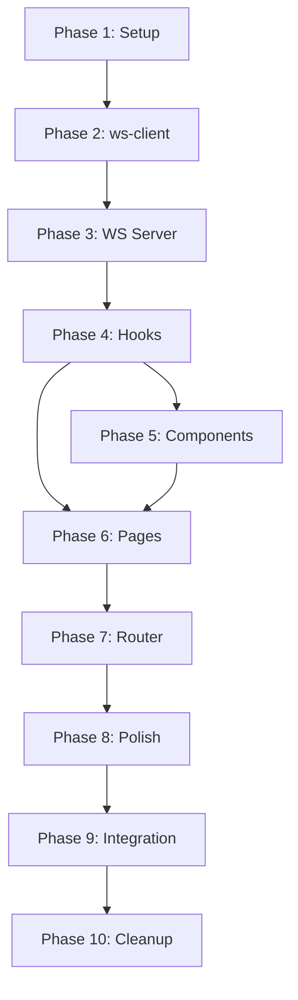

# Implementation Plan: Vite + React Frontend Migration

**Date:** 2025-11-03  
**Related Requirement:** `.docs/reqs/2025-11-01/req-vite-react-frontend.md`  
**Status:** Ready for Implementation  
**Estimated Time:** 13-20 hours

## Overview

Replace Next.js frontend with lightweight Vite + React SPA using WebSocket-only architecture. This plan breaks down the implementation into sequential, testable phases with clear checkpoints.

## Prerequisites

- ✅ Requirement document reviewed and approved
- ✅ Architecture review completed (2025-11-02)
- ✅ WebSocket server already supports slash commands
- ✅ ws-client already works in browser (only needs eventemitter3)

## Phase 1: Project Setup & Dependencies (1-2 hours)

### 1.1 Create React Package Structure
- [ ] Create `react/` folder at workspace root
- [ ] Create basic directory structure:
  ```
  react/
  ├── index.html
  ├── package.json
  ├── tsconfig.json
  ├── vite.config.ts
  ├── tailwind.config.js
  ├── postcss.config.js
  ├── src/
  │   ├── main.tsx
  │   ├── App.tsx
  │   ├── components/
  │   ├── pages/
  │   ├── hooks/
  │   ├── lib/
  │   ├── types/
  │   └── styles/
  └── public/
  ```

### 1.2 Configure Package.json
- [ ] Create `react/package.json` with dependencies:
  - React 19.1.0
  - react-dom 19.1.0
  - typescript ^5
  - vite ^6
  - @vitejs/plugin-react
  - tailwindcss ^4
  - postcss
  - gray-matter ^4.0.3
  - react-markdown ^10.1.0
  - remark-gfm ^4.0.1
  - react-router-dom ^6.28.0 (v6 for stability)
  - @types/eventemitter3 ^5 (dev dependency)
- [ ] Add scripts: dev, build, preview

### 1.3 Configure Build Tools
- [ ] Create `vite.config.ts`:
  - React plugin
  - Port 5173
  - Proxy WebSocket to localhost:3001
  - Path aliases (@/*)
- [ ] Create `tsconfig.json`:
  - Extend from root tsconfig
  - Include src/**/*
  - Path mappings for @/*
- [ ] Create `tailwind.config.js`:
  - Content paths (src/**/*.{tsx,ts})
  - Same theme as Next.js
  - Dark mode strategy (class or media) - match Next.js config
- [ ] Create `postcss.config.js`:
  - Tailwind CSS plugin

### 1.4 Create Environment Configuration
- [ ] Create `.env` file:
  ```
  VITE_WS_URL=ws://localhost:3001
  ```
- [ ] Create `src/lib/config.ts`:
  ```typescript
  export const WS_URL = import.meta.env.VITE_WS_URL || 'ws://localhost:3001';
  ```
- [ ] Add `.env.example` for documentation

### 1.5 Create Base HTML & Entry Point
- [ ] Create `index.html`:
  - Basic HTML5 structure
  - Root div
  - Module script to main.tsx
- [ ] Create `src/main.tsx`:
  - React root render
  - Import globals.css
- [ ] Create `src/styles/globals.css`:
  - Tailwind directives
  - Copy custom styles from Next.js

### Checkpoint 1: Verify Setup
```bash
cd react
npm install
npm run dev
# Should see blank React app at http://localhost:5173
```

---

## Phase 2: Update ws-client for Browser (1-1.5 hours)

### 2.1 Install eventemitter3 and Types
- [ ] Run: `npm install eventemitter3 --workspace=@agent-world/ws`
- [ ] Run: `npm install @types/eventemitter3 --save-dev --workspace=@agent-world/ws`
- [ ] Verify packages added to `ws/package.json`

### 2.2 Update ws-client.ts
- [ ] Replace EventEmitter import:
  ```typescript
  // Change:
  import { EventEmitter } from 'events';
  // To:
  import { EventEmitter } from 'eventemitter3';
  ```
- [ ] Verify no other changes needed (ws-client already browser-compatible)

### 2.3 Update TUI to Verify Compatibility
- [ ] Run TUI tests: `npm run tui:dev`
- [ ] Verify TUI still works with eventemitter3
- [ ] Test commands: list-worlds, create-agent, etc.

### Checkpoint 2: Verify ws-client Works
```bash
# Terminal 1
npm run ws:watch

# Terminal 2
npm run tui:dev
# Should connect and work normally
```

---

## Phase 3: Add WebSocket Server Update Commands (1-2 hours)

### 3.1 Add update-world Command
- [ ] Open `ws/ws-server.ts`
- [ ] Add case to command handler:
  ```typescript
  case 'update-world':
    if (!worldId && !params.worldId) {
      this.sendError(ws, 'worldId required for update-world');
      return;
    }
    result = await updateWorld(worldId || params.worldId, params);
    responseMessage = `World '${params.name}' updated successfully`;
    break;
  ```
- [ ] Import updateWorld from core

### 3.2 Add update-agent Command
- [ ] Add case to command handler:
  ```typescript
  case 'update-agent':
    if (!worldId) {
      this.sendError(ws, 'worldId required for update-agent');
      return;
    }
    result = await updateAgent(worldId, params.agentId, params);
    responseMessage = `Agent updated successfully`;
    break;
  ```
- [ ] Import updateAgent from core

### 3.3 Test Commands via CLI
- [ ] Test update-world command with TUI/CLI
- [ ] Test update-agent command with TUI/CLI
- [ ] Verify error handling (missing worldId, invalid data)

### Checkpoint 3: Verify Update Commands
```bash
# Terminal 1: Start WS server
npm run ws:watch

# Terminal 2: Test with CLI
npm run cli:dev
# Try: update world, update agent
```

---

## Phase 4: WebSocket Client Hook (3-4 hours)

### 4.1 Copy and Setup WebSocket Client
- [ ] Copy `ws/ws-client.ts` to `react/src/lib/ws-client.ts`
- [ ] Add comment at top of both files:
  ```typescript
  // Note: This file is duplicated between ws/ and react/src/lib/
  // If modified, sync both versions manually
  ```
- [ ] Install in react workspace: `npm install eventemitter3 @types/eventemitter3 --save-dev --workspace=react`
- [ ] Verify TypeScript compiles without errors
- [ ] Create `src/types/index.ts`:
  - Re-export types from ws-client
  - Add UI-specific types (World, Agent, Chat, Message)
  - Connection state types

### 4.2 Create WebSocket Context
- [ ] Create `src/lib/WebSocketContext.tsx`:
  - Check WebSocket browser support:
    ```typescript
    if (!('WebSocket' in window)) {
      throw new Error('WebSocket not supported');
    }
    ```
  - Use WS_URL from config.ts
  - Context for WebSocket client instance
  - Provider component with client initialization
  - Connection state management
  - Auto-reconnection handling

### 4.3 Create useWebSocket Hook
- [ ] Create `src/hooks/useWebSocket.ts`:
  - Access context
  - Return client instance
  - Connection state
  - Error handling
  - Typed event listeners

### 4.4 Create useWorldData Hook
- [ ] Create `src/hooks/useWorldData.ts`:
  - List worlds
  - Get world details
  - Create/update/delete world
  - Subscribe to world events
  - Return loading/error states

### 4.5 Create useAgentData Hook
- [ ] Create `src/hooks/useAgentData.ts`:
  - List agents for world
  - Get agent details
  - Create/update/delete agent
  - Return loading/error states

### 4.6 Create useChatData Hook
- [ ] Create `src/hooks/useChatData.ts`:
  - List chats for world
  - Create/delete chat
  - Send messages (check connection state first)
  - Subscribe to chat events
  - Real-time message updates
  - Error if sending while disconnected

### Checkpoint 4: Test Hooks in Isolation
- [ ] Create test page with buttons to test each hook
- [ ] Verify data fetching works
- [ ] Verify real-time updates work
- [ ] Check error handling

---

## Phase 5: Port React Components (3-4 hours)

### 5.1 Port MarkdownEditor Component
- [ ] Copy `next/src/components/MarkdownEditor.tsx` → `react/src/components/MarkdownEditor.tsx`
- [ ] Update imports (remove Next.js specific)
- [ ] Verify gray-matter works
- [ ] Test in isolation with sample data
- [ ] Update comment block

### 5.2 Port StreamChatBox Component
- [ ] Copy `next/src/components/StreamChatBox.tsx` → `react/src/components/StreamChatBox.tsx`
- [ ] Update to use WebSocket events instead of SSE
- [ ] Remove fetch/streaming logic (use hooks)
- [ ] Test with mock data
- [ ] Update comment block

### 5.3 Port MarkdownMemory Component
- [ ] Copy `next/src/components/MarkdownMemory.tsx` → `react/src/components/MarkdownMemory.tsx`
- [ ] Verify react-markdown and remark-gfm work
- [ ] Test with sample markdown
- [ ] Update comment block

### 5.4 Create Common UI Components
- [ ] Create `src/components/Layout.tsx`:
  - Header with navigation
  - Sidebar (if needed)
  - Main content area
  - ConnectionStatus in header
- [ ] Create `src/components/ConnectionStatus.tsx`:
  - Display: "Connected", "Connecting...", "Reconnecting...", "Disconnected"
  - Use useWebSocket hook for state
  - Visual indicator (dot with color)
- [ ] Create `src/components/Loading.tsx`:
  - Spinner component
  - Loading states
- [ ] Create `src/components/ErrorBoundary.tsx`:
  - Error boundary wrapper
  - Error display

### Checkpoint 5: Component Testing
- [ ] Test each component in Storybook or isolation
- [ ] Verify Tailwind styles work
- [ ] Check responsive design
- [ ] Verify markdown rendering

---

## Phase 6: Build Page Components (3-4 hours)

### 6.1 Create HomePage
- [ ] Create `src/pages/HomePage.tsx`:
  - World list display
  - Create world button
  - World selection/navigation
  - Empty state
- [ ] Integrate useWorldData hook
- [ ] Add loading/error states
- [ ] Test CRUD operations

### 6.2 Create WorldPage
- [ ] Create `src/pages/WorldPage.tsx`:
  - World details header
  - Agent list sidebar
  - Chat interface (StreamChatBox)
  - Agent management
  - Edit world button
- [ ] Integrate useWorldData, useAgentData, useChatData hooks
- [ ] Add WebSocket event subscriptions
- [ ] Handle real-time updates
- [ ] Test chat streaming

### 6.3 Create EditWorldPage
- [ ] Create `src/pages/EditWorldPage.tsx`:
  - MarkdownEditor integration
  - Save/cancel handling
  - Navigation back to world
- [ ] Test world update

### 6.4 Create EditAgentPage
- [ ] Create `src/pages/EditAgentPage.tsx`:
  - MarkdownEditor integration
  - Agent-specific fields
  - Save/cancel handling
- [ ] Test agent update

### Checkpoint 6: Page Navigation
```bash
npm run dev
# Test:
# 1. Home → Create world
# 2. Home → Select world
# 3. World → Chat with agent
# 4. World → Edit world/agent
# 5. Verify real-time updates
```

---

## Phase 7: Router & App Integration (1-2 hours)

### 7.1 Setup React Router
- [ ] Create `src/App.tsx`:
  - BrowserRouter setup
  - WebSocketProvider wrapper
  - Route definitions
  - Layout component
- [ ] Define routes:
  - `/` - HomePage
  - `/world/:worldId` - WorldPage
  - `/world/:worldId/edit` - EditWorldPage
  - `/world/:worldId/agent/:agentId/edit` - EditAgentPage

### 7.2 Add Navigation
- [ ] Update Layout component:
  - Home link
  - Back button
  - Breadcrumbs
- [ ] Add useNavigate hooks to pages

### 7.3 Handle 404
- [ ] Create NotFoundPage component
- [ ] Add catch-all route

### Checkpoint 7: Full App Testing
```bash
npm run dev
# Test complete user flows:
# 1. Create world → add agent → chat
# 2. Edit world → verify changes
# 3. Multiple worlds/chats
# 4. Browser navigation (back/forward)
```

---

## Phase 8: UI Polish & Testing (2-3 hours)

### 8.1 Style Refinement & Optimization
- [ ] Review all pages for consistency
- [ ] Match Next.js design exactly:
  - Colors
  - Spacing
  - Typography
  - Shadows
- [ ] Test dark mode (if configured)
- [ ] Check responsive breakpoints
- [ ] Bundle size optimization:
  - [ ] Lazy load pages with React.lazy()
  - [ ] Code splitting by route
  - [ ] Run `npm run build` and check bundle size
  - [ ] Target: < 500KB initial bundle
- [ ] Document HMR behavior:
  - [ ] Add to README: WebSocket disconnects on HMR (expected)
  - [ ] Add cleanup in WebSocketContext useEffect

### 8.2 Error Handling
- [ ] Add error boundaries to all pages
- [ ] User-friendly error messages
- [ ] Retry mechanisms
- [ ] Connection status indicators

### 8.3 Loading States
- [ ] Skeleton screens for loading
- [ ] Smooth transitions
- [ ] Progress indicators

### 8.4 Real-time Features
- [ ] Test WebSocket reconnection
- [ ] Verify event replay after disconnect
- [ ] Test multiple browser tabs
- [ ] Verify sequence tracking

### 8.5 Manual Testing Checklist
- [ ] **CRUD Operations:**
  - [ ] Create world
  - [ ] Update world (edit)
  - [ ] Delete world
  - [ ] List worlds
  - [ ] Create agent
  - [ ] Update agent
  - [ ] Delete agent
  - [ ] Create chat
  - [ ] Delete chat
- [ ] **Chat Features:**
  - [ ] Send message
  - [ ] Receive agent response
  - [ ] Real-time streaming
  - [ ] Multiple agents in same chat
- [ ] **Error Handling:**
  - [ ] Invalid YAML in editor
  - [ ] Network failure during send
  - [ ] WebSocket disconnect
  - [ ] Missing required fields
- [ ] **Connection States:**
  - [ ] Initial connection
  - [ ] Disconnect (kill ws server)
  - [ ] Reconnection (restart ws server)
  - [ ] Send message while disconnected
- [ ] **Browser Compatibility:**
  - [ ] Chrome/Edge
  - [ ] Firefox
  - [ ] Safari (if available)
  - [ ] Browser refresh
  - [ ] Multiple tabs simultaneously
- [ ] **Edge Cases:**
  - [ ] Empty world list
  - [ ] World with no agents
  - [ ] World with no chats
  - [ ] Very long messages
  - [ ] Special characters in names

### Checkpoint 8: Quality Assurance
- [ ] All features work identically to Next.js version
- [ ] No console errors
- [ ] No TypeScript errors
- [ ] Smooth UX

---

## Phase 9: Integration & Workspace Updates (1 hour)

### 9.1 Update Root Package.json
- [ ] Add `react` to workspaces array
- [ ] Add scripts:
  ```json
  "react:dev": "npm run dev --workspace=react",
  "react:build": "npm run build --workspace=react",
  "react:preview": "npm run preview --workspace=react"
  ```

### 9.2 Update README
- [ ] Document new react/ frontend
- [ ] Update development commands
- [ ] Note that next/ is deprecated

### 9.3 Update .gitignore
- [ ] Add `react/dist/`
- [ ] Add `react/node_modules/`

### Checkpoint 9: Workspace Integration
```bash
# From root
npm run react:dev
# Should start Vite dev server
```

---

## Phase 10: Cleanup & Documentation (1 hour)

### 10.1 Remove Next.js
- [ ] Verify react/ frontend is fully functional
- [ ] Get final approval from user
- [ ] Delete `next/` folder
- [ ] Remove `next` from workspace in root package.json
- [ ] Remove Next.js specific scripts

### 10.2 Update Documentation
- [ ] Create `.docs/done/2025-11-03/vite-react-frontend.md`
- [ ] Document all features implemented
- [ ] Note any deviations from plan
- [ ] Add troubleshooting guide

### 10.3 Update Comment Blocks
- [ ] Review all new files
- [ ] Ensure comment blocks are complete
- [ ] Document any implementation decisions

### Checkpoint 10: Final Verification
```bash
# Clean install
rm -rf node_modules react/node_modules
npm install

# Start servers
npm run ws:watch           # Terminal 1
npm run react:dev          # Terminal 2

# Full end-to-end test
# 1. Create world
# 2. Add agents
# 3. Chat with agents
# 4. Edit world/agents
# 5. Delete and recreate
# 6. Test reconnection
```

---

## Success Criteria

All checkpoints must pass:
- [ ] ✅ Phase 1: Blank React app runs
- [ ] ✅ Phase 2: ws-client works in TUI with eventemitter3
- [ ] ✅ Phase 3: Update commands work
- [ ] ✅ Phase 4: Hooks connect to WebSocket
- [ ] ✅ Phase 5: Components render correctly
- [ ] ✅ Phase 6: Pages work individually
- [ ] ✅ Phase 7: Full navigation works
- [ ] ✅ Phase 8: UI matches Next.js quality
- [ ] ✅ Phase 9: Workspace integration complete
- [ ] ✅ Phase 10: Next.js removed, docs complete

---

## Risk Management

### High Priority Risks

**Risk:** eventemitter3 breaks TUI  
**Mitigation:** Test immediately in Phase 2, rollback if issues  
**Fallback:** Keep Node.js EventEmitter for TUI, use different approach for browser

**Risk:** WebSocket client doesn't work in browser  
**Mitigation:** Test early in Phase 4 with simple connection  
**Fallback:** Create browser-specific client wrapper

**Risk:** Component porting introduces subtle bugs  
**Mitigation:** Test each component in isolation (Phase 5)  
**Fallback:** Rebuild components from scratch if needed

### Medium Priority Risks

**Risk:** Real-time updates don't work correctly  
**Mitigation:** Thorough testing in Phase 8  
**Fallback:** Polling fallback mechanism

**Risk:** UI doesn't match Next.js exactly  
**Mitigation:** Side-by-side comparison during Phase 8  
**Fallback:** Ask user for acceptable deviations

### Low Priority Risks

**Risk:** Performance issues with Vite  
**Mitigation:** Monitor bundle size, use lazy loading  
**Fallback:** Optimize later, doesn't block migration

---

## Development Workflow

### Daily Workflow
1. Start with checkpoint from previous phase
2. Work through tasks sequentially
3. Test each task before moving on
4. Update plan with actual time/issues
5. Commit after each phase completion

### Testing Strategy
- Unit test: Individual components/hooks
- Integration test: Page-level functionality
- E2E test: Full user flows
- Manual test: Edge cases, UX polish

### Git Strategy
```bash
# Create feature branch
git checkout -b feat/vite-react-frontend

# Commit after each phase
git commit -m "Phase 1: Project setup complete"
git commit -m "Phase 2: ws-client updated to eventemitter3"
# etc.

# Final PR when all phases complete
```

---

## Time Tracking

| Phase | Estimated | Actual | Notes |
|-------|-----------|--------|-------|
| 1. Setup | 1.5-2.5h | | +env config, dark mode |
| 2. ws-client | 1-1.5h | | +types, copy file |
| 3. WS Server | 1-2h | | |
| 4. Hooks | 3-4h | | +connection status, checks |
| 5. Components | 3-4h | | +ConnectionStatus component |
| 6. Pages | 3-4h | | |
| 7. Router | 1-2h | | |
| 8. Polish | 3-4h | | +bundle optimization, detailed tests |
| 9. Integration | 1h | | |
| 10. Cleanup | 1h | | |
| **Total** | **15-23h** | | +2-3h for robustness |

---

## Dependencies Between Phases



**Critical Path:** P1 → P2 → P3 → P4 → P6 → P7 → P8 → P10  
**Parallel Work:** P5 can overlap with P6 (components tested in pages)

---

## Notes

- Each phase is independent and testable
- Checkpoints ensure steady progress
- Can pause/resume at any phase boundary
- Update this plan with actual findings/changes
- Flag blockers immediately for discussion
