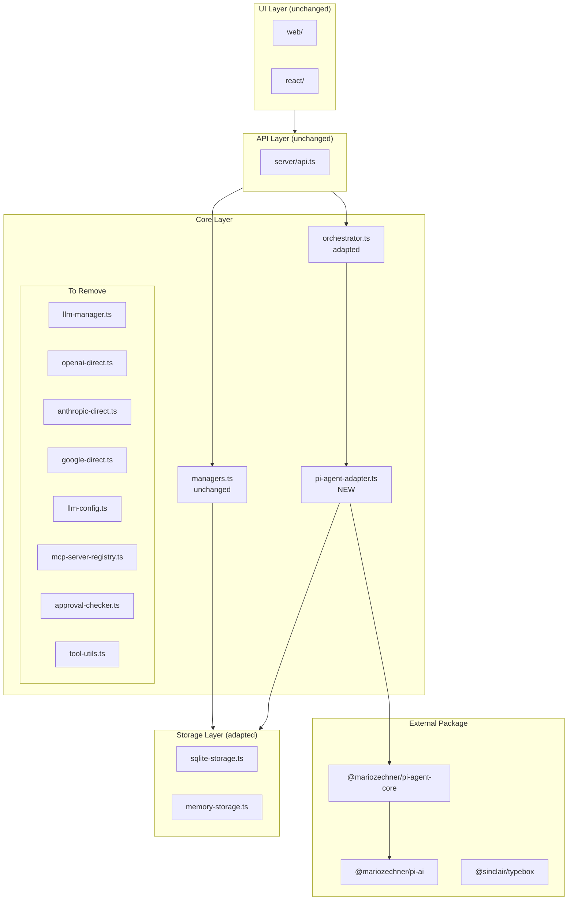

# Architecture Plan: Pi-Agent-Core Integration

**Requirement**: [req-pi-agent-core-integration.md](../../reqs/2026-02-01/req-pi-agent-core-integration.md)  
**Created**: 2026-02-01  
**Status**: In Progress (Phases 1-4 Complete)

---

## Overview

Replace the existing agent runtime with `@mariozechner/pi-agent-core` package, keeping World/Agent CRUD, storage, and UIs unchanged.

## Implementation Progress

| Phase | Status | Notes |
|-------|--------|-------|
| Phase 1: Setup & Adapter | ✅ Complete | `pi-agent-adapter.ts` ~600 lines |
| Phase 2: Event Bridging | ✅ Complete | Integrated in adapter |
| Phase 3: Tool Definition | ✅ Complete | `pi-agent-tools.ts` ~160 lines |
| Phase 4: Orchestrator | ✅ Complete | Feature flag `USE_PI_AGENT=true` |
| Phase 5: Storage Sync | ⏳ Partial | Message conversion functions exist |
| Phase 6: Memory Manager | ⏳ Pending | May not need changes |
| Phase 7: Cleanup | ⏳ Pending | 8 files to delete |
| Phase 8: Documentation | ⏳ Pending | |

**All 570 tests pass. TypeScript compiles successfully.**

## Architecture Diagram



---

## Phase 1: Setup & Adapter Foundation

**Goal**: Install dependencies and create adapter scaffold without breaking existing functionality.

### Tasks

- [x] **1.1** Install pi-agent-core and typebox packages ✅
  ```bash
  npm install @mariozechner/pi-agent-core @sinclair/typebox
  ```

- [x] **1.2** Create `core/pi-agent-adapter.ts` with type definitions ✅
  - Define `PiAgentInstance` interface
  - Define `PiAgentConfig` interface  
  - Define event type mappings

- [x] **1.3** Implement `createPiAgentForAgent()` factory function ✅
  - Accept `Agent` and `World` parameters
  - Create pi-agent-core `Agent` instance
  - Configure model via `getModel()` from `@mariozechner/pi-ai`
  - Set system prompt from agent config

- [x] **1.4** Implement `getApiKey()` callback (replaces `llm-config.ts`) ✅
  - Read API keys from environment variables
  - Handle all providers: OpenAI, Anthropic, Google
  - Return API key for provider dynamically
  ```typescript
  getApiKey: (provider) => {
    switch (provider) {
      case 'openai': return process.env.OPENAI_API_KEY;
      case 'anthropic': return process.env.ANTHROPIC_API_KEY;
      case 'google': return process.env.GOOGLE_API_KEY;
    }
  }
  ```

- [x] **1.5** Implement storage message conversion ✅
  - `toAgentMessage(stored)`: Convert storage format to pi-agent-core
  - `toStoredMessage(agentMsg)`: Convert pi-agent-core to storage format
  - Handle role mapping: `tool` → `toolResult`
  - Handle field name mapping: `tool_call_id` → `toolCallId`

- [ ] **1.6** Add unit tests for adapter foundation
  - Test `createPiAgentForAgent()` creates valid instance
  - Test message conversion functions
  - Mock pi-agent-core for isolation

---

## Phase 2: Event Bridging

**Goal**: Connect pi-agent-core events to World.eventEmitter for UI compatibility.

### Tasks

- [x] **2.1** Implement `bridgeEventsToWorld()` function ✅
  - Subscribe to pi-agent-core events
  - Map to World.eventEmitter events
  - Handle event payload transformation

- [x] **2.2** Map streaming events ✅
  ```typescript
  // Pi-agent-core → Agent-world
  message_start    → sse { type: 'start' }
  message_update   → sse { type: 'chunk', content: delta }
  message_end      → sse { type: 'end' }
  ```

- [x] **2.3** Map tool events ✅
  ```typescript
  tool_execution_start  → world { type: 'tool-start' }
  tool_execution_update → world { type: 'tool-progress' }
  tool_execution_end    → world { type: 'tool-result' }
  ```

- [x] **2.4** Map completion events ✅
  ```typescript
  turn_end  → message event with response
  agent_end → trigger storage persist
  ```

- [ ] **2.5** Add unit tests for event bridging
  - Test each event type mapping
  - Verify World.eventEmitter receives correct payload
  - Test error event handling

---

## Phase 3: Tool Definition

**Goal**: Define tools using pi-agent-core's `AgentTool` format with TypeBox schemas.

### Tasks

- [x] **3.1** Create `core/pi-agent-tools.ts` with tool definitions ✅
  - Define tools using `AgentTool` interface
  - Use TypeBox `Type.Object()` for parameter schemas
  - Implement `execute` functions directly (no wrappers)

- [x] **3.2** Implement core tools as `AgentTool` ✅
  ```typescript
  import { AgentTool } from "@mariozechner/pi-agent-core";
  import { Type } from "@sinclair/typebox";
  
  const shellCmdTool: AgentTool = {
    name: 'shell_cmd',
    description: 'Execute shell commands',
    parameters: Type.Object({
      command: Type.String({ description: 'Command to execute' }),
      parameters: Type.Optional(Type.Array(Type.String())),
      directory: Type.String({ description: 'Working directory' })
    }),
    execute: async (id, args) => executeCommand(args)
  };
  ```

- [x] **3.3** Create `getToolsForAgent()` function ✅
  - Return array of `AgentTool` for an agent
  - Support agent-specific tool configuration
  - Tools execute directly without approval/validation

- [x] **3.4** Update tool event publishing ✅
  - Emit tool events through bridge
  - Include tool execution metadata
  - Handle streaming tool updates

- [ ] **3.5** Add tests for tool definitions
  - Test tool execution with mock parameters
  - Test tool error handling
  - Test tool event emission

---

## Phase 4: Orchestrator Adaptation

**Goal**: Update orchestrator to use pi-agent-adapter instead of llm-manager.

### Tasks

- [x] **4.1** Create adapter instance cache ✅
  - Store pi-agent instances per agent ID
  - Lazy initialization on first message
  - Handle world context changes

- [x] **4.2** Update `processAgentMessage()` ✅
  - Added `processAgentMessageWithPiAgent()` function
  - Feature flag `USE_PI_AGENT=true` in subscribers.ts
  - Handle pi-agent-core event subscription
  - Maintain existing message saving logic

- [x] **4.3** Implement turn limit enforcement ✅
  - Track `turn_end` events per agent
  - Call `agent.abort()` at world turn limit
  - Publish turn limit message to human

- [x] **4.4** Update `shouldAgentRespond()` ✅
  - Existing logic works unchanged
  - Mention detection still works

- [x] **4.5** Implement memory synchronization ✅
  - On agent activation: `replaceMessages(storedMessages)`
  - On `agent_end`: persist new messages to storage
  - Handle partial failures gracefully

- [ ] **4.6** Add integration tests for orchestrator
  - Test single agent response flow
  - Test multi-agent conversation
  - Test turn limit enforcement
  - Test storage synchronization

- [ ] **4.7** Implement agent-level queue
  - Replace global LLM queue from `llm-manager.ts`
  - Serialize agent processing within each world
  - Prevent concurrent agent responses

---

## Phase 5: Storage Synchronization

**Goal**: Adapt storage layer to pi-agent-core message types.

### Tasks

- [ ] **5.1** Update storage schema mapping
  - Map `role: 'tool'` → `role: 'toolResult'` on read
  - Map `role: 'toolResult'` → `role: 'tool'` on write (for backward compat)
  - Handle `tool_call_id` ↔ `toolCallId` camelCase conversion

- [ ] **5.2** Implement `loadMessagesForPiAgent()` function
  - Load from storage via existing API
  - Convert to pi-agent-core format using `toAgentMessage()`
  - Handle empty state

- [ ] **5.3** Implement `persistMessagesFromPiAgent()` function
  - Extract messages from `agent_end` event
  - Convert using `toStoredMessage()`
  - Save via existing storage API

- [ ] **5.4** Handle system prompts
  - Move `role: 'system'` messages to `agent.systemPrompt`
  - Don't store system messages separately
  - Apply system prompt on agent creation

- [ ] **5.5** Implement error recovery
  - Retry on storage failure
  - Log errors for debugging
  - Emit system error events

- [ ] **5.6** Add persistence tests
  - Test load → modify → save cycle
  - Test message type conversion
  - Test recovery from storage errors

---

## Phase 6: Memory Manager Updates

**Goal**: Simplify memory-manager.ts to work with pi-agent-core flow.

### Tasks

- [ ] **6.1** Remove `resumeLLMAfterApproval()`
  - No longer needed (no approval flow)
  - Clean up related event handlers

- [ ] **6.2** Update `handleTextResponse()`
  - Keep auto-mention logic
  - Ensure message saving works with new flow
  - Verify event publishing

- [ ] **6.3** Update `generateChatTitleFromMessages()`
  - Use pi-agent-core Agent instance
  - Simplified LLM call via adapter
  - Handle skipTools flag

- [ ] **6.4** Simplify `saveIncomingMessageToMemory()`
  - Use pi-agent-core message format
  - Remove approval-related logic
  - Test with pi-agent-core flow

- [ ] **6.5** Add memory manager tests
  - Test text response handling
  - Test chat title generation
  - Verify no approval dependencies

---

## Phase 7: Cleanup & Removal

**Goal**: Remove deprecated code, MCP infrastructure, and dependencies.

### Tasks

- [ ] **7.1** Remove old LLM manager
  - Delete `core/llm-manager.ts`
  - Update all imports

- [ ] **7.2** Remove direct provider implementations
  - Delete `core/openai-direct.ts`
  - Delete `core/anthropic-direct.ts`
  - Delete `core/google-direct.ts`

- [ ] **7.3** Remove LLM configuration
  - Delete `core/llm-config.ts`

- [ ] **7.4** Remove MCP infrastructure
  - Delete `core/mcp-server-registry.ts`
  - Delete `core/approval-checker.ts`
  - Delete `core/tool-utils.ts`
  - Remove `/mcp/*` endpoints from `server/api.ts`
  - Remove MCP init/shutdown from `server/index.ts`
  - Remove MCP config UI from `web/src/components/world-edit.tsx`
  - Remove `clearToolsCache` from `core/index.ts`
  - Remove `approval-checker` export from `core/events/index.ts`

- [ ] **7.5** Remove unused dependencies
  ```bash
  npm uninstall openai @anthropic-ai/sdk @google/generative-ai @modelcontextprotocol/sdk
  ```

- [ ] **7.6** Update core/index.ts exports
  - Remove old LLM exports
  - Remove MCP exports
  - Add pi-agent-adapter exports

- [ ] **7.7** Update type definitions
  - Remove unused LLM types from types.ts
  - Keep `World.mcpConfig` for backward compat (ignored)

- [ ] **7.8** Fix shell-cmd-tool.ts
  - Remove `validateToolParameters` import from tool-utils
  - Inline validation or use TypeBox directly

- [ ] **7.9** Run full test suite
  - All existing tests must pass
  - No TypeScript errors
  - No runtime errors

---

## Phase 8: Documentation & Polish

**Goal**: Update documentation and verify production readiness.

### Tasks

- [ ] **8.1** Update core/README.md
  - Document pi-agent-core usage
  - Update architecture section
  - Add migration notes

- [ ] **8.2** Update AGENTS.md if needed
  - Any new conventions
  - Updated file structure

- [ ] **8.3** Add CHANGELOG entry
  - Document breaking changes (internal only)
  - List replaced modules
  - Credit pi-agent-core

- [ ] **8.4** Performance testing
  - Benchmark streaming latency
  - Measure memory usage
  - Compare to previous implementation

- [ ] **8.5** End-to-end testing
  - Test via web UI
  - Test via CLI
  - Test multi-agent scenarios
  - Test all LLM providers

---

## Implementation Notes

### Files Created ✅

| File | Lines | Purpose |
|------|-------|---------|
| `core/pi-agent-adapter.ts` | ~600 | Main adapter layer - factory, event bridge, message conversion |
| `core/pi-agent-tools.ts` | ~160 | Tool definitions using AgentTool/TypeBox |

### Files Modified ✅

| File | Changes |
|------|---------|
| `core/events/orchestrator.ts` | Added `processAgentMessageWithPiAgent()` (~100 lines) |
| `core/events/subscribers.ts` | Added `USE_PI_AGENT=true` feature flag |
| `core/index.ts` | Removed MCP export, added pi-agent-adapter exports |
| `package.json` | Added `@mariozechner/pi-agent-core`, `@sinclair/typebox` |

### Files to Modify (Phase 7 pending)

| File | Changes |
|------|---------|
| `server/api.ts` | Remove `/mcp/*` endpoints |
| `server/index.ts` | Remove MCP init/shutdown |
| `web/src/components/world-edit.tsx` | Remove MCP config UI |
| `core/events/index.ts` | Remove approval-checker export |

### Tests Pending

| File | Purpose |
|------|---------|
| `tests/core/pi-agent-adapter.test.ts` | Unit tests for adapter |
| `tests/integration/pi-agent.test.ts` | Integration tests |

### Key Files to Delete (8 files)

| File | Reason |
|------|---------|
| `core/llm-manager.ts` | Replaced by pi-agent-core Agent |
| `core/openai-direct.ts` | Replaced by pi-ai |
| `core/anthropic-direct.ts` | Replaced by pi-ai |
| `core/google-direct.ts` | Replaced by pi-ai |
| `core/llm-config.ts` | Replaced by getApiKey callback |
| `core/mcp-server-registry.ts` | MCP removed |
| `core/approval-checker.ts` | Approval flow removed |
| `core/tool-utils.ts` | Tool wrappers removed |

---

## Risk Mitigation

### Fallback Strategy

Keep `llm-manager.ts` until Phase 6 tests pass. Add feature flag:

```typescript
// In orchestrator.ts
const USE_PI_AGENT = process.env.USE_PI_AGENT === 'true';

if (USE_PI_AGENT) {
  await processWithPiAgent(world, agent, messageEvent);
} else {
  await processWithLegacyLLM(world, agent, messageEvent);
}
```

### Rollback Plan

1. Revert to previous commit
2. Re-install old dependencies
3. No database migrations needed (storage adapts at runtime)

---

## Success Criteria

- [ ] All existing unit tests pass
- [ ] All existing integration tests pass
- [ ] Streaming works in web UI
- [ ] Tool execution works (direct, no approval)
- [ ] Multi-agent conversations work
- [ ] Turn limits enforce correctly
- [ ] Messages persist to SQLite correctly
- [ ] No performance regression (< 10% latency increase)

---

## Timeline Estimate

| Phase | Estimated Time |
|-------|---------------|
| Phase 1: Setup & Adapter Foundation | 3-4 hours |
| Phase 2: Event Bridging | 2-3 hours |
| Phase 3: Tool Definition | 2-3 hours |
| Phase 4: Orchestrator Adaptation | 3-4 hours |
| Phase 5: Storage Synchronization | 2-3 hours |
| Phase 6: Memory Manager Updates | 1-2 hours |
| Phase 7: Cleanup & Removal | 2-3 hours |
| Phase 8: Documentation & Polish | 1-2 hours |
| **Total** | **16-24 hours** |

---

## Architecture Review (AR)

### Validated Design Decisions ✅

1. **Adapter Pattern**: Creating `pi-agent-adapter.ts` isolates pi-agent-core integration. If the package changes, only the adapter needs updates.

2. **Event Bridging**: Clean separation between pi-agent-core events and World.eventEmitter. No changes needed to UI or API layers.

3. **Phased Migration**: Feature flag approach allows gradual rollout and easy rollback.

4. **Direct Tool Execution**: Using pi-agent-core's `AgentTool` format with TypeBox schemas. Tools execute directly without MCP/approval layers.

### Decision: Remove MCP Entirely ✅

**Date**: 2026-02-01 (Final Decision)

Per user request, remove all MCP infrastructure. Can be added back later if needed.

---

### Code Review Findings (2026-02-01)

#### 1. Orchestrator Integration Points

**File**: `core/events/orchestrator.ts` (~450 lines)

Key functions requiring modification:

| Function | Current Behavior | Change Required |
|----------|------------------|-----------------|
| `processAgentMessage()` | Calls `generateAgentResponse()` / `streamAgentResponse()` from llm-manager.ts | Replace with pi-agent-core `agent.run()` |
| Tool execution block | Imports `getMCPToolsForWorld()` and executes tools inline | Remove MCP, use pi-agent-core tool loop |
| AI command handling | Special bypass for `gemini`, `copilot`, `codex` commands | Keep, adapt to new tool format |

**Critical Code Block to Replace** (lines ~120-150):
```typescript
// BEFORE: Uses llm-manager.ts
const { streamAgentResponse } = await import('../llm-manager.js');
const result = await streamAgentResponse(world, agent, filteredMessages, publishSSE);

// AFTER: Use pi-agent-adapter.ts
const piAgent = await getPiAgentForAgent(world, agent);
for await (const event of piAgent.run(messages)) {
  bridgeEventToWorld(world, event);
}
```

#### 2. Message Format Compatibility

**Current `AgentMessage` interface** (core/types.ts):
```typescript
interface AgentMessage {
  role: 'system' | 'user' | 'assistant' | 'tool';  // ⚠️ 'tool' role
  content: string;
  tool_calls?: ToolCall[];
  tool_call_id?: string;
  // Custom fields
  sender?: string;
  chatId?: string | null;
  messageId?: string;
  replyToMessageId?: string;
  toolCallStatus?: {...};
}
```

**Pi-agent-core message types**:
```typescript
// Uses 'toolResult' role instead of 'tool'
type MessageRole = 'user' | 'assistant' | 'toolResult';
```

**Mapping Required**:
| Current | Pi-agent-core | Notes |
|---------|---------------|-------|
| `user` | `user` | Direct mapping |
| `assistant` | `assistant` | Direct mapping |
| `tool` | `toolResult` | Role rename only |
| `system` | (embedded) | System prompt in agent config |

#### 3. LLM Manager Analysis

**File**: `core/llm-manager.ts` (~600 lines)

Components to remove entirely:
- `LLMQueue` class (~150 lines) - Pi-agent-core handles serialization
- `streamOpenAIResponse()` import - Uses pi-ai
- `streamAnthropicResponse()` import - Uses pi-ai  
- `streamGoogleResponse()` import - Uses pi-ai
- Provider detection functions (`isOpenAIProvider`, etc.)

**Only keep**: SSE event publishing pattern (move to adapter)

#### 4. Shell Command Tool Preservation

**File**: `core/shell-cmd-tool.ts` (~500 lines) - **KEEP**

Must convert from MCP format to pi-agent-core `AgentTool`:

```typescript
// BEFORE: MCP tool format
export function createShellCmdToolDefinition() {
  return {
    name: 'shell_cmd',
    description: '...',
    parameters: {...}, // JSON Schema
    execute: async (args, ...) => {...}
  };
}

// AFTER: Pi-agent-core AgentTool with TypeBox
import { Type } from '@sinclair/typebox';

export const shellCmdTool: AgentTool = {
  name: 'shell_cmd',
  description: '...',
  parameters: Type.Object({
    command: Type.String({ description: 'Command to execute' }),
    parameters: Type.Array(Type.String(), { description: 'Command parameters' }),
    directory: Type.String({ description: 'Working directory' })
  }),
  execute: async (args, context) => {...}
};
```

#### 5. Event Bridging Details

**Current Events** (World.eventEmitter):
- `message` → `WorldMessageEvent`
- `sse` → `WorldSSEEvent` (types: start, chunk, end, error)
- `world` → `WorldToolEvent` (types: tool-start, tool-result, tool-error)
- `crud` → `WorldCRUDEvent`

**Pi-agent-core Events** (from generator):
- `message` → Text content
- `tool_start` → Tool name, arguments
- `tool_end` → Tool result
- Token usage events

**Bridge Mapping**:
```typescript
function bridgeEventToWorld(world: World, event: AgentEvent) {
  switch (event.type) {
    case 'message':
      publishSSE(world, { type: 'chunk', content: event.text });
      break;
    case 'tool_start':
      publishToolEvent(world, { type: 'tool-start', ... });
      break;
    case 'tool_end':
      publishToolEvent(world, { type: 'tool-result', ... });
      break;
  }
}
```

---

### MCP Removal Scope

| Component | Removal Action |
|-----------|----------------|
| `server/api.ts` | Remove lines 1247-1330 (3 MCP endpoints) |
| `server/api.ts` | Remove import from mcp-server-registry (line 89) |
| `server/api.ts` | Remove mcpConfig from Zod schemas (lines 224, 233) |
| `server/index.ts` | Remove import (line 30), init (line 141), shutdown (line 165) |
| `core/types.ts` | Remove `mcpConfig?: string \| null` from World interface |
| `core/index.ts` | Remove `clearToolsCache` export |
| `web/*/world-edit.tsx` | Remove MCP config textarea |

### Files to Delete (8 files)

| File | Lines | Reason |
|------|-------|--------|
| `core/llm-manager.ts` | ~600 | Replaced by pi-agent-core Agent |
| `core/openai-direct.ts` | ~400 | Replaced by pi-ai |
| `core/anthropic-direct.ts` | ~350 | Replaced by pi-ai |
| `core/google-direct.ts` | ~300 | Replaced by pi-ai |
| `core/llm-config.ts` | ~100 | Replaced by getApiKey callback |
| `core/mcp-server-registry.ts` | ~2100 | MCP removed |
| `core/approval-checker.ts` | ~200 | Approval flow removed |
| `core/tool-utils.ts` | ~420 | Tool wrappers removed |
| **Total** | **~4500** | Code deletion |

### Files to Adapt

| File | Change |
|------|--------|
| `core/shell-cmd-tool.ts` | Convert to AgentTool format |
| `core/events/orchestrator.ts` | Replace LLM calls with pi-agent-core |
| `core/events/memory-manager.ts` | Update message role mapping |
| `core/utils.ts` | Update `prepareMessagesForLLM()` |

### Dependency Changes

**Remove from package.json:**
```json
"@anthropic-ai/sdk": "^0.71.2",
"@google/generative-ai": "^0.24.1",
"openai": "^6.15.0",
"@modelcontextprotocol/sdk": "^1.0.0"
```

**Add to package.json:**
```json
"@mariozechner/pi-agent-core": "^0.50.9",
"@sinclair/typebox": "^0.32.0"
```

### Risk Analysis

| Risk | Mitigation |
|------|------------|
| Message format incompatibility | Role mapping layer in adapter |
| Streaming behavior difference | Event bridge maintains SSE contract |
| Tool execution semantics | Shell-cmd-tool keeps same behavior |
| AI command bypass | Preserve special handling in orchestrator |
| Rollback needed | Feature flag to switch between runtimes |

---

*Created: 2026-02-01*  
*AR Completed: 2026-02-01*  
*AR Final: 2026-02-01* (Detailed code review completed, MCP removal scoped)  
*Implementation Started: 2026-02-01* (Phases 1-4 complete, feature flag enabled)
