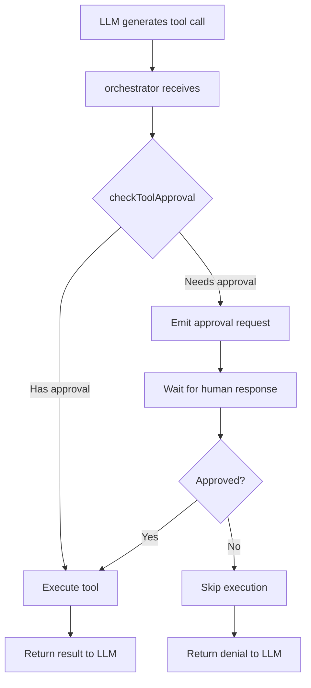
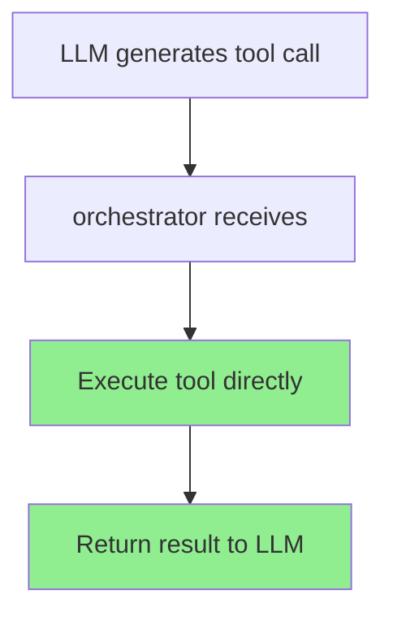
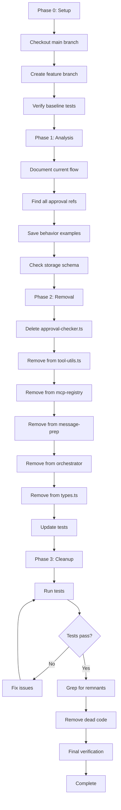

# Architecture Plan: Auth/HITL Removal

**Date**: 2026-02-06  
**Type**: Refactoring  
**Related REQ**: [req-remove-redesign-auth-hitl.md](../../../.docs/reqs/2026-02-06/req-remove-redesign-auth-hitl.md)  
**Estimated Effort**: 6-8 hours  
**Complexity**: Medium-High

## Overview

Systematically remove authentication and Human-in-the-Loop (HITL) approval systems from agent-world to simplify the codebase and prepare for a cleaner redesign. Work will be done on a feature branch from `main` to avoid conflicts with pi-agent-core integration work.

**Key Strategy**: Remove approval infrastructure while ensuring tools execute normally (auto-execute behavior). This creates a clean foundation for Phase 4 redesign.

## Architecture Decisions

### Decision 1: Start from `main` Branch
**Rationale**: Clean baseline without pi-agent-core complexity  
**Impact**: Can merge to both `main` and `pi` branches after completion  
**Trade-offs**: Need to merge later, but avoids integration conflicts

### Decision 2: Auto-Execute All Tools (Option A)
**Rationale**: Simplest removal path, minimal code changes  
**Impact**: Tools execute immediately without approval checks  
**Trade-offs**: Less safe for production, but acceptable for development  
**Mitigation**: Add README warning about missing approval system

### Decision 3: Incremental Removal with Testing
**Rationale**: Catch breakages early, maintain stability  
**Impact**: Each phase verified before proceeding  
**Trade-offs**: Takes longer, but safer

### Decision 4: Save Approval Behavior Examples
**Rationale**: Document current behavior for Phase 4 redesign  
**Impact**: Better understanding of requirements for new system  
**Trade-offs**: Small overhead to capture examples

## Components Affected

### Core Components to Modify
1. **approval-checker.ts** (DELETE)
   - `checkToolApproval()` - Main approval validation
   - `findSessionApproval()` - Session approval lookup
   - `findOnceApproval()` - One-time approval lookup

2. **tool-utils.ts** (MODIFY)
   - `createHumanInterventionTool()` - HITL tool creation (REMOVE)
   - Keep utility functions that don't relate to approval

3. **mcp-server-registry.ts** (MODIFY)
   - Remove `client.approveToolUse` tool registration
   - Remove `human_intervention.request` tool registration
   - Remove approval wrapper logic

4. **message-prep.ts** (MODIFY)
   - Remove filtering of `approval_` and `hitl_` prefixed messages
   - Keep other message preparation logic

5. **orchestrator.ts** (MODIFY)
   - Remove approval flow integration
   - Direct tool execution without approval checks
   - Keep normal tool execution pipeline

6. **types.ts** (MODIFY)
   - Remove `toolCallStatus` type definitions
   - Remove approval-related interfaces

### Storage Components to Check
7. **storage schema** (VERIFY ONLY)
   - Check if `toolCallStatus` is persisted
   - Check if approval messages have special storage
   - No changes if not in schema

### UI Components to Check
8. **web/src/** (CHECK)
   - Search for approval UI components
   - Remove if found

9. **server/api.ts** (CHECK)
   - Search for approval API endpoints
   - Remove if found

### Test Components
10. **tests/core/hitl-tool-phase1.test.ts** (DELETE or MODIFY)
    - Remove approval-specific tests
    - Keep tool execution tests

## Data Flow

### Current Flow (with Approval)


### New Flow (without Approval)


### Removal Strategy Flow


## Implementation Phases

### Phase 0: Branch Setup
**Goal**: Start from clean `main` branch baseline

- [ ] **Task 0.1**: Commit or stash any work on `pi` branch
- [ ] **Task 0.2**: Checkout `main` branch
  ```bash
  git checkout main
  git pull origin main
  ```
- [ ] **Task 0.3**: Verify working directory is clean
  ```bash
  git status
  ```
- [ ] **Task 0.4**: Create feature branch
  ```bash
  git checkout -b remove-auth-hitl
  ```
- [ ] **Task 0.5**: Run baseline tests
  ```bash
  npm test
  ```
- [ ] **Task 0.6**: Verify tests pass before proceeding

**Exit Criteria**: On `remove-auth-hitl` branch with all tests passing

---

### Phase 1: Pre-Removal Analysis
**Goal**: Document current state and identify all code to remove

- [ ] **Task 1.1**: Document current approval flow
  - Read `approval-checker.ts` and document logic
  - Trace approval integration in `orchestrator.ts`
  - Document MCP tool registration for approval tools
  - Save documentation in analysis notes

- [ ] **Task 1.2**: Find ALL approval-related code
  ```bash
  # Run comprehensive grep searches
  grep -rn "approval\|approveToolUse" core/ --include="*.ts" > /tmp/approval-refs.txt
  grep -rn "HITL\|humanIntervention" core/ --include="*.ts" >> /tmp/approval-refs.txt
  grep -rn "toolCallStatus" core/ --include="*.ts" >> /tmp/approval-refs.txt
  grep -rn "approval_\|hitl_" core/ --include="*.ts" >> /tmp/approval-refs.txt
  grep -rn "client\.approve" core/ --include="*.ts" >> /tmp/approval-refs.txt
  ```
  - Review results and create comprehensive file list
  - Identify all functions that reference approval

- [ ] **Task 1.3**: Check web UI for approval components
  ```bash
  grep -rn "approval\|approveToolUse" web/src/ --include="*.ts" --include="*.tsx"
  ```

- [ ] **Task 1.4**: Check server for approval endpoints
  ```bash
  grep -rn "approval" server/ --include="*.ts"
  ```

- [ ] **Task 1.5**: Check storage schema
  - Read database migration files
  - Look for `toolCallStatus` column
  - Check AgentMessage interface in types.ts
  - Document if approval data is persisted

- [ ] **Task 1.6**: Save approval behavior examples
  - Create example of session approval message
  - Create example of once approval message
  - Create example of HITL request/response
  - Save in `.docs/reqs/2026-02-06/approval-examples.md`

**Exit Criteria**: Complete file list, flow documented, examples saved

---

### Phase 2: Systematic Removal
**Goal**: Remove all approval-related code

#### Subtask 2.1: Remove approval-checker.ts
- [ ] **Task 2.1.1**: Verify no other files import from approval-checker.ts
  ```bash
  grep -rn "from.*approval-checker" core/
  grep -rn "import.*approval-checker" core/
  ```
- [ ] **Task 2.1.2**: Delete the file
  ```bash
  git rm core/events/approval-checker.ts
  ```
- [ ] **Task 2.1.3**: Run tests to check for import errors
  ```bash
  npm test
  ```

#### Subtask 2.2: Remove approval functions from tool-utils.ts
- [ ] **Task 2.2.1**: Open `core/tool-utils.ts`
- [ ] **Task 2.2.2**: Identify approval-related functions:
  - `createApprovalTool()` or similar
  - `createHumanInterventionTool()`
  - Any wrapper that adds approval logic
- [ ] **Task 2.2.3**: Remove these functions
- [ ] **Task 2.2.4**: Remove related imports
- [ ] **Task 2.2.5**: Run ESLint to check for dead code
  ```bash
  npm run lint
  ```

#### Subtask 2.3: Remove approval tool registration from mcp-server-registry.ts
- [ ] **Task 2.3.1**: Open `core/mcp-server-registry.ts`
- [ ] **Task 2.3.2**: Find tool registration section (likely `getBuiltInTools()`)
- [ ] **Task 2.3.3**: Remove `client.approveToolUse` registration
- [ ] **Task 2.3.4**: Remove `human_intervention.request` registration
- [ ] **Task 2.3.5**: Remove any approval wrapper logic from tool execution
- [ ] **Task 2.3.6**: Remove related imports (from tool-utils, approval-checker)

#### Subtask 2.4: Remove approval filtering from message-prep.ts
- [ ] **Task 2.4.1**: Open `core/message-prep.ts`
- [ ] **Task 2.4.2**: Find message filtering logic
- [ ] **Task 2.4.3**: Locate code that filters `approval_` and `hitl_` prefixed messages
- [ ] **Task 2.4.4**: Remove this filtering logic
- [ ] **Task 2.4.5**: Keep other filtering (like system messages)
- [ ] **Task 2.4.6**: Verify `filterClientSideMessages()` or similar function still works

#### Subtask 2.5: Remove approval flow from orchestrator.ts
- [ ] **Task 2.5.1**: Open `core/events/orchestrator.ts`
- [ ] **Task 2.5.2**: Find tool execution section (likely in `processAgentMessage`)
- [ ] **Task 2.5.3**: Locate approval check logic (call to `checkToolApproval`)
- [ ] **Task 2.5.4**: Remove approval check block
- [ ] **Task 2.5.5**: Ensure tool execution goes directly to MCP
- [ ] **Task 2.5.6**: Remove approval-related imports
- [ ] **Task 2.5.7**: Verify tool execution flow is clean

#### Subtask 2.6: Remove approval types from types.ts
- [ ] **Task 2.6.1**: Open `core/types.ts`
- [ ] **Task 2.6.2**: Search for `toolCallStatus`
- [ ] **Task 2.6.3**: Remove `toolCallStatus` property from `AgentMessage`
- [ ] **Task 2.6.4**: Search for approval-related interfaces:
  - `ApprovalRequest`
  - `ApprovalDecision`
  - `ApprovalResult`
  - etc.
- [ ] **Task 2.6.5**: Remove these type definitions
- [ ] **Task 2.6.6**: Run TypeScript compiler to check for errors
  ```bash
  npm run build
  ```

#### Subtask 2.7: Update or remove approval tests
- [ ] **Task 2.7.1**: Find approval test files
  ```bash
  find tests/ -name "*approval*" -o -name "*hitl*"
  ```
- [ ] **Task 2.7.2**: Delete `tests/core/hitl-tool-phase1.test.ts` if exists
- [ ] **Task 2.7.3**: Check integration tests for approval scenarios
- [ ] **Task 2.7.4**: Remove approval-specific test cases
- [ ] **Task 2.7.5**: Keep tool execution tests

#### Subtask 2.8: Run tests after each major removal
- [ ] **Task 2.8.1**: Run tests after removing approval-checker.ts
- [ ] **Task 2.8.2**: Run tests after modifying tool-utils.ts
- [ ] **Task 2.8.3**: Run tests after modifying mcp-server-registry.ts
- [ ] **Task 2.8.4**: Run tests after modifying message-prep.ts
- [ ] **Task 2.8.5**: Run tests after modifying orchestrator.ts
- [ ] **Task 2.8.6**: Run tests after modifying types.ts
- [ ] **Task 2.8.7**: Fix any failures immediately

**Exit Criteria**: All approval code removed, tests still passing

---

### Phase 3: Cleanup & Verification
**Goal**: Ensure complete removal and no regressions

#### Subtask 3.1: Automated checks for remnants
- [ ] **Task 3.1.1**: Run comprehensive grep to verify removal
  ```bash
  # Should return no results
  grep -rn "checkToolApproval\|findSessionApproval\|findOnceApproval" core/
  grep -rn "client\.approveToolUse" core/
  grep -rn "human_intervention\.request" core/
  grep -rn "toolCallStatus" core/
  grep -rn "approval_\|hitl_" core/
  ```
- [ ] **Task 3.1.2**: If any results found, investigate and remove
- [ ] **Task 3.1.3**: Document any intentional exceptions

#### Subtask 3.2: Dead code removal
- [ ] **Task 3.2.1**: Run ESLint to find unused imports
  ```bash
  npm run lint
  ```
- [ ] **Task 3.2.2**: Remove any unused imports flagged
- [ ] **Task 3.2.3**: Check for orphaned utility functions
- [ ] **Task 3.2.4**: Use `list_code_usages` tool to verify functions are called
- [ ] **Task 3.2.5**: Remove any dead code found

#### Subtask 3.3: Add tool execution tests
- [ ] **Task 3.3.1**: Verify existing tool execution tests
- [ ] **Task 3.3.2**: Add test for direct tool execution (no approval)
- [ ] **Task 3.3.3**: Test that MCP tools work correctly
- [ ] **Task 3.3.4**: Test shell_cmd tool if it exists

#### Subtask 3.4: Full test suite verification
- [ ] **Task 3.4.1**: Run unit tests
  ```bash
  npm run test:unit
  ```
- [ ] **Task 3.4.2**: Run integration tests if available
  ```bash
  npm run test:integration
  ```
- [ ] **Task 3.4.3**: Fix any failures
- [ ] **Task 3.4.4**: Verify test coverage maintained

#### Subtask 3.5: Check web UI and server
- [ ] **Task 3.5.1**: If UI approval components found in Phase 1, remove them
- [ ] **Task 3.5.2**: If server approval endpoints found, remove them
- [ ] **Task 3.5.3**: Test web app if affected
- [ ] **Task 3.5.4**: Verify no console errors

#### Subtask 3.6: Documentation updates
- [ ] **Task 3.6.1**: Create `.docs/done/2026-02-06/auth-hitl-removal.md`
- [ ] **Task 3.6.2**: Document what was removed
- [ ] **Task 3.6.3**: Document new tool execution behavior (auto-execute)
- [ ] **Task 3.6.4**: Add warning to README about missing approval
- [ ] **Task 3.6.5**: Update CHANGELOG.md if exists

#### Subtask 3.7: Final verification
- [ ] **Task 3.7.1**: Run full test suite one more time
  ```bash
  npm test
  ```
- [ ] **Task 3.7.2**: Build the project
  ```bash
  npm run build
  ```
- [ ] **Task 3.7.3**: Check for TypeScript errors
- [ ] **Task 3.7.4**: Verify no ESLint warnings
- [ ] **Task 3.7.5**: Run manual smoke test (send message to agent, verify tool executes)

**Exit Criteria**: All tests passing, no approval code remains, documentation updated

---

### Phase 4: Git and Merge
**Goal**: Clean commit history and merge to target branches

#### Subtask 4.1: Commit work
- [ ] **Task 4.1.1**: Review all changes
  ```bash
  git status
  git diff
  ```
- [ ] **Task 4.1.2**: Stage all changes
  ```bash
  git add .
  ```
- [ ] **Task 4.1.3**: Create comprehensive commit message
  ```bash
  git commit -m "refactor: remove auth/HITL approval system
  
  - Delete approval-checker.ts completely
  - Remove approval functions from tool-utils.ts
  - Remove approval tool registration from mcp-server-registry.ts
  - Remove approval filtering from message-prep.ts
  - Remove approval flow from orchestrator.ts
  - Remove toolCallStatus and approval types from types.ts
  - Remove approval-specific tests
  - Update documentation with removal notes
  - Add README warning about auto-execute behavior
  
  BREAKING CHANGE: All tools now auto-execute without approval.
  Not recommended for production use until Phase 4 redesign.
  
  Closes #XX (if issue exists)"
  ```

#### Subtask 4.2: Merge to main
- [ ] **Task 4.2.1**: Ensure remove-auth-hitl branch is up to date
- [ ] **Task 4.2.2**: Switch to main branch
  ```bash
  git checkout main
  ```
- [ ] **Task 4.2.3**: Merge feature branch
  ```bash
  git merge remove-auth-hitl
  ```
- [ ] **Task 4.2.4**: Run tests on main
- [ ] **Task 4.2.5**: Push to remote
  ```bash
  git push origin main
  ```

#### Subtask 4.3: Merge to pi branch
- [ ] **Task 4.3.1**: Switch to pi branch
  ```bash
  git checkout pi
  ```
- [ ] **Task 4.3.2**: Merge main (which now has removal)
  ```bash
  git merge main
  ```
- [ ] **Task 4.3.3**: Resolve any conflicts if present
- [ ] **Task 4.3.4**: Run tests on pi branch
- [ ] **Task 4.3.5**: Push to remote
  ```bash
  git push origin pi
  ```

#### Subtask 4.4: Cleanup
- [ ] **Task 4.4.1**: Delete feature branch locally
  ```bash
  git branch -d remove-auth-hitl
  ```
- [ ] **Task 4.4.2**: Update project board if exists
- [ ] **Task 4.4.3**: Close related issues

**Exit Criteria**: Changes merged to both main and pi branches

---

## Dependencies

### Internal Dependencies
- Understanding of tool execution flow
- Access to test suite
- Knowledge of MCP server registry

### External Dependencies
- None (pure refactoring)

### Blocking Dependencies
- Must finish Phase 0 before Phase 1
- Must finish Phase 1 before Phase 2
- Must finish Phase 2 before Phase 3
- Must pass all tests before Phase 4 merge

## Risks & Mitigation

### Risk 1: Breaking Tool Execution
**Probability**: Medium  
**Impact**: High  
**Mitigation**: 
- Test after each removal step
- Keep MCP tool execution pipeline intact
- Add direct execution tests

### Risk 2: Missing Hidden Approval References
**Probability**: Medium  
**Impact**: Medium  
**Mitigation**:
- Comprehensive grep searches in Phase 1
- Automated verification in Phase 3
- Multiple test runs

### Risk 3: Storage Schema Changes Needed
**Probability**: Low  
**Impact**: High  
**Mitigation**:
- Check schema in Phase 1
- If needed, create migration script
- Test with existing database

### Risk 4: Merge Conflicts with Pi Branch
**Probability**: Medium  
**Impact**: Medium  
**Mitigation**:
- Work from main (clean baseline)
- Merge to main first, then pi
- Resolve conflicts carefully

### Risk 5: Breaking Web UI
**Probability**: Low  
**Impact**: Medium  
**Mitigation**:
- Check UI in Phase 1
- Remove UI components if found
- Test web app after changes

## Testing Strategy

### Unit Tests
- Run after each component modification
- Verify no regressions in unchanged code
- Add tests for direct tool execution

### Integration Tests
- Verify tool execution end-to-end
- Test MCP server integration
- Test agent message handling

### Manual Testing
- Send message to agent
- Verify tool executes automatically
- Check no approval prompts appear
- Verify tool results returned correctly

### Automated Verification
- Grep for approval keywords (should be empty)
- ESLint for dead code
- TypeScript compiler for type errors
- npm test for full suite

## Success Metrics

- [ ] Zero references to approval code (verified by grep)
- [ ] All tests passing (unit + integration)
- [ ] TypeScript compiles without errors
- [ ] ESLint shows no warnings
- [ ] ~500 lines of code removed
- [ ] Documentation updated
- [ ] Changes merged to both main and pi branches

## Rollback Plan

If critical issues found:

1. **Before commit**: `git reset --hard` to undo changes
2. **After commit on branch**: `git revert <commit-hash>`
3. **After merge to main**: Create hotfix branch, revert merge commit
4. **Emergency**: Restore from backup, don't merge

## Notes

- **Work incrementally**: Each task should take 15-30 minutes max
- **Test frequently**: Don't let test failures accumulate
- **Document as you go**: Update plan checkboxes in real-time
- **Save examples**: Before deleting code, save examples for Phase 4
- **Be surgical**: Only remove approval code, nothing else

## Phase 4: Future Redesign (Not in This Plan)

After this removal is complete and merged, Phase 4 will involve:
- New requirements document for approval system
- Architecture design (evaluate LangGraph, pi-agent steering, custom)
- Implementation with clean API boundaries
- ApprovalManager class design
- Proper HITL framework integration

This will be tracked in a separate requirements document.

---

**Plan Status**: Ready for Implementation  
**Next Step**: SS (Step-by-Step Implementation)  
**Start with**: Phase 0 - Branch Setup  
**Estimated Total Time**: 6-8 hours  
**Last Updated**: 2026-02-06
