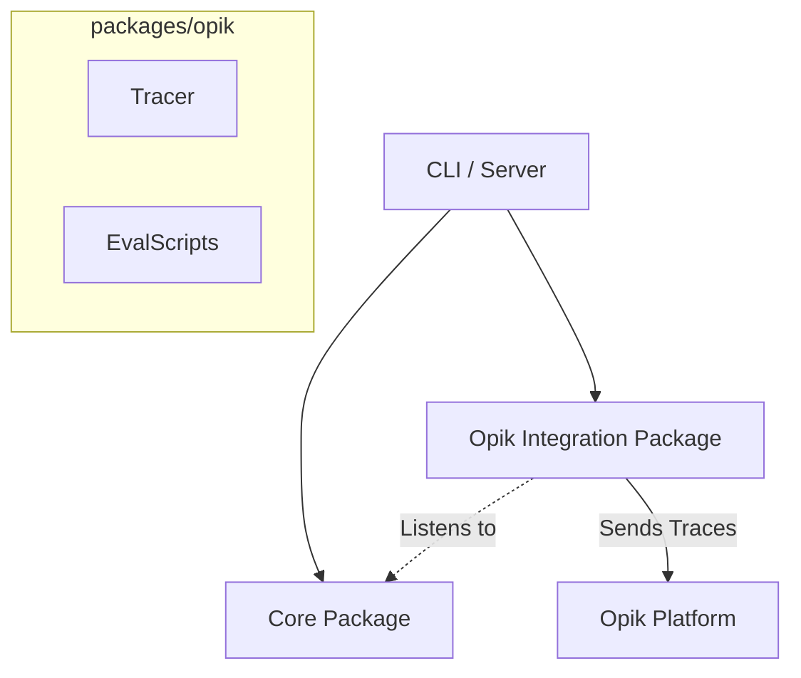

# Architecture Plan: Opik Integration for Pi-Agent

**Date:** 2026-02-07
**Requirement:** [req-opik-integration.md](../../reqs/2026-02-07/req-opik-integration.md)
**Status:** In Progress

---

## Overview

Integrate Opik (by Comet) with the `agent-world` project by creating a **separate library package** (`packages/opik`) to handle tracing and observability. This ensures strict decoupling from the `core` business logic. The integration will listen to `pi-agent-core` events (mediated by `core` or directly) to capture execution spans.

## Phased Implementation

### Phase 1: Workspace & Package Setup
Create the isolated environment for the Opik integration code.

- [x] **New Workspace**: Create `packages/opik` directory and initialization.
- [x] **Package Config**: Setup `package.json` with dependencies (`opik`, `@agent-world/core` as peer/dev dependency).
- [x] **Build Setup**: Update root `package.json` scripts and `tsconfig` to include the new workspace.
- [x] **SDK Init**: Create `src/client.ts` in the new package to wrap basic Opik initialization.

### Phase 2: Tracing Implementation (The Library)
Implement the tracing logic within `packages/opik`.

- [x] **Tracer Class**: Create `OpikTracer` class that accepts a `World` or `PiAgent` instance.
- [x] **Event Listener**: Implement logic to subscribe to `AgentEvent`s (e.g., `step`, `tool`, `llm` events from `pi-agent-core`).
- [x] **Span Management**: Map agent events to Opik Spans (`trace.span(...)`).
- [x] **Export**: Clean public API (e.g., `startTracing(world, config)`).

### Phase 3: Integration (The Wiring)
Connect the new library to the application entry points without polluting `core`.

- [x] **CLI Integration**: Update `cli/index.ts` to dynamically import or configure `packages/opik` if enabled.
- [x] **Environment**: Ensure `OPIK_API_KEY` etc. are passed correctly.
- [ ] **Verification**: Run an agent session and verify traces in Opik dashboard.

### Phase 4: Evaluation & Datasets
Leverage the isolated library for offline tasks.

- [ ] **Eval Script**: Create `packages/opik/src/scripts/eval.ts` (or similar) to run offline evaluations.
- [ ] **Metrics**: Implement Opik metrics wrappers.
- [ ] **Golden Dataset**: Add functionality to export specific traces to a shared Opik dataset.

## Architecture

## Verification Plan

### Manual Verification
1. Build all workspaces: `npm run build`.
2. Run `agent-world` with `OPIK_ENABLED=true`.
3. **Run a Complex Scenario**: Use an external User Agent configuration (e.g., `data/setup-infinite-etude.ts`) to generate multi-turn, multi-agent traffic. This ensures rich traces (LLM spans, tool calls) are captured for evaluation.
4. Check Opik Dashboard for traces.

### Automated Tests
- Unit tests within `packages/opik` (mocking the Agent events).

