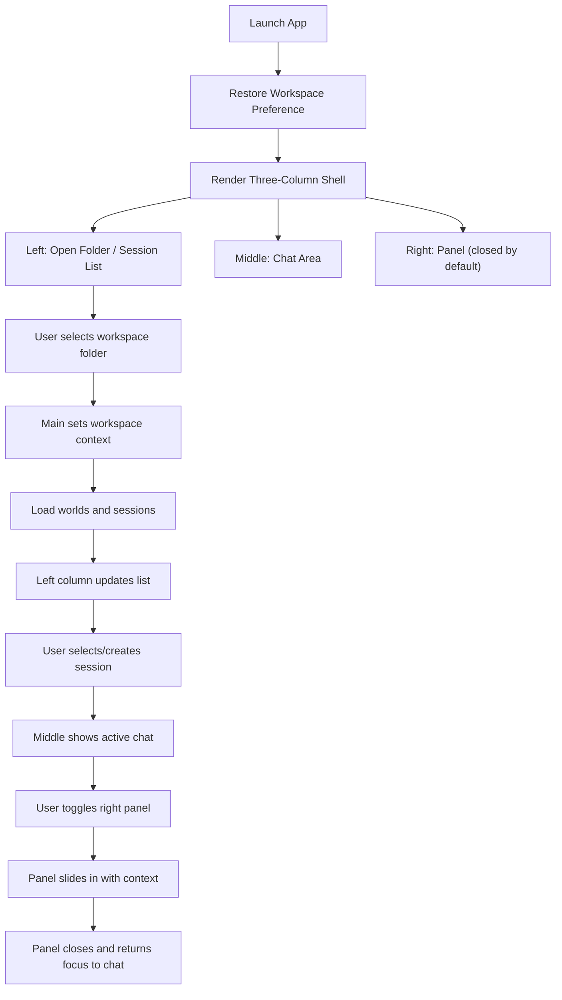

# Architecture Plan: Electron Desktop Three-Column Workspace and Chat UI

**Date**: 2026-02-08  
**Status**: In Progress (Checkpoint 1 Completed)  
**Related Requirement**: `/Users/esun/Documents/Projects/agent-world/.docs/reqs/2026-02-08/req-electron-workspace-worlds.md`

## Overview

Evolve the Electron desktop app to a Codex Desktop-like three-column UI:
- Left column for project folder context and chat session navigation
- Middle column for active chat interaction
- Right side slide-in panel for contextual settings/details

The runtime remains workspace-scoped and uses core APIs through secure IPC.

## Architecture Decisions

### Decision 1: Three-Column Shell as Primary Desktop Layout
- **Choice**: Make three-column structure the default desktop experience.
- **Rationale**: Matches required UX mental model and separates navigation, conversation, and context tools.

### Decision 2: Core in Main Process + Renderer via IPC
- **Choice**: Keep world/session operations in Electron main process, renderer accesses only through preload IPC.
- **Rationale**: Security boundary and predictable runtime state ownership.

### Decision 3: Workspace-Scoped Storage Context
- **Choice**: Bind active workspace folder to local storage path in that workspace.
- **Rationale**: Folder-level data isolation and consistent developer workflow.

### Decision 4: Right Panel as Slide-In Context Surface
- **Choice**: Right panel opens/closes with slide motion and reflects current selection context.
- **Rationale**: Preserves focus on chat while allowing optional contextual controls.

### Decision 5: Session-First Navigation in Left Column
- **Choice**: Left column includes both workspace controls and chat session list/selection.
- **Rationale**: Supports conversational workflows with quick session switching.

### Decision 6: Vite + React + Tailwind Renderer Stack
- **Choice**: Implement renderer with Vite + React for stateful UI composition and Tailwind CSS for layout/styling.
- **Rationale**: Aligns with requested UX complexity and project frontend toolchain conventions.

### Decision 7: IPC-Only Desktop Data Access
- **Choice**: Desktop renderer calls preload IPC APIs only; no renderer use of local server REST routes.
- **Rationale**: Keeps desktop app decoupled from server API contracts and enforces secure main-process mediation.

### Decision 8: Push-Based Chat Updates via Main-Process IPC
- **Choice**: Use main-process world event listeners to push chat events to renderer over IPC channels.
- **Rationale**: Removes local server dependency and gives renderer near-real-time updates without polling.
- **Concurrency Rule**: Support multiple concurrent subscriptions in main process, keyed by subscription ID, to avoid single-subscription bottlenecks.

## Component Architecture

- **Electron Main**
  - Owns workspace lifecycle and storage context
  - Owns world/session data operations through core
  - Provides IPC handlers for workspace, sessions, and world actions
  - Pushes world message events to renderer for active chat context
- **Preload Bridge**
  - Exposes explicit API surface only
  - Prevents unrestricted Node access in renderer
  - Exposes subscribe/unsubscribe and event-listener helpers for chat event stream
- **Renderer Shell**
  - Left column: workspace + sessions
  - Middle column: chat thread + composer
  - Right panel: contextual controls/details
  - Vite + React component tree styled with Tailwind utility classes

## Data and UI Flow

## Implementation Phases

### Phase 1: Layout Contract and State Model
- [x] Define renderer state model for:
  - [x] active workspace
  - [x] world list / selected world
  - [x] chat session list / selected session
  - [x] right panel open/closed + panel section context
- [x] Establish deterministic layout contract for left/middle/right regions.
- [x] Define default initial state behavior (no workspace, no session selected).
- [x] Bootstrap Vite + React renderer structure for three-column desktop shell.
- [x] Configure Tailwind CSS in renderer build pipeline.

### Phase 2: Left Column (Workspace + Sessions)
- [x] Implement workspace controls in left column:
  - [x] open folder
  - [x] current workspace display
  - [x] workspace status/errors
- [x] Add session list display and selection behavior.
- [x] Add session management actions (at minimum create/select; optional delete/rename based on existing capabilities).
- [x] Ensure left column reflects active world/session context after refresh/restart.
- [x] Ensure left-column actions invoke preload IPC methods (no direct HTTP route usage).

### Phase 3: Middle Column (Chat Core)
- [x] Implement middle column as primary chat thread area.
- [x] Add chat composer and send-message interaction flow.
- [x] Ensure session switching updates middle area conversation context.
- [x] Ensure empty-state behavior is explicit when no session is selected.
- [x] Ensure middle-column data actions are IPC-mediated only.

### Phase 4: Right Slide-In Panel
- [x] Implement right panel open/close trigger and slide animation behavior.
- [x] Define panel sections and contextual binding to current workspace/session/chat.
- [x] Ensure panel state does not break chat flow in middle column.
- [x] Ensure panel close restores expected interaction focus.
- [x] Implement panel visuals and transitions with Tailwind classes and React state bindings.

### Phase 5: IPC and Core Integration Expansion
- [x] Extend preload and IPC contract for session-aware operations needed by left/middle columns.
- [x] Validate core-backed world/session operations remain workspace-scoped.
- [x] Keep workspace-switch safety guard (controlled restart or equivalent safe transition after initialization).
- [x] Keep environment-based provider configuration path available.
- [x] Verify renderer contains no `/api` fetch calls for desktop core workflows.
- [x] Add main-process message event subscription and renderer push channel over IPC.
- [x] Add renderer subscription lifecycle (subscribe/unsubscribe on active world/session changes).
- [x] Normalize sender values in core message publishing for consistent role classification.
- [x] Add concurrent subscription support in main process using subscription IDs.

### Phase 6: UX Validation and Documentation
- [ ] Validate requirement coverage for REQ-1 through REQ-23.
- [ ] Run manual desktop checks:
  - [ ] open workspace and verify left column context
  - [ ] create/select sessions and verify middle chat updates
  - [ ] toggle right panel and validate contextual behavior
  - [ ] restart app and verify workspace/session restoration behavior
  - [ ] switch workspace path and verify safe guard behavior
- [ ] Confirm renderer stack and architecture checks:
  - [x] Vite + React renderer component composition is in place
  - [x] Tailwind styling is used for three-column layout and panel motion
  - [x] IPC-only data path is used (no direct renderer server API calls)
- [ ] Update user docs and screenshots for three-column UX.

## Dependencies

- Existing core APIs for world/session and provider configuration.
- Electron main/preload/renderer runtime.
- Existing environment variable conventions for provider credentials.
- Vite + React renderer toolchain and Tailwind CSS integration for the desktop renderer.

## Risks and Mitigations

- **Risk**: Three-column state coupling causes inconsistent UI updates.
  - **Mitigation**: Explicit state ownership and event flow between columns.
- **Risk**: Right panel interactions disrupt chat input flow.
  - **Mitigation**: Keep panel optional and preserve middle-column focus behavior.
- **Risk**: Session context drifts from workspace/world context.
  - **Mitigation**: Enforce context checks before session operations.
- **Risk**: Security regression via expanded renderer access.
  - **Mitigation**: Keep strictly curated preload API; no direct Node exposure.
- **Risk**: Renderer accidentally reuses web `/api` client code.
  - **Mitigation**: Enforce IPC-only desktop service layer and add explicit verification checklist item.

## Definition of Done

- [ ] Desktop shell is visibly three-column (left/middle/right panel).
- [ ] Left column manages workspace context and chat session navigation.
- [ ] Middle column provides usable primary chat area.
- [ ] Right panel slides in/out and is context-aware.
- [ ] Workspace-scoped isolation and workspace-switch safety are preserved.
- [ ] Secure IPC boundary remains enforced.
- [ ] Renderer is Vite + React-based and styled with Tailwind CSS.
- [ ] Renderer desktop flows use IPC only and do not call server API routes directly.
- [ ] Active chat updates are pushed through main->renderer IPC events.
- [ ] Documentation reflects the new desktop UX model.
