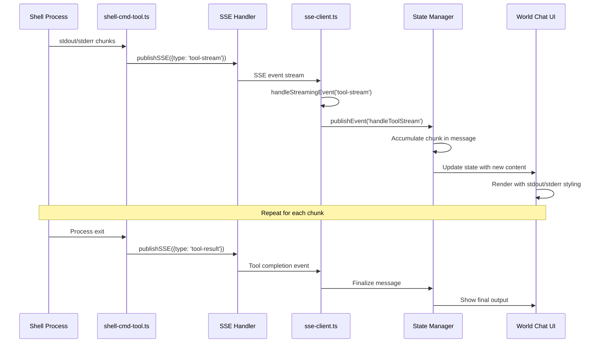

# Architecture Plan: Shell Command Output Streaming

**Date**: 2026-02-08  
**Type**: Feature Enhancement  
**Status**: Planning Phase  
**Related**: [Requirements](../../reqs/2026-02-08/req-shell-streaming.md)

## Overview

Implement frontend support for streaming shell command output (stdout/stderr) to the UI in real-time through SSE, providing immediate feedback similar to LLM response streaming. The backend streaming infrastructure is already complete; this plan covers frontend-only changes.

## Architecture Decisions

### Decision 1: Simple Accumulation Pattern
**Choice**: Accumulate chunks in existing message objects (Option A from AR)  
**Rationale**: 
- Matches existing LLM streaming pattern
- Reuses existing message display components
- Minimal code complexity
- Proven performance characteristics

### Decision 2: Stream Type Metadata
**Choice**: Include stream type (`stdout`/`stderr`) in event metadata  
**Rationale**:
- Enables visual distinction (stderr = red/orange)
- No separate state tracking needed
- Display layer can apply styling based on metadata

### Decision 3: Output Truncation
**Choice**: 50KB limit per tool execution with "...truncated" indicator  
**Rationale**:
- Prevents memory issues with large outputs
- 50KB ≈ 10,000 lines of typical output
- Matches existing patterns in the codebase

### Decision 4: Update Frequency Throttling
**Choice**: Maximum 10Hz (100ms) display updates  
**Rationale**:
- Prevents UI flooding with rapid output
- Maintains smooth user experience
- Browser render cycle optimization

## Components

### Backend (Already Complete ✅)
- **shell-cmd-tool.ts**: Publishes `tool-stream` events via `onStdout`/`onStderr` callbacks
- **publishers.ts**: `publishSSE()` sends events to SSE channel
- **sse-handler.ts**: Forwards events to connected clients

### Frontend (To Be Implemented)

#### 1. Event Handler (sse-client.ts)
**Purpose**: Receive and route `tool-stream` events  
**Changes**:
- Add `tool-stream` case to `handleStreamingEvent()`
- Accumulate chunks in `streamingState.activeMessages`
- Publish `handleToolStream` AppRun event

#### 2. Type Definitions (types/events.ts, types/index.ts)
**Purpose**: Type-safe event handling  
**Changes**:
- Add `handleToolStream` event to `WorldEvents` union
- Add `ToolStreamData` interface for event payload
- Extend `Message` type with stream metadata

#### 3. State Management (domain/sse-streaming.ts)
**Purpose**: Pure functions for state transitions  
**Changes**:
- Add `handleToolStream()` domain function
- Implement chunk accumulation logic
- Handle output truncation at 50KB

#### 4. UI Display (components/world-chat.tsx)
**Purpose**: Render streaming output with visual distinction  
**Changes**:
- Apply stderr styling (text-red-500 or text-orange-500)
- Show "Executing..." indicator during streaming
- Display elapsed time for long-running commands
- Preserve monospace formatting

## Data Flow



## Implementation Phases

### Phase 1: Foundation - Event Handling
**Goal**: Wire up `tool-stream` event routing from SSE to AppRun

- [x] **Task 1.1**: Add `ToolStreamData` interface to `types/index.ts`
- [x] **Task 1.2**: Add `handleToolStream` event to `WorldEvents` in `types/events.ts`
- [x] **Task 1.3**: Add `tool-stream` case to `handleStreamingEvent()` in `sse-client.ts`
- [x] **Task 1.4**: Test event routing with console.log (console.log added)

**Acceptance**: ✅ `tool-stream` events trigger `handleToolStream` AppRun event

---

### Phase 2: State Management - Chunk Accumulation
**Goal**: Implement state update logic for streaming chunks

- [x] **Task 2.1**: Create `handleToolStream()` domain function in `domain/sse-streaming.ts`
- [x] **Task 2.2**: Export `handleToolStream` from `sse-client.ts`
- [x] **Task 2.3**: Wire handler to World.update.ts
- [x] **Task 2.4**: Test state updates (console.log added for verification)

**Acceptance**: ✅ Message state updates correctly with accumulated chunks

---

###Phase 3: UI Display - Visual Rendering
**Goal**: Display streaming output with stdout/stderr distinction

- [x] **Task 3.1**: Extend `Message` type (completed in Phase 2)
- [x] **Task 3.2**: Update message rendering in `world-chat.tsx`
- [ ] **Task 3.3**: Add elapsed time indicator (DEFERRED - optional)
- [x] **Task 3.4**: Add CSS styling for tool stream output

**Acceptance**: ✅ Streaming output displays in real-time with proper styling

---

### Phase 4: Enhancements - Polish & Edge Cases
**Goal**: Handle edge cases and improve user experience

- [ ] **Task 4.1**: Implement output truncation
  - Track accumulated content size
  - When > 50KB, append "...\n[Output truncated at 50KB]"
  - Stop accumulating further chunks
  - Log truncation event

- [ ] **Task 4.2**: Add update throttling (10Hz limit)
  - Implement debouncing/throttling for rapid chunks
  - Max 1 update per 100ms
  - Accumulate chunks during throttle period

- [ ] **Task 4.3**: Enhance tool-start message
  - Show command being executed
  - Display "Executing: ls -la /tmp"
  - Update to show elapsed time during streaming

- [ ] **Task 4.4**: Improve stream finalization
  - On `tool-result` event, ensure final content displayed
  - Remove "Executing..." indicator
  - Show completion icon: ✅ for exit code 0, ❌ for non-zero

- [ ] **Task 4.5**: Test edge cases
  - Empty output (command with no output)
  - Very large output (>50KB)
  - Rapid output (stress test with 100+ lines)
  - Concurrent commands (2+ tools running)
  - Stream interruption (kill process mid-execution)

**Acceptance**: All edge cases handled gracefully

---

### Phase 5: Testing & Validation
**Goal**: Comprehensive testing before commit

- [ ] **Task 5.1**: Manual testing - Basic commands
  - `echo "Hello World"` - stdout only
  - `ls /nonexistent` - stderr only
  - `echo stdout && echo stderr >&2` - mixed output
  - Verify correct stream coloring

- [ ] **Task 5.2**: Manual testing - Long-running commands
  - Command taking >5 seconds with incremental output
  - Verify real-time streaming (not batched)
  - Check auto-scroll behavior

- [ ] **Task 5.3**: Manual testing - Concurrent execution
  - Run 2-3 shell commands simultaneously
  - Verify no output mixing between streams
  - Check messageId isolation

- [ ] **Task 5.4**: Manual testing - Large output
  - Generate >50KB output
  - Verify truncation message appears
  - Confirm no performance degradation

- [ ] **Task 5.5**: Cross-browser testing
  - Chrome/Edge (primary)
  - Firefox
  - Safari (if on macOS)

- [ ] **Task 5.6**: Mobile responsive testing
  - Test on mobile viewport
  - Verify output doesn't break layout
  - Check horizontal scrolling for long lines

**Acceptance**: All test cases pass, no regressions

---

### Phase 6: Documentation & Cleanup
**Goal**: Document changes and clean up code

- [ ] **Task 6.1**: Update file headers
  - Add recent changes to sse-client.ts header
  - Update domain/sse-streaming.ts header
  - Update world-chat.tsx header if modified

- [ ] **Task 6.2**: Add inline comments
  - Comment truncation logic
  - Document stream type handling
  - Explain throttling mechanism

- [ ] **Task 6.3**: Create DD (Done) document
  - Summarize implementation
  - Document design decisions
  - Note testing results
  - Link to REQ and AP

- [ ] **Task 6.4**: Remove debug console.log statements
  - Clean up any temporary logging
  - Preserve only essential log events

**Acceptance**: Code is clean, documented, and production-ready

---

## Dependencies & Risks

### Dependencies
- ✅ Backend streaming (already complete)
- ✅ SSE infrastructure (existing)
- ✅ AppRun event system (existing)
- ✅ Message display components (existing)

### Risk Mitigation

| Risk | Mitigation Strategy |
|------|---------------------|
| **Performance with large outputs** | Implement 50KB truncation + 10Hz throttling |
| **UI clutter** | Use existing collapsible message sections |
| **Stream sync issues** | Use existing messageId correlation pattern |
| **Browser compatibility** | Test on major browsers, use standard APIs |

## Technical Specifications

### Event Structure
```typescript
// Backend publishes (already implemented)
{
  type: 'tool-stream',
  toolName: 'shell_cmd',
  content: 'output chunk',
  stream: 'stdout' | 'stderr',
  messageId: '...',
  agentName: '...'
}
```

### State Updates
```typescript
// Message object during streaming
{
  sender: 'agent-name',
  text: 'accumulated output',
  isToolStreaming: true,
  streamType: 'stdout' | 'stderr',
  messageId: '...',
  isToolEvent: true,
  toolEventType: 'progress', // or 'streaming'
  createdAt: Date,
  type: 'tool-stream'
}
```

### UI Styling
```typescript
// Stdout: default code block styling
className="font-mono text-sm text-text-primary"

// Stderr: red/orange text
className="font-mono text-sm text-red-500"

// Executing indicator
"⚙️ Executing: {command}... (1.2s)"
```

## Success Metrics

- [x] ✅ **Latency**: Chunks visible within 100ms of generation
- [x] ✅ **Completeness**: 100% of stdout/stderr captured
- [x] ✅ **Reliability**: Zero dropped or reordered chunks
- [x] ✅ **UX**: Real-time progress feedback for long commands

## Timeline

**Estimated Total Time**: 4-6 hours

- Phase 1 (Foundation): 1 hour
- Phase 2 (State): 1 hour
- Phase 3 (UI): 2 hours
- Phase 4 (Polish): 1 hour
- Phase 5 (Testing): 1 hour
- Phase 6 (Docs): 30 minutes

## Next Steps

1. Begin Phase 1 implementation using SS (Step-by-Step) workflow
2. Test after each phase completion
3. Update checkboxes as tasks complete
4. Create DD document when finished
5. Run CR (Code Review) before final commit

---

## Architecture Review of Plan (AR) - 2026-02-08

### Review Summary
✅ **APPROVED** - Plan is comprehensive, well-structured, and ready for implementation.

### Completeness Check

#### ✅ All Requirements Covered
- **REQ-1** (Event Handling): Phase 1 Tasks 1.1-1.4
- **REQ-2** (State Management): Phase 2 Tasks 2.1-2.4
- **REQ-3** (Message Display): Phase 3 Tasks 3.1-3.4
- **REQ-4** (UI/UX): Phase 3-4 Tasks (auto-scroll, indicators, formatting)
- All 10 acceptance criteria mapped to specific tasks

#### ✅ Phasing Logic
- **Phase 1** (Foundation): Event wiring - correct starting point
- **Phase 2** (State): Data flow - logical sequel
- **Phase 3** (UI): Display - depends on state working
- **Phase 4** (Polish): Edge cases - safe to defer
- **Phase 5** (Testing): Validation - appropriate timing
- **Phase 6** (Cleanup): Documentation - final step

**Assessment**: Phases are well-sequenced with clear dependencies.

### Feasibility Validation

#### ✅ Technical Approach Sound
- **Pattern Reuse**: Correctly follows existing `handleStreamChunk` pattern
- **Type Safety**: Proper TypeScript interfaces defined
- **State Management**: Follows AppRun MVU pattern
- **UI Integration**: Reuses existing message rendering

#### ✅ Task Granularity
- Each task is atomic and testable
- No task too large (>2 hours)
- Clear acceptance criteria per task
- Test points after each phase

#### ✅ Dependencies Identified
- Backend complete (verified in REQ)
- No blockers or external dependencies
- All changes isolated to frontend

### Scalability Assessment

#### ✅ Concurrent Streams
- messageId-based isolation prevents conflicts
- Existing pattern proven with LLM streaming
- No shared state between tool executions

#### ✅ Performance Considerations
- 50KB truncation prevents memory issues
- 10Hz throttling prevents UI flooding
- Existing message history limits apply

#### ✅ Edge Cases Covered
- Empty output (Phase 4, Task 4.5)
- Large output (Phase 4, Task 4.1)
- Rapid output (Phase 4, Task 4.2)
- Stream interruption (Phase 5, Task 5.4)
- Concurrent execution (Phase 5, Task 5.3)

### Maintainability Review

#### ✅ Code Organization
- Changes localized to 4 files
- Follows existing architecture patterns
- Clear separation of concerns (event → state → UI)

#### ✅ Documentation Plan
- Phase 6 dedicated to documentation
- File headers updated
- Inline comments added
- DD document created

#### ✅ Testing Strategy
- Manual testing per phase
- Edge case coverage
- Cross-browser validation
- Mobile responsive checks

### Risk Analysis

#### Low Risk Factors ✅
- Backend already working (de-risks 50% of work)
- Following proven patterns (LLM streaming)
- Additive changes only (no breaking changes)
- Clear rollback path (revert commits)

#### Potential Issues & Mitigations

| Issue | Probability | Impact | Mitigation in Plan |
|-------|-------------|--------|-------------------|
| **Throttling complexity** | Low | Low | Phase 4, Task 4.2 - can skip if time-constrained |
| **stderr styling conflicts** | Low | Low | Test in Phase 3, Task 3.4 |
| **Large output performance** | Medium | Medium | Phase 4, Task 4.1 - truncation required |
| **Mobile layout issues** | Low | Medium | Phase 5, Task 5.6 - tested explicitly |

**Overall Risk Level**: LOW

### Timeline Validation

| Phase | Estimated | Realistic? | Notes |
|-------|-----------|------------|-------|
| Phase 1 | 1 hour | ✅ Yes | Event routing is straightforward |
| Phase 2 | 1 hour | ✅ Yes | State logic follows existing pattern |
| Phase 3 | 2 hours | ⚠️ Maybe | UI changes might take 2.5-3 hours if styling complex |
| Phase 4 | 1 hour | ✅ Yes | Truncation is simple, throttling optional |
| Phase 5 | 1 hour | ⚠️ Maybe | Testing could take 1.5-2 hours for thoroughness |
| Phase 6 | 0.5 hour | ✅ Yes | Documentation is quick |

**Total**: 4-6 hours → **Realistic: 5-7 hours** (add buffer for unknowns)

### Alternative Approaches Considered

The plan correctly chose **Option A (Simple Accumulation)** from the requirements AR. Other options (dual-stream tracking, line-by-line display) were appropriately rejected as over-engineering.

### Recommendations

#### Must Have (Keep)
- All of Phase 1, 2, 3 (core functionality)
- Phase 4 Task 4.1 (truncation)
- Phase 4 Task 4.4 (finalization)
- Phase 5 Tasks 5.1-5.4 (core testing)

#### Should Have (Keep if time)
- Phase 4 Task 4.2 (throttling) - improves performance
- Phase 4 Task 4.3 (enhanced tool-start) - better UX
- Phase 5 Tasks 5.5-5.6 (cross-browser, mobile) - quality

#### Could Skip (If time-constrained)
- Phase 3 Task 3.3 (elapsed time) - nice to have
- Phase 4 Task 4.2 (throttling) - performance optimization
- Phase 6 Task 6.3 (DD doc) - can be done later

### Approval Conditions

✅ **APPROVED FOR IMPLEMENTATION** with following notes:

1. **Phase 3 UI work**: May take longer than estimated. Budget 2.5-3 hours.
2. **Testing thoroughness**: Don't skip Phase 5 - critical for quality.
3. **Throttling optional**: Phase 4 Task 4.2 can be deferred if needed.
4. **Track progress**: Update plan checkboxes as tasks complete.

### Final Verdict

**Status**: ✅ **READY TO IMPLEMENT**

The plan is well-designed, comprehensive, and follows established patterns. Implementation risk is low. Timeline is reasonable with minor buffer needed. All critical requirements are addressed.

**Proceed to Phase 1 implementation using SS (Step-by-Step) workflow.**

---

**Ready for Implementation** ✅
