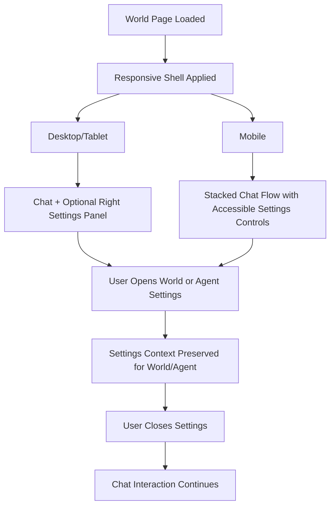

# Architecture Plan: World Page Right Settings Panel + Responsive Layout

**Date**: 2026-02-08  
**Status**: In Progress (Checkpoint C Reached)  
**Related Requirement**: `/Users/esun/Documents/Projects/agent-world/.docs/reqs/2026-02-08/req-world-page-right-settings-panel.md`  
**Target File**: `/Users/esun/Documents/Projects/agent-world/react/src/pages/WorldPage.tsx`

## Overview

Refactor the React World page from full-page mode switching into a split layout where chat remains the main area and a right-side panel slides open for settings. The right panel will host both World settings and Agent settings while staying side-by-side with the main content on desktop/tablet.  
Add responsive layout behavior so chat list, main chat, and settings remain usable across desktop, tablet, and mobile viewports.

## Current State Summary

- The page currently uses `viewMode` (`chat`, `world-settings`, `agent-settings`).
- Selecting settings replaces the full main area rather than opening a side panel.
- World and Agent settings editors already exist and can be reused.
- Existing page layout is tuned for larger screens and needs explicit responsive behavior.

## Architecture Decisions

- Keep chat as the permanent main content view.
- Introduce a dedicated right panel state:
  - `isRightPanelOpen: boolean`
  - `settingsSection: 'world' | 'agent'`
- Reuse existing `selectedAgent` for Agent settings context.
- Use split flex layout so panel width is allocated in layout flow (no overlay positioning) on desktop/tablet.
- Keep `MarkdownEditor` for both settings forms to avoid unnecessary component churn.
- Define viewport behavior contracts:
  - Desktop: chat list + main chat + optional right settings panel.
  - Tablet: compressed split layout with accessible chat list and settings.
  - Mobile: stacked/single-column flow with accessible chat list and settings controls.

## Architecture Review Updates (AR)

### Findings

- Current `WorldPage` settings flow is tightly coupled to `viewMode`, which conflicts with persistent main-area behavior.
- Existing world-save path in `WorldPage` is a pre-existing TODO and should remain behaviorally unchanged by this refactor.
- No existing React WorldPage test coverage was found for this behavior, so verification must include both manual checks and targeted tests.
- Current structure can clip content on small widths unless responsive layout rules are explicitly added.

### Decision

- Keep **Option A** as the implementation strategy:
  - Persistent chat main area
  - Toggleable right settings panel
  - In-panel section switching for World/Agent settings
- Add responsive adaptation strategy for tablet/mobile in the same route/component.
- Reject overlay drawer approach for desktop/tablet behavior because it violates the side-by-side requirement.

## Interaction Flow

## Implementation Phases

### Phase 1: State Model Refactor
- [x] Replace `viewMode` settings navigation behavior with right-panel state (`isRightPanelOpen`, `settingsSection`).
- [x] Preserve existing `selectedAgent` semantics for agent selection.
- [x] Keep chat as default/always-rendered main state; remove settings-only full-page branches.
- [x] Update click handlers:
  - World settings button opens panel in world section.
  - Agent click opens panel in agent section.
- [x] Keep chat behavior unchanged for message send, chat switch, create/delete chat.

### Phase 2: Responsive Layout Foundation
- [x] Refactor World page shell with explicit desktop/tablet/mobile breakpoints.
- [x] Define responsive behavior for chat list region:
  - Persistent/collapsible on larger screens
  - Accessible compact pattern on mobile
- [x] Ensure main chat region remains readable and operable across breakpoints.
- [x] Ensure no horizontal overflow in core interaction regions.
- [x] Keep selected world/chat/agent context stable on viewport resize/orientation changes.

### Phase 3: Split Layout and Right Panel Structure
- [x] Implement split content region:
  - Main area (chat) as primary flexible column.
  - Right settings panel column with width transition.
- [x] Ensure right panel uses layout width, not absolute/fixed overlay, on desktop/tablet.
- [x] Keep main area visible at all times when panel is open on desktop/tablet.
- [x] Add panel open/close transition classes for slide behavior.
- [x] Define mobile settings behavior that preserves access to chat and settings without layout breakage.

### Phase 4: Right Panel Composition
- [x] Create right panel header with close control.
- [x] Add section switch controls for:
  - World settings
  - Agent settings
- [x] Render World settings editor in panel world section.
- [x] Render Agent settings editor in panel agent section.
- [x] Add empty-state messaging for agent section when no agent is selected.

### Phase 5: Save/Cancel Behavior and Context Integrity
- [x] Keep world and agent save handlers functional in panel context.
- [x] Validate panel content reflects active world and selected agent.
- [x] Ensure cancel/back behavior closes panel or returns to default section without navigating away from World page.
- [x] Confirm no regression in existing agent create flow and chat interactions while panel is open.
- [x] Preserve current world-save behavior baseline (pre-existing TODO remains unchanged unless separately addressed).

### Phase 6: Verification and Regression Coverage
- [ ] Add/update component tests for:
  - Panel open/close behavior
  - World vs Agent section switching
  - Side-by-side rendering contract on desktop/tablet
  - Responsive behavior across viewport breakpoints
- [ ] If no existing WorldPage test harness exists, add a targeted test file for panel behavior with mocked hooks.
- [ ] Perform manual UI checks:
  - Chat remains visible while settings open (desktop/tablet)
  - Main interactions remain usable with settings open/closed
  - Desktop/tablet/mobile responsive behavior is stable
  - World settings trigger opens World section; agent trigger opens Agent section
  - No layout clipping/horizontal overflow in key viewport sizes

## Checkpoints for Confirmation

### Checkpoint A (after Phase 2)
- Expected: responsive shell works for desktop/tablet/mobile with stable core interactions.

### Checkpoint B (after Phase 3)
- Expected: right panel opens with slide behavior and main content remains visible side-by-side on desktop/tablet.

### Checkpoint C (after Phase 4)
- Expected: both World settings and Agent settings are reachable inside the same settings surface.

### Checkpoint D (after Phase 6)
- Expected: no regression in chat, chat list, and agent interactions; requirement acceptance criteria met.

## Dependencies

- Existing `MarkdownEditor` component behavior.
- Existing world/agent hooks in World page (`useWorldData`, `useAgentData`, `useChatData`).
- Existing World page CSS utility conventions (Tailwind/shadcn patterns).

## Risks and Mitigations

- **Risk**: Layout compression makes chat unusable on smaller widths.
  - **Mitigation**: define panel width constraints and responsive min-width behavior.
- **Risk**: Refactor from `viewMode` introduces unintended state transitions.
  - **Mitigation**: isolate panel state logic and keep chat state paths unchanged.
- **Risk**: Agent settings opened without selected agent.
  - **Mitigation**: explicit empty state with guidance to select an agent.
- **Risk**: Responsive states diverge between breakpoints and create inconsistent behavior.
  - **Mitigation**: define viewport behavior matrix and test each breakpoint path explicitly.

## Definition of Done

- [ ] Right panel slides open and closed.
- [ ] World and Agent settings live in the same right panel/settings surface.
- [ ] Panel is side-by-side with main area and does not overlay main content on desktop/tablet.
- [ ] Main area remains visible and interactive during panel open state on desktop/tablet.
- [ ] World page is responsive and usable across desktop, tablet, and mobile.
- [ ] Existing World page behaviors still function.
