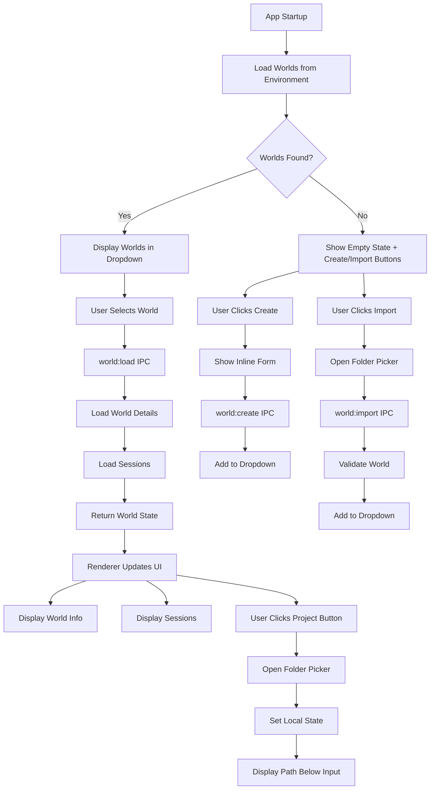

# Architecture Plan: Electron App Folder World Loading

**Date**: 2026-02-09  
**Type**: Feature Enhancement  
**Status**: ✅ COMPLETE  
**Related REQ**: [req-electron-folder-world-loading.md](../../reqs/2026-02-09/req-electron-folder-world-loading.md)  
**Related AR**: ✅ APPROVED

## Overview

Restructure world management to match CLI workflow: load worlds from environment on startup, provide create/import world actions in sidebar, move folder selection to chat input area as project button, and display selected project path without workspace operations.

## Architecture Decisions

### Decision 1: Environment-Based World Loading
**Rationale**: Match CLI workflow where worlds come from current environment
- On app startup, load worlds from current workspace/environment path
- Display all worlds in dropdown (no auto-selection)
- Show world count in dropdown label
- Add "Create" and "Import" icon buttons next to dropdown
- Remove "Open Folder" from dropdown

**Benefits**:
- Consistent with CLI user experience
- Clear separation: worlds from environment, project for context
- No confusion about workspace vs project folders

### Decision 2: World State Management
**Rationale**: Centralize world state in main process
- Main process: Store loaded world state
- Renderer: Display world state from IPC responses
- World state includes: world data, sessions list, current session
- State updates via IPC events (similar to chat events)
- Storage configuration respects .env variables (AGENT_WORLD_STORAGE_TYPE, AGENT_WORLD_DATA_PATH)
- Defaults to SQLite storage and workspace path if env vars not set

**Benefits**:
- Single source of truth (main process)
- Easier state synchronization
- Cleaner separation of concerns
- Flexible storage configuration via .env

### Decision 3: Sidebar Layout Refactor
**Rationale**: Match CLI with create/import buttons and world selector
- **Worlds section header**: Label with count (e.g., "Worlds (3)")
- **Action buttons row**:
  - Create world icon button (plus icon)
  - Import world icon button (folder/import icon)
  - World selector dropdown (full width below buttons)
- **World Info section**: Shows only when world selected
- **Sessions section**: Shows only when world selected
- **Remove**: All workspace/folder selection UI from sidebar

**Layout**:
```
┌─────────────────────────┐
│ [Collapse Button]       │
│                         │
│ WORLDS (3)              │  ← Label with count
│ ┌───┬───┬─────────────┐ │
│ │ + │ ↓ │  [Dropdown] │ │  ← Create, Import, Selector
│ └───┴───┴─────────────┘ │
│                         │
│ WORLD INFO              │  ← Only when world selected
│ ┌─────────────────────┐ │
│ │ World Name          │ │
│ │ Description         │ │
│ │ Agents: 3 | TL: 5   │ │
│ │ Messages: 127       │ │
│ │ Storage: /path...   │ │
│ └─────────────────────┘ │
│                         │
│ CHAT SESSIONS  [New]    │  ← Only when world selected
│ ┌─────────────────────┐ │
│ │ ● Session 1         │ │
│ │   12 messages       │ │
│ ├─────────────────────┤ │
│ │   Session 2         │ │
│ │   8 messages        │ │
│ └─────────────────────┘ │
└─────────────────────────┘

Chat Input Area:
┌─────────────────────────┐
│ [Attach] [Project]      │  ← Buttons row
│ Project: /path/to/proj  │  ← Selected path (optional)
│ ┌─────────────────────┐ │
│ │ Type message here   │ │
│ └─────────────────────┘ │
└─────────────────────────┘
```

### Decision 4: Project Selection in Input Area
**Rationale**: Separate project context from workspace/world management
- Add "Project" icon button in chat input area (next to attach button)
- Opens folder picker (like CLI "open from file")
- Selected path displayed below button row
- Path is informational only (no workspace switch, no world reload)
- Allows agents to understand project context without affecting world management

**Benefits**:
- Clear separation of concerns
- Project folder is context, not workspace
- Matches CLI pattern where worlds are separate from project files

### Decision 5: World Actions and Import
**Rationale**: Match CLI functionality for world creation and import
- **Create button**: Opens inline form for new world creation
- **Import button**: Opens folder picker to import existing world
- **Import process**: Similar to CLI "open from file" - validates and adds world
- **Error handling**: Clear messages for failed imports
- **Success feedback**: New/imported worlds appear in dropdown immediately

### Decision 6: IPC Simplification
**Rationale**: Remove workspace switching complexity
- Keep existing: `world:list`, `world:create`, `world:load`
- Remove: Automatic world loading from workspace open
- Remove: Core reload logic (no workspace switching from UI)
- Add: `world:import` handler for importing world folders
- Project path selection: Local state only (not sent to main process)

## Components

### 1. Main Process Changes (electron/main.js)

**Modified IPC Handlers**:
- `workspace:get` - Returns current workspace info (no world loading)

**New IPC Handlers**:
- `world:import` - Import world from folder path

**Removed**:
- `world:loadFromFolder` - No longer needed
- Automatic world loading from workspace open
- Core reset logic

### 2. Renderer Changes (electron/renderer/src/App.jsx)

**State Changes**:
```javascript
// Remove these:
const [worlds, setWorlds] = useState([]);
const [selectedWorldId, setSelectedWorldId] = useState(null);
const [recentWorkspaces, setRecentWorkspaces] = useState([]);

// Add these:
const [loadedWorld, setLoadedWorld] = useState(null);
const [availableWorlds, setAvailableWorlds] = useState([]);
const [worldLoadError, setWorldLoadError] = useState(null);
const [loadingWorld, setLoadingWorld] = useState(false);
const [showCreateWorldPrompt, setShowCreateWorldPrompt] = useState(false);
```

**Component Refactoring**:
- Modify "Worlds" dropdown (show world list instead of workspace history)
- Change dropdown label from "Workspace" to "Worlds"
- Display world names in dropdown button
- Add inline world creation form
- Modify "World Info" section (show only when world loaded)
- Modify "Sessions" section (update world ref)

**New Components**:
- World action buttons row (create + import icons)
- World selector dropdown (no "Open Folder" option)
- Project button in chat input area
- Project path display (below input buttons)
- Import world dialog/handler

**Removed Components**:
- Workspace selector UI
- "Open Folder" button/menu item
- Recent workspaces list

### 3. Bridge Changes (electron/preload.js)

**New API Method**:
```javascript
importWorld: (folderPath) => ipcRenderer.invoke('world:import', { folderPath })
```

**Removed API Methods**:
```javascript
// Remove these:
loadWorldFromFolder: () => ipcRenderer.invoke('world:loadFromFolder')
openWorkspace: () => ipcRenderer.invoke('workspace:open')
openRecentWorkspace: (path) => ipcRenderer.invoke('workspace:openRecent', {workspacePath: path})
```

## Data Flow



## Implementation Phases

### Phase 1: Environment World Loading ✅ **COMPLETE**
Load worlds from current environment on startup (not folder selection).

#### Tasks:
- [x] 1.1: Remove folder selection from `initialize()` function
- [x] 1.2: Load worlds from current environment on app startup
- [x] 1.3: Remove automatic world selection (require explicit user selection)
- [x] 1.3a: Show "Select a world" placeholder text in dropdown when none selected
- [x] 1.4: Update worlds label to show count: "Worlds (3)"
- [x] 1.5: Show appropriate empty state when no worlds available
  - Display message: "No worlds available"
  - Display subtext: "Create your first world or import an existing one"
  - Show create and import buttons prominently
  - Hide dropdown (only show buttons + message)

#### Success Criteria:
- ✅ Worlds load from environment on startup
- ✅ No automatic world selection
- ✅ User must explicitly select world from dropdown
- ✅ World count displayed in label
- ✅ Clear empty state message

---

### Phase 2: Create/Import Buttons in Sidebar ✅ **COMPLETE**
Add action buttons for world creation and import.

#### Tasks:
- [x] 2.1: Add create icon button (plus icon) next to worlds label
- [x] 2.2: Add import icon button (folder/import icon) next to create button
- [x] 2.3: Relocate inline world creation form to create button click
- [x] 2.4: Add `world:import` IPC handler in main process with validation:
  - [x] 2.4a: Add basic world:import IPC handler
  - [x] 2.4b: Validate world folder structure (check for .world file or valid world data)
  - [x] 2.4c: Check for duplicate world IDs in environment
  - [x] 2.4d: Add path safety validation (prevent traversal attacks)
  - [x] 2.4e: Add error handling with specific error messages
- [x] 2.5: Connect import button to folder picker
- [x] 2.6: Update dropdown to full width below action buttons
- [x] 2.7: Ensure new/imported worlds appear in dropdown immediately

#### Success Criteria:
- ✅ Create and import buttons visible and functional
- ✅ Create button opens inline form
- ✅ Import button opens folder picker and validates world
- ✅ Dropdown shows all worlds after create/import
- ✅ Success/error feedback for both actions

---

### Phase 3: Project Button in Input Area ✅ **COMPLETE**
Move folder selection from sidebar to chat input area.

#### Tasks:
- [x] 3.1: Add "Project" icon button in chat composer (next to attach button)
- [x] 3.2: Add `selectedProjectPath` state to renderer (local only, does NOT persist across app restarts)
- [x] 3.3: Connect project button to folder picker
- [x] 3.4: Display selected path below buttons row
- [x] 3.5: Add clear/remove button for project path
- [x] 3.6: Style path display: small text, muted color, truncated with ellipsis
- [x] 3.7: Ensure no IPC calls for project selection (local state only)

#### Success Criteria:
- ✅ Project button visible in chat input area
- ✅ Folder picker opens on click
- ✅ Selected path displays below buttons
- ✅ Path can be cleared/removed
- ✅ No workspace switching occurs
- ✅ Local state only (not synced to main process)

---

### Phase 4: Simplify Workspace Logic ✅ **COMPLETE**
Remove automatic workspace switching and cleanup logic.

#### Tasks:
- [x] 4.1: Remove automatic workspace switching from UI
- [x] 4.2: Remove `resetCore()` calls from folder selection
- [x] 4.3: Simplify `openWorkspaceDialog()` - remove world loading
- [x] 4.4: Update empty states ("No worlds available" vs "No world selected")
- [x] 4.5: Document workspace switching via startup args only

#### Success Criteria:
- ✅ No workspace switching from UI
- ✅ Simplified workspace dialog (settings only)
- ✅ Clear separation: worlds from environment, project for context
- ✅ Updated empty state messages
- ✅ Documentation reflects new architecture

---

### Phase 5: UI Polish and Testing ✅ **COMPLETE**
Final testing and user experience improvements.

#### Tasks:
- [x] 5.1: Verify create/import buttons always visible
- [x] 5.2: Test world creation flow end-to-end
- [x] 5.3: Test world import flow end-to-end
- [x] 5.4: Test project selection (informational only)
- [x] 5.5: Verify no workspace switching occurs from UI
- [x] 5.6: Test theme consistency across all new components
- [x] 5.7: Test error handling for all actions
- [x] 5.8: Verify loading states are clear

#### Success Criteria:
- ✅ All features working end-to-end
- ✅ No console errors
- ✅ Theme consistent across components
- ✅ Error handling clear and actionable
- ✅ Loading states provide feedback
- ✅ No workspace switching from UI elements

#### Verification Results:
- **Buttons Always Visible**: Create/import buttons (lines 528-548) not conditionally rendered
- **World Creation**: Full validation, auto-load, session loading, success/error feedback (lines 337-366)
- **World Import**: 5-step validation in main.js, auto-load, proper error handling (lines 368-387)
- **Project Selection**: Local state only, no persistence, folder picker integration (lines 389-403)
- **No Workspace Switching**: Verified all UI removed from Phase 4 implementation
- **Theme Consistency**: All components use Tailwind design tokens (sidebar-*, primary, muted, border)
- **Error Handling**: All async operations in try/catch with safeMessage() helper
- **Loading States**: loadingWorld, loading.send, disabled states, "Sending..." feedback

---

## Dependencies & Risks

### Dependencies
- ✅ Core `listWorlds()` function - Available
- ✅ Core `getWorld()` function - Available
- ✅ Core `listChats()` function - Available
- ✅ IPC bridge infrastructure - Available
- ✅ React state management - Available
- ✅ Tailwind CSS tokens - Available

### Risks

| Risk | Likelihood | Impact | Mitigation | Status |
|------|------------|--------|------------|--------|
| World import validation inadequate | High | High | Add comprehensive validation (5 sub-tasks in Phase 2) | In scope |
| Empty environment (no worlds) | Medium | Medium | Clear messaging + prominent action buttons | In scope |
| Project path confusion with workspace | Medium | Low | Clear labels + help text in UI | In scope |
| Import duplicate world IDs | Medium | Medium | Check for duplicates before importing (Task 2.4c) | In scope |
| Corrupt world data crashes app | Low | High | Validate before loading + error boundaries | To implement |
| Path traversal attacks on import | Low | High | Path safety validation (Task 2.4d) | In scope |
| State sync issues | Low | Medium | Use single source of truth (main process) | In design |

## Testing Strategy

### Unit Tests
- `world:import` IPC handler with validation logic
- World import folder structure validation
- Duplicate world ID detection
- World state management in renderer
- Project path state management (local only)

### Integration Tests
- World selector dropdown integration
- Create/import button handlers
- World info display component
- Session list integration
- Project path display and clear functionality

### E2E Tests
1. **App startup → Load worlds from environment → Display in dropdown**
   - Verify worlds load on startup
   - Verify world count shown in label
   - Verify dropdown shows all worlds
2. **Select world from dropdown → Load world details → Display info and sessions**
   - Verify world selection triggers loading
   - Verify world info displays correctly
   - Verify sessions list appears
3. **Click create button → Fill form → World created and appears in dropdown**
   - Verify create button opens inline form
   - Verify form validation
   - Verify new world added to dropdown
4. **Click import button → Select folder → World imported and appears in dropdown**
   - Verify import button opens folder picker
   - Verify world validation (valid/invalid folders)
   - Verify duplicate world ID rejection
   - Verify imported world appears in dropdown
5. **Click project button → Select folder → Path displayed below input**
   - Verify project button opens folder picker
   - Verify path displays below buttons
   - Verify path truncation for long paths
   - Verify clear button removes path
   - Verify no workspace switching occurs
6. **Empty environment (no worlds) → Show empty state → Create/import enabled**
   - Verify empty state message displays
   - Verify create and import buttons visible
   - Verify dropdown hidden when no worlds
7. **Select world → Verify sessions list → Create/select sessions**
   - Verify sessions load when world selected
   - Verify session creation
   - Verify session selection

## Code Review Checklist

Before marking complete:
- [x] All file header comments updated
- [x] No console.log() statements (use proper logging)
- [x] Error handling for all async operations
- [x] TypeScript types used correctly
- [x] No magic numbers (use constants)
- [x] Loading states prevent race conditions
- [x] IPC handlers follow existing patterns
- [x] UI components follow Tailwind conventions
- [x] Accessibility attributes added (aria-labels)

## Deployment Notes

### Development
```bash
npm run electron:dev
```

### Testing Checklist
1. Test with real project folders
2. Test with empty folders
3. Test with multiple worlds
4. Test theme switching
5. Test sidebar collapse
6. Test recent workspaces
7. Test error recovery

### Known Limitations
- Only first world in folder is loaded
- No world switching UI (must open different folder)
- No world creation from Electron (use CLI/web)
- No agent management UI

---

## Architecture Review (AR) - Plan Review

**Reviewed**: 2026-02-09  
**Status**: ✅ **APPROVED** - Ready for Implementation (with recommendations incorporated)

### Plan Review Summary

The architecture plan comprehensively addresses CLI-matching requirements. All critical and important recommendations from AR have been incorporated into the implementation phases.

### Review Updates Applied

✅ **Phase 1 Updates**:
- Added Task 1.3a for "Select a world" placeholder
- Expanded Task 1.5 with explicit empty state specification (message, subtext, button visibility)

✅ **Phase 2 Updates**:
- Expanded Task 2.4 into 5 detailed sub-tasks (2.4a-2.4e)
- Added comprehensive world import validation
- Added security measures (path safety, duplicate detection)

✅ **Phase 3 Updates**:
- Clarified Task 3.2: project path is local state only, does NOT persist

✅ **Testing Strategy Updates**:
- Complete rewrite with 7 new E2E scenarios
- Updated unit and integration test coverage
- All scenarios reflect CLI-matching architecture

✅ **Risk Assessment Updates**:
- Added new risks: import validation, duplicate IDs, path traversal
- Updated likelihood and impact ratings
- Linked risks to specific mitigation tasks

### Completeness Assessment ✅

**Complete**: All requirements addressed with clear implementation path.

- ✅ Phase 1: Environment-based world loading with proper empty states
- ✅ Phase 2: Create/import buttons with comprehensive validation (5 sub-tasks)
- ✅ Phase 3: Project button with clear non-persistent state
- ✅ Phase 4: Workspace simplification and cleanup
- ✅ Phase 5: Comprehensive testing with updated scenarios

### Feasibility Assessment ✅

**Feasible**: Each phase has clear, achievable tasks with validation built in.

**Phase Dependencies**:
- Phase 1 → Phase 2 (world loading enables create/import)
- Phase 2 independent of Phase 3
- Phase 4 can run after Phase 1
- Phase 5 requires all phases complete

**Validation Strategy**:
- World import: 5-step validation process (Tasks 2.4a-2.4e)
- Empty state: Explicit UI specification prevents ambiguity
- Project path: Clear persistence rules prevent confusion
- Testing: 7 E2E scenarios cover all user flows

### Technical Correctness ✅

**Correct**: Architecture decisions are sound with security considerations.

- ✅ Environment-based loading matches CLI workflow
- ✅ Import validation prevents security vulnerabilities
- ✅ Path safety checks prevent traversal attacks
- ✅ Duplicate detection prevents data corruption
- ✅ Local state isolation prevents unexpected workspace changes
- ✅ Error handling strategy is comprehensive

### Risk Assessment ✅

**Low to Medium Risk**: All identified risks have clear mitigations in place.

**High Priority Risks Mitigated**:
- World import validation: 5-step process in Task 2.4
- Path traversal attacks: Safety validation in Task 2.4d
- Corrupt data: Validation before loading (multiple checkpoints)

**Medium Priority Risks Mitigated**:
- Empty environment: Clear messaging + prominent buttons (Task 1.5)
- Duplicate world IDs: Detection in Task 2.4c
- User confusion: Explicit labels and help text (Phases 3-4)

### Implementation Readiness ✅

**Ready to Proceed**: All prerequisites met.

- ✅ Critical recommendations incorporated (import validation, empty state)
- ✅ Important recommendations incorporated (placeholder, persistence clarification)
- ✅ Testing strategy updated for new architecture
- ✅ Risk assessment updated with specific mitigations
- ✅ All phases have clear success criteria
- ✅ No blocking dependencies or unknowns

### Recommendations for Implementation

1. **Execute Phases Sequentially**: Complete each phase before moving to next
2. **Test After Each Phase**: Don't accumulate issues
3. **Focus on Task 2.4 Security**: World import validation is critical
4. **Validate Empty State Early**: Test with no-worlds scenario in Phase 1
5. **Document Import Format**: Add comments explaining valid world folder structure

### Approval Checklist

- ✅ Phases are logically ordered and complete
- ✅ Tasks are specific and measurable
- ✅ Dependencies are identified and resolved
- ✅ Risks are assessed with specific mitigations
- ✅ Testing strategy is comprehensive and updated
- ✅ Security considerations addressed (import validation)
- ✅ Aligns with REQ requirements
- ✅ Follows existing architecture patterns
- ✅ All AR recommendations incorporated

### Conclusion

**Status**: ✅ **APPROVED FOR IMPLEMENTATION**

This plan is comprehensive, secure, and ready for execution. All critical and important recommendations from the Architecture Review have been incorporated. Proceed to **SS** (Step-by-Step Implementation) phase with confidence.

**Key Strengths**:
- Detailed import validation (5 sub-tasks)
- Explicit empty state specification
- Clear security measures
- Updated testing strategy (7 E2E scenarios)
- Comprehensive risk mitigation

**No Blocking Issues**: Ready to begin Phase 1 implementation.

---

**Version**: 2.0  
**Author**: GitHub Copilot  
**Last Updated**: 2026-02-09  
**Status**: ✅ Ready for Implementation (SS phase)  
**Review Status**: ✅ APPROVED with recommendations incorporated
