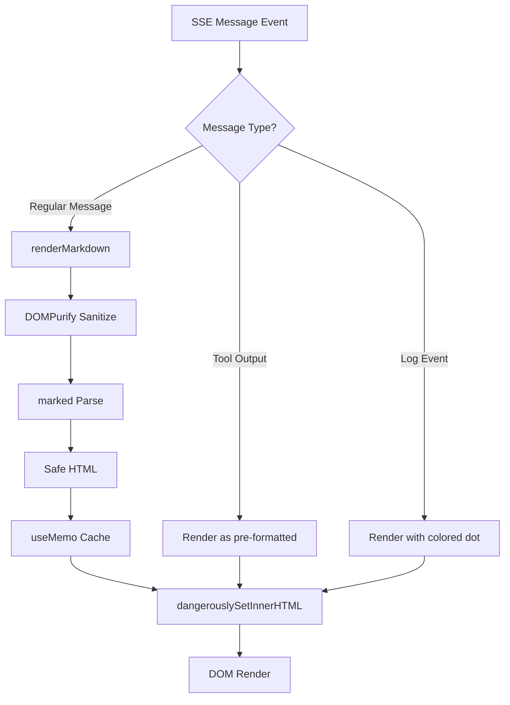

# Architecture Plan: Electron App Markdown Rendering

**Date**: 2026-02-10  
**Related Requirement**: [req-electron-markdown-rendering.md](../../reqs/2026-02-10/req-electron-markdown-rendering.md)

## Overview

Implement markdown rendering in the Electron app to achieve feature parity with the web app. The implementation will create a markdown utility module and update message rendering to use it for both streaming and final messages.

## Architecture Decisions

### Decision 1: Utility Function Pattern
**Rationale**: Matches web app architecture; simple to test and maintain; can be imported and used anywhere in the renderer

### Decision 2: React useMemo for Performance
**Rationale**: Cache rendered markdown during streaming to avoid re-parsing on every chunk update; improves performance during rapid updates

### Decision 3: Selective Rendering
**Rationale**: Skip markdown rendering for tool output and log messages since they have special formatting requirements (terminal colors, status indicators)

### Decision 4: Direct Code Reuse
**Rationale**: Copy and adapt the web app's markdown utility with minimal changes; ensures consistency and proven security

## Components

### 1. Markdown Utility Module
**Location**: `/electron/renderer/src/utils/markdown.js`  
**Exports**:
- `renderMarkdown(text)` - Main rendering function
- `hasMarkdown(text)` - Detection helper (optional optimization)

**Dependencies**:
- marked
- dompurify

**Configuration**:
- Same allowed tags/attributes as web app
- GitHub Flavored Markdown enabled
- Line breaks converted to `<br>`

### 2. Updated App.jsx
**Changes**:
- Import markdown utility
- Add `useMemo` for markdown rendering
- Conditionally render markdown vs plain text based on message type
- Use `dangerouslySetInnerHTML` for markdown content

## Data Flow



## Implementation Phases

### Phase 1: Dependencies and Utility ✅ COMPLETED
- [x] Install marked, dompurify, @types/dompurify
- [x] Create `/electron/renderer/src/utils/` directory
- [x] Create markdown.js with renderMarkdown function
- [x] Configure marked options (GFM, breaks)
- [x] Configure DOMPurify allowed tags/attributes
- [x] Add error handling and fallback

### Phase 2: Message Rendering Updates ✅ COMPLETED
- [x] Import markdown utility in App.jsx
- [x] Add MessageContent component with useMemo hook for markdown rendering
- [x] Update regular message rendering to use dangerouslySetInnerHTML
- [x] Preserve plain text rendering for tool output
- [x] Preserve plain text rendering for log messages
- [x] Add prose CSS styles for markdown content

### Phase 3: Testing and Refinement 🔄 IN PROGRESS
- [ ] Manual test: bold, italic, code
- [ ] Manual test: links, lists, blockquotes
- [ ] Manual test: tables (GFM)
- [ ] Manual test: streaming updates
- [ ] Manual test: tool output still displays correctly
- [ ] Manual test: log messages still display correctly
- [ ] Verify no XSS vulnerabilities
- [ ] Check for visual regressions

## File Changes Summary

### New Files
- `/electron/renderer/src/utils/markdown.js` (new)

### Modified Files
- `/electron/package.json` (dependencies)
- `/electron/renderer/src/App.jsx` (message rendering)

## Dependencies & Risks

### Dependencies
- marked (^14.1.4 or latest)
- dompurify (^3.2.3 or latest)
- @types/dompurify (^3.2.0 or latest) - dev only

### Risks

**Risk 1**: Performance degradation during rapid streaming  
**Mitigation**: Use React.useMemo to cache rendered markdown; only re-render when content changes

**Risk 2**: Breaking tool output formatting  
**Mitigation**: Keep tool output and log messages using existing plain text rendering; only apply markdown to regular messages

**Risk 3**: XSS vulnerabilities  
**Mitigation**: Use DOMPurify with strict whitelist; reuse web app's proven configuration

**Risk 4**: Styling conflicts with Tailwind  
**Mitigation**: Ensure markdown HTML inherits correct Tailwind classes; may need to add prose styles

## Testing Strategy

### Manual Testing Checklist
1. **Basic Markdown**
   - Bold: `**text**`
   - Italic: `*text*`
   - Inline code: `` `code` ``
   - Links: `[text](url)`

2. **Advanced Markdown**
   - Code blocks: ` ```language\ncode\n``` `
   - Lists: unordered and ordered
   - Blockquotes: `> quote`
   - Tables: `| col1 | col2 |`

3. **Streaming Behavior**
   - Markdown renders incrementally during streaming
   - No visual glitches or flickering
   - Thinking indicator still works

4. **Special Message Types**
   - Tool output: colored terminal display preserved
   - Log messages: colored dot indicators preserved
   - Human messages: markdown renders correctly

5. **Security**
   - Script tags are stripped
   - Inline event handlers are stripped
   - Only safe tags/attributes allowed

## Rollback Plan

If issues arise:
1. Remove markdown utility imports from App.jsx
2. Revert message rendering to plain text
3. Uninstall markdown dependencies
4. Restore from git if needed

## Success Metrics

- ✅ All markdown syntax renders correctly
- ✅ No performance degradation during streaming
- ✅ Tool output and log messages unchanged
- ✅ No security vulnerabilities
- ✅ Visual parity with web app
