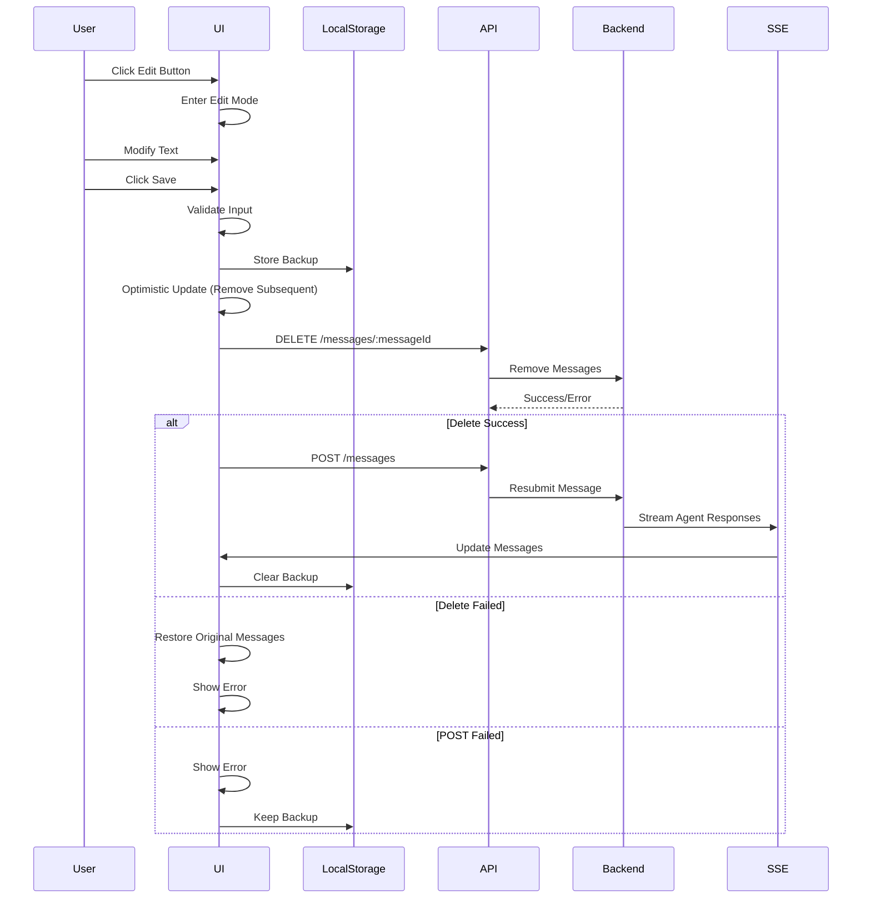
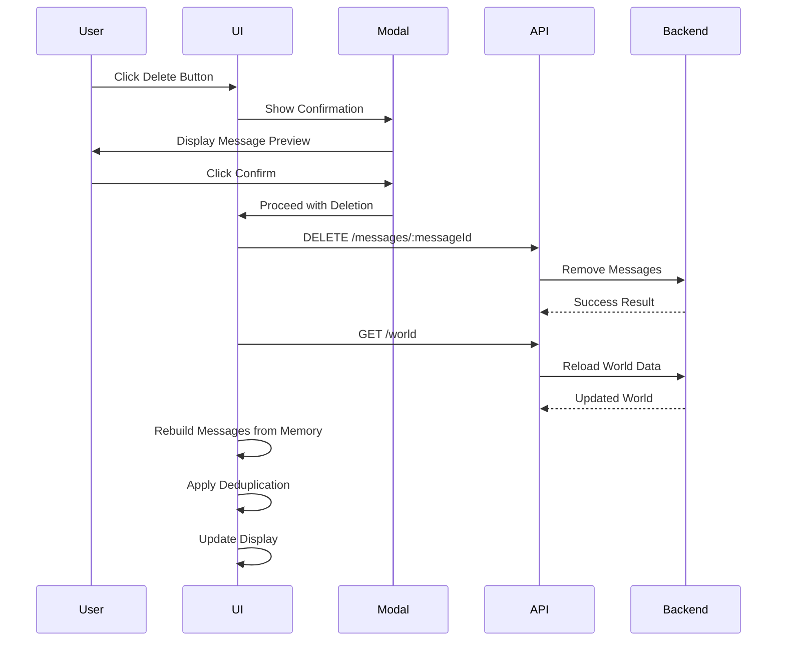

# Architecture Plan: User Message Edit and Delete in Electron App

**Date**: 2026-02-10  
**Requirement**: [req-electron-message-edit-delete.md](../../reqs/2026-02-10/req-electron-message-edit-delete.md)  
**Target**: Electron Desktop App (`electron/renderer/src/App.jsx`)

## Overview

This plan implements user message edit and delete functionality in the Electron desktop app by following the web app's established patterns. The implementation will reuse existing backend APIs, maintain SSE streaming integration, and provide consistent UX across platforms.

## Architecture Decisions

### Decision 1: Direct Implementation in App.jsx
**Rationale**: 
- Web app uses domain modules for separation of concerns
- Electron app uses single-component architecture with inline handlers
- Maintain consistency with existing Electron app patterns
- All state and handlers in main App component using React hooks

### Decision 2: Two-Phase Edit Approach (DELETE → POST)
**Rationale**:
- Reuses existing SSE streaming infrastructure for agent responses
- Matches web app behavior exactly
- Provides localStorage backup for recovery
- Removes edited message and all subsequent messages (conversation flow integrity)

### Decision 3: Confirmation Modal for Delete
**Rationale**:
- Prevents accidental deletion
- Shows message preview for user confirmation
- Uses window.confirm() for simplicity (matches existing agent delete pattern)
- Could be enhanced to custom modal later if needed

### Decision 4: Optimistic UI Updates
**Rationale**:
- Provides instant feedback to users
- Matches web app behavior
- Includes rollback on errors
- Better perceived performance

### Decision 5: State Management with React Hooks
**Rationale**:
- Follows existing App.jsx patterns (useState)
- No need for complex state management libraries
- Edit state: `editingMessageId`, `editingText`
- Delete state: `deletingMessageId`

## Components

### State Extensions

Add to existing App component state:

```javascript
const [editingMessageId, setEditingMessageId] = useState(null);
const [editingText, setEditingText] = useState('');
const [deletingMessageId, setDeletingMessageId] = useState(null);
```

### UI Components

**1. Message Action Buttons**
- Edit button (pencil icon)
- Delete button (X icon)
- Positioned after message timestamp
- Show only on user messages with messageId

**2. Edit Mode UI**
- Textarea replacing message content
- Save button (primary style)
- Cancel button (secondary style)
- Similar to composer styling

**3. Delete Confirmation**
- window.confirm() dialog with message preview
- Shows first 100 characters of message
- "Delete this message and all responses after it?"

### API Integration

**Existing APIs to use**:
- `api.deleteMessage(worldId, messageId, chatId)` - DELETE endpoint
- `api.sendMessage({worldId, chatId, content, sender})` - POST endpoint (via IPC)
- `api.getWorld(worldId)` - Reload after delete

**localStorage**:
- Key: `agent-world-desktop-edit-backup`
- Stores: `{messageId, chatId, newContent, timestamp, worldId}`

## Data Flow

### Edit Flow



### Delete Flow



## Implementation Phases

### Phase 1: Edit Mode UI & State Management
- [x] Add edit state variables (editingMessageId, editingText)
- [x] Add edit button to user messages (pencil icon)
- [x] Implement edit button click handler (startEditMessage)
- [x] Create edit mode UI (textarea + buttons)
- [x] Implement cancel edit handler
- [x] Implement edit text change handler
- [x] Disable edit button until messageId exists
- [x] Test edit mode entry and exit

### Phase 2: Edit Save Logic & API Integration
- [x] Create validateEditInput helper function
- [x] Create localStorage backup helper (saveEditBackup)
- [x] Implement optimistic UI update for edit
- [x] Call DELETE API endpoint
- [x] Handle DELETE response and errors
- [x] Call POST API endpoint on DELETE success
- [x] Clear localStorage on POST success
- [x] Handle POST errors with recovery message
- [x] Test full edit flow with backend

### Phase 3: Edit Error Handling & Edge Cases
- [x] Handle 423 Locked error (world processing)
- [x] Handle 404 Not Found error (message deleted)
- [x] Handle 400 Bad Request error (invalid message)
- [x] Implement rollback on DELETE error
- [x] Show user-friendly error messages
- [x] Test error scenarios
- [x] Test session mode validation
- [x] Test with multiple agents

### Phase 4: Delete Confirmation UI
- [x] Add delete state variable (deletingMessageId)
- [x] Add delete button to user messages (X icon)
- [x] Implement delete button click handler
- [x] Create confirmation dialog (window.confirm)
- [x] Format message preview (first 100 chars)
- [x] Implement confirmation cancel
- [x] Style delete button (red hover)
- [x] Test confirmation flow

### Phase 5: Delete Execution & World Reload
- [x] Implement delete execution handler
- [x] Validate messageId and chatId
- [x] Call DELETE API endpoint
- [x] Handle DELETE response
- [x] Call getWorld API to reload
- [x] Rebuild messages from agent memory
- [x] Apply deduplicateMessages logic
- [x] Update messages state
- [x] Handle errors and partial failures
- [x] Test delete flow end-to-end

### Phase 6: Polish & Styling
- [x] Match web app button positioning exactly
- [x] Apply consistent Tailwind styling
- [x] Add hover states and transitions
- [x] Ensure keyboard shortcuts work (Escape)
- [x] Test accessibility (tab navigation, aria labels)
- [x] Test with markdown-rendered messages
- [x] Test with long messages
- [x] Visual QA against web app

### Phase 7: Testing & Documentation
- [x] Test all acceptance criteria
- [x] Test error scenarios
- [x] Test with multiple chat sessions
- [x] Test with multiple agents
- [x] Test localStorage backup/recovery
- [x] Add code comments for complex logic
- [x] Update component header comment
- [x] Manual testing on macOS

## Key Implementation Details

### Edit Button Rendering

```javascript
{isHumanMessage(message) && message.messageId ? (
  <button
    type="button"
    onClick={() => onEditMessage(message.id, message.messageId, message.content)}
    disabled={!message.messageId}
    className="text-sidebar-foreground/70 hover:text-sidebar-foreground"
    title="Edit message"
  >
    <svg className="h-3.5 w-3.5" {...} />
  </button>
) : null}
```

### Edit Mode UI

```javascript
{editingMessageId === message.id ? (
  <div className="space-y-2">
    <textarea
      value={editingText}
      onChange={(e) => setEditingText(e.target.value)}
      className="w-full rounded border p-2"
      rows={3}
    />
    <div className="flex gap-2">
      <button onClick={() => onSaveEdit(message.id)}>Save</button>
      <button onClick={onCancelEdit}>Cancel</button>
    </div>
  </div>
) : (
  <MessageContent message={message} />
)}
```

### Delete Confirmation

```javascript
const onDeleteMessage = async (message) => {
  const preview = (message.text || '').substring(0, 100);
  const confirmed = window.confirm(
    `Delete this message and all responses after it?\n\n"${preview}${preview.length < message.text?.length ? '...' : '"}"`
  );
  if (!confirmed) return;
  
  // Proceed with deletion...
};
```

### Edit Save Handler

```javascript
const onSaveEdit = async (messageId) => {
  const editedText = editingText.trim();
  if (!editedText) return;

  const message = messages.find(m => m.id === messageId);
  if (!message?.messageId) {
    setStatusText('Cannot edit: message not saved yet', 'error');
    return;
  }

  if (!selectedSessionId) {
    setStatusText('Cannot edit: no active chat', 'error');
    return;
  }

  // Store backup
  const backup = {
    messageId: message.messageId,
    chatId: selectedSessionId,
    newContent: editedText,
    timestamp: Date.now(),
    worldId: loadedWorld.id
  };
  localStorage.setItem('agent-world-desktop-edit-backup', JSON.stringify(backup));

  // Optimistic update
  const editedIndex = messages.findIndex(m => m.id === messageId);
  const optimisticMessages = editedIndex >= 0 ? messages.slice(0, editedIndex) : messages;
  setMessages(optimisticMessages);
  setEditingMessageId(null);
  setEditingText('');

  try {
    // Phase 1: DELETE
    const deleteResult = await api.deleteMessage(loadedWorld.id, message.messageId, selectedSessionId);
    
    if (!deleteResult.success) {
      throw new Error('Failed to delete message');
    }

    // Phase 2: POST
    await api.sendMessage({
      worldId: loadedWorld.id,
      chatId: selectedSessionId,
      content: editedText,
      sender: 'human'
    });

    localStorage.removeItem('agent-world-desktop-edit-backup');
    setStatusText('Message edited successfully', 'success');
  } catch (error) {
    setStatusText(error.message || 'Failed to edit message', 'error');
    // Reload messages on error
    await refreshMessages(loadedWorld?.id, selectedSessionId);
  }
};
```

### Delete Handler

```javascript
const onDeleteMessage = async (message) => {
  if (!message.messageId || !selectedSessionId) return;

  const preview = (message.content || '').substring(0, 100);
  const confirmed = window.confirm(
    `Delete this message and all responses after it?\n\n"${preview}..."`
  );
  if (!confirmed) return;

  setDeletingMessageId(message.id);
  try {
    const result = await api.deleteMessage(loadedWorld.id, message.messageId, selectedSessionId);
    
    if (!result.success) {
      throw new Error(result.error || 'Failed to delete message');
    }

    // Reload world data
    const world = await api.getWorld(loadedWorld.id);
    
    // Rebuild messages from memory
    let newMessages = [];
    const agents = Array.isArray(world.agents) ? world.agents : Array.from(world.agents.values());
    
    for (const agent of agents) {
      for (const memoryItem of agent.memory || []) {
        if (memoryItem.chatId === selectedSessionId) {
          const msg = createMessageFromMemory(memoryItem, agent.name);
          newMessages.push(msg);
        }
      }
    }

    // Apply deduplication (same logic as initWorld)
    newMessages = deduplicateMessages(newMessages, agents);
    
    setMessages(newMessages);
    setLoadedWorld(world);
    setStatusText('Message deleted successfully', 'success');
  } catch (error) {
    setStatusText(error.message || 'Failed to delete message', 'error');
  } finally {
    setDeletingMessageId(null);
  }
};
```

## Dependencies & Risks

### Dependencies
- **Desktop API Bridge**: `window.agentWorldDesktop` IPC methods
- **Backend APIs**: DELETE /messages/:messageId, POST /messages
- **SSE System**: Must remain functional for edit resubmission
- **Message Deduplication**: `deduplicateMessages()` function
- **LocalStorage**: Browser localStorage API

### Risks

**Risk 1: API Unavailable During Edit**
- Mitigation: Validate session mode before attempting edit
- Mitigation: Show clear error messages with recovery instructions

**Risk 2: localStorage Backup Lost**
- Mitigation: User can manually retry edit operation
- Impact: Low (user can re-enter edited text)

**Risk 3: SSE Connection Disrupted**
- Mitigation: Existing SSE reconnection logic handles this
- Impact: Medium (agent responses may be delayed)

**Risk 4: Partial Delete Failures**
- Mitigation: Show which agents failed deletion
- Mitigation: Allow retry operation
- Impact: Medium (inconsistent state across agents)

**Risk 5: Edit During Active Processing**
- Mitigation: Backend returns 423 Locked status
- Mitigation: Show "try again" message
- Impact: Low (temporary condition)

## Testing Strategy

### Unit Testing
- Helper functions (validation, formatting)
- State transitions (edit mode entry/exit)
- Error condition handlers

### Integration Testing
- Edit flow with mock API responses
- Delete flow with mock API responses
- SSE streaming after edit
- Message deduplication after delete

### Manual Testing
- Edit and delete in various chat sessions
- Edit with multiple agents responding
- Delete with message preview correctness
- Error scenarios (network failures, 423/404/400)
- Keyboard shortcuts (Escape to cancel)
- Visual parity with web app

### Edge Cases
- Edit message without messageId
- Edit when session mode OFF
- Delete last message in chat
- Delete with only one message
- Edit very long messages (>1000 chars)
- Rapid edit/delete operations

## Performance Considerations

- Optimistic UI updates for instant feedback
- localStorage operations are synchronous but fast
- API calls don't block UI (async/await)
- Message rebuilding after delete uses existing deduplication logic
- No new performance bottlenecks introduced

## Alternative Approaches Considered

### Alternative 1: Domain Module Architecture
**Pros**: Clean separation of concerns, matches web app
**Cons**: Overengineering for single-component Electron app
**Decision**: Not chosen - maintain Electron app patterns

### Alternative 2: Custom Modal Component
**Pros**: Better UX, more control over styling
**Cons**: Additional complexity, not needed for MVP
**Decision**: Use window.confirm() initially, can enhance later

### Alternative 3: Single-Phase Edit (PATCH endpoint)
**Pros**: Simpler flow, fewer API calls
**Cons**: Requires new backend endpoint, loses SSE streaming benefits
**Decision**: Not chosen - use existing DELETE+POST approach

### Alternative 4: Inline Edit (No Mode)
**Pros**: Slightly faster UX
**Cons**: Confusing state management, harder to cancel
**Decision**: Not chosen - use explicit edit mode for clarity

## Success Criteria

- [ ] All acceptance criteria from requirement document met
- [ ] Visual parity with web app (buttons, positioning, styling)
- [ ] Edit and delete work reliably in all scenarios
- [ ] Error handling provides clear user feedback
- [ ] No regression in existing functionality
- [ ] Code follows Electron app patterns
- [ ] Comments explain complex logic (two-phase edit)
- [ ] Manual testing passes on macOS

## Timeline Estimate

- **Phase 1**: 2 hours (Edit UI & State)
- **Phase 2**: 2 hours (Edit API Integration)
- **Phase 3**: 1.5 hours (Edit Error Handling)
- **Phase 4**: 1 hour (Delete UI)
- **Phase 5**: 1.5 hours (Delete Execution)
- **Phase 6**: 1 hour (Polish & Styling)
- **Phase 7**: 2 hours (Testing & Documentation)

**Total**: ~11 hours (approximately 1.5 days)

## Next Steps

1. **AR (Architecture Review)**: Validate this plan before implementation
2. **SS (Step-by-Step)**: Execute phases in order with testing between phases
3. **TT (Test and Fix)**: Run comprehensive tests after implementation
4. **DD (Document Done)**: Create completion documentation

---

**Plan Version**: 1.0  
**Last Updated**: 2026-02-10  
**Ready for Review**: Yes
