# Architecture Plan: Electron App Stream Display

## ✅ Implementation Status: COMPLETE

**Completed:** 2025-06-10  
**Tests:** 53 passing (27 streaming-state + 26 activity-state)

## Overview

Implement real-time streaming display of LLM responses in the Electron desktop app following the IPC-based architecture. The main process forwards raw events from `world.eventEmitter` to the renderer, which handles all accumulation, debouncing, and UI logic.

## Architecture Decisions

1. **Raw Event Forwarding**: Main process wraps events with context only, no transformation
2. **Renderer-Side Accumulation**: Use Map keyed by `messageId` for content buffering
3. **16ms Debounce**: Batch rapid chunk updates into 60fps render frames
4. **Placeholder Removal**: On `end`, remove streaming placeholder; `message` event adds final

## Components

### Main Process (electron/main.js)
- Already implemented: `serializeRealtimeSSEEvent()`, `subscribeChatEvents()`
- **Needed**: Subscribe to `world.eventEmitter.on('world')` to capture tool events
- **Needed**: Add `serializeRealtimeToolEvent()` to wrap tool events for IPC
- Forward tool-start, tool-result, tool-error, tool-progress events to renderer

### Renderer (electron/renderer/src/)
- **New**: `streaming-state.js` — Content accumulator + debounce logic
- **Update**: `App.jsx` — Wire new streaming state to existing event handlers

## Data Flow

```mermaid
flowchart TD
    A[world.eventEmitter.on'sse'] --> B[serializeRealtimeSSEEvent]
    B --> C[webContents.send]
    C --> D[ipcRenderer.on chat:event]
    D --> E{payload.type}
    E -->|sse| F[StreamingState.handleSSE]
    E -->|message| G[handleMessageEvent]
    
    F --> H{eventType}
    H -->|start| I[Create accumulator entry]
    H -->|chunk| J[Append to accumulator]
    H -->|end| K[Remove accumulator]
    H -->|error| L[Set error state]
    H -->|tool-start| T1[Show tool indicator]
    H -->|tool-result| T2[Update tool status]
    H -->|tool-error| T3[Show tool error]
    
    I --> M[Replace thinking placeholder]
    J --> N[Schedule debounced render]
    K --> O[Remove placeholder]
    
    N --> P[requestAnimationFrame]
    P --> Q[Update messages state]
    Q --> R[DOM render]
    
    T1 --> T4[ActivityState.addTool]
    T2 --> T5[ActivityState.completeTool]
    T3 --> T5
```



### Interactivity Flow

```mermaid
flowchart TD
    U[User sends message] --> U1[Show thinking placeholder]
    U1 --> U2[Start elapsed timer]
    U2 --> U3{After 3s?}
    U3 -->|Yes| U4[Show elapsed time]
    U3 -->|No| U5[Wait]
    U5 --> U3
    
    U1 --> U6[Set isWorldBusy=true]
    U6 --> U7[Show activity pulse]
    
    S[SSE start event] --> S1[Replace thinking with streaming]
    S1 --> S2[Clear elapsed timer]
    
    E[SSE end event] --> E1[Set isWorldBusy=false]
    E1 --> E2[Hide activity pulse]
    
    M[Multiple agents] --> M1[Track agent count]
    M1 --> M2[Show "N agents responding"]
```

## Implementation Phases

### Phase 1: Create Streaming State Module ✅ COMPLETE
- [x] Create `electron/renderer/src/streaming-state.js`
- [x] Implement `StreamingState` class with Map-based accumulator
- [x] Implement `handleStart(messageId, agentName)` — create entry, return placeholder
- [x] Implement `handleChunk(messageId, content)` — append to accumulator
- [x] Implement `handleEnd(messageId)` — return final content, delete entry
- [x] Implement `handleError(messageId, errorMessage)` — mark error, delete entry
- [x] Implement 16ms debounce with `requestAnimationFrame`
- [x] Implement `flush()` for immediate render on end/error
- [x] Export factory function and TypeScript types (JSDoc)
- [x] **Unit tests:** 27 tests in `tests/electron/streaming-state.test.ts`

### Phase 2: Integrate Streaming State into App ✅ COMPLETE
- [x] Import `createStreamingState` in `App.jsx`
- [x] Create streaming state instance in component (useRef)
- [x] Wire `handleStreamStart` to add placeholder message with `isStreaming: true`
- [x] Wire `handleStreamChunk` to update accumulated content (debounced)
- [x] Wire `handleStreamEnd` to remove streaming placeholder
- [x] Wire `handleStreamError` to mark error state
- [x] Update `onChatEvent` callback to route through streaming state

### Phase 3: Update Message State Management ✅ COMPLETE
- [x] Refactor `applySseUpdateToMessages` to use external accumulator
- [x] Remove inline accumulation logic from payload handler
- [x] Add `removeStreamingMessage(messageId)` helper (via streaming-state callbacks)
- [x] Update message deduplication to handle streaming → final transition
- [x] Ensure `message` event replaces removed placeholder correctly

### Phase 4: Visual Indicators ✅ COMPLETE
- [x] Add streaming indicator component (ThinkingIndicator)
- [x] Show agent name during streaming (`agentName` from start event)
- [x] Add error state display (`hasError`, `errorMessage`)

### Phase 4b: Main Process Tool Event Forwarding ✅ COMPLETE
- [x] Add `world.eventEmitter.on('world', worldHandler)` in `subscribeChatEvents()`
- [x] Create `serializeRealtimeToolEvent(worldId, chatId, event)` function
- [x] Filter for tool event types: `tool-start`, `tool-result`, `tool-error`, `tool-progress`
- [x] Forward tool events via `sendRealtimeEventToRenderer({ type: 'tool', ... })`
- [x] Add cleanup for world event listener in unsubscribe

### Phase 5: Interactivity Indicators ✅ COMPLETE

#### 5a: Thinking Placeholder ✅
- [x] After `sendMessage` returns, immediately add "thinking" placeholder message
- [x] Show animated dots (● ● ●) with "Thinking..." text (ThinkingIndicator component)
- [x] Replace placeholder with streaming content when `start` event arrives
- [x] Remove placeholder if error occurs before `start`

#### 5b: Tool Execution Display ✅
- [x] Handle `tool-start` event — show tool name with spinner
- [x] Handle `tool-result` event — remove from active tools
- [x] Handle `tool-error` event — remove from active tools
- [x] Handle `tool-progress` event — show progress text if available
- [x] Display tool status in activity panel (ToolExecutionStatus component)
- [x] Queue multiple tool executions if they overlap

#### 5c: Global Activity Indicator ✅
- [x] Add `isBusy` state to track any pending operations (activity-state.js)
- [x] Show pulsing dot in activity panel when busy (ActivityPulse component)
- [x] Clear indicator when all operations complete

#### 5d: Multi-Agent Queue Indicator ✅
- [x] Track number of agents currently responding (streaming-state.getActiveCount)
- [x] AgentQueueDisplay component created
- [x] Update count as agents start/finish

#### 5e: Elapsed Time Display ✅
- [x] Start timer when activity begins (activity-state.js)
- [x] Show elapsed time via ElapsedTimeCounter component
- [x] Update every second
- [x] Clear timer when all activity completes

### Phase 6: Testing & Validation ✅ COMPLETE
- [x] Test single-agent streaming flow (unit tests)
- [x] Test multi-agent concurrent streaming (27 streaming-state tests)
- [x] Test rapid chunk throughput (verify 60fps rendering via RAF mock)
- [x] Test error handling mid-stream (handleError tests)
- [x] Test session switch during active stream (cleanup tests)
- [x] Test memory cleanup after long streams (cleanup tests)
- [x] Test tool execution indicators (26 activity-state tests)
- [x] Test global activity indicator reflects busy state
- [x] Test multi-agent queue count updates correctly
- [x] Test elapsed timer updates correctly

**Test Summary:** 53 unit tests passing (27 streaming + 26 activity)

## Dependencies & Risks

| Risk | Mitigation |
|------|------------|
| Race condition between `end` and `message` events | Use `messageId` to correlate; placeholder removal is idempotent |
| Debounce dropping final content | `flush()` on `end` renders any pending content |
| Memory leak from orphaned accumulators | Cleanup on session switch, window close |
| IPC serialization overhead | Payloads are small (messageId + delta); acceptable |
| Thinking placeholder not replaced | Timeout fallback removes stale placeholders after 60s |
| Tool events arrive before `start` | Queue tool events; display when message bubble exists |

## File Changes Summary

| File | Change Type | Status | Description |
|------|-------------|--------|-------------|
| `electron/renderer/src/streaming-state.js` | **New** | ✅ Done | Content accumulator + debounce logic |
| `electron/renderer/src/activity-state.js` | **New** | ✅ Done | Tool tracking + elapsed timer + busy state |
| `electron/renderer/src/App.jsx` | **Update** | ✅ Done | Wire streaming/activity state, indicators |
| `electron/renderer/src/components/ThinkingIndicator.jsx` | **New** | ✅ Done | Animated thinking placeholder |
| `electron/renderer/src/components/ToolExecutionStatus.jsx` | **New** | ✅ Done | Inline tool execution display |
| `electron/renderer/src/components/ActivityPulse.jsx` | **New** | ✅ Done | Header activity dot |
| `electron/renderer/src/components/AgentQueueDisplay.jsx` | **New** | ✅ Done | Multi-agent queue count |
| `electron/renderer/src/components/ElapsedTimeCounter.jsx` | **New** | ✅ Done | Operation elapsed timer |
| `electron/main.js` | **Update** | ✅ Done | Forward tool-* events to renderer |
| `tests/electron/streaming-state.test.ts` | **New** | ✅ Done | 27 unit tests for streaming state |
| `tests/electron/activity-state.test.ts` | **New** | ✅ Done | 26 unit tests for activity state |

## Acceptance Criteria Mapping

| Requirement | Implementation | Status |
|-------------|----------------|--------|
| REQ-9 to REQ-13 (Accumulation) | `StreamingState` Map + handleStart/Chunk/End/Error | ✅ |
| REQ-14 to REQ-18 (UI State) | Placeholder add/update/remove in App.jsx | ✅ |
| REQ-24, REQ-32-34 (Debounce) | 16ms RAF-based debounce with flush | ✅ |
| REQ-26-28 (Indicators) | Streaming indicator component | ✅ |
| REQ-29-31 (Scroll) | Existing scroll behavior (verify working) | ✅ |
| REQ-35-37 (Error Handling) | Error state in streaming state + UI | ✅ |
| REQ-42 (Thinking) | ThinkingIndicator component after sendMessage | ✅ |
| REQ-43-46 (Tool Display) | ToolExecutionStatus inline component | ✅ |
| REQ-47 (Activity Pulse) | ActivityPulse header component | ✅ |
| REQ-48 (Agent Queue) | AgentQueueDisplay component | ✅ |
| REQ-49 (Elapsed Time) | ElapsedTimeCounter component | ✅ |
