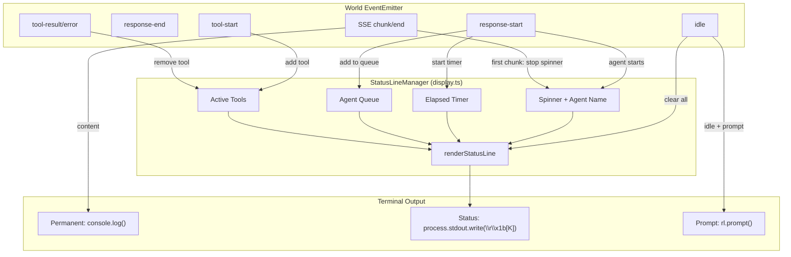
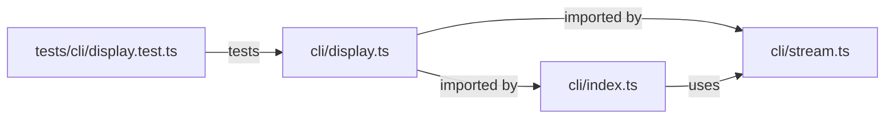

# Architecture Plan: CLI UX Improvements

**Date**: 2026-02-11  
**REQ**: [req-cli-ux-improvements.md](../../reqs/2026-02-11/req-cli-ux-improvements.md)

## Overview

Port Electron desktop app UX patterns to the CLI interactive mode using ANSI escape codes, Unicode symbols, and inline status updates. The implementation adds a new `cli/display.ts` module for formatting utilities and a status line manager, then integrates them into the existing event flow in `cli/index.ts` and `cli/stream.ts`.

## Architecture Decisions

1. **New `cli/display.ts` module**: All display formatting, spinner, elapsed timer, and status line logic lives here. `stream.ts` stays focused on streaming data management. `index.ts` stays focused on event routing and CLI lifecycle.

2. **Function-based state managers**: Follow the Electron `createActivityState` / `createStreamingState` factory pattern, but adapted for terminal output. No classes — use `createStatusLineManager()` factory returning an API object.

3. **Single dynamic status line**: All transient indicators (spinner, elapsed, agent queue, active tools) rendered on one rewritable line at the bottom of output. Permanent output (messages, tool completions) printed above it with `console.log()`.

4. **Readline coordination**: Status line paused before `rl.prompt()` and any `console.log()` output. Pattern: `clearStatusLine()` → permanent output → `redrawStatusLine()`.

5. **Pipeline mode untouched**: All display enhancements gated behind an `isInteractive` check. Pipeline mode output unchanged.

## Data Flow



## Component Design

### `cli/display.ts` — New Module

```typescript
// Pure formatting utilities (easily testable)
export function formatToolName(toolName: string): string;
export function formatElapsed(ms: number): string;
export function getToolIcon(toolName: string): string;
export function truncateToWidth(text: string, maxWidth: number): string;

// Spinner factory
export function createSpinner(): {
  start: (label: string) => void;
  stop: () => void;
  isRunning: () => boolean;
  cleanup: () => void;
};

// Status line manager factory
export interface StatusLineState {
  spinner: { label: string; active: boolean };
  elapsedMs: number;
  agents: { name: string; active: boolean }[];
  tools: { name: string; status: 'running' | 'done' | 'error'; detail?: string }[];
}

export function createStatusLineManager(): {
  // State setters
  setSpinner: (label: string | null) => void;
  setElapsed: (ms: number) => void;
  setAgents: (agents: StatusLineState['agents']) => void;
  addTool: (name: string) => void;
  removeTool: (name: string, status: 'done' | 'error', detail?: string) => void;

  // Rendering
  render: () => void;       // Write status line using \r\x1b[K
  clear: () => void;        // Clear status line
  pause: () => void;        // Pause rendering (before prompt/console.log)
  resume: () => void;       // Resume rendering

  // Lifecycle
  startElapsedTimer: () => void;
  stopElapsedTimer: () => void;
  reset: () => void;        // Full reset (on idle)
  cleanup: () => void;      // Destroy all intervals/timers
};
```

### Integration Points in `cli/index.ts`

| Current Code | Change |
|---|---|
| `ActivityProgressRenderer` class | **Replace** with `createStatusLineManager()` from `display.ts` |
| `handleWorldEvent()` — activity events | **Add** calls to status line manager (setSpinner, setAgents, startElapsedTimer) |
| `handleWorldEvent()` — tool events | **Add** calls to `addTool()` / `removeTool()` on status line manager |
| `handleWorldEvent()` — idle events | **Add** `statusLine.reset()` call |
| Before `console.log()` messages | **Add** `statusLine.pause()` / `statusLine.resume()` wrapping |
| Before `rl.prompt()` | **Add** `statusLine.clear()` |
| Streaming `handleStreamingEvents()` | **Add** `statusLine.setSpinner(null)` on first chunk |
| SIGINT / cleanup handlers | **Add** `statusLine.cleanup()` call |

### Integration Points in `cli/stream.ts`

| Current Code | Change |
|---|---|
| `handleToolEvents()` | **Enhance** tool-start/result/error formatting with `getToolIcon()` and `formatToolName()` |
| `handleToolStreamEvents()` | **Enhance** stderr display with `[stderr]` prefix, add 50K truncation |
| `handleActivityEvents()` | **Replace** verbose `[World]` log lines with status line updates (remove `console.log` calls) |

## File Changes Summary

| File | Action | Description |
|---|---|---|
| `cli/display.ts` | **CREATE** | New module: formatting utilities + spinner + status line manager |
| `cli/index.ts` | **MODIFY** | Replace `ActivityProgressRenderer`, integrate status line manager |
| `cli/stream.ts` | **MODIFY** | Enhance tool/error display, use formatting utilities |
| `tests/cli/display.test.ts` | **CREATE** | Unit tests for display utilities and status line manager |

## Implementation Phases

### Phase 1: Display Utilities Module (`cli/display.ts`)
Core formatting functions and types — no side effects, fully testable.

- [x] Create `cli/display.ts` with file header comment
- [x] Implement `formatToolName(toolName: string): string` — snake_case/camelCase → Title Case
- [x] Implement `formatElapsed(ms: number): string` — ms → `m:ss` or `h:mm:ss`
- [x] Implement `getToolIcon(toolName: string): string` — pattern match → Unicode icon
- [x] Implement `truncateToWidth(text: string, maxWidth: number): string` — terminal width safety
- [x] Export types: `StatusLineState`, `ToolDisplayEntry`, `AgentDisplayEntry`

### Phase 2: Spinner Factory (`cli/display.ts`)
Braille spinner with `setInterval` lifecycle.

- [x] Define spinner frames: `['⠋','⠙','⠹','⠸','⠼','⠴','⠦','⠧','⠇','⠏']`
- [x] Implement `createSpinner()` factory function
- [x] `start(label)`: begin 80ms interval, write `\r\x1b[K` + frame + label
- [x] `stop()`: clear interval, clear line
- [x] `cleanup()`: stop + nullify references
- [x] Guard against multiple starts (idempotent)

### Phase 3: Status Line Manager (`cli/display.ts`)
Unified status line combining spinner, elapsed, agents, tools.

- [x] Implement `createStatusLineManager()` factory
- [x] Internal state: spinner label, elapsed ms, agent list, tool list
- [x] `render()`: compose status line string, write with `\r\x1b[K`
- [x] Status line format: `⠋ AgentA thinking [0:12] | 📄 Read File ⟳`
- [x] `pause()` / `resume()`: suppress rendering during prompt/output
- [x] `startElapsedTimer()` / `stopElapsedTimer()`: 1s interval for elapsed updates
- [x] `reset()`: clear all state, stop timer, clear line
- [x] `cleanup()`: full teardown for exit/world-switch
- [x] Terminal width truncation via `process.stdout.columns`

### Phase 4: Integrate into CLI Event Flow (`cli/index.ts`)
Wire status line manager into existing event handlers.

- [x] Import `createStatusLineManager` and formatting functions from `display.ts`
- [x] Remove `ActivityProgressRenderer` class
- [x] Create `statusLine` instance alongside `activityMonitor` in `runInteractiveMode()`
- [x] In `handleWorldEvent()` activity events:
  - `response-start`: call `statusLine.setSpinner(agentName + ' is thinking...')`, `statusLine.setAgents(...)`, `statusLine.startElapsedTimer()`
  - `response-end`: update agent list, potentially stop spinner for that agent
  - `idle`: call `statusLine.reset()`, show completion message
- [x] In `handleWorldEvent()` tool events:
  - `tool-start`: call `statusLine.addTool(toolName)`
  - `tool-result`/`tool-error`: call `statusLine.removeTool(toolName, status, detail)`
- [x] Wrap `console.log()` calls with `statusLine.pause()` / `statusLine.resume()`
- [x] Add `statusLine.clear()` before `rl.prompt()`
- [x] Add `statusLine.cleanup()` to SIGINT and close handlers
- [x] Pass `statusLine` to `handleSubscribe()` and `attachCLIListeners()`

### Phase 5: Enhanced Tool & Error Display (`cli/stream.ts`)
Upgrade existing display functions with icons and formatting.

- [x] Import `formatToolName`, `getToolIcon` from `display.ts`
- [x] In `handleToolEvents()`:
  - `tool-start`: use `getToolIcon(toolName)` + `formatToolName(toolName)` in log
  - `tool-result`: show icon + name + duration + result size with `✓`
  - `tool-error`: show icon + name + error with `✗`
- [x] In `handleToolStreamEvents()`:
  - Add `[stderr]` prefix for stderr streams (red text)
  - Add `[stdout]` prefix for stdout streams (gray text)
  - Add 50K character truncation with `[output truncated]` notice
- [x] In `handleActivityEvents()`:
  - Remove verbose `[World]` console.log lines (status line handles this now)
  - Keep only debug-level logging

### Phase 6: Streaming Integration (`cli/stream.ts`)
Connect spinner lifecycle to streaming events.

- [x] Add optional `statusLine` parameter to `handleStreamingEvents()`
- [x] On first `chunk` event: call `statusLine?.setSpinner(null)` to stop spinner
- [x] On `end` event: ensure spinner is stopped
- [x] On `error` event: stop spinner, show error in status line briefly

### Phase 7: Unit Tests (`tests/cli/display.test.ts`)
Comprehensive tests for the new display module.

- [x] Test `formatToolName()`: snake_case, camelCase, mixed, single word, empty
- [x] Test `formatElapsed()`: 0ms, 5s, 65s, 3661s (1h+), negative values
- [x] Test `getToolIcon()`: all patterns (read, write, search, shell, web, default)
- [x] Test `truncateToWidth()`: short text, exact width, over width, unicode chars
- [x] Test `createSpinner()`: start/stop lifecycle, idempotent start, cleanup
- [x] Test `createStatusLineManager()`: render composition, pause/resume, reset, cleanup
- [x] Test status line format: single agent, multiple agents, with tools, elapsed timer
- [x] Mock `process.stdout.write` and `process.stdout.columns` for rendering tests
- [x] Mock `setInterval`/`clearInterval` for timer tests (vi.useFakeTimers)

## Dependency Graph



No circular dependencies. `display.ts` is a leaf module with no internal imports.

## Key Implementation Details

### Status Line Rendering Strategy

```
Permanent output (console.log - always ends with \n):
  ✓ AgentA: Hello world!
  ⚡ Shell Command ✓ done (245ms)

Status line (process.stdout.write - no trailing \n, rewritten in-place):
  ⠋ AgentB is thinking... [0:12] | 🔍 Search Files ⟳
```

The status line is always the last thing on screen. Before any new permanent output:
1. `statusLine.pause()` → clears status line with `\r\x1b[K`
2. `console.log(permanentContent)` → writes with newline
3. `statusLine.resume()` → redraws status line

### Console.log Wrapping Pattern

To avoid scattering `pause()/resume()` everywhere, create a helper:

```typescript
function log(statusLine: StatusLineManager, ...args: any[]): void {
  statusLine.pause();
  console.log(...args);
  statusLine.resume();
}
```

Use this `log()` wrapper for all interactive-mode output within event handlers.

### Readline Prompt Coordination

```typescript
// Before showing prompt
statusLine.clear();  // Remove status line
rl.prompt();         // Show "> " prompt
// Status line stays cleared while user types
// After user submits input and processing starts, status line resumes
```

### Cleanup Chain

```typescript
// On SIGINT / close / world-switch:
statusLine.cleanup();     // Stops all timers, clears line
activityMonitor.reset();  // Resets waiters
```

## Performance Budget

| Operation | Target | Mechanism |
|---|---|---|
| Status line render | ≤ 100ms interval | Throttled by elapsed timer (1s) and spinner (80ms) |
| Spinner frame | 80ms | setInterval |
| Elapsed update | 1000ms | setInterval |
| Console.log wrapping | < 1ms overhead | Simple pause/resume flag |

## Risk Mitigations

| Risk | Mitigation | Phase |
|---|---|---|
| Spinner/readline conflict | pause()/resume() pattern, clear before prompt | Phase 4 |
| Emoji width in terminals | Fixed-width Unicode chars chosen; emoji avoided in status line composition (use ⟳ ✓ ✗ ● ○ instead) | Phase 1 |
| Timer leaks | cleanup() in all exit paths, idempotent stop | Phase 3, 4 |
| Status line flicker | Single render function, throttled updates | Phase 3 |
| Terminal width overflow | truncateToWidth() on composed line | Phase 3 |

## AR Review Notes

### AR Status: ✅ Approved

**Reviewed dimensions**:

1. **Completeness** ✅ — All 6 REQs mapped to implementation phases. Every acceptance criterion addressable.

2. **Feasibility** ✅ — All techniques (ANSI escape codes, setInterval spinners, `\r\x1b[K` status line) are well-established Node.js patterns. No external dependencies needed.

3. **Separation of Concerns** ✅ — Clear module boundaries:
   - `display.ts`: pure formatting + status line state management
   - `stream.ts`: streaming data + enhanced tool output
   - `index.ts`: event routing + lifecycle orchestration

4. **Testability** ✅ — Phase 7 has comprehensive test plan. Pure formatting functions trivially testable. Timer-based components testable with `vi.useFakeTimers()`. `process.stdout.write` mockable.

5. **Risk Management** ✅ — All 5 identified risks have concrete mitigations mapped to specific phases.

6. **Backward Compatibility** ✅ — Pipeline mode explicitly untouched. All changes gated behind interactive mode checks. Existing event flow preserved, only display layer changed.

**AR Recommendations applied**:
- ✅ New `cli/display.ts` module (from REQ AR)
- ✅ Emoji avoidance in status line (use Unicode symbols with consistent width)
- ✅ Readline coordination documented with specific code patterns
- ✅ Terminal width truncation included
- ✅ Max tool display capping planned

**Phase ordering rationale**: Bottom-up (utilities → spinner → status line → integration → tests) ensures each phase builds on tested foundations. Phase 7 (tests) is last since the functions being tested are created in earlier phases, but tests can be written alongside each phase during implementation.
