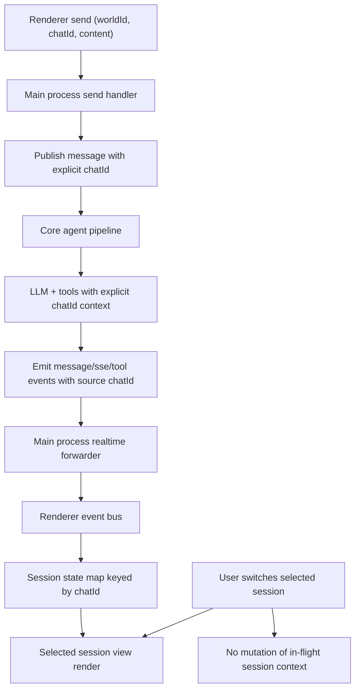

# Architecture Plan: Electron Concurrent Chat Sessions

**Date**: 2026-02-11  
**Type**: Feature Enhancement  
**Status**: ✅ Implementation Complete  
**Related**:  
- [Requirements](../../reqs/2026-02-11/req-electron-concurrent-chat.md)
- [Done Document](../../done/2026-02-11/concurrent-chat-sessions.md)

## Overview

This plan introduces true concurrent chat-session execution within a single world in the Electron app. The architecture removes dependence on a single mutable world-level active chat context during request processing, and replaces it with explicit, session-scoped context propagation for message handling, streaming events, tool events, and renderer activity state.

## 🔍 Architecture Review (AR) Summary

**Review Date**: 2026-02-11  
**Result**: ✅ **APPROVED WITH REVISIONS**

### Key Findings

- Recent Electron chat-sync hardening improves canonical chat routing.
- True concurrency is still incomplete while core processing paths depend on `world.currentChatId`.
- Renderer send/busy states are not yet scoped per session, which can block valid parallel sends.

### Approach Options

1. **Option A: Explicit `chatId` propagation end-to-end (Selected)**  
   Meets all requirement goals with deterministic session isolation.

2. **Option B: Serialize sends with world-level lock**  
   Easier to deliver but violates concurrency goals.

3. **Option C: Per-chat world runtime instances**  
   Strong isolation but disproportionate complexity for this scope.

### AR Decision

- Adopt **Option A** and treat world-level selected chat as UI selection state only.
- Preserve current persistence schema and migrate behavior via phased code-path hardening and tests.

## Architecture Decisions

### Decision 1: Explicit Chat Context Propagation
- All runtime processing paths must use explicit `chatId` context rather than implicit world-global selection.
- Message routing, LLM context selection, memory save/read, and continuation after tool execution must remain bound to the originating `chatId`.

### Decision 2: Session-Scoped Event Envelope
- Realtime events must carry source `chatId` from origin to renderer without substituting selected-session or subscription-level fallback values.
- Event filtering must rely on event `chatId`, not global current-chat state.

### Decision 3: Per-Session Renderer Runtime State
- Renderer streaming/activity state must be keyed by session rather than treated as a single global activity channel.
- Switching selected session changes the visible pane only; it must not reset or reroute background session processing.

### Decision 4: Backward-Compatible Migration
- Existing world/session persistence schema remains valid.
- Legacy workflows that rely on `currentChatId` for selection can remain for navigation, but processing correctness cannot depend on it.

### Decision 5: Concurrency First Test Gate
- No rollout without targeted concurrency tests that prove no cross-session leakage for messages, streams, tool events, and busy/send UI state.

### Decision 6: Strict Chat-Scoped Event Validation
- Chat-scoped subscriptions require canonical event `chatId`.
- Missing/invalid `chatId` events are dropped and logged for diagnosis.

## Target Data Flow

## Implementation Phases

### Phase 1: Contract and Audit Baseline
- [x] 1.1 Catalog all runtime branches where `world.currentChatId` affects processing correctness.
- [x] 1.2 Define explicit `chatId` contracts for:
  - message processing entry
  - memory-save/read
  - LLM preparation
  - tool continuation
  - event publish/forward
- [x] 1.3 Add temporary diagnostics to detect chat-context drift at runtime.

### Phase 2: Core Execution Isolation
- [x] 2.1 Update orchestrator paths to derive context from originating message `chatId`.
- [x] 2.2 Update memory-manager save/continue flows to use explicit `chatId`.
- [x] 2.3 Ensure tool continuation and assistant follow-up stay bound to original session.
- [x] 2.4 Ensure publish paths preserve originating `chatId` without fallback to selected chat.
- [x] 2.5 Keep `world.currentChatId` as selection state only.

### Phase 3: Main Process Event and Send Isolation
- [x] 3.1 Ensure `chat:sendMessage` does not mutate unrelated in-flight session context.
- [x] 3.2 Keep event-origin `chatId` authoritative for SSE/tool/message forwarding.
- [x] 3.3 Enforce strict validation for chat-scoped subscription events (drop invalid chat IDs).
- [x] 3.4 Confirm subscribe/unsubscribe lifecycle cannot cross-cancel active sessions.
- [x] 3.5 Expand chat-sync logging for concurrency diagnostics.

### Phase 4: Renderer Session-Scoped State
- [x] 4.1 Replace global send flag with per-session send state.
- [ ] 4.2 Introduce per-session stream/activity state containers.
- [ ] 4.3 Route incoming events to session-specific state by payload `chatId`.
- [ ] 4.4 Preserve background session indicators while viewing another session.
- [ ] 4.5 Ensure session switch does not clear active background session state.

### Phase 5: Lifecycle and Failure Safety
- [x] 5.1 Define delete-session behavior when session is active/in-flight.
- [x] 5.2 Ensure error in one session never resets another session's state.
- [ ] 5.3 Validate per-session ordering remains deterministic under overlap.
- [ ] 5.4 Verify recovery behavior after rapid switch/send sequences.

### Phase 6: Test and Verification Gate
- [x] 6.1 Add core unit tests for explicit chat-context isolation.
- [x] 6.2 Add main-process tests for concurrent routing and strict event validation.
- [ ] 6.3 Add renderer tests for per-session send/busy/stream behavior.
- [x] 6.4 Add integration scenario: send A → switch/send B → verify independent continuations.
- [ ] 6.5 Add regression tests for invalid/missing `chatId` event handling.
- [x] 6.6 Run full tests and manual Electron validation before completion.

## Dependencies

- Core event pipeline modules under `core/events/*`
- Session selection and message send flow in `electron/main.js`
- Renderer state/event handling in `electron/renderer/src/App.jsx`
- Existing streaming/activity state modules in `electron/renderer/src/streaming-state.js` and `electron/renderer/src/activity-state.js`

## Risks and Mitigations

- **Risk**: Hidden reliance on world-level current chat in deep execution paths.  
  **Mitigation**: Complete Phase 1 audit and enforce explicit `chatId` contracts.

- **Risk**: Event misrouting during rapid session switching.  
  **Mitigation**: Event-origin `chatId` propagation and deterministic routing tests.

- **Risk**: Renderer state complexity regression.  
  **Mitigation**: Per-session state map design + focused UI behavior tests.

- **Risk**: Backward compatibility issues with existing selection flows.  
  **Mitigation**: Keep selection semantics for navigation, decouple from processing semantics.

- **Risk**: Partial migration leaves mixed context behavior in edge branches.  
  **Mitigation**: Add temporary drift diagnostics and block completion until all drift alerts are eliminated.

## Completion Criteria

- [ ] Concurrent sends across sessions work reliably in one world.
- [ ] No cross-session leakage in messages, streams, tools, or UI status.
- [ ] One session failure never interrupts another active session.
- [ ] Automated tests cover core, main-process routing, and renderer behavior.
- [ ] Manual Electron validation confirms expected concurrency behavior.
