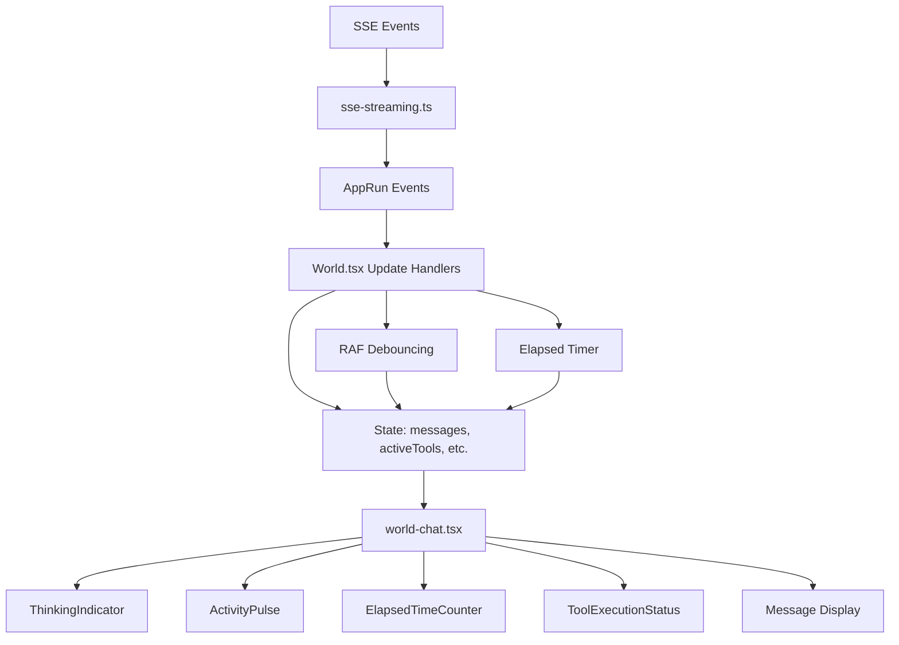
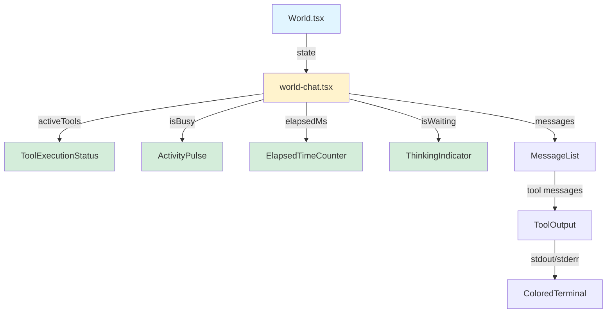
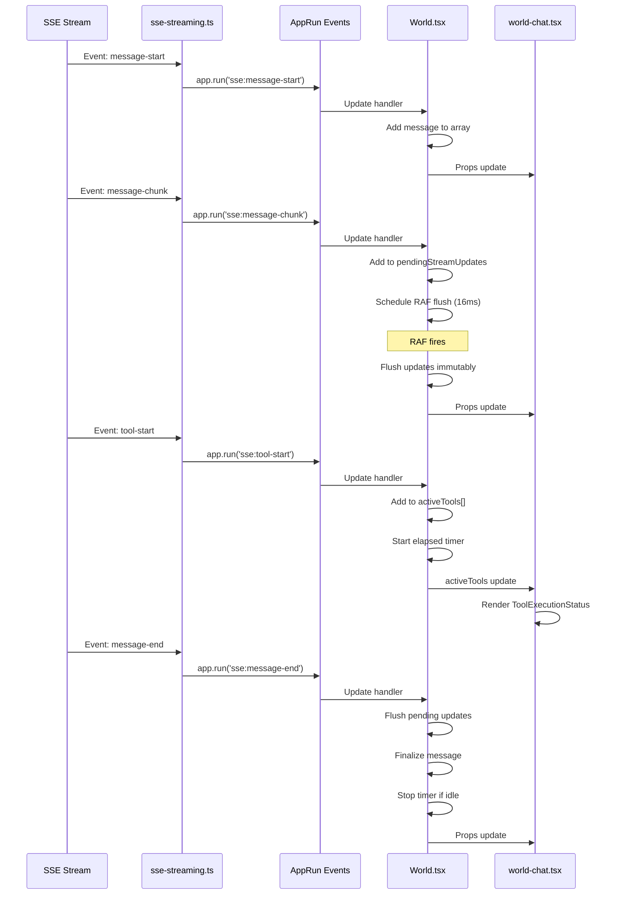

# Architecture Plan: Port Electron UX to Web App

**Date**: 2026-02-11  
**Type**: Feature Enhancement  
**Related Requirements**: `.docs/reqs/2026-02-11/req-port-electron-ux-to-web.md`

## Overview

Port the superior UX features from the Electron app to the web app by implementing activity indicators, tool execution status, optimized streaming state management, and enhanced visual feedback. The implementation will be phased to allow testing and validation at each stage.

## Architecture Decisions

### Decision 1: State Management Approach ✅
**Choice**: Merge streaming state directly into World.tsx (SIMPLIFIED)  
**Rationale**: 
- Only World.tsx needs streaming state (no reuse elsewhere)
- AppRun's immutable updates work better without callback layers
- Simpler architecture = easier to maintain
- Can extract to module later if reuse is needed

**Alternative Considered**: Separate streaming-state module (original plan)
- Pros: Reusable, proven in Electron, easy to unit test
- Cons: Callback wiring complexity, extra abstraction layer
- **Decision**: Rejected in favor of simplicity since no reuse case exists

**Implementation**:
- Add streaming state directly to WorldComponentState
- Implement RAF debouncing in World.tsx update handlers
- Keep `activity-state.js` separate (used for tool tracking)

**Comparison Table**:

| Aspect | Original (Separate Module) | Simplified (Merged) |
|--------|---------------------------|---------------------|
| **Files** | +2 new modules | 0 new modules |
| **Callbacks** | 7+ callback functions | 0 callbacks |
| **State sources** | 3 (streaming, activity, World) | 1 (World.tsx only) |
| **Code lines** | ~400 (modules) + wiring | ~100 (inline logic) |
| **Testability** | Easy (unit test modules) | Harder (test component) |
| **Reusability** | High (can reuse modules) | Low (World.tsx specific) |
| **Complexity** | Medium (callback layer) | Low (direct updates) |
| **AppRun fit** | Awkward (callbacks) | Natural (events → state) |
| **Implementation time** | ~10 hours | ~8 hours |
| **Maintenance** | More files to track | Simpler, fewer files |

**Decision**: Simplified approach wins for this specific use case.

### Decision 2: AppRun Component Pattern ✅
**Choice**: Create functional components returning JSX (AppRun style)  
**Rationale**:
- Similar to React functional components but without hooks
- Use AppRun's `$onclick` and event system
- Local state managed by parent component
- Props passed down from World.tsx

**Pattern**:
```typescript
export function ComponentName(props: ComponentProps) {
  const { prop1, prop2 } = props;
  
  return (
    <div className="component-class">
      {/* JSX content */}
      <button $onclick="event-name">Click</button>
    </div>
  );
}
```

### Decision 3: CSS Custom Properties (Not Tailwind) ✅
**Choice**: Convert Tailwind utilities to CSS custom properties  
**Rationale**:
- Web app uses CSS variables for theming
- Keep existing Short Stack font style
- Avoid adding full Tailwind dependency
- Maintain consistency with current styling

**Mapping**:
```css
/* Electron Tailwind → Web CSS Variables */
text-muted-foreground → var(--text-tertiary)
bg-muted → var(--bg-accent)
border-border → var(--border-primary)
```

### Decision 4: Integrate with Existing SSE Handler ✅
**Choice**: Extend `/web/src/domain/sse-streaming.ts` with activity callbacks  
**Rationale**:
- Don't duplicate SSE infrastructure
- Add activity state tracking to existing event handlers
- Maintain single source of truth for streaming events

**Integration Points**:
1. SSE handler calls `streaming-state` methods (start, chunk, end)
2. SSE handler calls `activity-state` methods (tool-start, tool-result)
3. State managers call back to update World component state
4. World component passes state to child components

## System Architecture (SIMPLIFIED)



**Key Simplification**: No separate state manager layer. SSE → AppRun events → World.tsx state directly.

## Component Architecture



## Data Flow (SIMPLIFIED)



**Key Simplification**: No callback layer. Direct event → update handler → state flow.

## File Structure (SIMPLIFIED)

```
web/src/
├── components/
│   ├── activity-indicators.tsx     # NEW: All indicator components
│   ├── tool-execution-status.tsx   # NEW: Tool status display
│   └── world-chat.tsx              # MODIFIED: Add new components
├── domain/
│   └── sse-streaming.ts            # MODIFIED: Emit AppRun events
├── pages/
│   └── World.tsx                   # MODIFIED: ALL state + debouncing logic here
└── styles.css                      # MODIFIED: Add new styles
```

**Note**: No separate state manager modules. All streaming/activity state managed directly in World.tsx.

## Implementation Phases

### Phase 1: Foundation - State Setup ✅ (SIMPLIFIED)
**Goal**: Set up core state types without separate modules  
**Risk**: Low  
**Testing**: Type checking

- [ ] Copy `activity-state.js` from electron to `/web/src/utils/`
- [ ] **RECOMMENDED**: Convert `activity-state.js` to TypeScript:
  - [ ] Rename to `activity-state.ts`
  - [ ] Add proper TypeScript types (no .d.ts files needed)
  - [ ] Test compilation with AppRun types
- [ ] Add streaming state types to `WorldComponentState`:
  ```typescript
  interface WorldComponentState {
    // ... existing fields
    
    // Streaming state (merged, no separate module)
    pendingStreamUpdates: Map<string, string>;  // messageId -> content
    debounceFrameId: number | null;
    
    // Activity state (from activity-state module)
    activeTools: ToolEntry[];
    isBusy: boolean;
    elapsedMs: number;
  }
  ```
- [ ] Test TypSE Integration with Debouncing ✅ (SIMPLIFIED)
**Goal**: Add debounced streaming directly in World.tsx  
**Risk**: Low (simpler than callback wiring)  
**Testing**: Manual testing with SSE events

**CRITICAL: State Ownership Model** (AR Review - SIMPLIFIED)
```
World.tsx: Single source of truth for ALL state
  - Owns: messages[], pendingStreamUpdates, debounceFrameId
  - Owns: activeTools[], isBusy, elapsedMs
  - Updates via immutable AppRun pattern (return new state object)
  - RAF debouncing managed directly in update handlers
```

- [ ] Add debouncing state to `WorldComponentState`:
  - [ ] `pendingStreamUpdates: Map<string, string>` (messageId -> content)
  - [ ] `debounceFrameId: number | null` (RAF ID)
- [ ] Add activity state to `WorldComponentState`:
  - [ ] `isBusy: boolean`
  - [ ] `elapsedMs: number`
  - [ ] `activeTools: ToolEntry[]`
  - [ ] `activityStartTime: number | null`
  - [ ] `elapsedIntervalId: number | null`
- [ ] Update `sse-streaming.ts` event handlers in World.tsx:
  - [ ] `'sse:message-start'`: Initialize message in array
  - [ ] `'sse:message-chunk'`: Add to pendingStreamUpdates, schedule RAF
  - [ ] `'sse:message-end'`: Flush pending updates, finalize message
  - [ ] `'sse:tool-start'`: Add to activeTools, start elapsed timer
  - [ ] `'sse:tool-result'`: Remove from activeTools, stop timer if idle
- [ ] Implement RAF debouncing helper function in World.tsx:
  ```typescript
  scheduleStreamFlush(state: WorldComponentState): WorldComponentState {
    if (state.debounceFrameId !== null) {
      return state; // Already scheduled
    }
    
    const frameId = requestAnimationFrame(() => {
      app.run('flush-stream-updates');
    });
    
    return { ...state, debounceFrameId: frameId };
  }
  ```
- [ ] Add flush handler in update object:
  - [ ] `'flush-stream-updates'`: Apply pendingStreamUpdates to messages immutably
  - [ ] Clear pendingStreamUpdates Map
  - [ ] Reset debounceFrameId to null
- [ ] Add elapsed timer logic:
  - [ ] Start timer when first tool/stream starts
  - [ ] Update elapsedMs every 1 second
  - [ ] Stop timer when all activity completes
- [ ] Add cleanup handlers:
  - [ ] `'change-chat'`: Clear pendingUpdates, cancel RAF, stop timer
  - [ ] `unload()`: lifecycle hook to cancel RAF and stop timer
- [ ] Pass new state props to `world-chat.tsx`
- [ ] Test streaming still works (no visual changes yet)

**Success Criteria**:
- Messages stream correctly with debouncing
- No console errors
- Debouncing works (check frame rate in DevTools)
- Cleanup works when switching chats (no RAF leaks)
- Tools tracked in activeTools state

**AR Note**: This simplified approach removes the callback layer and manages everything directly in World.tsx update handlers. Much simpler!

// In update handlers
'stream-update': (state, { messageId, content }) => ({
  ...state,
  messages: state.messages.map(msg =>
    msg.messageId === messageId ? { ...msg, text: content } : msg
  )
})
```

### Phase 3: Basic Indicators - Activity Feedback ✅
**Goal**: Add simple activity indicators for immediate feedback  
**Risk**: Low  
**Testing**: Visual verification during streaming

- [ ] Create `/web/src/components/activity-indicators.tsx`:
  - [ ] `ThinkingIndicator` component:
    - [ ] Pulsing dot animation (3 dots)
    - [ ] "Thinking..." text
    - [ ] aria-live for accessibility
  - [ ] `ActivityPulse` component:
    - [ ] Single pulsing dot
    - [ ] Active (green) vs idle (gray) states
    - [ ] Optional label text
  - [ ] `ElapsedTimeCounter` component:
    - [ ] Format ms as mm:ss or hh:mm:ss
    - [ ] Clock icon (optional)
    - [ ] Tabular numbers for alignment
- [ ] Add CSS for indicators in `styles.css`:
  - [ ] `.thinking-indicator` styles
  - [ ] `.activity-pulse` with @keyframes animation
  - [ ] `.elapsed-counter` with monospace digits
  - [ ] Pulsing animation keyframes
- [ ] Update `world-chat.tsx`:
  - [ ] Add `ThinkingIndicator` when `isWaiting && !isBusy`
  - [ ] Add header section with activity indicators:
    - [ ] `ActivityPulse` with `isBusy` prop
    - [ ] `ElapsedTimeCounter` with `elapsedMs` prop
- [ ] Test indicators appear correctly:
  - [ ] Dots animate when waiting
  - [ ] Pulse changes color when busy
  - [ ] Timer counts up during activity

**Success Criteria**:
- Activity indicators visible during processing
- Animations smooth and non-janky
- Timer updates every second
- Indicators clear when processing completes

### Phase 4: Tool Execution Status ✅
**Goal**: Rich tool feedback with icons and progress  
**Risk**: Medium (component complexity)  
**Testing**: Visual verification with various tools

- [ ] Create `/web/src/components/tool-execution-status.tsx`:
  - [ ] `ToolExecutionStatus` component:
    - [ ] Accept `activeTools[]` prop
    - [ ] Map tool names to icons
    - [ ] Format tool names (snake_case → Title Case)
    - [ ] Show spinner for running tools
    - [ ] Display progress text when available
  - [ ] Helper function `getToolIcon()`:
    - [ ] Map patterns to SVG icons
    - [ ] file, terminal, search, web, etc.
  - [ ] Helper function `formatToolName()`:
    - [ ] Convert snake_case to Title Case
- [ ] Add CSS for tool status in `styles.css`:
  - [ ] `.tool-execution-status` container
  - [ ] `.tool-entry` for each tool row
  - [ ] Tool icon styles
  - [ ] Spinner animation (rotate 360deg)
  - [ ] Progress text styles
- [ ] Update `world-chat.tsx`:
  - [ ] Add `ToolExecutionStatus` component
  - [ ] Pass `activeTools` prop
  - [ ] Position in header or above messages
- [ ] Test with various tools:
  - [ ] File read/write shows file icon
  - [ ] Terminal commands show terminal icon
  - [ ] Search shows magnifying glass icon
  - [ ] Progress text displays when available

**Success Criteria**:
- Tool execution visible with appropriate icons
- Tool names readable and formatted
- Progress text shows when available
- Spinner animates smoothly
- Multiple concurrent tools displayed correctly

### Phase 5: Collapsible Tool Output ✅
**Goal**: Clean tool output display with expand/collapse  
**Risk**: Low  
**Testing**: Visual verification with stdout/stderr

- [ ] Modify tool message rendering in `world-chat.tsx`:
  - [ ] Add local state for collapse/expand (per message)
  - [ ] Wrap tool output in collapsible container
  - [ ] Add expand/collapse button (icon only)
  - [ ] Default state: collapsed
- [ ] Add stdout/stderr visual distinction:
  - [ ] stderr: red-tinted background
  - [ ] stdout: dark terminal background
  - [ ] Pre-formatted text (monospace)
- [ ] Add 50K character truncation:
  - [ ] Check content length before render
  - [ ] Truncate if > 50,000 characters
  - [ ] Show "Output truncated..." message
- [ ] Add CSS for tool output:
  - [ ] `.tool-output-container` styles
  - [ ] `.tool-output-header` with toggle button
  - [ ] `.tool-output-content` (collapsed/expanded states)
  - [ ] `.tool-output-stderr` (red tint)
  - [ ] `.tool-output-stdout` (terminal style)
  - [ ] Expand/collapse animation (max-height transition)
- [ ] Test tool output:
  - [ ] Defaults to collapsed
  - [ ] Expands on button click
  - [ ] stderr shows red background
  - [ ] stdout shows terminal background
  - [ ] Long output truncated properly

**Success Criteria**:
- Tool output collapsed by default
- Click to expand/collapse works
- stderr visually distinct from stdout
- Very long output truncated with notice
- Smooth expand/collapse animation

### Phase 6: Enhanced Message Styling ✅
**Goal**: Role-based visual hierarchy and polish  
**Risk**: Low  
**Testing**: Visual verification across message types

- [ ] Update message card styles in `styles.css`:
  - [ ] Add role-based left border colors:
    - [ ] `.user-message`: subtle border color
    - [ ] `.tool-message`: amber/orange border
    - [ ] `.system-message`: gray border
    - [ ] `.agent-message`: sky blue border
  - [ ] Adjust spacing and padding
  - [ ] Ensure consistent border width (3-4px)
- [ ] Update message rendering in `world-chat.tsx`:
  - [ ] Apply role-based classes correctly
  - [ ] Ensure markdown renders for all types
  - [ ] Add reply chain tracking in sender label
- [ ] Test message appearance:
  - [ ] All message types have distinct borders
  - [ ] Hierarchy clear from border colors
  - [ ] Markdown renders properly
  - [ ] Reply chains show correctly

**Success Criteria**:
- Message role immediately visible from border
- Clean visual hierarchy
- All message types render correctly
- No layout shifts or overflow issues

### Phase 7: Performance Optimization ✅
**Goal**: Ensure 60fps streaming and smooth UI  
**Risk**: Medium (performance tuning)  
**Testing**: DevTools performance profiling

- [ ] Profile current performance:
  - [ ] Open DevTools Performance tab
  - [ ] Record during message streaming
  - [ ] Identify bottlenecks (if any)
- [ ] Verify debouncing works:
  - [ ] Check frame rate during streaming
  - [ ] Ensure RAF updates at 16ms intervals
  - [ ] No blocking main thread
- [ ] Optimize if needed:
  - [ ] Research AppRun's shouldUpdate or memoization patterns
  - [ ] Reduce unnecessary re-renders
  - [ ] Optimize CSS animations (use transform/opacity)
  - [ ] Consider memoizing markdown rendering for completed messages
- [ ] Test with long conversations:
  - [ ] 100+ messages
  - [ ] Multiple concurrent tools
  - [ ] Fast streaming (many chunks)
  - [ ] **Consider virtual scrolling if >500 messages cause lag**
- [ ] Memory leak check:
  - [ ] Profile memory over time
  - [ ] Verify cleanup on session change (cleanup() called)
  - [ ] Check for retained objects (especially RAF IDs and intervals)
  - [ ] Verify state managers are garbage collected after cleanup
- [ ] Bundle size check:
  - [ ] Measure before/after bundle sizes
  - [ ] Verify <20KB addition claim (or update docs with actual size)
  - [ ] Check for unnecessary dependencies

**Success Criteria**:
- 60fps maintained during streaming
- No dropped frames in DevTools
- Memory stable over time
- No memory leaks on session change
- UI remains responsive
- Bundle size increase documented and reasonable

**AR Note**: AppRun doesn't have React.memo(). Research if AppRun has shouldUpdate lifecycle or similar optimization patterns. Consider memoizing expensive operations like markdown rendering.

### Phase 8: Polish & Accessibility ✅
**Goal**: Final touches and accessibility improvements  
**Risk**: Low  
**Testing**: Manual accessibility testing

- [ ] Add ARIA attributes:
  - [ ] `role="status"` on indicators
  - [ ] `aria-live="polite"` on activity updates
  - [ ] `aria-label` on icon buttons
  - [ ] `aria-expanded` on collapsible sections
- [ ] Keyboard navigation:
  - [ ] Tool output toggle via keyboard
  - [ ] Focus indicators visible
  - [ ] Tab order logical
- [ ] Visual polish:
  - [ ] Consistent spacing
  - [ ] Smooth transitions
  - [ ] Color contrast sufficient (WCAG AA)
  - [ ] Icons clear and recognizable
- [ ] Error handling:
  - [ ] Graceful degradation if state manager fails
  - [ ] Console warnings for missing props
  - [ ] Fallback UI for errors
  - [ ] Try-catch around state manager callbacks
- [ ] Documentation:
  - [ ] Add comments to new components
  - [ ] Update component README if exists
  - [ ] Document prop types
  - [ ] **Document state ownership model in code comments**
  - [ ] **Document cleanup lifecycle in World.tsx**

**Success Criteria**:
- Screen reader announces activity changes
- Keyboard navigation works smoothly
- Focus indicators clear
- Color contrast meets WCAG AA
- No accessibility warnings in DevTools

### Phase 8.5: Testing (NEW - AR Recommendation)
**Goal**: Add unit and integration tests  
**Risk**: Low  
**Testing**: Automated test suite

- [ ] Unit tests for state managers:
  - [ ] Test streaming-state debouncing logic
  - [ ] Test activity-state tool tracking
  - [ ] Test cleanup() clears all state
  - [ ] Test error handling
- [ ] Integration tests:
  - [ ] Create mock SSE event source
  - [ ] Test SSE → state manager → AppRun event flow
  - [ ] Test tool streaming end-to-end
- [ ] Visual regression tests (optional):
  - [ ] Snapshot tests for indicator components
  - [ ] Screenshot comparison for message styling

**Success Criteria**:
- 80%+ code coverage for state managers
- All integration tests pass
- CI pipeline runs tests automatically

**AR Note**: Testing was missing from original plan. Unit tests for state managers are critical for catching synchronization bugs early.

## Dependencies & Integration Points

### New Dependencies
None - all code is internal

### Modified Files
1. `/web/src/utils/` - New state managers
2. `/web/src/components/` - New indicator components
3. `/web/src/pages/World.tsx` - State management
4. `/web/src/domain/sse-streaming.ts` - Activity tracking
5. `/web/src/components/world-chat.tsx` - UI integration
6. `/web/src/styles.css` - New styles

### Integration with Existing Code
- SSE event handling: Extends existing `sse-streaming.ts`
- Message display: Enhances `world-chat.tsx`
- Styling: Adds to existing `styles.css`
- State management: Uses AppRun's state system

## Testing Strategy

### Phase-by-Phase Testing
- **After each phase**: Manual testing with running dev server
- **Checkpoint**: Verify no regressions in existing features
- **Visual**: Screenshot comparison for styling changes

### Performance Testing
- DevTools Performance profiling during streaming
- Memory profiling over 30+ minute session
- Frame rate monitoring (should maintain 60fps)

### Accessibility Testing
- Screen reader testing (VoiceOver on macOS)
- Keyboard navigation testing
- Color contrast verification
- ARIA attribute validation

### Manual Test Scenarios
1. **Basic streaming**: Send message, watch indicators
2. **Tool execution**: Run command, verify tool status
3. **Long output**: Generate large tool output, verify truncation
4. **Multiple tools**: Run concurrent tools, verify all tracked
5. **Error handling**: Trigger error, verify display
6. **Session change**: Switch sessions, verify cleanup

## Rollback Plan

If critical issues arise:

### Phase 1-2 (State Managers)
- Remove state manager files
- Revert World.tsx changes
- Revert sse-streaming.ts changes
- **Impact**: None, no UI changes yet

### Phase 3-4 (Indicators)
- Hide indicator components (CSS display: none)
- **Impact**: Loss of activity feedback, but messages still work

### Phase 5-8 (Polish)
- Revert individual component changes
- **Impact**: Loss of specific features, but core functionality intact

## Success Metrics

### Qualitative
- [ ] Activity indicators provide clear feedback
- [ ] Tool execution status is informative
- [ ] UI feels responsive and smooth
- [ ] Visual hierarchy improved
- [ ] No confusion about system state

### Quantitative
- [ ] 60fps maintained during streaming (measured)
- [ ] <20KB bundle size increase (measured)
- [ ] <100ms latency for activity updates (measured)
- [ ] Zero regressions in existing features (tested)
- [ ] 100% of existing tests pass (verified)

## Post-Implementation

### Documentation
- Update component documentation
- Add usage examples for new components
- Document state manager APIs

### Future Enhancements
- Agent queue display (deferred, lower priority)
- More tool-specific icons
- Animated transitions between states
- User preferences for collapsed/expanded default

## Timeline Estimate

- **Phase 1**: 30 minutes (copy files) + 1 hour (optional TS conversion) = 1.5 hours
- **Phase 2**: 1.5 hours (SSE integration + cleanup lifecycle)
- **Phase 3**: 45 minutes (basic indicators)
- **Phase 4**: 1 hour (tool status)
- **Phase 5**: 45 minutes (collapsible output)
- **Phase 6**: 30 minutes (message styling)
- **Phase 7**: 1.5 hours (performance tuning + bundle size check)
- **Phase 8**: 45 minutes (polish)
- **Phase 8.5**: 2 hours (testing - NEW)

**Total**: ~10 hours (with TS conversion and testing)  
**Minimum**: ~8 hours (skip TS conversion, minimal testing)

## Related Work (SIMPLIFIED)

- **Phase 1**: 15 minutes (types only, no separate modules)
- **Phase 2**: 1.5 hours (direct SSE + debouncing in World.tsx)
- **Phase 3**: 45 minutes (basic indicators)
- **Phase 4**: 1 hour (tool status)
- **Phase 5**: 45 minutes (collapsible output)
- **Phase 6**: 30 minutes (message styling)
- **Phase 7**: 1.5 hours (performance tuning + bundle size check)
- **Phase 8**: 45 minutes (polish)
- **Phase 8.5**: 1.5 hours (testing - simpler without separate modules)

**Total**: ~8.25 hours (with testing)  
**Minimum**: ~6.5 hours (minimal testing)

**Time Saved**: ~1.75 hours compared to original plan (no callback wiring, simpler
### Critical Issues Addressed

1. **State Synchronization** - Added clear ownership model in Phase 2
2. **AppRun Immutable Updates** - Added examples and pattern documentation
3. **Cleanup Lifecycle** - Added unload() and change-chat cleanup hooks
4. **TypeScript Integration** - Recommended TS conversion for state managers
5. **Testing Gap** - Added Phase 8.5 for unit/integration tests

### Key Recommendations Implemented

- **High Priority**:
  - ✅ State ownership model documented (Phase 2)
  - ✅ AppRun update pattern examples added (Phase 2)
  - ✅ Cleanup lifecycle hooks added (Phase 2)
  - ✅ TypeScript conversion recommended (Phase 1)
- **Medium Priority**:
  - ✅ Unit test phase added (Phase 8.5)
  - ✅ Bundle size measurement - SIMPLIFIED APPROACH

**Reviewer**: Architecture Review Process (AR)  
**Date**: 2026-02-11  
**Update**: 2026-02-11 (Simplified architecture based on user feedback)

### Architecture Decision Change

**Original**: Separate streaming-state and activity-state modules  
**Revised**: Merge streaming state directly into World.tsx

**Rationale**:
- Only World.tsx needs streaming state (no reuse case)
- Simpler architecture without callback wiring
- Better alignment with AppRun's patterns
- Easier to maintain and test
- ~1.75 hours time savings

### Critical Issues Addressed

1. **State Synchronization** - ✅ Eliminated (single source of truth in World.tsx)
2. **AppRun Immutable Updates** - ✅ Direct updates, no callback layer
3. **Cleanup Lifecycle** - ✅ Added unload() and change-chat cleanup hooks
4. **Testing Gap** - ✅ Added Phase 8.5, simpler without separate modules

### Key Recommendations Implemented

- **High Priority**:
  - ✅ State ownership model: Everything in World.tsx (simplest)
  - ✅ AppRun update pattern: Direct immutable updates
  - ✅ Cleanup lifecycle hooks: RAF and timer cleanup
  - ✅ **SIMPLIFIED**: No separate state manager modules
- **Medium Priority**:
  - ✅ Unit test phase added (Phase 8.5)
  - ✅ Bundle size measurement added (Phase 7)
  - ✅ Virtual scrolling consideration added (Phase 7)

### Risk Assessment

- **State Synchronization**: ~~Medium~~ → **Eliminated** (single state)
- **AppRun Integration**: ~~Medium~~ → **Low** (direct integration)
- **Memory Leaks**: Medium → Low (added cleanup hooks)
- **Performance**: Low (good architecture, added testing)
- **Testing**: ~~High~~ → **Low** (simpler without separate modules)

### Alternative Approaches Considered

1. **Separate state managers** (Original plan) - Rejected: unnecessary complexity
2. **Merge streaming-state into World.tsx** (**SELECTED**) - Simpler, better fit
3. **Keep activity-state separate** (Optional) - Can inline if also not reused

### Outstanding Concerns

- AppRun memoization patterns unclear (research in Phase 7)
- Long conversation performance (test with 500+ messages)
- ~~Tool stream state coordination~~ → Eliminated with merged state

### Sign-off

**Simplified architecture approved.** This approach is cleaner, faster to implement, and better aligned with AppRun patterns. Proceed with Phases 1-8.5 using the revised plan