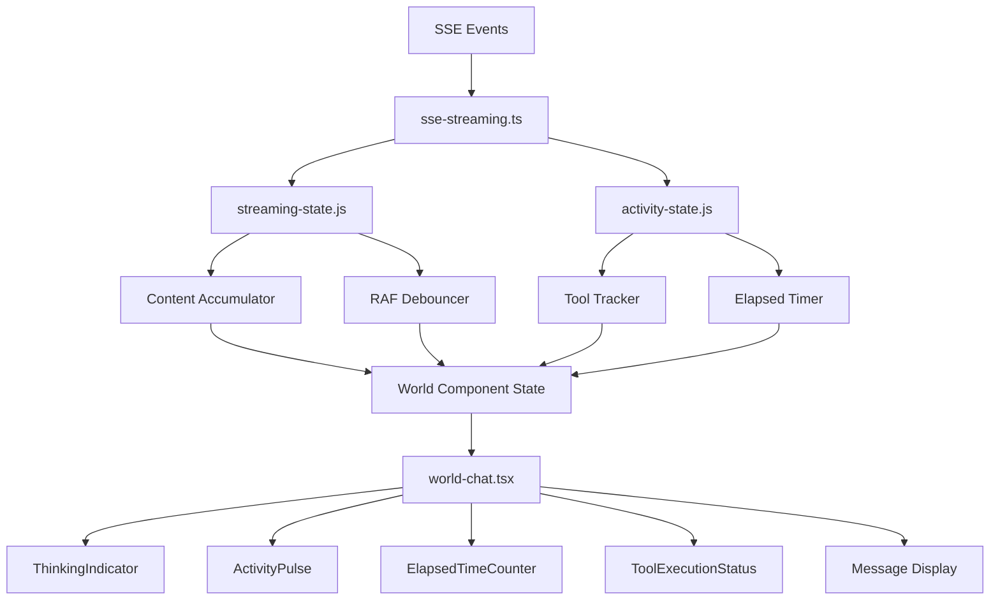
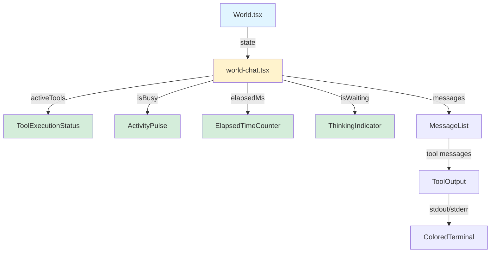
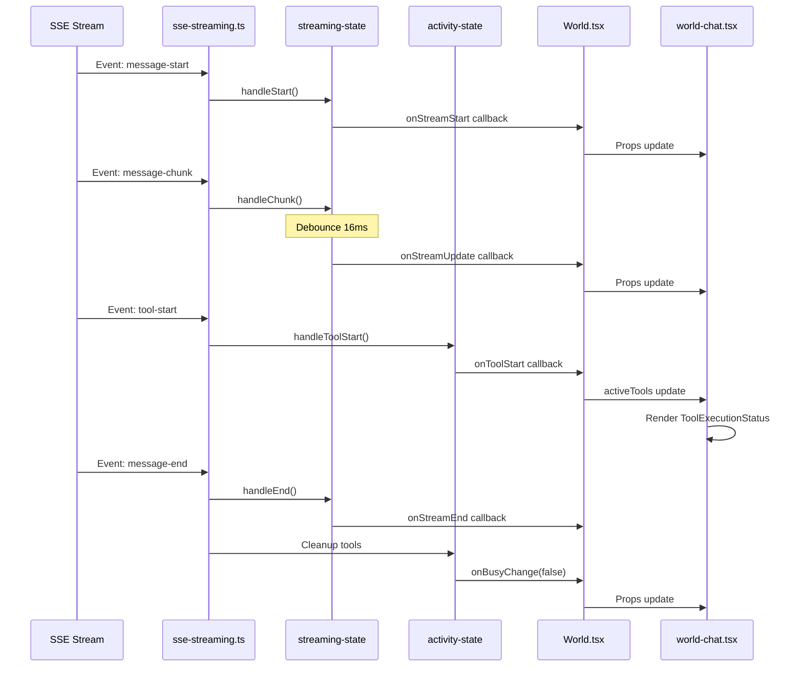

# Architecture Plan: Port Electron UX to Web App

**Date**: 2026-02-11  
**Type**: Feature Enhancement  
**Related Requirements**: `.docs/reqs/2026-02-11/req-port-electron-ux-to-web.md`

## Overview

Port the superior UX features from the Electron app to the web app by implementing activity indicators, tool execution status, optimized streaming state management, and enhanced visual feedback. The implementation will be phased to allow testing and validation at each stage.

## Architecture Decisions

### Decision 1: Framework-Agnostic State Managers ✅
**Choice**: Copy `streaming-state.js` and `activity-state.js` directly from Electron  
**Rationale**: 
- Pure JavaScript, no framework dependencies
- Factory function pattern works in any environment
- Already proven and tested in Electron app
- No changes needed to core logic

**Implementation**:
- Copy files to `/web/src/utils/`
- Add TypeScript definitions (`.d.ts`)
- Import and use with AppRun event system

### Decision 2: AppRun Component Pattern ✅
**Choice**: Create functional components returning JSX (AppRun style)  
**Rationale**:
- Similar to React functional components but without hooks
- Use AppRun's `$onclick` and event system
- Local state managed by parent component
- Props passed down from World.tsx

**Pattern**:
```typescript
export function ComponentName(props: ComponentProps) {
  const { prop1, prop2 } = props;
  
  return (
    <div className="component-class">
      {/* JSX content */}
      <button $onclick="event-name">Click</button>
    </div>
  );
}
```

### Decision 3: CSS Custom Properties (Not Tailwind) ✅
**Choice**: Convert Tailwind utilities to CSS custom properties  
**Rationale**:
- Web app uses CSS variables for theming
- Keep existing Short Stack font style
- Avoid adding full Tailwind dependency
- Maintain consistency with current styling

**Mapping**:
```css
/* Electron Tailwind → Web CSS Variables */
text-muted-foreground → var(--text-tertiary)
bg-muted → var(--bg-accent)
border-border → var(--border-primary)
```

### Decision 4: Integrate with Existing SSE Handler ✅
**Choice**: Extend `/web/src/domain/sse-streaming.ts` with activity callbacks  
**Rationale**:
- Don't duplicate SSE infrastructure
- Add activity state tracking to existing event handlers
- Maintain single source of truth for streaming events

**Integration Points**:
1. SSE handler calls `streaming-state` methods (start, chunk, end)
2. SSE handler calls `activity-state` methods (tool-start, tool-result)
3. State managers call back to update World component state
4. World component passes state to child components

## System Architecture



## Component Architecture



## Data Flow



## File Structure

```
web/src/
├── utils/
│   ├── streaming-state.js          # NEW: Copy from electron
│   ├── streaming-state.d.ts        # NEW: TypeScript definitions
│   ├── activity-state.js           # NEW: Copy from electron
│   └── activity-state.d.ts         # NEW: TypeScript definitions
├── components/
│   ├── activity-indicators.tsx     # NEW: All indicator components
│   ├── tool-execution-status.tsx   # NEW: Tool status display
│   └── world-chat.tsx              # MODIFIED: Add new components
├── domain/
│   └── sse-streaming.ts            # MODIFIED: Add activity tracking
├── pages/
│   └── World.tsx                   # MODIFIED: Manage activity state
└── styles.css                      # MODIFIED: Add new styles
```

## Implementation Phases

### Phase 1: Foundation - State Managers ✅
**Goal**: Set up core state management without UI changes  
**Risk**: Low  
**Testing**: Unit tests for state managers

- [ ] Copy `streaming-state.js` from electron to `/web/src/utils/`
- [ ] Copy `activity-state.js` from electron to `/web/src/utils/`
- [ ] Create TypeScript definitions:
  - [ ] `streaming-state.d.ts`
  - [ ] `activity-state.d.ts`
- [ ] Add JSDoc comments for better IDE support
- [ ] Test state managers work in web environment
- [ ] Verify imports resolve correctly

**Success Criteria**:
- State manager files compile without errors
- TypeScript recognizes all types
- No console errors when imported

### Phase 2: State Integration - Connect to SSE ✅
**Goal**: Wire up state managers to existing SSE infrastructure  
**Risk**: Medium (integration complexity)  
**Testing**: Manual testing with SSE events

- [ ] Modify `World.tsx` to create state manager instances:
  - [ ] Add `streamingStateRef` using factory function
  - [ ] Add `activityStateRef` using factory function
  - [ ] Initialize in component lifecycle
- [ ] Add state properties to `WorldComponentState`:
  - [ ] `isBusy: boolean`
  - [ ] `elapsedMs: number`
  - [ ] `activeTools: ToolEntry[]`
  - [ ] `activeStreamCount: number`
- [ ] Update `sse-streaming.ts` to call state managers:
  - [ ] On `message-start`: call `streaming.handleStart()`
  - [ ] On `message-chunk`: call `streaming.handleChunk()`
  - [ ] On `message-end`: call `streaming.handleEnd()`
  - [ ] On `tool-start`: call `activity.handleToolStart()`
  - [ ] On `tool-result`: call `activity.handleToolResult()`
  - [ ] On `tool-stream`: call `streaming.handleToolStream*()`
- [ ] Add callback functions in World.tsx:
  - [ ] `onStreamStart`: update messages state
  - [ ] `onStreamUpdate`: debounced message content update
  - [ ] `onStreamEnd`: finalize message
  - [ ] `onToolStart`: add to activeTools
  - [ ] `onToolResult`: remove from activeTools
  - [ ] `onBusyChange`: update isBusy state
  - [ ] `onElapsedUpdate`: update elapsedMs state
- [ ] Pass new state props to `world-chat.tsx`
- [ ] Test streaming still works (no visual changes yet)

**Success Criteria**:
- Messages still stream correctly
- No console errors
- State managers track activity (verify in DevTools)
- Can see activeTools populate in React DevTools

### Phase 3: Basic Indicators - Activity Feedback ✅
**Goal**: Add simple activity indicators for immediate feedback  
**Risk**: Low  
**Testing**: Visual verification during streaming

- [ ] Create `/web/src/components/activity-indicators.tsx`:
  - [ ] `ThinkingIndicator` component:
    - [ ] Pulsing dot animation (3 dots)
    - [ ] "Thinking..." text
    - [ ] aria-live for accessibility
  - [ ] `ActivityPulse` component:
    - [ ] Single pulsing dot
    - [ ] Active (green) vs idle (gray) states
    - [ ] Optional label text
  - [ ] `ElapsedTimeCounter` component:
    - [ ] Format ms as mm:ss or hh:mm:ss
    - [ ] Clock icon (optional)
    - [ ] Tabular numbers for alignment
- [ ] Add CSS for indicators in `styles.css`:
  - [ ] `.thinking-indicator` styles
  - [ ] `.activity-pulse` with @keyframes animation
  - [ ] `.elapsed-counter` with monospace digits
  - [ ] Pulsing animation keyframes
- [ ] Update `world-chat.tsx`:
  - [ ] Add `ThinkingIndicator` when `isWaiting && !isBusy`
  - [ ] Add header section with activity indicators:
    - [ ] `ActivityPulse` with `isBusy` prop
    - [ ] `ElapsedTimeCounter` with `elapsedMs` prop
- [ ] Test indicators appear correctly:
  - [ ] Dots animate when waiting
  - [ ] Pulse changes color when busy
  - [ ] Timer counts up during activity

**Success Criteria**:
- Activity indicators visible during processing
- Animations smooth and non-janky
- Timer updates every second
- Indicators clear when processing completes

### Phase 4: Tool Execution Status ✅
**Goal**: Rich tool feedback with icons and progress  
**Risk**: Medium (component complexity)  
**Testing**: Visual verification with various tools

- [ ] Create `/web/src/components/tool-execution-status.tsx`:
  - [ ] `ToolExecutionStatus` component:
    - [ ] Accept `activeTools[]` prop
    - [ ] Map tool names to icons
    - [ ] Format tool names (snake_case → Title Case)
    - [ ] Show spinner for running tools
    - [ ] Display progress text when available
  - [ ] Helper function `getToolIcon()`:
    - [ ] Map patterns to SVG icons
    - [ ] file, terminal, search, web, etc.
  - [ ] Helper function `formatToolName()`:
    - [ ] Convert snake_case to Title Case
- [ ] Add CSS for tool status in `styles.css`:
  - [ ] `.tool-execution-status` container
  - [ ] `.tool-entry` for each tool row
  - [ ] Tool icon styles
  - [ ] Spinner animation (rotate 360deg)
  - [ ] Progress text styles
- [ ] Update `world-chat.tsx`:
  - [ ] Add `ToolExecutionStatus` component
  - [ ] Pass `activeTools` prop
  - [ ] Position in header or above messages
- [ ] Test with various tools:
  - [ ] File read/write shows file icon
  - [ ] Terminal commands show terminal icon
  - [ ] Search shows magnifying glass icon
  - [ ] Progress text displays when available

**Success Criteria**:
- Tool execution visible with appropriate icons
- Tool names readable and formatted
- Progress text shows when available
- Spinner animates smoothly
- Multiple concurrent tools displayed correctly

### Phase 5: Collapsible Tool Output ✅
**Goal**: Clean tool output display with expand/collapse  
**Risk**: Low  
**Testing**: Visual verification with stdout/stderr

- [ ] Modify tool message rendering in `world-chat.tsx`:
  - [ ] Add local state for collapse/expand (per message)
  - [ ] Wrap tool output in collapsible container
  - [ ] Add expand/collapse button (icon only)
  - [ ] Default state: collapsed
- [ ] Add stdout/stderr visual distinction:
  - [ ] stderr: red-tinted background
  - [ ] stdout: dark terminal background
  - [ ] Pre-formatted text (monospace)
- [ ] Add 50K character truncation:
  - [ ] Check content length before render
  - [ ] Truncate if > 50,000 characters
  - [ ] Show "Output truncated..." message
- [ ] Add CSS for tool output:
  - [ ] `.tool-output-container` styles
  - [ ] `.tool-output-header` with toggle button
  - [ ] `.tool-output-content` (collapsed/expanded states)
  - [ ] `.tool-output-stderr` (red tint)
  - [ ] `.tool-output-stdout` (terminal style)
  - [ ] Expand/collapse animation (max-height transition)
- [ ] Test tool output:
  - [ ] Defaults to collapsed
  - [ ] Expands on button click
  - [ ] stderr shows red background
  - [ ] stdout shows terminal background
  - [ ] Long output truncated properly

**Success Criteria**:
- Tool output collapsed by default
- Click to expand/collapse works
- stderr visually distinct from stdout
- Very long output truncated with notice
- Smooth expand/collapse animation

### Phase 6: Enhanced Message Styling ✅
**Goal**: Role-based visual hierarchy and polish  
**Risk**: Low  
**Testing**: Visual verification across message types

- [ ] Update message card styles in `styles.css`:
  - [ ] Add role-based left border colors:
    - [ ] `.user-message`: subtle border color
    - [ ] `.tool-message`: amber/orange border
    - [ ] `.system-message`: gray border
    - [ ] `.agent-message`: sky blue border
  - [ ] Adjust spacing and padding
  - [ ] Ensure consistent border width (3-4px)
- [ ] Update message rendering in `world-chat.tsx`:
  - [ ] Apply role-based classes correctly
  - [ ] Ensure markdown renders for all types
  - [ ] Add reply chain tracking in sender label
- [ ] Test message appearance:
  - [ ] All message types have distinct borders
  - [ ] Hierarchy clear from border colors
  - [ ] Markdown renders properly
  - [ ] Reply chains show correctly

**Success Criteria**:
- Message role immediately visible from border
- Clean visual hierarchy
- All message types render correctly
- No layout shifts or overflow issues

### Phase 7: Performance Optimization ✅
**Goal**: Ensure 60fps streaming and smooth UI  
**Risk**: Medium (performance tuning)  
**Testing**: DevTools performance profiling

- [ ] Profile current performance:
  - [ ] Open DevTools Performance tab
  - [ ] Record during message streaming
  - [ ] Identify bottlenecks (if any)
- [ ] Verify debouncing works:
  - [ ] Check frame rate during streaming
  - [ ] Ensure RAF updates at 16ms intervals
  - [ ] No blocking main thread
- [ ] Optimize if needed:
  - [ ] Use React.memo() equivalent if available
  - [ ] Reduce unnecessary re-renders
  - [ ] Optimize CSS animations (use transform/opacity)
- [ ] Test with long conversations:
  - [ ] 100+ messages
  - [ ] Multiple concurrent tools
  - [ ] Fast streaming (many chunks)
- [ ] Memory leak check:
  - [ ] Profile memory over time
  - [ ] Verify cleanup on session change
  - [ ] Check for retained objects

**Success Criteria**:
- 60fps maintained during streaming
- No dropped frames in DevTools
- Memory stable over time
- No memory leaks on session change
- UI remains responsive

### Phase 8: Polish & Accessibility ✅
**Goal**: Final touches and accessibility improvements  
**Risk**: Low  
**Testing**: Manual accessibility testing

- [ ] Add ARIA attributes:
  - [ ] `role="status"` on indicators
  - [ ] `aria-live="polite"` on activity updates
  - [ ] `aria-label` on icon buttons
  - [ ] `aria-expanded` on collapsible sections
- [ ] Keyboard navigation:
  - [ ] Tool output toggle via keyboard
  - [ ] Focus indicators visible
  - [ ] Tab order logical
- [ ] Visual polish:
  - [ ] Consistent spacing
  - [ ] Smooth transitions
  - [ ] Color contrast sufficient (WCAG AA)
  - [ ] Icons clear and recognizable
- [ ] Error handling:
  - [ ] Graceful degradation if state manager fails
  - [ ] Console warnings for missing props
  - [ ] Fallback UI for errors
- [ ] Documentation:
  - [ ] Add comments to new components
  - [ ] Update component README if exists
  - [ ] Document prop types

**Success Criteria**:
- Screen reader announces activity changes
- Keyboard navigation works smoothly
- Focus indicators clear
- Color contrast meets WCAG AA
- No accessibility warnings in DevTools

## Dependencies & Integration Points

### New Dependencies
None - all code is internal

### Modified Files
1. `/web/src/utils/` - New state managers
2. `/web/src/components/` - New indicator components
3. `/web/src/pages/World.tsx` - State management
4. `/web/src/domain/sse-streaming.ts` - Activity tracking
5. `/web/src/components/world-chat.tsx` - UI integration
6. `/web/src/styles.css` - New styles

### Integration with Existing Code
- SSE event handling: Extends existing `sse-streaming.ts`
- Message display: Enhances `world-chat.tsx`
- Styling: Adds to existing `styles.css`
- State management: Uses AppRun's state system

## Testing Strategy

### Phase-by-Phase Testing
- **After each phase**: Manual testing with running dev server
- **Checkpoint**: Verify no regressions in existing features
- **Visual**: Screenshot comparison for styling changes

### Performance Testing
- DevTools Performance profiling during streaming
- Memory profiling over 30+ minute session
- Frame rate monitoring (should maintain 60fps)

### Accessibility Testing
- Screen reader testing (VoiceOver on macOS)
- Keyboard navigation testing
- Color contrast verification
- ARIA attribute validation

### Manual Test Scenarios
1. **Basic streaming**: Send message, watch indicators
2. **Tool execution**: Run command, verify tool status
3. **Long output**: Generate large tool output, verify truncation
4. **Multiple tools**: Run concurrent tools, verify all tracked
5. **Error handling**: Trigger error, verify display
6. **Session change**: Switch sessions, verify cleanup

## Rollback Plan

If critical issues arise:

### Phase 1-2 (State Managers)
- Remove state manager files
- Revert World.tsx changes
- Revert sse-streaming.ts changes
- **Impact**: None, no UI changes yet

### Phase 3-4 (Indicators)
- Hide indicator components (CSS display: none)
- **Impact**: Loss of activity feedback, but messages still work

### Phase 5-8 (Polish)
- Revert individual component changes
- **Impact**: Loss of specific features, but core functionality intact

## Success Metrics

### Qualitative
- [ ] Activity indicators provide clear feedback
- [ ] Tool execution status is informative
- [ ] UI feels responsive and smooth
- [ ] Visual hierarchy improved
- [ ] No confusion about system state

### Quantitative
- [ ] 60fps maintained during streaming (measured)
- [ ] <20KB bundle size increase (measured)
- [ ] <100ms latency for activity updates (measured)
- [ ] Zero regressions in existing features (tested)
- [ ] 100% of existing tests pass (verified)

## Post-Implementation

### Documentation
- Update component documentation
- Add usage examples for new components
- Document state manager APIs

### Future Enhancements
- Agent queue display (deferred, lower priority)
- More tool-specific icons
- Animated transitions between states
- User preferences for collapsed/expanded default

## Timeline Estimate

- **Phase 1**: 30 minutes (copy files, add types)
- **Phase 2**: 1 hour (SSE integration)
- **Phase 3**: 45 minutes (basic indicators)
- **Phase 4**: 1 hour (tool status)
- **Phase 5**: 45 minutes (collapsible output)
- **Phase 6**: 30 minutes (message styling)
- **Phase 7**: 1 hour (performance tuning)
- **Phase 8**: 45 minutes (polish)

**Total**: ~6 hours

## Related Work

- Electron app implementation: `/electron/renderer/src/`
- Web app current state: `/web/src/`
- SSE infrastructure: `/web/src/domain/sse-streaming.ts`
- AppRun documentation: Component patterns

## Notes

- Keep changes additive, no breaking changes
- Maintain existing Short Stack font style
- Follow AppRun patterns, not React patterns
- Test after each phase before continuing
- Profile performance early and often
