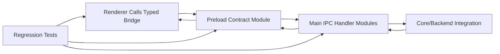

# Architecture Plan: Electron Modular Refactor + TypeScript Main/Preload

**Date**: 2026-02-12  
**Type**: Refactor / Maintainability  
**Requirement**: [req-electron-modular-structure-and-test-reorg.md](../../reqs/2026-02-12/req-electron-modular-structure-and-test-reorg.md)

## Overview

This plan modularizes the Electron app structure, converts `electron/main` and `electron/preload` to TypeScript, and reorganizes related tests. The delivery strategy is incremental and regression-first so runtime behavior remains unchanged while maintainability and type safety improve.

## Architecture Review (AR) Summary

**Review Date**: 2026-02-12  
**Result**: ✅ APPROVED WITH REVISIONS

### Key Findings

- Current Electron code already has separable renderer state and component boundaries that can be expanded into a clearer module layout.
- Main/preload conversion to TypeScript is feasible, but risk concentrates in IPC contracts and Electron startup wiring.
- Test files are distributed and partially inconsistent in naming/layout for Electron concerns, reducing discoverability.

### Options Considered

1. **Option A: Incremental TypeScript + module extraction with regression gates (Selected)**
2. **Option B: One-pass rewrite of Electron app structure**
3. **Option C: Keep JavaScript entrypoints and only refactor renderer/tests**

### AR Decision

- Use **Option A** to minimize risk.
- Lock behavior with targeted regression tests before and during refactor.
- Convert `main` and `preload` to TypeScript with explicit typed IPC contracts and compatibility checks.

## Architecture Decisions

### Decision 1: Layered Electron Structure
- Separate concerns by runtime layer:
  - `main`: lifecycle, window, IPC registration, backend integration boundaries
  - `preload`: secure bridge, channel contract, validation
  - `renderer`: app composition, state/domain modules, UI components

### Decision 2: TypeScript as Source of Truth for Main/Preload
- `main` and `preload` are authored in TypeScript.
- Runtime execution must remain compatible with existing dev/build commands.
- Type contracts become the canonical IPC interface boundary.

### Decision 3: Contract-First IPC Typing
- Define explicit request/response event payload shapes for channels exposed through preload.
- Main handlers and renderer callers consume shared types to prevent contract drift.

### Decision 4: Incremental Refactor with Safety Gates
- Extract and migrate in small steps with passing tests at each phase.
- Avoid broad file churn that mixes behavior changes with structural moves.

### Decision 5: Test Reorganization by Layer + Feature
- Reorganize Electron tests into clear domains, preserving assertions:
  - main process behavior
  - preload bridge/contracts
  - renderer state/UI behavior
  - integration/regression scenarios

## Target High-Level Flow

## Implementation Phases

### Phase 1: Baseline and Safety Harness
- [x] 1.1 Capture baseline behavior-critical flows for Electron launch, send, streaming, and tool/status updates.
- [x] 1.2 Confirm existing Electron tests and add missing smoke/regression coverage before structural moves.
- [x] 1.3 Define migration checkpoints and rollback criteria per phase.

Phase 1 validation note:
- Local shell runtime is Node `v14.17.3`; `vitest` execution in this environment is blocked by parser/runtime incompatibility. Use Node `>=20` for Phase 7 verification runs.

### Phase 2: TypeScript Foundation for Electron Entry Layers
- [x] 2.1 Add/confirm TypeScript configuration support for Electron `main` and `preload` sources.
- [x] 2.2 Establish build/runtime path mapping so Electron loads compiled TS outputs consistently.
- [x] 2.3 Preserve existing startup behavior in local development and packaging flows.

Phase 2 validation note:
- `electron/main` runtime now loads directly from compiled TS output (`dist/main.js`) with compiled preload resolution.
- `npm run main:build --prefix electron` succeeds with the new TS entry-layer build config.
- Full `electron` runtime launch verification is pending on a Node `>=20` shell/GUI-capable environment; current shell uses Node `v14.17.3`.

### Phase 3: Main Process Conversion and Modularization
- [x] 3.1 Convert `electron/main.js` to TypeScript entrypoint with behavior parity.
- [x] 3.2 Extract lifecycle/window/IPC wiring into focused main-process modules.
- [x] 3.3 Ensure IPC registration remains deterministic and backward compatible.
- [x] 3.4 Add or update tests for main process orchestration and channel handling.

Phase 3 validation note:
- Main entry conversion is now `electron/main.ts`, compiled to `electron/dist/main.js`, and loaded directly by Electron package `main`.
- Wiring extraction added:
  - `electron/main-process/ipc-routes.ts`
  - `electron/main-process/ipc-registration.ts`
  - `electron/main-process/window-paths.ts`
  - `electron/main-process/lifecycle.ts`
- Added tests for orchestration/channel behavior:
  - `tests/electron/main-ipc-routes.test.ts`
  - `tests/electron/main-lifecycle.test.ts`
  - `tests/electron/main-window-paths.test.ts`
- Validation executed:
  - `npm run main:build --prefix electron` ✅
  - Targeted `tsc --noEmit` checks for new main-process modules/tests ✅

### Phase 4: Preload Conversion and Typed Bridge Hardening
- [x] 4.1 Convert `electron/preload.js` to TypeScript entrypoint with behavior parity.
- [x] 4.2 Split preload bridge exposure, channel guards, and bridge helpers into modules.
- [x] 4.3 Introduce shared typed IPC contracts consumed by preload, renderer callers, and main handlers.
- [x] 4.4 Add or update tests for bridge behavior, allowed channels, and payload shape expectations.

Phase 4 validation note:
- Preload entry conversion is now `electron/preload.ts`, compiled to `electron/dist/preload.js`, and resolved directly from main runtime path candidates.
- Preload modularization added:
  - `electron/preload/bridge.ts`
  - `electron/preload/invoke.ts`
  - `electron/preload/payloads.ts`
- Shared typed IPC contracts added and consumed by preload + main + renderer typings:
  - `electron/shared/ipc-contracts.ts`
  - `electron/main-process/ipc-routes.ts` now imports shared channel/payload contracts
  - `electron/renderer/src/types/desktop-api.ts`
  - `electron/renderer/src/types/global.d.ts`
- Added/updated tests for bridge behavior and payload/channel guards:
  - `tests/electron/preload-bridge.test.ts`
  - `tests/electron/preload-invoke.test.ts`
  - `tests/electron/preload-payloads.test.ts`
- Validation executed:
  - `npm run main:build --prefix electron` ✅
  - Targeted `tsc --noEmit` checks for preload/main-process modules/tests ✅

### Phase 5: Renderer Module Boundary Cleanup
- [x] 5.1 Extract `App.jsx` orchestration concerns into domain/state modules while keeping UI behavior unchanged.
- [x] 5.2 Keep component boundaries clear between presentational components and orchestration logic.
- [x] 5.3 Preserve existing message/stream/activity behavior with regression tests.

Phase 5 validation note:
- Extracted renderer orchestration/domain modules:
  - `electron/renderer/src/domain/desktop-api.js`
  - `electron/renderer/src/domain/message-updates.js`
  - `electron/renderer/src/domain/chat-event-handlers.js`
- `electron/renderer/src/App.jsx` now delegates desktop-API access, message upsert/log conversion, and realtime event routing to domain modules.
- Added renderer-domain regression tests:
  - `tests/electron/desktop-api-domain.test.ts`
  - `tests/electron/message-updates-domain.test.ts`
  - `tests/electron/chat-event-handlers-domain.test.ts`
- Validation executed:
  - Targeted `tsc --noEmit` checks for extracted renderer domain modules + App imports ✅
  - Targeted `tsc --noEmit` checks for new renderer-domain tests ✅

### Phase 6: Test Reorganization
- [x] 6.1 Reorganize Electron-related tests into a consistent folder strategy by layer and feature.
- [x] 6.2 Normalize test naming conventions for discoverability.
- [x] 6.3 Move/refactor tests without dropping assertions; replace removed coverage with equivalent or stronger tests.
- [x] 6.4 Ensure unit tests continue using in-memory storage and mocked LLM interactions.

Phase 6 validation note:
- Reorganized Electron tests into layer folders:
  - `tests/electron/main/`
  - `tests/electron/preload/`
  - `tests/electron/renderer/`
- Updated all moved test imports and dynamic preload import paths to match new folder depth.
- Added test layout guide:
  - `tests/electron/README.md`
- Updated test-file header change logs to reflect relocation/import updates.
- Validation executed:
  - Targeted `tsc --noEmit` across all `tests/electron/**/*.test.ts` ✅
  - `npm run main:build --prefix electron` ✅

### Phase 7: Verification and Stabilization
- [x] 7.1 Run targeted Electron tests for main/preload/renderer after each phase.
- [x] 7.2 Run full project test command(s) required by CI expectations.
- [ ] 7.3 Validate no regressions in IPC-driven updates, streaming state, and activity indicators.
- [x] 7.4 Finalize docs and migration notes for contributor onboarding.

Phase 7 validation note:
- Executed verification commands:
  - `npm test -- tests/electron/main/main-ipc-routes.test.ts tests/electron/preload/preload-bridge.test.ts tests/electron/renderer/activity-state.test.ts`
  - `npm test`
  - `npm run check`
  - `npm run main:build --prefix electron`
  - targeted `tsc --noEmit` across `tests/electron/**/*.test.ts`
- Results:
  - `npm run check` ✅
  - `npm run main:build --prefix electron` ✅
  - targeted `tsc --noEmit` across Electron tests ✅
  - `npm test` / targeted `npm test -- ...` ❌ blocked by local shell Node runtime (`v14.17.3`) parsing unsupported syntax in current Vitest bundle.
- Onboarding/migration notes finalized:
  - `electron-refactor-phase1-baseline.md`
  - `electron-refactor-migration-notes.md`
- Post-phase cleanup:
  - Removed transitional entry wrappers (`electron/entry/main-entry.ts`, `electron/entry/preload-entry.ts`).
  - Electron package now points directly to `dist/main.js` and resolves compiled preload via runtime path candidates.
- `7.3` remains open until Node `>=20` runtime executes Electron-targeted and full Vitest suites successfully and runtime smoke checks confirm no behavior regressions.

## Dependencies

- Electron entry/runtime files under `electron/`
- Renderer app/state/components under `electron/renderer/src`
- Existing tests under `tests/electron` and related integration paths
- Project TypeScript/vitest configuration and npm scripts

## Risks and Mitigations

- **Risk**: Startup/runtime breakage from TS entrypoint migration.  
  **Mitigation**: Keep incremental checkpoints and launch verification per phase.

- **Risk**: IPC contract mismatch during module splits.  
  **Mitigation**: Shared typed IPC contracts and bridge/handler contract tests.

- **Risk**: Lost test coverage during reorganization.  
  **Mitigation**: Map old-to-new test coverage and block merges on missing critical assertions.

- **Risk**: Hidden behavior changes from large App extraction.  
  **Mitigation**: Separate structural refactor commits from behavior changes and run regression suites each step.

## Completion Criteria

- [x] `main` and `preload` are TypeScript-based with unchanged runtime behavior.
- [x] Electron layers have clear module boundaries and ownership.
- [x] Typed IPC contracts are shared and enforced across preload/main/renderer boundaries.
- [x] Electron test suite is reorganized, discoverable, and behavior-preserving.
- [ ] Regression checks pass for critical Electron user flows.
