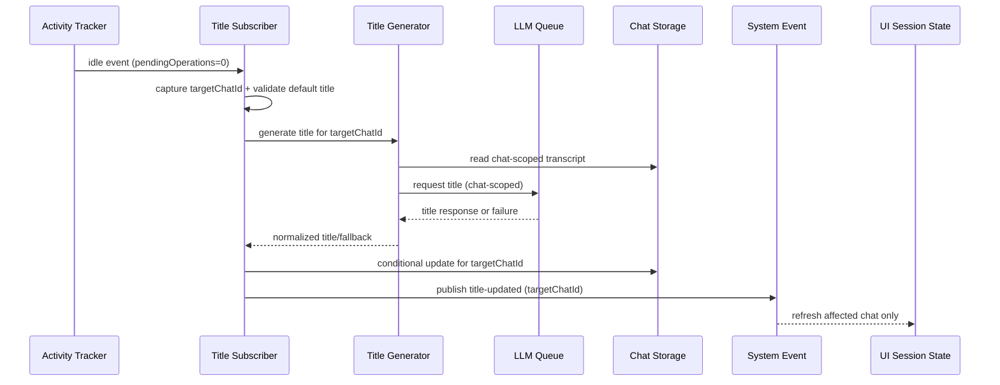

# Architecture Plan: Chat Session Title Generation Reliability and Quality

**Date**: 2026-02-13  
**Type**: Feature Enhancement  
**Status**: ✅ Completed  
**Related**:
- [Requirements](../../reqs/2026-02-13/req-chat-title-generation.md)

## Overview

Improve automatic chat title generation by making it session-correct under concurrency, resilient to chat switching during async generation, and more consistent in title quality through better prompt input shaping and fallback handling.

## Architecture Decisions

### Decision 1: Capture and Carry Target Chat Context
- Capture `targetChatId` at idle trigger time.
- Pass `targetChatId` through generation, persistence, and event publication.
- Do not read mutable `currentChatId` during commit steps for the same generation cycle.

### Decision 2: Commit with Default-Title Preconditions
- Title update commit must validate the target chat is still in default-title state.
- If preconditions fail, skip update without erroring the chat pipeline.

### Decision 3: Chat-Scoped Generation and Cancellation
- Title generation LLM calls use chat-scoped context (`worldId + chatId`) to align with existing cancellation controls.
- Stop/cancel behavior must remain session-isolated.

### Decision 4: Deterministic Prompt Input Shaping
- Build title input from chat-scoped transcript only.
- Exclude irrelevant/tool-only noise and de-duplicate repeated turns.
- Use bounded context window to control prompt size and consistency.

### Decision 5: Strong Post-Processing and Fallback Semantics
- Enforce sanitized, concise plain-text output.
- Apply fallback logic when title is empty/invalid/generic.
- Keep naming deterministic for repeated idle notifications.

### Decision 6: Shared Default-Title Constant
- Centralize default-title semantics to avoid hardcoded string drift across modules.

## Scope of Change

- Core event subscriber path for idle-triggered title updates.
- Core title generation utility and prompt construction logic.
- Event publishing payload for title-updated notifications.
- Test suites for title generation success, fallback, and race handling.

## Data Flow

## Implementation Phases

### Phase 1: Session-Scoped Correctness Foundation
- [x] Capture `targetChatId` at idle event entry.
- [x] Pass explicit `targetChatId` through title generation function signature.
- [x] Replace commit-time `currentChatId` reads with captured target context.
- [x] Ensure title-updated event includes target chat context from captured ID.
- [x] Centralize default-title constant usage in title-update path.

### Phase 2: Safe Commit and Idempotency
- [x] Add conditional title update semantics that only apply when target chat remains in default-title state.
- [x] Skip update safely when preconditions fail (no overwrite, no cross-chat rename).
- [x] Guard repeated idle events from generating conflicting titles for same chat.

### Phase 3: Prompt Input Quality
- [x] Build transcript shaping for title prompt input (chat-scoped).
- [x] Filter irrelevant roles/content and de-duplicate repeated turns.
- [x] Add bounded turn/window policy for predictable prompt size.
- [x] Preserve compatibility with existing storage backends.

### Phase 4: Generation Output Hardening
- [x] Strengthen title sanitizer for formatting artifacts and low-quality prefixes/suffixes.
- [x] Define fallback hierarchy for empty/invalid/generic outputs.
- [x] Ensure fallback remains meaningful and non-empty.

### Phase 5: Cancellation and Queue Alignment
- [x] Submit title-generation calls with explicit chat scope to existing LLM queue/cancel controls.
- [x] Validate stop/cancel behavior remains session-isolated and deterministic.

### Phase 6: Test Coverage and Validation
- [x] Fix/align title-generation unit mocks with actual response contract shape.
- [x] Add race test: switch chats during async title generation.
- [x] Add tests for conditional commit semantics and no-op behavior.
- [x] Add tests for prompt shaping and fallback output quality.
- [x] Run targeted test suites and verify no regressions in chat/session flow.

## Risks and Mitigations

- **Risk**: Hidden dependency on global `currentChatId` remains in one path.
  - **Mitigation**: enforce function signatures requiring `targetChatId`.
- **Risk**: Prompt shaping removes too much context.
  - **Mitigation**: start with conservative filtering and add test fixtures.
- **Risk**: Conditional commit creates silent no-update confusion.
  - **Mitigation**: add explicit debug logs for skipped commits with reason.
- **Risk**: Additional checks increase latency.
  - **Mitigation**: keep shaping linear-time and bounded by small window size.

## Completion Criteria

- [x] Title generation is fully chat-scoped from trigger through commit.
- [x] No cross-session rename occurs under chat switching.
- [x] Cancellation semantics for title generation align with chat-scoped stop behavior.
- [x] Title quality improves with deterministic prompt shaping and fallback rules.
- [x] Tests cover success, fallback, and race conditions with passing results.

---

## Architecture Review (AR)

**Review Date**: 2026-02-13  
**Status**: Approved with revisions

### Review Summary

The architecture is feasible and aligned with current event and storage boundaries. The highest-risk gap is async reliance on mutable global session context. The plan now prioritizes context capture and conditional commit semantics before quality tuning.

### Assumption Validation

- ✅ Idle event boundary is suitable for title generation trigger.
- ✅ Default-title-only auto-rename remains the correct product behavior.
- ⚠️ Global mutable chat selection must not be read after async boundaries for this flow.

### Recommended Option

- Use **Option B** from requirements AR: session-correctness fix plus prompt-input quality improvements in the same feature track.

### Review-Driven Plan Updates Applied

- Added explicit phase ordering that puts correctness and safe commit ahead of title quality tuning.
- Added cancellation/queue alignment phase for chat-scoped stop behavior.
- Added test tasks for chat-switch race and contract-shape correctness.
