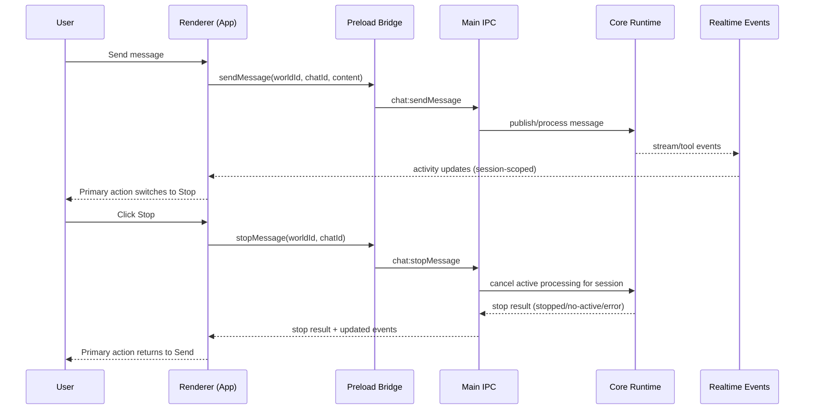

# Architecture Plan: Electron Stop Message Processing and Send/Stop Toggle

**Date**: 2026-02-13  
**Type**: Feature Enhancement  
**Status**: In Progress (Checkpoint 2)  
**Related**:
- [Requirements](../../reqs/2026-02-13/req-electron-stop-message-process.md)

## Overview

Implement session-scoped stop control for in-flight chat processing in the Electron app, and update the composer primary action to behave as a send/stop toggle. The design must preserve existing message ownership, streaming behavior, and concurrent session isolation.

## Architecture Decisions

### Decision 1: Session-Scoped Stop Contract
- Introduce an explicit stop command scoped by `worldId` + `chatId`.
- Stop must target only active processing for that session.
- No implicit global stop behavior is allowed.

### Decision 2: End-to-End Cancellation Propagation
- Cancellation must propagate from renderer action through preload bridge and main IPC handler to core processing runtime.
- Runtime must expose a deterministic stop acknowledgment result (`stopped`, `no-active-process`, `error`).

### Decision 3: Safe Partial Output Preservation
- Stop operation must preserve already-emitted and already-persisted message/tool output.
- Stop only affects remaining in-flight processing work.

### Decision 4: UI State Derived from Session Activity
- Composer primary action mode (`send` vs `stop`) must derive from selected-session processing state.
- UI must revert automatically to send mode when selected session is idle again.

### Decision 5: Backward-Compatible Incremental Rollout
- Existing send path remains functional.
- Stop path is additive and guarded by tests before full completion.

## Scope of Change

- IPC contracts and preload bridge (`chat:stopMessage` style command surface).
- Main process routing and handler composition for stop requests.
- Core runtime processing control to track and cancel active session work.
- Renderer composer behavior and status feedback in `electron/renderer/src/App.jsx`.
- Test coverage across preload, main route wiring, and session-level UI behavior.

## Data Flow

## Implementation Phases

### Phase 1: Contract and Interface Foundation
- [x] Define stop request/response payload contract for session-scoped stop.
- [x] Add new shared IPC channel constant and Desktop API interface method.
- [x] Update preload bridge to expose `stopMessage` invoke method.
- [x] Add/adjust payload helper validation for required `worldId` and `chatId`.
- [x] Add preload unit tests for `stopMessage` invoke wiring.

### Phase 2: Main Process Routing and Handler Surface
- [x] Extend IPC route builder to register stop-message channel.
- [x] Extend main IPC handler factory dependencies with runtime stop function.
- [x] Implement handler-level validation/error semantics for missing IDs and no-active-session stop.
- [x] Wire handler in `electron/main.ts` route registration.
- [x] Add main-process route tests covering channel list/order and payload routing.

### Phase 3: Core Runtime Stop Control
- [x] Introduce session-level in-flight processing registry keyed by `worldId` + `chatId`.
- [x] Attach cancellable handles to active LLM/tool processing work.
- [x] Implement stop operation that cancels active handles and returns deterministic status.
- [x] Ensure cancellation clears/updates activity state to avoid stuck busy state.
- [x] Preserve already-emitted/persisted partial output while terminating remaining work.
- [ ] Add core tests for stop success, no-op stop, repeated stop, and concurrent-session isolation.

### Phase 4: Renderer Send/Stop Toggle UX
- [x] Add selected-session stop action handler in `App.jsx`.
- [x] Switch composer primary action mode based on selected-session activity.
- [x] While active: primary action triggers stop; while idle: primary action sends.
- [x] Update button label/icon/aria text to reflect current mode.
- [x] Ensure Enter-to-send behavior is disabled while in stop mode (no accidental duplicate send).
- [x] Surface stop results through existing status feedback patterns.

### Phase 5: Session Switching and Edge-Case Hardening
- [ ] Verify stop action from session A does not affect active processing in session B.
- [x] Handle rapid send→stop→send transitions safely in same session.
- [x] Handle stop request when no active process exists (graceful no-op feedback).
- [x] Handle renderer unmount/session switch cleanup without orphaned busy state.
- [x] Confirm compatibility with existing stream/tool event render paths.

### Phase 6: Verification and Release Gate
- [ ] Add renderer tests for send/stop button mode transitions.
- [ ] Add integration test scenario: send in A, stop A, B continues unaffected.
- [ ] Run Electron-focused unit test suite for preload/main/renderer domains.
- [ ] Run targeted manual verification for UX behavior and stop feedback.
- [ ] Mark requirements acceptance criteria as validated.

## Risks and Mitigations

- **Risk**: Cancellation support is incomplete in one runtime branch (LLM, tool, or queue), causing partial stop behavior.
  - **Mitigation**: enforce unified session in-flight registry and test each branch explicitly.
- **Risk**: UI and runtime activity states drift, leaving stop button stuck.
  - **Mitigation**: activity state must be source-of-truth from session-scoped realtime/runtime signals with timeout-safe cleanup.
- **Risk**: Concurrent sessions regress due to non-scoped stop calls.
  - **Mitigation**: strict required `worldId/chatId` contract and cross-session isolation tests.
- **Risk**: Repeated stop calls create error noise or unstable state.
  - **Mitigation**: make repeated stop idempotent with stable `no-active-process` response semantics.

## Completion Criteria

- [ ] Stop command is available through Electron Desktop API and main IPC routing.
- [ ] Active session processing can be stopped deterministically.
- [ ] Composer primary action correctly toggles between send and stop by selected-session state.
- [ ] No cross-session interruption/regression in concurrent usage.
- [ ] Automated tests and manual verification pass for stop behavior and send/stop UX.
