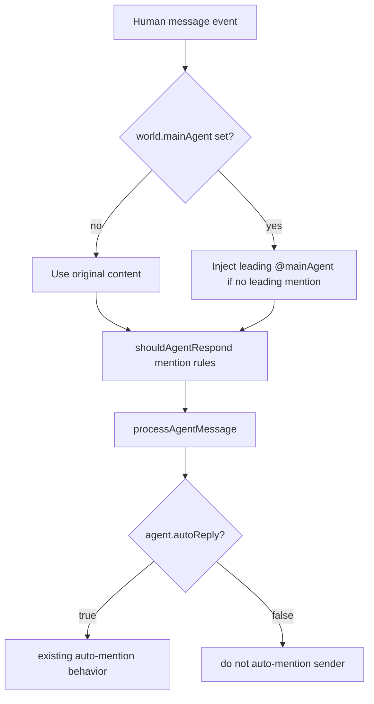

# Architecture Plan: Main Agent Routing and Agent Auto Reply

## Overview
Introduce one world-level routing flag and one agent-level reply flag while preserving existing event-driven processing.

## Architecture Decisions
- Add `mainAgent?: string | null` to world model and world create/update params.
- Add `autoReply?: boolean` to agent model and agent create/update params.
- Apply main-agent routing in message subscriber path (pre-orchestrator) by rewriting human content to include an explicit leading mention.
- Apply auto-reply guard in orchestrator auto-mention flow so agents with disabled flag do not target sender automatically.
- Persist both fields in SQLite with backward-compatible migration defaults.
- Reflect both fields in Web and Electron world/agent edit forms, using existing API payloads for create/update.

## Data Flow

## Implementation Phases

### Phase 1: Type and Persistence Foundation
- [x] Add fields to core types and params.
- [x] Add SQLite migration for `worlds.main_agent` and `agents.auto_reply`.
- [x] Update SQLite read/write mappers.

### Phase 2: Runtime Behavior
- [x] Apply world main-agent mention injection for human messages.
- [x] Apply agent auto-reply gating in orchestrator.

### Phase 3: Verification
- [x] Add/adjust tests for defaults and behavior.
- [x] Run targeted tests and full `npm test`.

### Phase 4: Client Form Integration (Web + Electron)
- [x] Add `mainAgent` input to world edit forms in web and electron clients.
- [x] Add `autoReply` toggle to agent edit forms in web and electron clients.
- [x] Ensure form load/edit/save pipelines map values correctly (`null`/empty for `mainAgent`, boolean for `autoReply`).
- [x] Ensure both clients display persisted values after refresh/reload.
- [x] Add/adjust client tests for world/agent edit forms where test coverage exists.

## Risks and Mitigations
- Risk: mention injection could alter explicit mention behavior. Mitigation: inject only when no paragraph-beginning mention is present.
- Risk: legacy rows missing new columns/values. Mitigation: migration + defaulting to prior behavior.
- Risk: client forms may omit new fields in patch payloads and silently overwrite state. Mitigation: explicit form schema fields + payload mapping tests in both clients.
