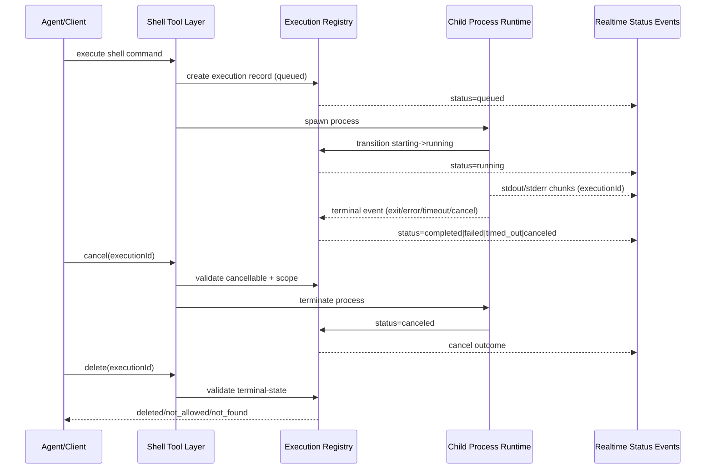

# Architecture Plan: Shell Child Process Lifecycle Management and Control

**Date**: 2026-02-13  
**Type**: Feature Enhancement  
**Status**: Completed  
**Related**:
- [Requirements](../../reqs/2026-02-13/req-shell-process-management.md)

## Overview

Implement a canonical process-execution control plane for shell commands so agents and clients can monitor status, observe progress, cancel deterministically, and safely delete historical records. The architecture centers on execution-ID-scoped lifecycle management with evented status propagation.

## Architecture Decisions

### Decision 1: Canonical Execution Registry
- Introduce a registry keyed by stable `executionId` for every shell child process.
- Store lifecycle state, ownership context, timestamps, and runtime handle linkage.
- Treat registry as source-of-truth for monitor/cancel/delete eligibility checks.

### Decision 2: Explicit Lifecycle State Machine
- Enforce valid transitions among `queued -> starting -> running -> completed|failed|canceled|timed_out`.
- Prevent ambiguous states and reject invalid transition attempts.
- Capture final-state reason metadata for diagnostics and UX messaging.

### Decision 3: Execution-ID-Scoped Control APIs
- All control operations (`get`, `list`, `cancel`, `delete`) must target `executionId`.
- No PID-only control in public APIs.
- Scope checks enforce session/world isolation before control action.

### Decision 4: Split Runtime Handles from History Records
- Runtime map maintains active child-process handles.
- History records store lifecycle snapshots for completed/canceled/failed runs.
- Cleanup removes active handles on terminal transitions while retaining record history per policy.

### Decision 5: Evented Progress and Status Reporting
- Emit status/progress events on transition and meaningful output milestones.
- Associate stdout/stderr and tool-stream events with `executionId`.
- Reuse existing status/realtime channels rather than introducing a parallel transport.

### Decision 6: Safe Delete Semantics
- Delete is allowed only for terminal-state records unless force policy is explicitly defined.
- Active records require cancel/terminal transition first.
- Delete returns explicit result (`deleted`, `not_found`, `active_process_conflict`, etc.).

## Scope of Change

- Core shell process orchestration and lifecycle tracking.
- Process registry state model and transition helpers.
- APIs/tool surfaces for monitor/cancel/delete by `executionId`.
- Event payload schema updates to include execution context.
- Optional persistence hooks for process history (if required by existing storage conventions).
- Tests across unit/domain/integration for lifecycle races and isolation.

## Data Flow

## Implementation Phases

### Phase 1: State Model and Contracts
- [x] Define `ProcessExecution` model and lifecycle enum.
- [x] Define transition rules and terminal-state semantics.
- [x] Add result contract types for monitor/cancel/delete operations.
- [x] Define event payload shape with `executionId` linkage.

### Phase 2: Registry and Runtime Handle Management
- [x] Implement in-memory execution registry module.
- [x] Implement active child-process handle map keyed by `executionId`.
- [x] Add atomic transition helpers with validation + timestamps.
- [x] Wire spawn lifecycle (`queued`/`starting`/`running`) and terminal cleanup.

### Phase 3: Control Surface (Monitor/Cancel/Delete)
- [x] Add monitor APIs: get single execution + list active/recent.
- [x] Add cancel API with idempotent outcome semantics.
- [x] Add delete API with active-process protection.
- [x] Enforce ownership/context isolation checks.

### Phase 4: Event and Output Integration
- [x] Attach `executionId` to stdout/stderr and tool-stream updates.
- [x] Emit lifecycle/status events for each meaningful transition.
- [x] Integrate cancel/delete outcomes into existing status reporting channel.
- [x] Ensure no regression in existing shell stream rendering path.

### Phase 5: Persistence and Retention Policy (Optional/Policy-Driven)
- [x] Decide retention behavior (in-memory recent history vs persisted history).
- [x] If persisted: add storage schema + manager methods for process history. *(Not required for this delivery; kept in-memory by policy decision.)*
- [x] Implement bounded retention/cleanup policy for stale terminal records.

### Phase 6: Verification and Hardening
- [x] Unit tests for transition validity, idempotent cancel, and delete constraints.
- [x] Integration tests for concurrent executions and session isolation.
- [x] Race tests: cancel-vs-complete, duplicate cancel, delete-vs-active.
- [x] Manual validation for monitor/progress/cancel UX flows.
- [x] Verify cleanup behavior on process exit and runtime shutdown.

## Risks and Mitigations

- **Risk**: Transition races create inconsistent state.
  - **Mitigation**: single transition helper with terminal-state guard + idempotent operations.
- **Risk**: Orphaned child processes after errors.
  - **Mitigation**: centralized handle cleanup in finally/shutdown paths; terminal-state reconciliation checks.
- **Risk**: Cross-session cancellation.
  - **Mitigation**: strict context ownership checks prior to cancel/delete.
- **Risk**: Unbounded process-history growth.
  - **Mitigation**: retention cap + time-based pruning policy.
- **Risk**: Output/status mismatch.
  - **Mitigation**: require `executionId` on every progress/status event and test correlation.

## Completion Criteria

- [x] Every launched shell process has a stable execution record and lifecycle state.
- [x] Monitor APIs return accurate active/recent process state.
- [x] Cancel is deterministic and idempotent with explicit outcomes.
- [x] Delete obeys active-process safety constraints.
- [x] Output/status events are correlated by execution ID.
- [x] Concurrency isolation holds across sessions/chats/worlds.
- [x] Automated race/isolation tests pass.

---

## Architecture Review (AR)

### Review Summary

✅ **Approved**: The phased plan is feasible and properly ordered for low-risk delivery. It prioritizes core lifecycle correctness before UX layering.

### Plan Validation

- Correctly prioritizes state model + registry before control operations.
- Explicitly addresses cancel/delete semantics and idempotency.
- Includes required race and isolation testing coverage.
- Keeps compatibility with existing status/realtime channel strategy.

### Recommended Execution Order

1. Complete Phase 1 + Phase 2 first (foundation).
2. Implement Phase 3 control APIs with strict result contracts.
3. Integrate Phase 4 events and verify end-to-end observability.
4. Apply Phase 5 only if persisted history is required by product scope.
5. Gate merge on Phase 6 race/isolation tests.

### AR Outcome

- Proceed with this plan as written.
- Treat cancel/delete result semantics as non-negotiable API contracts.
- Do not implement delete-for-active behavior unless explicitly requested with force semantics.
