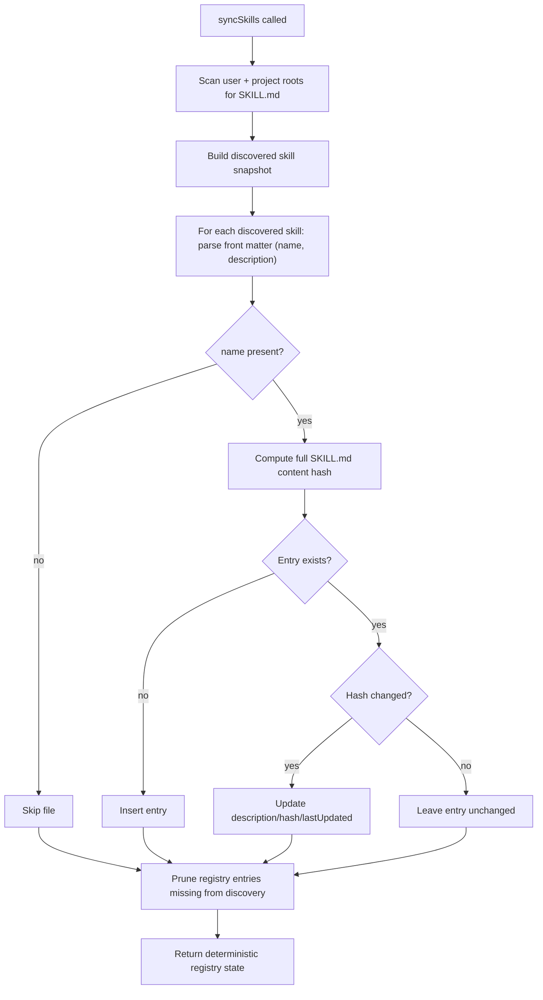

# Architecture Plan: Core Skill Registry and Synchronization

**Date:** 2026-02-14  
**Related Requirement:** [req-core-skill-registry.md](../../reqs/2026-02-14/req-core-skill-registry.md)  
**Status:** ✅ Completed

## Overview

Establish and verify a core singleton skill registry that synchronizes `SKILL.md` files from user and project skill roots, updates changed entries by full-file content hash, and prunes removed skills so registry state always matches the filesystem.

This plan is implementation-focused but starts with alignment checks because a baseline `core/skill-registry.ts` module already exists.

## Architecture Decisions

### AD-1: Singleton Registry Surface
- Keep one process-local singleton registry instance in `core`.
- Expose top-level registry accessors and `syncSkills` from `core` exports.
- Trigger one automatic sync during core module load to warm registry state at startup.

### AD-2: Skill Entry Contract
- Use one canonical entry shape:
  - `skill_id: string` (parsed from SKILL.md front-matter `name`)
  - `description: string` (parsed from SKILL.md front-matter `description`)
  - `hash: string`
  - `lastUpdated: string`

### AD-3: File-System as Source of Truth
- Rebuild discovered skill snapshot from scanned `SKILL.md` files each sync run.
- Parse front matter metadata (`name`, `description`) before registry mutation.
- Compute entry hash from the full `SKILL.md` file content (not metadata-only fields).
- Include both `~/.agents/skills` and `~/.codex/skills` as default user roots.
- Registry mutation rules:
  - add missing entries,
  - update changed entries (hash mismatch),
  - preserve unchanged entries,
  - delete entries absent from discovery.
  - ignore files missing front-matter `name`.
  - on ID collisions, project-scope entries override user-scope entries.

### AD-4: Deterministic Sync Runs
- Use stable scan ordering and stable skill ID resolution.
- Ensure repeated sync with unchanged files yields identical registry data.

### AD-5: Resilient Discovery
- Missing/unreadable roots must not fail entire sync.
- Continue scanning remaining valid roots and complete with best-effort results.

## Components and Responsibilities

- `core/skill-registry.ts`
  - Singleton state container
  - Skill file discovery and content loading
  - Hash comparison and mutation logic
  - Prune logic for removed skills
- `core/index.ts`
  - Public exports for registry API
- `tests/*` (core-focused test suite)
  - Unit/integration verification for add/update/no-op/remove/no-skill flows

## Data Flow

## Implementation Phases

### Phase 1: Baseline Audit and Contract Lock
- [x] Verify current `core/skill-registry.ts` API matches REQ contract.
- [x] Verify `core/index.ts` exports singleton and `syncSkills`.
- [x] Confirm/align entry fields exactly to `skill_id`, `description`, `hash`, `lastUpdated`.
- [x] Record any contract gaps before behavioral edits.

### Phase 2: Discovery and Sync Logic Alignment
- [x] Validate scanning coverage for both user and project skill roots.
- [x] Ensure only `SKILL.md` files are used as skill sources.
- [x] Enforce add/update/no-op behavior using hash comparison.
- [x] Enforce prune behavior for deleted/missing skills.
- [x] Ensure no-skill case produces clean empty state without errors.

### Phase 3: Determinism and Error Handling
- [x] Stabilize ordering/id-resolution behavior across runs.
- [x] Ensure missing directories do not abort sync.
- [x] Ensure per-file read errors are isolated and do not corrupt registry state.
- [x] Verify repeated unchanged runs return identical registry state.

### Phase 4: Test Coverage
- [x] Add/adjust tests for singleton and exports.
- [x] Add/adjust tests for insert on newly discovered skill.
- [x] Add/adjust tests for update on changed hash.
- [x] Add/adjust tests for unchanged hash no-op.
- [x] Add/adjust tests for prune on removed skill.
- [x] Add/adjust tests for zero-skill and missing-root scenarios.
- [x] Keep tests aligned with project unit-test rules (in-memory and mocked external calls).

### Phase 5: Validation and Documentation
- [x] Run targeted test suite for affected core modules.
- [x] Run project test command and resolve regressions.
- [x] Update file header comment blocks in modified source files.
- [x] Update REQ/AP docs if scope shifts during implementation.

## Dependencies and Risks

### Dependencies
- Existing core export conventions (`core/index.ts`)
- File-system access patterns used by core modules
- Test harness utilities for temporary/in-memory fixtures

### Risks
- Risk: Skill ID collisions across roots overwrite unintended entries.  
  Mitigation: lock deterministic precedence and test collision behavior.
- Risk: Timestamp-only change detection can miss content drift.  
  Mitigation: hash-based update as primary change detector.
- Risk: Root scan failures stop sync early.  
  Mitigation: isolate root errors and continue remaining roots.

## Exit Criteria

- [x] Registry singleton and `syncSkills` exports conform to REQ.
- [x] Sync behavior covers add/update/no-op/remove exactly.
- [x] Missing roots and empty discovery are handled safely.
- [x] Determinism is verified with repeated-run tests.
- [x] All relevant tests pass.

## Architecture Review (AR)

**Review Date:** 2026-02-14  
**Reviewer:** AI Assistant  
**Status:** ✅ Approved for SS

### AR Notes
- The plan is feasible within current core structure because skill registry scaffolding already exists.
- Main implementation risk is behavioral drift versus REQ contract; Phase 1 + Phase 4 explicitly mitigate this.
- Proceed with SS execution in phase order and update checkboxes as tasks complete.
