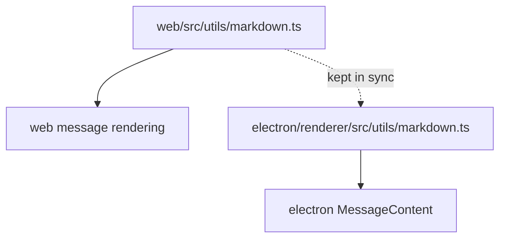

# Architecture Plan: Message Display Alignment

## Overview

Align web and electron message display by favoring the electron app's simpler patterns. Work is organized into 4 phases: shared infrastructure, web simplification, electron enhancements, and cross-cutting polish.

## Architecture Decisions

- **AD-1:** Keep markdown utilities in each app but ensure parity — `core/package.json` lacks `marked`/`dompurify` and the electron renderer doesn't import from `core/`, making a true shared module impractical without build-tool changes. Instead, sync the two copies and add the missing `hasMarkdown()` to the electron copy.
- **AD-2:** Remove web's 3-tier tool call reconstruction — the core already formats `message.content` before storage/streaming; client-side reconstruction is redundant complexity.
- **AD-3:** Extract `renderMessageContent` as a pure function in `web/src/domain/` — follows the web app's existing pattern of domain logic separated from components (see `message-display.ts`, `sse-streaming.ts`).
- **AD-4:** Port the `AgentQueueDisplay` as AppRun markup — not a full React port, just the same visual structure using AppRun conventions.

## Components

```
web/src/
  domain/
    message-content.ts ← NEW: extracted message rendering logic
  components/
    world-chat.tsx     ← MODIFIED: simplified rendering
    activity-indicators.tsx ← MODIFIED: add ARIA attributes
    tool-execution-status.tsx ← MODIFIED: add ARIA attributes
    agent-queue-display.tsx ← NEW: ported from electron

electron/renderer/src/
  App.jsx              ← MODIFIED: cross-agent styling, truncation warning
  utils/
    markdown.ts        ← MODIFIED: add hasMarkdown(), sync with web
  components/
    ToolExecutionStatus.jsx ← no changes needed (already has ARIA)
```

## Data Flow



## Implementation Phases

### Phase 1: Sync Markdown Utilities
- [ ] Add `hasMarkdown()` function to `electron/renderer/src/utils/markdown.ts`
- [ ] Ensure both markdown files have identical configuration (allowed tags, attributes, options)
- [ ] Verify both apps render markdown correctly

### Phase 2: Simplify Web Message Rendering
- [ ] Extract `renderMessageContent()` into `web/src/domain/message-content.ts` with three clean paths: log → tool → regular
- [ ] Remove `formatMessageText()` (3-tier tool call reconstruction) from `world-chat.tsx`
- [ ] Update `world-chat.tsx` to call `renderMessageContent()` instead of inline rendering
- [x] ~~Change web message edit/delete buttons to hover-reveal~~ (already implemented via `.message:hover .message-actions`)
- [ ] Verify all message types render correctly (human, agent, tool, system, cross-agent, streaming)

### Phase 3: Electron Enhancements
- [ ] Add truncation warning UI in `MessageContent` when tool output exceeds 50K chars
- [ ] Add cross-agent message detection in `getMessageCardClassName()` — distinct border color for cross-agent
- [ ] Add cross-agent directional label in message header (e.g., `Agent: X → Y`)

### Phase 4: Cross-Cutting Polish
- [ ] Add `role="status"` and `aria-live="polite"` to web `ThinkingIndicator`
- [ ] Add `role="status"` and `aria-live="polite"` to web `ToolExecutionStatus`
- [ ] Port `AgentQueueDisplay` to web app as AppRun component in `web/src/components/agent-queue-display.tsx`
- [ ] Integrate `AgentQueueDisplay` into the web chat header area

## Dependencies & Risks

| Risk | Mitigation |
|------|-----------|
| Markdown files may drift apart over time | Add a comment header in both files noting they should stay in sync; consider a lint rule or build check in the future |
| Removing `formatMessageText()` may degrade display of old messages stored without formatted content | Verify by loading historical messages; core has been formatting content on save since at least 2025-11 |
| AppRun hover patterns differ from React's `group-hover` | Use CSS `:hover` on the message container — framework-agnostic |
| AgentQueueDisplay needs agent queue data | Web app must expose active/queued agent state; check if `WorldComponentState` already tracks this or if new state is needed |

## Estimated Effort

- Phase 1: Small (move + re-export)
- Phase 2: Medium (refactor web rendering, remove ~130 lines of formatMessageText)
- Phase 3: Small (add warning + styling in electron)
- Phase 4: Small-Medium (ARIA attrs + port AgentQueueDisplay)

Total: ~2-3 focused sessions
