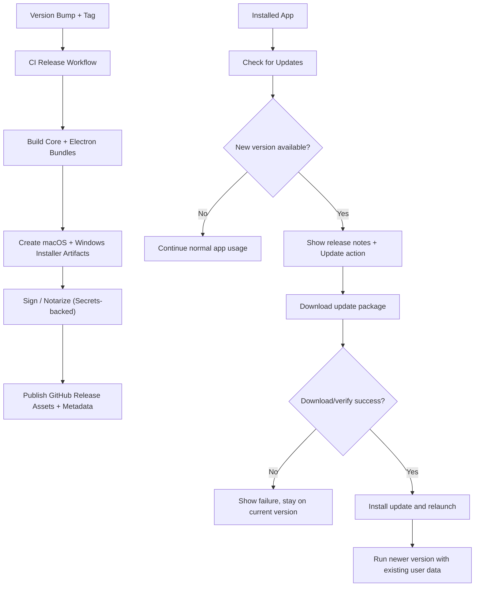

# Architecture Plan: Publish Agent World Electron for macOS and Windows (GitHub + Installer + Auto-Update)

**Date**: 2026-02-14  
**Type**: Release / Distribution / Update Lifecycle  
**Requirement**: [req-publish-agent-world-electron.md](../../reqs/2026-02-14/req-publish-agent-world-electron.md)
**Status**: ✅ AR Reviewed (Approved with revisions)

## Overview

Deliver a production macOS and Windows desktop release pipeline for Agent World Electron that:
- builds installer-grade artifacts,
- publishes them to GitHub Releases, and
- allows installed apps to check/download/apply newer versions safely.

This plan prioritizes repeatable release operations, platform trust requirements, and non-destructive upgrades for existing user data.

## Architecture Review (AR) Summary

**Review Date**: 2026-02-14  
**Result**: ✅ APPROVED WITH REVISIONS

### Key Findings

- A generic "installer artifact" requirement is insufficient for auto-update; updater-compatible artifacts and metadata must be first-class release outputs.
- Current repository versioning is split (`package.json` vs `electron/package.json`) and must be normalized into one release contract.
- Platform trust requirements (macOS signing/notarization and Windows signing) cannot be optional for production distribution.
- Release automation must fail-fast if trust/signing prerequisites are missing.

### Options Considered

1. **Option A (Selected): Electron packaging + updater integration + GitHub Releases provider**
2. **Option B: Installer-only release with custom update client logic**
3. **Option C: Manual download/replace updates (no in-app install)**

### AR Revisions Applied

- Added explicit release artifact contract (installer + updater metadata/package assets).
- Added explicit stable/prerelease channel policy.
- Added explicit fail-fast signing/notarization gates in CI.
- Added explicit authoritative version-source alignment milestone.

## Architecture Decisions

- **Decision 1: Use a dedicated Electron packaging/publishing toolchain**
  - Package macOS and Windows app artifacts from `electron/` and repo root builds in a repeatable way.
  - Produce release assets required for both first-time install and update metadata resolution.

- **Decision 2: GitHub Releases is the single source of truth**
  - CI publishes versioned desktop assets and release metadata to GitHub.
  - Desktop update checks query release-backed metadata only.

- **Decision 3: Installer-first distribution**
  - End-user install path is downloadable macOS and Windows installer artifacts from Releases.
  - Source-code build remains a developer workflow, not the primary end-user install path.

- **Decision 4: In-app updater is explicit and user-controlled**
  - App checks for updates, surfaces availability, and lets user confirm installation.
  - Update errors are non-fatal and keep current app usable.

- **Decision 5: Preserve data path stability across upgrades**
  - Keep workspace/world persistence directories stable and version-agnostic.
  - Upgrade must never migrate data to ephemeral/versioned locations by default.

- **Decision 6: Explicit release channels**
  - Stable releases are the default update channel.
  - Prerelease updates are opt-in and must not impact stable users.

## Delivery Flow

## Implementation Phases

### Phase 1: Release Contract and Versioning Baseline
- [x] Define desktop release artifact contract (artifact names, platform/architecture targets, metadata files).
- [x] Select packaging/updater stack and lock release asset conventions for installer + updater feeds.
- [x] Align app version source between root package and Electron package to avoid version drift.
- [x] Define release trigger policy (tag pattern, prerelease handling, rollback strategy).
- [x] Document required CI secrets and platform signing/notarization prerequisites.

Phase 1 delivery notes:
- Added release contract baseline: `docs/electron-release-contract.md`
- Added version-contract enforcement script: `scripts/sync-electron-version.js`
- Added root scripts:
  - `version:sync:electron`
  - `version:check:electron`
  - `release:prepare`
- Synced `electron/package.json` version from `0.1.0` to `0.10.0` and validated with `--check`.

### Phase 2: Packaging and Artifact Generation
- [x] Add macOS and Windows packaging configuration for installer-grade outputs and update metadata outputs.
- [x] Ensure build pipeline compiles required root/electron bundles before packaging.
- [ ] Verify produced macOS artifacts are installable on Apple Silicon + Intel targets.
- [ ] Verify produced Windows artifacts are installable on x64 and arm64 targets (where supported).
- [x] Verify updater metadata resolves correctly across platform/architecture targets.
- [x] Add local verification commands for maintainers to validate packaging before publishing.

Phase 2 delivery notes:
- Added packaging configuration + targets in `electron/package.json` (`electron-builder` build block).
- Added runtime staging script `scripts/prepare-electron-runtime.js` and wired it into Electron packaging scripts.
- Added root wrappers for packaging commands (`electron:package:base`, `electron:dist:*`) in `package.json`.
- Added local verification command documentation in `docs/electron-release-contract.md`.
- Verified generated artifacts and update metadata:
  - macOS arm64: DMG + ZIP + `latest-mac.yml`
  - Windows x64: NSIS EXE + blockmap + `latest.yml`
- Verified packaged `app.asar` includes:
  - `dist/main.js`
  - `dist/core/index.js`
  - `dist/migrations/*.sql`
  - `renderer/dist/index.html`
- Remaining host-specific verification:
  - macOS x64 installer validation
  - Windows arm64 installer validation (native-module cross-build constraints from current host)

### Phase 3: GitHub Release Automation
- [ ] Add GitHub Actions workflow to build and publish macOS + Windows release assets on tagged versions.
- [ ] Configure workflow to upload all installer/update assets and publish release notes.
- [ ] Add workflow guardrails for failed signing/notarization/publishing paths.
- [ ] Add channel-aware publish rules for stable vs prerelease releases.
- [ ] Ensure release process is repeatable without manual artifact renaming/editing.

### Phase 4: In-App Update Lifecycle
- [ ] Add updater service in Electron main process for check/download/install lifecycle.
- [ ] Expose update status/events through preload bridge to renderer.
- [ ] Add renderer UI to show current app version.
- [ ] Add renderer action to manually check for updates.
- [ ] Add renderer notification flow for update availability.
- [ ] Add renderer view/action for release notes before update install.
- [ ] Add renderer action to trigger update install and restart.
- [ ] Ensure updater respects configured channel policy (stable by default, prerelease opt-in).
- [ ] Implement graceful failure states that keep current app functional.

### Phase 5: Data Safety and Upgrade Resilience
- [ ] Validate workspace/world data persistence remains stable across app upgrades.
- [ ] Add upgrade-path tests/verification for existing-user scenario (install old -> update -> verify data).
- [ ] Define rollback behavior and user messaging for failed update apply/relaunch.

### Phase 6: Documentation and Operational Readiness
- [ ] Update README/docs with end-user installer steps from GitHub release for macOS and Windows.
- [ ] Add maintainer release runbook (version bump, tag, publish, validate).
- [ ] Add troubleshooting guide for failed update checks/downloads/install.
- [ ] Add post-release validation checklist for first install and in-app update.

## Test and Validation Strategy

- [ ] Artifact validation: verify macOS and Windows installers install and launch cleanly.
- [ ] Update validation: on macOS and Windows, install previous release, publish newer release, perform in-app update.
- [ ] Failure validation: simulate unavailable release feed / download failure / install failure.
- [ ] Data validation: verify pre-existing worlds/chats/workspace settings remain intact post-update.
- [ ] CI validation: ensure release workflow fails fast on signing/publish errors and reports actionable logs.
- [ ] Channel validation: stable users do not receive prerelease updates unless explicitly enabled.

## Dependencies

- GitHub repository release permissions and CI runners.
- Apple developer credentials/certificates for macOS signing and notarization.
- Windows code-signing credentials for signed installer/update artifacts.
- Consistent Node/Electron build environments in CI.
- Existing Electron IPC bridge for exposing update status to UI.
- Selected Electron packaging + updater libraries and compatible configuration.

## Risks and Mitigations

- **Risk**: Unsigned/unnotarized builds blocked by macOS trust checks.  
  **Mitigation**: make signing/notarization mandatory in release workflow and fail release when absent.

- **Risk**: Unsigned Windows builds trigger SmartScreen/reputation warnings and reduce install trust.  
  **Mitigation**: require Windows code signing for production artifacts and gate release on signing success.

- **Risk**: Update metadata/assets mismatch causing failed auto-update.  
  **Mitigation**: enforce deterministic artifact naming and publish all required update files in one workflow.

- **Risk**: Version drift between app binaries and release metadata.  
  **Mitigation**: single authoritative version contract with CI validation before publish.

- **Risk**: Upgrade corrupts or loses user data.  
  **Mitigation**: stable data path policy + upgrade regression checks + rollback guidance.

## Milestones

- [ ] M1: Packaging config and local macOS + Windows installable artifacts validated.
- [ ] M2: GitHub tagged release automation publishes macOS + Windows desktop assets successfully.
- [ ] M3: In-app update check/download/install works against GitHub release source on macOS and Windows.
- [ ] M4: End-to-end installer + upgrade flow documented and operationalized.
