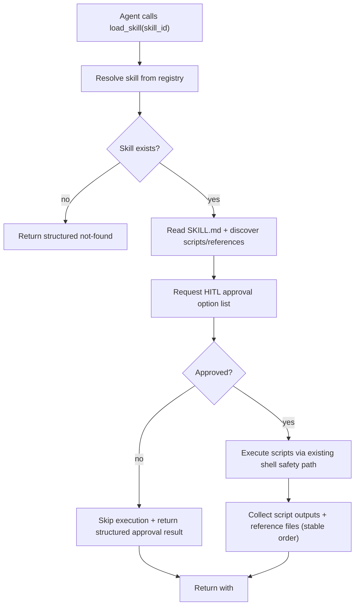

# Architecture Plan: Safe Skill Script Execution via `load_skill` + HITL Approval

**Date:** 2026-02-14  
**Related Requirement:** [req-safe-skill-script-execution.md](../../reqs/2026-02-14/req-safe-skill-script-execution.md)  
**Status:** ✅ Implemented

## Overview

Extend `load_skill` so it can execute skill-bundled scripts safely and include script output plus reference assets under `<active_resources>`, while reusing existing shell command safeguards.

Add a generic HITL option request/response flow and require `load_skill` to request user approval with option-list selections before executing scripts.

## Architecture Decisions

### AD-1: Keep Skill Registry as Lookup Source
- `skill_id` resolution and SKILL.md path lookup stay registry-backed.
- Script/reference discovery is rooted at the resolved skill directory from registry path.

### AD-2: Reuse Existing Shell Safety Controls
- Script execution must route through existing shell safety primitives (scope validation, trusted working directory, timeout/error handling).
- No parallel custom script executor path.

### AD-2a: Restrictive Script Selection
- Execute only scripts referenced by skill instructions.
- Optional caller-side script filtering is deferred; current scope is referenced-only execution.
- Do not execute scripts by directory scan alone.

### AD-3: Deterministic Active Resources Contract
- `load_skill` returns `<active_resources>` with deterministic ordering:
  - script outputs in stable script-name order.
  - reference files in stable path order.

### AD-4: Structured Failures, No Runtime Crash
- Not-found skill/script and execution/read errors return structured tool output.
- Tool execution failure does not break orchestration loop.

### AD-5: Progressive Loading Boundaries
- Keep prompt lightweight.
- Load full SKILL.md, script output, and reference context only on `load_skill` call.

### AD-6: Generic World HITL Option Runtime
- Introduce a world-scoped option request/response primitive (`requestWorldOption`, `submitWorldOptionResponse`).
- Emit HITL prompts as `system` events with `eventType = hitl-option-request`.
- Resolve pending requests by `(worldId, requestId)` with timeout fallback.

### AD-7: `load_skill` Approval Policy
- `load_skill` must request approval before running referenced scripts.
- Approval options are fixed: `yes_once`, `yes_in_session`, `no`.
- `yes_in_session` caches approval for the active `(world, chat, skill)` session scope.
- `no` or unavailable approval channel skips execution and returns structured status output.

## End-to-End Flow

## Components

- `core/load-skill-tool.ts`
  - Add safe script execution pipeline.
  - Build required `<active_resources>` payload.
  - Add HITL approval gate and session-scoped approval cache.

- `core/hitl.ts`
  - Add generic world-scoped option request/response runtime.
  - Emit HITL prompts as system events and resolve selected options.

- `core/skill-registry.ts`
  - Reuse current source-path lookup API (`getSkillSourcePath`) for deterministic skill root resolution.

- `core/shell-cmd-tool.ts` (reuse only)
  - Reuse existing guardrails and execution safety behavior.

- `electron/shared/ipc-contracts.ts`, `electron/preload/*`, `electron/main-process/*`, `electron/main.ts`
  - Add renderer-to-core `hitl:respond` IPC for submitting option selections.

- `electron/renderer/src/App.jsx`
  - Handle `hitl-option-request` system events and render option-list approval UI.

- `server/api.ts`, `web/src/api.ts`, `web/src/pages/World.update.ts`, `web/src/pages/World.tsx`
  - Add web endpoint/client wiring and UI event handling for HITL option submission.

- `cli/index.ts`
  - Add HITL option prompt rendering and response submission in interactive mode.
  - Add default-option auto-response in pipeline/non-interactive mode.

- `tests/core/load-skill-tool.test.ts`
  - Extend coverage for script execution, reference files, and failure paths.

## Phased Implementation

### Phase 1: Skill Resource Resolution
- [x] Define deterministic extraction rules for instruction-referenced scripts and reference files under a skill directory.
- [x] Resolve script/reference relative paths against skill root.
- [x] Enforce skill-root containment before any script execution/read.
- [x] Add explicit rejection for unreferenced scripts.

### Phase 2: Safe Script Execution Adapter
- [x] Introduce a `load_skill` script execution path that reuses existing shell safety checks.
- [x] Enforce trusted working directory and path scope for each script execution.
- [x] Standardize timeout/error/cancellation handling in returned script output blocks.
- [ ] Add optional script-filter input that can only narrow referenced script set. (Deferred)

### Phase 3: Generic HITL Option Process
- [x] Add core world-scoped option request/response runtime with timeout fallback.
- [x] Emit HITL requests as `hitl-option-request` system events for realtime subscribers.
- [x] Add IPC channel + preload bridge for renderer option submission to core runtime.
- [x] Add renderer option modal for generic list-based approvals.
- [x] Integrate `load_skill` with approval options: `yes_once`, `yes_in_session`, `no`.
- [x] Add in-session approval reuse for repeated skill runs in same session scope.
- [x] Add web HITL response endpoint/client + modal flow for option-list approvals.
- [x] Add CLI HITL option prompting and response submission support.

### Phase 4: `load_skill` Output Contract Update
- [x] Update tool result format to include:
  - [x] `<instructions>` (full SKILL.md)
  - [x] `<active_resources><script_output ...>` blocks
  - [x] `<active_resources><reference_files>` content/listing
  - [x] existing `<execution_directive>`
- [x] Preserve exact XML-like envelope semantics expected by downstream model flow.

### Phase 5: Error and Edge Handling
- [x] Add structured result variants for:
  - [x] missing skill
  - [x] missing script(s)
  - [x] unreferenced script request
  - [x] script execution failure
  - [x] unreadable reference files
- [x] Keep deterministic ordering and explicit source attribution in all outcomes.

### Phase 6: Tests
- [x] Add unit tests for successful script execution and output embedding.
- [x] Add unit tests for skill/script not-found and execution failure paths.
- [x] Add regression coverage ensuring shell safety path is used (scope-rejection scenarios).
- [x] Add HITL runtime tests for request/response and timeout fallback.
- [x] Add Electron IPC/preload routing tests for HITL response flow.
- [ ] Add ordering/determinism tests for multi-script/multi-reference skills.

### Phase 7: Validation and Documentation
- [x] Run targeted tests for `load_skill`, skill registry, and shell safety integrations.
- [x] Run `npm run check` and impacted package build/test commands.
- [x] Update requirement acceptance checkboxes.
- [x] Add completion note under `.docs/done/2026-02-14/`.

## Risks and Mitigations

- Risk: Script execution expands attack surface.
  Mitigation: hard require existing shell safety guards and skill-root containment checks.

- Risk: Approval prompts could be bypassed by direct tool execution paths.
  Mitigation: centralize approval in `load_skill` before script execution and enforce runtime checks.

- Risk: Approval fatigue for repeated invocations.
  Mitigation: provide explicit `yes_in_session` reuse option scoped to active session.

- Risk: Very large script output/reference content can bloat tool results.
  Mitigation: define bounded output strategy and deterministic truncation rules.

- Risk: Protocol mismatch vs expected Agent Skills behavior.
  Mitigation: align discovery and execution semantics to skill-local filesystem model and validate with fixture-based tests.

- Risk: Cross-platform shell differences.
  Mitigation: normalize execution wrapper and cover representative path patterns in tests.

## Exit Criteria

- [x] `load_skill` safely executes skill-bundled scripts using existing shell safeguards.
- [x] `load_skill` executes only instruction-referenced scripts by default.
- [x] Result payload includes required `<active_resources>` sections and source attribution.
- [x] Structured failures are returned for missing skills/scripts and execution/read errors.
- [x] Deterministic ordering is preserved for script and reference resources.
- [x] Generic HITL option process is available for world workflows.
- [x] `load_skill` requires HITL selection with `yes_once` / `yes_in_session` / `no`.
- [x] Electron, web, and CLI clients can submit HITL option responses.
- [x] Tests and type checks pass.

## Architecture Review (AR)

**Review Date:** 2026-02-14  
**Reviewer:** AI Assistant  
**Status:** ✅ Completed in implementation

### AR Notes / Completion
- The largest risk (which scripts get executed) is now explicitly constrained: referenced-only execution.
- Security posture is preserved by forcing execution through existing shell safeguards.
- Plan was implemented with one deferred item: optional caller-side script filtering.
