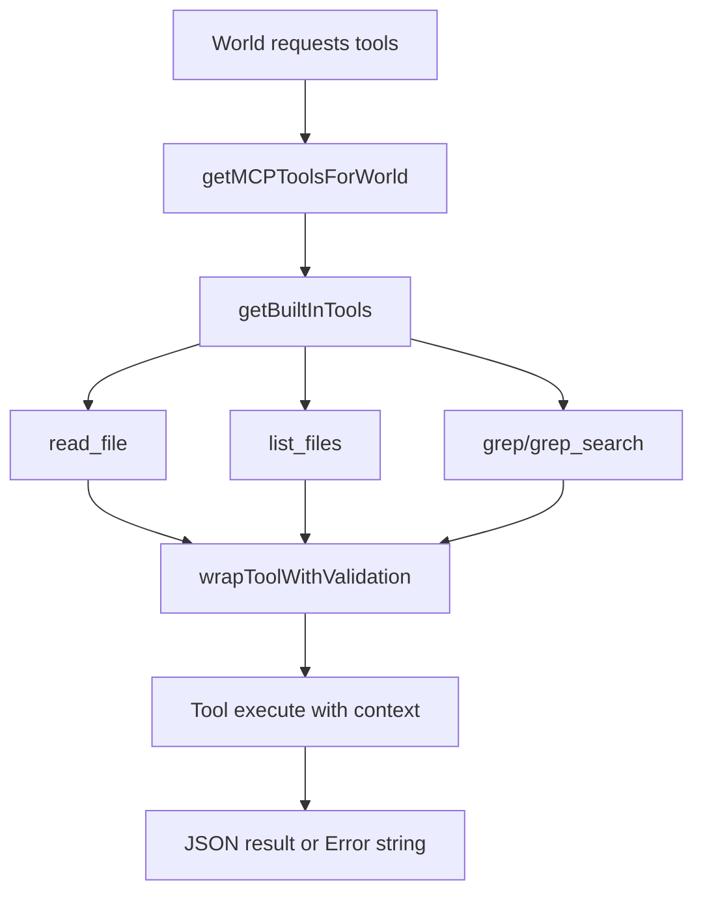

# Architecture Plan: Built-in File Navigation Tools

## Overview
Introduce three built-in tools (`read_file`, `list_files`, `grep`) so every world can gather code/document context without relying on external MCP servers.

## Architecture Decisions
- Keep tool registration centralized in `core/mcp-server-registry.ts` via `getBuiltInTools()`.
- Implement file-oriented tools in a dedicated module (`core/file-tools.ts`) using function-based design.
- Reuse existing validation wrapper (`wrapToolWithValidation`) for consistent argument handling.
- Preserve backward compatibility with existing naming by exposing `grep_search` as an alias to `grep`.

## AR Review Outcome
- **Status:** Conditionally approved.
- **Resolved:** Core structure is feasible, maintainable, and consistent with existing built-in tool patterns.
- **Required follow-up:** Stabilize path-resolution assumptions in integration tests to avoid false negatives.
- **Security note:** Current plan does not enforce trusted working-directory boundaries for file tools; acceptable for this scope but should be tracked as future hardening.

## Assumption Validation (AR)
- **Assumption A:** Relative paths are resolved against a stable runtime directory.
  - **Finding:** This is true in runtime but can diverge in tests if the tool context omits `workingDirectory`.
  - **Action:** Ensure tests pass context-aware paths or align expected base path explicitly.
- **Assumption B:** Existing callsites may still emit `grep_search`.
  - **Finding:** Confirmed by existing tests/history.
  - **Action:** Keep alias exposed in built-ins.

## Option Tradeoffs (AR)
- **Option 1 (selected):** Keep canonical `grep` + alias `grep_search`.
  - **Pros:** Backward compatible, minimal code churn.
  - **Cons:** Slightly larger tool surface.
- **Option 2:** Canonical `grep` only.
  - **Pros:** Cleaner API surface.
  - **Cons:** Breaks older prompts/tests and requires migration coordination.
- **Option 3:** Runtime name translation layer.
  - **Pros:** Centralized compatibility management.
  - **Cons:** Added complexity for limited value in current scope.

## Components
- **Tool Definitions**: `createReadFileToolDefinition`, `createListFilesToolDefinition`, `createGrepToolDefinition`.
- **Registry Wiring**: Built-in tool map in `getBuiltInTools()`.
- **Validation Layer**: `wrapToolWithValidation` in `core/tool-utils.ts`.
- **Integration Verification**: `tests/core/shell-cmd-integration.test.ts`.

## Data Flow

## Implementation Phases
### Phase 1: Built-in Tool Module
- [x] Add dedicated file tool module with `read_file`, `list_files`, and `grep` definitions.
- [x] Implement bounded read/search behavior and deterministic JSON responses.
- [x] Add error handling that returns user-readable tool errors.

### Phase 2: Registry Integration and Compatibility
- [x] Register new tools in `getBuiltInTools()`.
- [x] Preserve existing built-ins (`shell_cmd`, `load_skill`).
- [x] Add `grep_search` alias mapping to `grep` for compatibility.

### Phase 3: Verification and Stabilization
- [x] Extend integration tests to assert availability and basic execution of new tools.
- [x] Fix failing integration assertion caused by path-resolution mismatch in `read_file` test input by aligning expected base path strategy.
- [x] Re-run targeted Node 22 test suite and confirm green.

## Dependencies & Risks
- **Path Resolution Risk**: Relative path handling can differ between runtime `cwd` and test assumptions.
- **Search Cost Risk**: Recursive grep can become expensive; bounded max results and per-file size guard are required.
- **Compatibility Risk**: Renaming-only changes may break callers; alias is retained to avoid regressions.
- **Scope/Security Risk**: File tools currently do not enforce `shell_cmd`-style trusted directory boundaries; acceptable for feature parity but document for follow-up hardening.

## Rollout Notes
- Keep scope to built-in tool surface only.
- Avoid unrelated MCP transport and server lifecycle changes.
- Validate behavior in worlds with and without `mcpConfig`.
