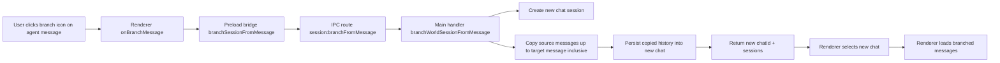

# Architecture Plan: Electron Branch Chat from Agent Message

## Overview
Implement chat branching in the Electron app so users can branch from an agent message, producing a new chat that contains message history up to that selected message, and immediately switch into the new branched chat.

## Architecture Decisions
- Keep branching flow in existing Electron desktop layers: renderer action → preload bridge → shared IPC contract/route → main-process handler.
- Reuse existing chat/session creation and selection semantics to avoid custom selection paths.
- Implement branching as a dedicated IPC operation instead of composing multiple renderer-side calls, to keep history-copy behavior atomic and deterministic.
- Restrict branch trigger in UI to agent messages only.

## AR Review Outcome
- **Status:** Approved for implementation.
- **Scalability:** Bounded by selected message index; linear copy of prior messages is acceptable for current desktop scope.
- **Maintainability:** Fits current function-based architecture and existing IPC route conventions.
- **Testability:** Branching can be validated through main-process route tests and renderer interaction tests with mocked bridge calls.

## Assumption Validation (AR)
- **Assumption A:** Core memory APIs can read source chat messages in order and support creating a new session.
  - **Finding:** Existing IPC handlers already rely on `getMemory`, `newChat`, and `restoreChat`; branching can leverage the same primitives.
  - **Action:** Add a dedicated handler that snapshots source messages up to target and writes them into the new chat memory path.
- **Assumption B:** Renderer already has stable message identity and chat targeting for per-message actions.
  - **Finding:** Message actions use `messageId` and resolved `chatId` today for edit/delete.
  - **Action:** Reuse identity/target helpers for branch action routing.
- **Assumption C:** Session selection updates are already robust after create/select operations.
  - **Finding:** Existing `onCreateSession` and `onSelectSession` logic handles list refresh + selection updates.
  - **Action:** Mirror this pattern for branch success path.

## Option Tradeoffs (AR)
- **Option 1 (selected):** Dedicated `session:branchFromMessage` IPC command.
  - **Pros:** Single source of truth, atomic behavior, less renderer orchestration risk.
  - **Cons:** Adds one new contract and route.
- **Option 2:** Renderer composes existing `createSession + getMessages + write` calls.
  - **Pros:** No new IPC contract.
  - **Cons:** More race conditions, duplicated logic, harder failure recovery.
- **Option 3:** Main-process overload of `session:create` with optional branch payload.
  - **Pros:** Fewer channels.
  - **Cons:** Less explicit API semantics and increased handler branching complexity.

## Components
- **Renderer UI:** `electron/renderer/src/App.jsx` message action row.
- **Renderer bridge usage:** `electron/renderer/src/domain/desktop-api.js` compatibility surface.
- **Preload bridge:** `electron/preload/bridge.ts`, `electron/preload/payloads.ts`.
- **Shared IPC contracts:** `electron/shared/ipc-contracts.ts`.
- **Main routes/handlers:** `electron/main-process/ipc-routes.ts`, `electron/main-process/ipc-handlers.ts`, wiring in `electron/main.ts`.
- **Tests:** Electron main/preload/renderer tests that cover new contract and behavior.

## Data Flow

## Implementation Phases
### Phase 1: IPC Contract and Main Handler Foundation
- [x] Add new shared IPC channel and payload contract for branch-from-message.
- [x] Add route wiring for new channel in main route builder.
- [x] Implement main handler to validate world/chat/message inputs.
- [x] Create new chat and copy source messages up to selected message (inclusive).

### Phase 2: Preload Bridge and Renderer Integration
- [x] Add preload payload helper and bridge method for branch operation.
- [x] Expose/consume method in renderer desktop API domain helper.
- [x] Add `branch` icon action button on agent message cards only.
- [x] On success: refresh sessions and select new branched session.
- [x] On failure: keep current session selected and show error status.

### Phase 3: Verification and Stabilization
- [x] Add/update tests for new IPC contract/route and payload shaping.
- [ ] Add/update renderer behavior test coverage for branch action visibility and invocation.
- [x] Run focused Node 22 test suites for changed Electron/preload/renderer areas.
- [x] Fix regressions and keep unrelated behavior unchanged.

## Dependencies & Risks
- **Memory Copy Semantics Risk:** Must preserve message order and include target message exactly once.
- **Session Drift Risk:** Incorrect selection handling could leave UI on source chat after success.
- **Validation Risk:** Missing/invalid `messageId` or non-agent message branch attempts must fail safely.
- **Backward Compatibility Risk:** New bridge method should not break older bridge consumers.

## Rollout Notes
- Keep scope strictly to branch-from-agent-message behavior.
- Do not alter unrelated message action UX beyond adding the branch icon.
- Maintain existing status-bar error/success patterns for user feedback.
