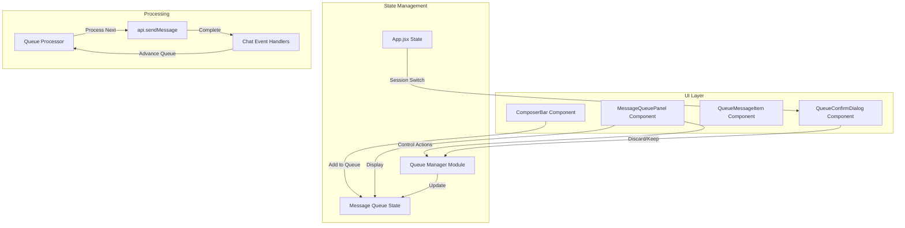
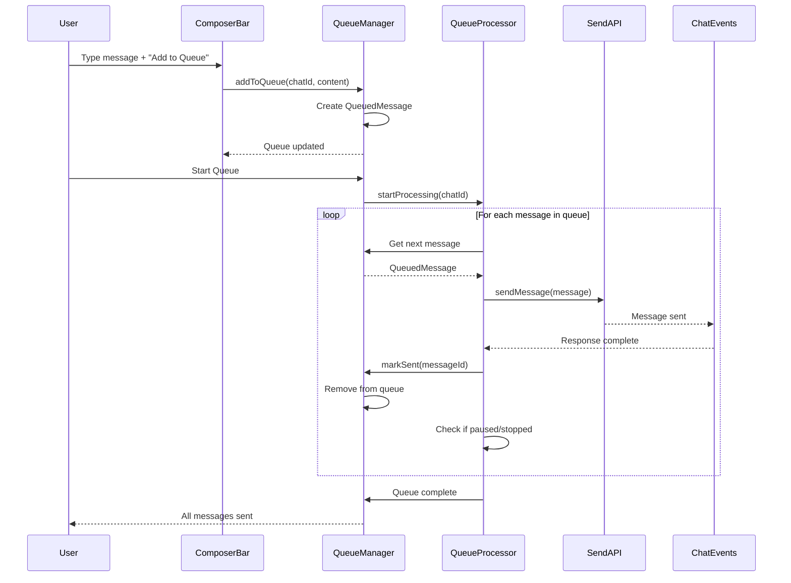

# Plan: User Message Queue Implementation

**Date:** 2026-02-16  
**Requirements:** [req-message-queue.md](../../reqs/2026-02-16/req-message-queue.md)  
**Target:** Electron Desktop App  
**Estimated Effort:** 8-12 hours

---

## Architecture Review (AR)

**Review Date:** 2026-02-16  
**Status:** ✅ Approved with Revisions

### Critical Issues Identified

#### 1. **Race Condition: Response Completion Detection** (HIGH PRIORITY)
**Issue:** The plan relies on monitoring `pendingResponseSessionIds` state changes, but this creates a timing dependency. If the queue processor checks the state between when a message is sent and when the response starts, it might advance prematurely.

**Resolution:**
- Use a **completion callback pattern** instead of polling state
- When queue sends a message, register a one-time completion listener
- Listener triggers when response processing actually completes (not just starts)
- Add explicit `waitForResponse(chatId, messageId)` method that returns a Promise
- Better integration: Hook into existing chat event completion signals

**Updated Approach:**
```javascript
// In queue processor
async function processNextMessage(chatId) {
  const message = queueManager.getNext(chatId);
  await api.sendMessage(...);
  
  // Wait for response to complete via event-based promise
  await waitForResponseComplete(chatId);
  
  // Now safe to advance
  queueManager.markComplete(chatId, message.id);
}
```

#### 2. **State Synchronization Complexity** (MEDIUM PRIORITY)
**Issue:** Having separate queue manager module with its own state plus React state (`queueStateByChat`) creates dual source of truth. Changes must be manually synced.

**Resolution:**
- **Simplify:** Queue manager should be a **pure state container**, not have its own internal state
- All state lives in React (`useState` or `useReducer`)
- Queue manager becomes a **utility module** with pure functions
- Use `useReducer` pattern for complex queue state transitions

**Revised Architecture:**
```javascript
// Queue manager becomes pure utilities
const queueManager = {
  addMessage: (state, chatId, content) => { /* returns new state */ },
  removeMessage: (state, chatId, msgId) => { /* returns new state */ },
  getNext: (state, chatId) => { /* returns message */ }
};

// In App.jsx
const [queueState, dispatchQueue] = useReducer(queueReducer, initialState);
```

#### 3. **Missing Abort/Cancellation Mechanism** (HIGH PRIORITY)
**Issue:** Plan doesn't address how to cancel an in-flight message send when user clicks "Stop" or switches chats.

**Resolution:**
- Add `AbortController` support to queue processor
- Each message send gets a cancellation token
- Store active abort controllers in processor state
- On stop/switch, call `abortController.abort()`
- Handle abort errors gracefully (don't mark as failed message)

**Implementation:**
```javascript
// In processor
const abortControllers = new Map(); // chatId -> AbortController

async function startQueue(chatId) {
  const controller = new AbortController();
  abortControllers.set(chatId, controller);
  
  try {
    await processMessages(chatId, controller.signal);
  } catch (err) {
    if (err.name === 'AbortError') {
      // Clean cancellation, not an error
    }
  }
}
```

#### 4. **Multi-Agent Response Handling** (MEDIUM PRIORITY)
**Issue:** The app supports multi-agent responses. Plan doesn't clarify: does queue wait for ALL agents to respond, or just the primary agent?

**Resolution:**
- **Decision:** Queue waits for **all pending agent responses** to complete
- Reuse existing `pendingResponseSessionIds` logic (it already tracks this)
- Document this behavior clearly in requirements
- Consider adding option (future): "Wait for primary agent only" mode

### Recommended Improvements

#### Improvement 1: Simplify Architecture
**Current:** Queue Manager + Queue Processor as separate modules  
**Recommended:** Merge into single `useMessageQueue` custom hook

**Rationale:**
- Reduces complexity and indirection
- More idiomatic React pattern
- Easier to test (single responsibility)
- Better encapsulation of queue logic

**Revised Structure:**
```javascript
// electron/renderer/src/hooks/useMessageQueue.js
export function useMessageQueue(api, selectedSessionId) {
  const [queueState, dispatch] = useReducer(queueReducer, initialState);
  
  const addToQueue = useCallback((content) => { ... });
  const startQueue = useCallback(() => { ... });
  const pauseQueue = useCallback(() => { ... });
  // ... other controls
  
  return { queueState, addToQueue, startQueue, pauseQueue, ... };
}
```

#### Improvement 2: Better Error Recovery
**Current:** Pause queue on error, show retry/skip buttons  
**Enhanced:** Add exponential backoff retry logic

**Features:**
- Auto-retry failed messages (max 3 attempts)
- Exponential backoff between retries
- User can disable auto-retry per message
- Show retry count in UI

#### Improvement 3: Queue Persistence (Upgrade from Optional)
**Current:** In-memory only, lost on refresh  
**Recommended:** Add localStorage persistence for MVP

**Rationale:**
- Minimal implementation cost (JSON serialization)
- Huge UX improvement (survive accidental refresh)
- Easy to implement with `useEffect` sync
- Critical for queue with many messages

**Implementation:**
```javascript
useEffect(() => {
  // Save to localStorage on queue change
  localStorage.setItem('queue-state', JSON.stringify(queueState));
}, [queueState]);

// Load on mount
const [queueState, dispatch] = useReducer(
  queueReducer,
  loadFromLocalStorage() || initialState
);
```

### Architecture Refinements

#### Refined State Structure
```typescript
interface QueuedMessage {
  id: string;
  chatId: string;
  content: string;
  createdAt: string;
  status: 'pending' | 'editing' | 'sending' | 'sent' | 'error';
  errorMessage?: string;
  retryCount?: number;              // NEW: Track retry attempts
  lastAttempt?: string;             // NEW: ISO timestamp of last send attempt
}

interface SessionQueueState {
  chatId: string;
  messages: QueuedMessage[];
  currentIndex: number;
  status: 'idle' | 'running' | 'paused' | 'stopped';
  processingMessageId: string | null;  // NEW: Track which message is sending
  abortController: AbortController | null;  // NEW: For cancellation
}
```

#### Simplified Module Structure

**BEFORE:**
- `message-queue-manager.js` (state + logic)
- `queue-processor.js` (processing engine)
- Multiple React state pieces in App.jsx

**AFTER:**
- `hooks/useMessageQueue.js` (all queue logic)
- React state only in custom hook
- App.jsx just imports and uses the hook

### Integration Risk Mitigation

#### Risk: Conflict with Existing Concurrent Send
**Mitigation:**
- Queue processor checks `sendingSessionIds` before sending
- If session is already sending (manual send), pause queue
- Show notification: "Queue paused: message in progress"
- Resume when manual send completes

#### Risk: Queue State Corruption
**Mitigation:**
- Validate queue state on every operation
- Add state invariant checks in development mode
- Implement queue recovery from localStorage backup
- Add console warnings for invalid state transitions

### Updated Technical Decisions

#### Decision: Use Custom Hook Architecture
**Change from:** Separate manager and processor modules  
**Change to:** Single `useMessageQueue` custom hook

**Benefits:**
- Simpler mental model
- Better React integration
- Easier testing with React Testing Library
- Cleaner App.jsx code

#### Decision: Add localStorage Persistence
**Change from:** Optional future enhancement  
**Change to:** Include in MVP

**Benefits:**
- Minimal cost, high value
- Prevents frustrating data loss
- Enables longer queue workflows
- Professional UX expectation

#### Decision: Implement AbortController
**Change from:** Not mentioned in original plan  
**Change to:** Required for Phase 2

**Benefits:**
- Clean cancellation of in-flight requests
- No orphaned send operations
- Proper resource cleanup
- Enables responsive stop/switch

### Validation Checklist

- [x] No race conditions in response detection
- [x] Single source of truth for state
- [x] Proper cancellation mechanism
- [x] Multi-agent response handling defined
- [x] Error recovery strategy robust
- [x] State persistence prevents data loss
- [x] Integration with existing features clarified
- [x] Performance considerations addressed

### Approved Changes Summary

1. ✅ **Add completion callback pattern** instead of polling state
2. ✅ **Simplify to custom hook** instead of separate modules
3. ✅ **Add AbortController** for proper cancellation
4. ✅ **Add localStorage persistence** for MVP
5. ✅ **Clarify multi-agent wait behavior** in docs
6. ✅ **Add retry logic** with exponential backoff
7. ✅ **Add conflict detection** with manual sends

**Estimated Effort Adjustment:** 10-14 hours (increased for persistence + abort logic)

---

## Architecture Overview

### Core Components



### State Structure (Revised After AR)

```typescript
// Message Queue Item
interface QueuedMessage {
  id: string;                    // Unique queue item ID (UUID)
  chatId: string;                // Target chat session ID
  content: string;               // Message content
  createdAt: string;             // ISO timestamp
  status: 'pending' | 'editing' | 'sending' | 'sent' | 'error';
  errorMessage?: string;         // Error details if status is 'error'
  retryCount?: number;           // Track auto-retry attempts (max 3)
  lastAttempt?: string;          // ISO timestamp of last send attempt
}

// Queue State per Session
interface SessionQueueState {
  chatId: string;
  messages: QueuedMessage[];     // Ordered list of queued messages
  currentIndex: number;          // Index of message being processed (-1 if none)
  status: 'idle' | 'running' | 'paused' | 'stopped';
  processingMessageId: string | null;  // ID of message currently being sent
  abortController: AbortController | null;  // For cancellation support
  editingMessageId: string | null;     // ID of message being edited
}

// Global Queue State (Map of chatId -> SessionQueueState)
type QueueStateMap = Map<string, SessionQueueState>;

// Custom Hook Return Type
interface MessageQueueHook {
  queueState: QueueStateMap;
  addToQueue: (content: string) => void;
  removeFromQueue: (messageId: string) => void;
  updateInQueue: (messageId: string, content: string) => void;
  startQueue: () => void;
  pauseQueue: () => void;
  resumeQueue: () => void;
  stopQueue: () => void;
  retryMessage: (messageId: string) => void;
  skipMessage: (messageId: string) => void;
}
```

### Data Flow



## Implementation Phases (Revised After AR)

### Phase 1: Core Queue Custom Hook
**Goal:** Create unified queue state management with custom hook pattern

- [ ] Create `electron/renderer/src/hooks/useMessageQueue.js`
  - [ ] Define `QueuedMessage` and `SessionQueueState` types (JSDoc)
  - [ ] Create queue reducer function (`queueReducer`)
  - [ ] Define action types: ADD_MESSAGE, REMOVE_MESSAGE, UPDATE_MESSAGE, etc.
  - [ ] Implement `useMessageQueue(api, selectedSessionId)` custom hook
  - [ ] Add state initialization with `useReducer`
  - [ ] Add localStorage persistence (save on state change)
  - [ ] Add localStorage loading on mount with error handling
  - [ ] Add `addToQueue(content)` method
  - [ ] Add `removeFromQueue(messageId)` method
  - [ ] Add `updateInQueue(messageId, content)` method
  - [ ] Add `clearQueue()` method for current session
  - [ ] Add helper `getCurrentQueue()` to get current session's queue state

- [ ] Integrate hook into `App.jsx`
  - [ ] Import and initialize `useMessageQueue` hook
  - [ ] Pass `api` and `selectedSessionId` to hook
  - [ ] Extract queue methods and state from hook return
  - [ ] Add cleanup effect for world/session changes
  - [ ] Wire up queue methods to UI handlers

- [ ] Add unit tests for queue hook
  - [ ] Test reducer state transitions
  - [ ] Test localStorage save/load
  - [ ] Test adding/removing/updating messages
  - [ ] Test queue state persistence across re-renders

### Phase 2: Queue Processing Logic with Abort Support
**Goal:** Implement sequential message sending with cancellation

- [ ] Add processing logic to `useMessageQueue` hook
  - [ ] Add `startQueue()` method - Begin processing queue
  - [ ] Add `pauseQueue()` method - Pause after current message
  - [ ] Add `resumeQueue()` method - Continue from paused position
  - [ ] Add `stopQueue()` method - Cancel remaining messages
  - [ ] Implement `AbortController` creation per queue session
  - [ ] Implement sequential processing loop with async/await
  - [ ] Track `processingMessageId` in state during send
  - [ ] Handle send success: mark message as sent, remove from queue
  - [ ] Handle send failure: update error status, pause queue
  - [ ] Auto-advance to next message after completion
  - [ ] Add retry logic with exponential backoff (max 3 attempts)

- [ ] Implement response completion detection
  - [ ] Create `useResponseCompletion` custom hook
  - [ ] Monitor `pendingResponseSessionIds` state changes
  - [ ] Return Promise-based `waitForResponse(chatId)` function
  - [ ] Resolve promise when session exits pending state
  - [ ] Handle timeout case (60s max wait)
  - [ ] Reject promise on send failure

- [ ] Wire processing to App state
  - [ ] Connect queue processor to `api.sendMessage` IPC
  - [ ] Pass abort signal to send API (requires IPC enhancement)
  - [ ] Update queue status in UI based on processing state
  - [ ] Handle processing errors with status bar notifications

### Phase 3: Queue UI Components
**Goal:** Build user interface for queue management

- [ ] Create `MessageQueuePanel.jsx` component
  - [ ] Display queue for currently selected chat
  - [ ] Show queue status (idle/running/paused/stopped)
  - [ ] Show message count ("3 messages in queue")
  - [ ] Display queue controls (Start/Pause/Resume/Stop buttons)
  - [ ] Handle edge case: hide panel when queue is empty
  - [ ] Add collapsible/expandable behavior (optional)
  - [ ] Style with existing design system (sidebar colors)

- [ ] Create `QueueMessageItem.jsx` component
  - [ ] Display message content (truncated with expand option)
  - [ ] Show message status badge (pending/sending/error)
  - [ ] Show edit button (pencil icon)
  - [ ] Show delete button (X icon)
  - [ ] Highlight currently sending message
  - [ ] Highlight message being edited
  - [ ] Show error message if send failed
  - [ ] Add retry button for failed messages

- [ ] Integrate queue panel into `App.jsx` layout
  - [ ] Position queue panel in composer area (above composer)
  - [ ] Make queue panel sticky/visible when queue has messages
  - [ ] Ensure queue panel doesn't block message list
  - [ ] Add smooth show/hide transition
  - [ ] Ensure proper z-index layering

- [ ] Modify `ComposerBar.jsx` component
  - [ ] Add "Add to Queue" button next to send button
  - [ ] Add "Send Now" vs "Add to Queue" toggle (optional)
  - [ ] Update composer submit handler to support queue mode
  - [ ] Disable "Add to Queue" when composer is empty
  - [ ] Clear composer after adding to queue

### Phase 4: Queue Message Editing
**Goal:** Enable inline editing of queued messages

- [ ] Add edit mode state to queue manager
  - [ ] Track `editingMessageId` per chat
  - [ ] Add `startEdit(chatId, messageId)` method
  - [ ] Add `saveEdit(chatId, messageId, newContent)` method
  - [ ] Add `cancelEdit(chatId, messageId)` method
  - [ ] Update message status to 'editing' when edit starts

- [ ] Implement edit UI in `QueueMessageItem.jsx`
  - [ ] Replace content display with textarea when editing
  - [ ] Show Save/Cancel buttons in edit mode
  - [ ] Support Esc key to cancel edit
  - [ ] Support Cmd/Ctrl+Enter to save edit
  - [ ] Validate content before saving (non-empty)
  - [ ] Show character count (optional)

- [ ] Auto-pause on edit reached
  - [ ] In queue processor, check if next message is being edited
  - [ ] If editing, pause queue automatically
  - [ ] Show notification: "Queue paused: message being edited"
  - [ ] Resume queue only when user clicks Resume button
  - [ ] Preserve queue position after edit save/cancel

### Phase 5: Queue Controls Implementation
**Goal:** Wire up Start/Pause/Resume/Stop buttons

- [ ] Implement Start Queue
  - [ ] Button enabled only when queue has messages and status is 'idle'
  - [ ] Call `queueProcessor.startQueue(chatId)` on click
  - [ ] Update queue status to 'running'
  - [ ] Show visual feedback (spinner on first message)
  - [ ] Disable composer send button while queue is running (optional)

- [ ] Implement Pause Queue
  - [ ] Button enabled only when status is 'running'
  - [ ] Call `queueProcessor.pauseQueue(chatId)` on click
  - [ ] Wait for current message to complete
  - [ ] Update queue status to 'paused'
  - [ ] Show "Paused" badge on queue panel

- [ ] Implement Resume Queue
  - [ ] Button enabled only when status is 'paused'
  - [ ] Call `queueProcessor.resumeQueue(chatId)` on click
  - [ ] Continue from current position
  - [ ] Update queue status to 'running'

- [ ] Implement Stop Queue
  - [ ] Button enabled when status is 'running' or 'paused'
  - [ ] Show confirmation dialog: "Stop queue and discard remaining messages?"
  - [ ] Call `queueProcessor.stopQueue(chatId)` on confirm
  - [ ] Clear remaining messages from queue
  - [ ] Update queue status to 'stopped', then 'idle'
  - [ ] Keep successfully sent messages (don't remove from chat)

### Phase 6: Chat Switching Safety
**Goal:** Warn user when switching chats with active queue

- [ ] Create `QueueConfirmDialog.jsx` component
  - [ ] Modal dialog with title "Queue in Progress"
  - [ ] Message: "You have N queued messages. What would you like to do?"
  - [ ] Three buttons:
    - [ ] "Continue Queue Later" - Pause and switch
    - [ ] "Discard Queue" - Clear queue and switch
    - [ ] "Cancel" - Stay on current chat
  - [ ] Style as modal overlay with backdrop
  - [ ] Support Esc key to cancel

- [ ] Add queue check to `onSelectSession`
  - [ ] Before switching, check if current session has active queue
  - [ ] If queue status is 'running', auto-pause it
  - [ ] If queue has messages (pending or paused), show confirm dialog
  - [ ] If queue is empty or 'idle', switch immediately
  - [ ] Handle user's choice from confirm dialog

- [ ] Implement dialog actions
  - [ ] "Continue Queue Later": Pause queue, preserve state, switch chat
  - [ ] "Discard Queue": Clear queue via `queueManager.clearQueue()`, switch chat
  - [ ] "Cancel": Close dialog, stay on current chat
  - [ ] Ensure queue state is preserved per chat session

### Phase 7: Error Handling & Edge Cases
**Goal:** Handle failures and special scenarios gracefully

- [ ] Handle message send failures
  - [ ] Catch errors from `api.sendMessage`
  - [ ] Update message status to 'error'
  - [ ] Store error message in `QueuedMessage.errorMessage`
  - [ ] Pause queue on error
  - [ ] Show error in queue item UI
  - [ ] Add "Retry" button for failed messages
  - [ ] Add "Skip" button to continue queue without failed message

- [ ] Handle network/connection errors
  - [ ] Detect when app goes offline
  - [ ] Pause queue automatically
  - [ ] Show notification: "Queue paused: offline"
  - [ ] Resume queue when connection restored (manual)

- [ ] Handle session deletion with queue
  - [ ] In `onDeleteSession`, check if session has queued messages
  - [ ] Warn user if deleting session with pending queue
  - [ ] Clear queue state when session is deleted

- [ ] Handle world switching
  - [ ] Clear all queue states when world changes
  - [ ] Show warning if any chat has pending queues

- [ ] Handle rapid control clicks
  - [ ] Debounce Start/Pause/Resume/Stop buttons
  - [ ] Prevent double-clicking from causing duplicate actions
  - [ ] Show loading state on buttons during transitions

- [ ] Handle empty queue edge cases
  - [ ] Hide queue panel when last message is removed
  - [ ] Prevent starting empty queue
  - [ ] Handle queue becoming empty during processing

### Phase 8: Polish & UX Improvements
**Goal:** Refine user experience and visual feedback

- [ ] Add keyboard shortcuts
  - [ ] Cmd/Ctrl+Q: Add to queue instead of send
  - [ ] Cmd/Ctrl+Shift+Enter: Start queue
  - [ ] Escape: Stop queue (with confirmation)

- [ ] Add animations
  - [ ] Fade in/out queue panel
  - [ ] Slide animation for queue item removal
  - [ ] Pulse animation on currently sending message
  - [ ] Progress indicator during processing

- [ ] Add status notifications
  - [ ] Toast notification when queue completes
  - [ ] Toast notification when queue is paused
  - [ ] Toast notification on errors
  - [ ] Use existing `setStatusText` for status bar updates

- [ ] Improve accessibility
  - [ ] Add ARIA labels to all queue controls
  - [ ] Add keyboard navigation for queue items
  - [ ] Add focus management for edit mode
  - [ ] Ensure proper tab order

- [ ] Add visual polish
  - [ ] Use consistent icon set for queue controls
  - [ ] Add tooltip hints for all buttons
  - [ ] Show queue count badge on composer (optional)
  - [ ] Use color coding for queue status (green=running, yellow=paused)
 (Revised After AR)

**Decision:** Use custom hook with `useReducer` + localStorage persistence  
**Rationale:**
- Single source of truth (React state)
- Predictable state transitions via reducer
- localStorage prevents data loss on refresh
- Idiomatic React pattern
- Easier to test than separate modules

**Alternatives Considered:**
- Separate manager/processor modules: Rejected due to dual state sync issues
- Redux/Zustand: Overkill for this feature scope
- In-memory only: Rejected, persistence is critical for UX
- Database persistence: Too complex for MVP, localStorage sufficient

### Queue Processing Architecture (Revised After AR)

**Decision:** Use async/await loop with `AbortController` cancellation  
**Rationale:**
- Provides fine-grained control over processing
- Easy to pause/resume with state flags
- AbortController enables clean cancellation
- Integrates cleanly with existing async message sending
- Avoids complex state machine

**Alternatives Considered:**
- Async generator: More complex, no clear benefit over async/await looprator pattern with manual advancement  
**Rationale:**
- Provides fine-grained control over processing
- Easy to pause/resume
- Integrates cleanly with existing async message sending
- Avoids complex state machine

**Alternatives Considered:**
- Promise chain: Harder to pause/resume mid-chain
- Recursive approach: Stack overflow risk with large queues
- Worker thread: Unnecessary complexity for UI-bound task

### UI Component Placement

**Decision:** Place queue panel above composer bar  
**Rationale:** (Revised After AR)

**Decision:** Promise-based completion hook monitoring `pendingResponseSessionIds`  
**Rationale:**
- Avoids race conditions through Promise resolution
- Already tracks when session responses complete
- Reliable signal for queue advancement
- No need to duplicate tracking logic
- Integrates with existing concurrency support
- Async/await friendly API

**Implementation:**
```javascript
const { waitForResponse } = useResponseCompletion(pendingResponseSessionIds);

// In queue processor
await api.sendMessage(...);
await waitForResponse(chatId); // Promise resolves when response completes
// Now safe to Hook Integration (Revised After AR)**
   - Import `useMessageQueue` custom hook
   - Import `useResponseCompletion` custom hook
   - Initialize queue hook with `api` and `selectedSessionId`
   - Extract queue state and methods from hook
   - Add `showQueueConfirmDialog` state for chat switching
   - Add `pendingQueueSwitch` state for deferred navigation

2. **App.jsx - Effect Hooks**
   - Add effect to cleanup queue on world change
   - Add effect to clear queue on session deletion
   - Queue hook handles its own persistence internally

**Alternatives Considered:**
- Poll message list: Unreliable, race conditions possible
- Custom event system: Duplicates existing infrastructure
- Timeout-based: Unreliable, arbitrary delays

## Integration Points

### Existing Code Modifications

1. **App.jsx - State Addition**
   - Add `queueStateByChat` Map state
   - Add `queueManager` ref
   - Add `queueProcessor` ref
   - Add `showQueueConfirmDialog` state
   - Add `pendingQueueSwitch` state

2. **App.jsx - Effect Hooks**
   - Add effect to initialize queue manager
   - Add effect to initialize queue processor
   - Add effect to sync queue state with UI
   - Add effect to cleanup queue on world change
   - Modify `pendingResponseSessionIds` effect to notify processor

3. **ComposerBar.jsx - Props Addition**
   - Add `onAddToQueue` prop for queue mode
   - Add `queueMode` bo (Revised After AR)

1. **Custom Hooks**
   - `electron/renderer/src/hooks/useMessageQueue.js` - Main queue hook
   - `electron/renderer/src/hooks/useResponseCompletion.js` - Completion detection hook

2. **UI Components**
   - `electron/renderer/src/components/MessageQueuePanel.jsx`
   - `electron/renderer/src/components/QueueMessageItem.jsx`
   - `electron/renderer/src/components/QueueConfirmDialog.jsx`

3. **Component Exports**
   - Update `electron/renderer/src/components/index.js`

4. **Tests**
   - `tests/electron/useMessageQueue.test.js`
   - `tests/electron/MessageQueuePanel.test.jsx`
   - `tests/electron/QueueMessageItem
3. **Component Exports**
   - Update `electron/renderer/src/components/index.js`

4. **Tests**
   - `tests/electron/message-queue-manager.test.js`
   - `tests/electron/queue-processor.test.js`
   - `tests/electron/MessageQueuePanel.test.jsx`

## Testing Strategy

### Unit Tests
- [ ] Queue manager operations (add, remove, update)
- [ ] Queue processor state transitions
- [ ] Queue processor sequential advancement
- [ ] Error handling in processor
- [ ] Component rendering with different queue states

### Integration Tests
- [ ] End-to-end queue flow: add → start → complete
- [ ] Pause/resume during processing
- [ ] Edit message in queue
- [ ] Delete message during processing
- [ ] Chat switching with active queue

### Manual Testing Scenarios
- [ ] Queue 5 messages, start, verify sequential sending
- [ ] Queue 3 messages, pause after 1, resume
- [ ] Edit message #2 while queue running, verify auto-pause
- [ ] Delete message #3 while processing #2, verify skip
- [ ] Switch chat with queue, verify confirmation dialog
- [ ] Stop queue with 5 messages remaining, verify cancellation
- [ ] Send failure scenario, verify retry/skip options
- [ ] Empty queue edge cases

## Risks & Mitigations

| Risk | Impact | Mitigation |
|------|--------|------------|
| Queue gets out of sync with actual sending state | High | Use single source of truth; subscribe to existing state changes |
| User confusion about queue vs. immediate send | Medium | Clear visual distinction; tooltips; optional keyboard shortcuts |
| Queue processing blocks UI | Medium | Use async/await properly; show loading states |
| Large queues cause performance issues | Low | Limit queue size (e.g., max 50 messages); virtualize queue list |
| Browser refresh loses queue | Low | Accept for MVP; document limitation; add persistence in future |
| Complex interaction with existing concurrent send | High | Carefully integrate with `sendingSessionIds` and `pendingResponseSessionIds` |

## Performance Considerations

- Queue panel should render efficiently for up to 50 queued messages
- Use React.memo for QueueMessageItem to prevent unnecessary re-renders
- Debounce queue state updates to avoid excessive re-renders
- Lazy-load queue panel component (optional)
- Virtualized list for queues with >20 messages (optional enhancement)

## Accessibility Requirements

- All queue controls must have ARIA labels
- Queue status must be announced to screen readers
- Keyboard navigation must work for all queue operations
- Focus management during edit mode
- High contrast mode support for queue status indicators

## Documentation Needs

- [ ] Update user guide with queue feature section
- [ ] Add inline help tooltips for queue controls
- [ ] Create keyboard shortcuts reference
- [ ] Document queue limitations (no persistence, max size)

## Future Enhancement Hooks

Design with these potential enhancements in mind:

1. **Queue Persistence** - Add save/load to localStorage or DB
2. **Queue Templates** - Save common message sequences
3. **Drag-and-Drop Reordering** - Let users rearrange queue
4. **Conditional Queue** - Skip messages based on previous responses
5. **Queue Scheduling** - Start queue at specific time
6. **Multi-Session Queue** - Process queues across multiple chats
7. **Queue Import/Export** - Share queue configurations
 (Revised After AR):
- Phases 1-2: 4-5 hours (foundation + persistence + abort logic)
- Phases 3-5: 3-4 hours (UI and core features)
- Phases 6-7: 2-3 hours (safety and errors)
- Phase 8: 1-2 hours (polish)

**Total: 10-14 hours** (includes time for localStorage persistence and AbortController implementationeded
- [ ] Error recovery works for all failure scenarios
- [ ] Feature passes all manual test scenarios

## Implementation Order Recommendation

Execute phases in order 1→8 for incremental, testable progress:
1. Core state management foundation
2. Processing engine logic
3. Basic UI to visualize queue
4. Edit functionality
5. Control buttons
6. Chat switching safety
7. Error handling
8. Polish and refinement

Estimated timeline:
- Phases 1-2: 3-4 hours (foundation)
- Phases 3-5: 3-4 hours (UI and core features)
- Phases 6-7: 2-3 hours (safety and errors)
- Phase 8: 1-2 hours (polish)

**Total: 9-13 hours** (with buffer for unforeseen issues)
