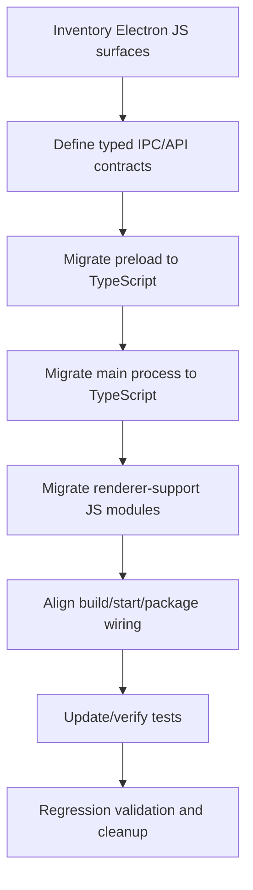

# Architecture Plan: Electron App TypeScript Migration

**Date**: 2026-02-17  
**Related Requirement**: `.docs/reqs/2026-02-17/req-electron-app-typescript-migration.md`

## Overview
Migrate Electron app code to TypeScript across main, preload, renderer-support modules, and Electron runtime wiring while preserving behavior parity, startup workflows, and test reliability.

## Architecture Decisions
- Use incremental migration with behavior lock instead of big-bang rewrite.
- Keep current runtime boundaries: renderer → preload bridge → main IPC handlers.
- Define shared IPC contract types in one canonical module and consume them on both sides.
- Preserve existing npm/electron commands and entry semantics from a user perspective.
- Validate migration with focused Electron tests before broader suite execution.
- Prioritize migration of remaining Electron renderer `.js`/`.jsx` modules, since main/preload are already TypeScript.

## AR Review Outcome (AP)
- **Status:** ✅ Approved for implementation with guardrails.
- **Guardrail 1:** No UX or feature expansion during migration.
- **Guardrail 2:** Prioritize compile-time contract safety at preload/main boundary.
- **Guardrail 3:** Keep migration reversible per phase (small PR-sized slices).
- **Guardrail 4:** Preserve existing developer commands and packaging assumptions.

## Scope Map
- **In scope:**
  - Electron main process runtime source and supporting modules.
  - Electron preload bridge source and payload/type surfaces.
  - Electron renderer-support JavaScript modules currently used by desktop UX/runtime.
  - Shared Electron IPC types and ambient typing needed for preload APIs.
  - Electron-focused tests affected by migration.
- **Out of scope:**
  - New product features, UX redesign, or non-Electron architecture changes.

## Current-State Validation (AR)
- Electron `main` and `preload` runtime sources are already TypeScript-authored.
- Shared IPC contracts are already TypeScript-authored and usable as canonical contract definitions.
- Primary migration scope is remaining Electron renderer-support `.js`/`.jsx` files and selected Electron JS support files.
- Certain JavaScript files may remain as tooling-specific config surfaces when TypeScript conversion is unnecessary.

## Migration Flow

## Implementation Phases

### Phase 1: Baseline and Inventory
- [x] Identify all JavaScript files in Electron scope and validate that main/preload runtime surfaces are already TypeScript.
- [x] Classify each file as migrate-now vs explicit exception (external/generated).
- [x] Capture baseline run behavior for electron startup/dev commands.
- [x] Capture baseline failing/passing Electron-focused tests before migration.

### Phase 2: Type Contracts First
- [x] Consolidate/normalize typed IPC channel contracts for request/response/event payloads.
- [x] Define typed preload API surface for `window` exposure and consumer usage.
- [x] Ensure renderer and main imports use the same contract source-of-truth.
- [x] Remove implicit `any` usage around IPC payloads in touched modules.

### Phase 3: Preload Migration
- [x] Validate preload TypeScript surface completeness against renderer consumption.
- [x] Preserve channel validation and bridge behavior exactly.
- [x] Keep preload exposed method names and runtime semantics stable.
- [x] Tighten global window augmentation typings and remove fallback `any` paths.

### Phase 4: Main Process Migration
- [x] Validate main-process TypeScript coverage for runtime entry and core orchestration modules.
- [x] Preserve app lifecycle behavior, window creation, IPC route wiring, and integration hooks.
- [x] Keep process startup order and side effects consistent.
- [x] Harden any remaining weakly typed edges in main-process integration points.

### Phase 5: Renderer-Support Migration
- [x] Convert Electron renderer-support JavaScript modules to TypeScript.
- [x] Convert Electron renderer JSX modules to TSX where migration is in scope.
- [x] Preserve desktop UX runtime behavior (streaming, activity, tool updates, message actions).
- [x] Replace broad `any` paths with explicit local types where feasible.
- [x] Keep component contracts and event flow unchanged for behavior parity.

Progress notes:
- 2026-02-17: Migrated first renderer-support slice from JS to TS:
  - `electron/renderer/src/activity-state.ts`
  - `electron/renderer/src/streaming-state.ts`
  - `electron/renderer/src/domain/chat-event-handlers.ts`
  - `electron/renderer/src/domain/desktop-api.ts`
  - `electron/renderer/src/domain/message-updates.ts`
  - `electron/renderer/src/domain/session-selection.ts`
  - `electron/renderer/src/domain/status-bar.ts`
- 2026-02-17: Removed superseded JS files for the migrated slice.
- 2026-02-17: Verified behavior parity with `npx vitest run tests/electron` (171 passed).
- 2026-02-17: Completed remaining renderer migration scope (`App/main`, hooks, constants/utils, and component suite) from JS/JSX to TS/TSX.
- 2026-02-17: Verified regression safety with full repo tests via `npm test` (88 files, 863 tests passed).

### Phase 6: Build, Script, and Packaging Alignment
- [x] Update Electron build/runtime wiring to resolve TypeScript outputs for main/preload.
- [x] Ensure existing npm scripts still operate from user perspective.
- [x] Verify Electron local startup works without undocumented manual steps.
- [x] Verify packaging/build commands remain operational with migrated sources.

### Phase 7: Test and Regression Validation
- [x] Update Electron-related tests to match migrated TypeScript file paths/types.
- [x] Keep unit tests in-memory and mock LLM calls where applicable.
- [x] Run focused Electron/preload/main test suites first, then broader project tests as needed.
- [x] Validate no behavior regressions in core desktop flows.

### Phase 8: Final Cleanup and Documentation
- [x] Remove superseded Electron JavaScript files that were migrated.
- [x] Document any intentionally retained JS files with rationale.
- [x] Update relevant docs for Electron TypeScript runtime expectations.
- [x] Record migration completion summary in done-doc step when requested.

## Risks and Mitigations
- **Risk:** Contract drift between renderer/preload/main during phased conversion.  
  **Mitigation:** Single shared IPC contract module and phase-gated compile/test checks.
- **Risk:** Startup regressions due to entry/wiring changes.  
  **Mitigation:** Baseline command verification before/after each migration phase.
- **Risk:** Hidden runtime `any` masking payload issues.  
  **Mitigation:** Tighten IPC and preload types first before broad file conversion.
- **Risk:** Test flakiness from path/extension changes.  
  **Mitigation:** Update tests alongside each migrated area, run focused suites early.

## Exit Criteria
- [x] All in-scope Electron runtime/support sources are TypeScript-authored (or explicitly documented exceptions).
- [x] Shared IPC and preload contracts are explicitly typed and consumed consistently.
- [x] Electron startup/dev/package workflows operate as expected.
- [x] Electron-focused tests pass for migrated behavior-critical areas.
- [x] No user-visible regression identified in core Electron workflows.
