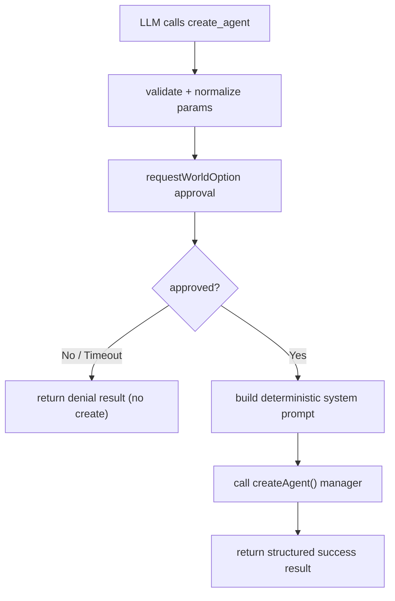

# Architecture Plan: Approval-Gated `create_agent` Built-in Tool

**Date**: 2026-02-19  
**Related Requirement**: `/Users/esun/Documents/Projects/agent-world/.docs/reqs/2026-02-19/req-create-agent-tool.md`

## Overview

Implement a new built-in tool `create_agent` that creates an agent only after explicit user approval, accepts required `name` plus optional `auto-reply`, `role`, and `next agent`, and generates a deterministic system prompt template.

## Architecture Decisions

- Add `create_agent` as a built-in tool in the existing built-in registry path (`getBuiltInTools()`), consistent with `load_skill`, `read_file`, and `shell_cmd`.
- Use existing generic HITL option runtime (`requestWorldOption`) for mandatory approval, avoiding new API/event protocols.
- Use canonical internal argument keys (`autoReply`, `role`, `nextAgent`) with alias normalization for user-requested spellings (`auto-reply`, `next agent`) and common variants (`auto_reply`, `next_agent`).
- Build system prompt in one deterministic formatter function to prevent drift across call paths.
- Default unresolved/omitted `next agent` to `human` (deterministic handoff target), while still allowing explicit override.
- Resolve new-agent `provider`/`model` from world-level `chatLLMProvider`/`chatLLMModel` when configured, with deterministic fallback only when world values are unset.

## AR Review Outcome (AP)

- **Status:** ✅ Approved for implementation.
- **Resolved 1:** Approval is enforced inside `create_agent` execution via HITL runtime; denied/timeout returns non-creation result.
- **Resolved 2:** Hyphen/space parameter names are aliases, not primary persisted field names.
- **Resolved 3:** Missing `next agent` defaults to `human` to avoid accidental agent-loop fan-out and keep deterministic behavior.
- **Resolved 4:** Tool implementation calls existing `createAgent()` manager function to preserve standard persistence behavior and CRUD event emission.
- **Resolved 5:** New agent provider/model inherit from world settings (`chatLLMProvider`/`chatLLMModel`) whenever present.

## Scope Map

- **In scope:**
  - New built-in `create_agent` tool definition + prompt formatter.
  - Built-in tool registry wiring.
  - Parameter alias normalization for create-agent argument variants.
  - Core tests for approval path, parameter handling, prompt formatting, and creation behavior.
- **Out of scope:**
  - UI redesign for approval prompts (reuse existing generic HITL prompt UX).
  - Changes to existing REST `/agents` API contract.
  - Refactors unrelated to tool creation/approval flow.

## Flow

## Implementation Phases

### Phase 1: New Tool Module
- [x] Add `core/create-agent-tool.ts` with function-based implementation.
- [x] Define tool schema with required `name` and optional `autoReply`, `role`, `nextAgent`.
- [x] Implement deterministic prompt builder:
  - `You are agent <name>. <You role is ...>`
  - blank line
  - `Always respond in exactly this structure:`
  - `@<next agent>`
  - `{Your response}`
- [x] Implement approval gate using `requestWorldOption(...)` with options:
  - `yes`
  - `no`
- [x] On approval, call `createAgent(worldId, params)` with deterministic defaults:
  - `type: "default"`
  - `autoReply: true` when omitted
  - `provider` = world `chatLLMProvider` when set; otherwise existing deterministic default (`openai`)
  - `model` = world `chatLLMModel` when set; otherwise existing deterministic default (`gpt-4`)
  - `systemPrompt` from formatter
- [x] Return structured success/denial/error results as deterministic JSON string payloads.

### Phase 2: Built-in Registry Wiring
- [x] Import `createCreateAgentToolDefinition` into `/Users/esun/Documents/Projects/agent-world/core/mcp-server-registry.ts`.
- [x] Register `create_agent` in `getBuiltInTools()` via `wrapToolWithValidation(...)`.
- [x] Keep existing built-in tools unchanged.

### Phase 3: Parameter Alias Normalization
- [x] Extend `/Users/esun/Documents/Projects/agent-world/core/tool-utils.ts` alias normalization to map:
  - `auto-reply` / `auto_reply` → `autoReply`
  - `next agent` / `next-agent` / `next_agent` → `nextAgent`
- [x] Ensure normalization is non-destructive and only applies when canonical key is absent.
- [x] Preserve existing alias behavior for other tools.

### Phase 4: Test Coverage
- [x] Add `/Users/esun/Documents/Projects/agent-world/tests/core/create-agent-tool.test.ts` covering:
  - missing `name` validation failure
  - approval denied path (no create call)
  - timeout/denial handling behavior
  - alias normalization for `auto-reply` and `next agent` variants
  - deterministic prompt content with/without optional `role` and `nextAgent`
  - world provider/model inheritance behavior (configured vs unset world values)
  - duplicate-agent error path passthrough
- [x] Update `/Users/esun/Documents/Projects/agent-world/tests/core/shell-cmd-integration.test.ts` to assert `create_agent` is present in built-ins.
- [x] Keep tests isolated with in-memory fixtures/mocks and no real LLM calls.

### Phase 5: Regression + Validation
- [x] Run targeted core tests for tool utils, built-in registry integration, and new create-agent tests.
- [x] Validate no regressions in existing load-skill approval behavior and existing agent create API flows.
- [x] Confirm deterministic output shape for success/denial/error results.

## Risks and Mitigations

- **Risk:** Parameter keys containing spaces/hyphens may be emitted inconsistently by models.  
  **Mitigation:** Canonical internal keys + alias normalization for multiple variants.
- **Risk:** HITL channel unavailable in non-interactive contexts.  
  **Mitigation:** Return explicit non-creation error/denial result rather than bypassing approval.
- **Risk:** Agent provider/model drift from world settings.  
  **Mitigation:** Resolve provider/model directly from world config at execution time and assert via unit tests.
- **Risk:** Prompt injection via free-form `role` text.  
  **Mitigation:** Normalize whitespace and bound role length before interpolating into system prompt.
- **Risk:** Agent ID collisions from duplicate names.  
  **Mitigation:** Keep manager-level collision checks as source of truth; surface clear error payload.

## Validation Plan

- [x] Unit tests pass for new tool behavior and alias normalization.
- [x] Built-in tool availability test includes `create_agent`.
- [ ] Manual smoke in web/CLI:
  - invoke `create_agent`
  - deny approval and verify no new agent appears
  - approve once and verify agent appears with expected system prompt template

## Exit Criteria

- [x] `create_agent` is discoverable as a built-in tool.
- [x] Approval is mandatory and enforced before creation.
- [x] Agent creation uses required parameter contract and deterministic defaults.
- [x] Generated system prompt matches required structure.
- [x] Tests for new behavior are in place and green.

## Progress Notes

- 2026-02-19: Implemented `core/create-agent-tool.ts` with approval-gated creation and deterministic prompt generation.
- 2026-02-19: Registered `create_agent` as a built-in tool via `core/mcp-server-registry.ts`.
- 2026-02-19: Added `create_agent` alias normalization (`auto-reply`, `next agent`) in `core/tool-utils.ts`.
- 2026-02-19: Added unit coverage in `tests/core/create-agent-tool.test.ts` and alias tests in `tests/core/tool-utils.test.ts`.
- 2026-02-19: Updated built-in integration assertions in `tests/core/shell-cmd-integration.test.ts`.
- 2026-02-19: Ran targeted tests: `npx vitest run tests/core/create-agent-tool.test.ts tests/core/tool-utils.test.ts tests/core/shell-cmd-integration.test.ts` (45 passed).
