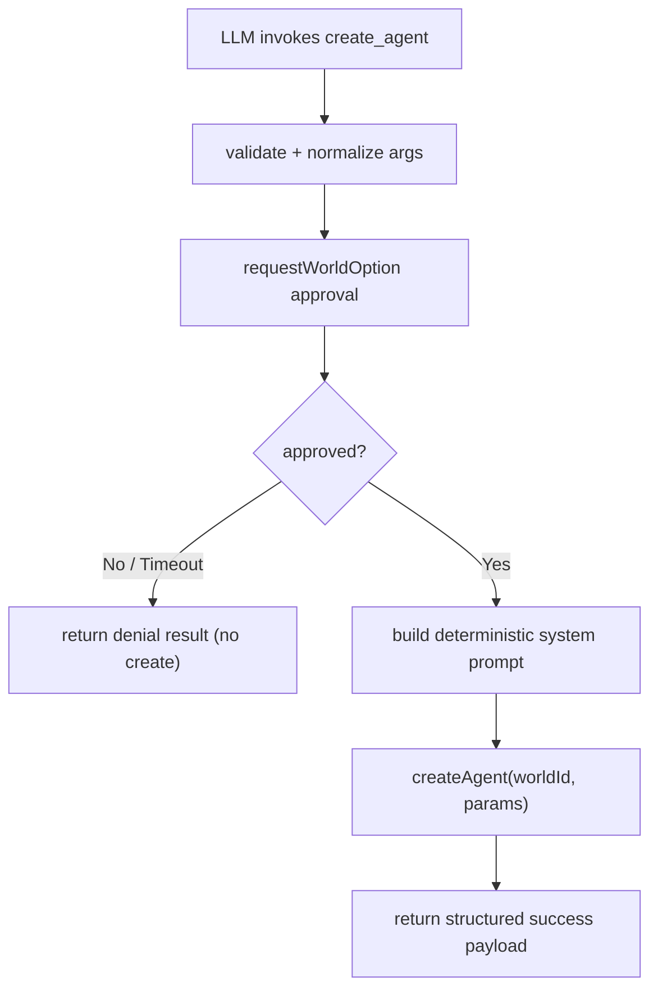

# Architecture Plan (Reset): Approval-Gated `create_agent` Built-in Tool

**Date**: 2026-02-20  
**Related Requirement**: `/Users/esun/Documents/Projects/agent-world/.docs/reqs/2026-02-19/req-create-agent-tool.md`

## Overview

Reset and redo the implementation plan for `create_agent` as a built-in tool that:
- requires explicit user approval before creation,
- accepts required `name` and optional `auto-reply`, `role`, `next agent`,
- and produces a deterministic system prompt shape required by the spec.

## Reset Notes

- This plan intentionally clears prior completion state and restarts execution tracking from zero.
- All checklists below are reset to pending (`[ ]`).
- Prior implementation notes should be treated as historical context, not current execution state.

## Architecture Decisions

- Keep `create_agent` as a built-in tool in `getBuiltInTools()` to match current built-in discovery behavior.
- Enforce approval using existing HITL option flow (`requestWorldOption`) rather than introducing a new approval protocol.
- Normalize input aliases to canonical runtime keys:
  - `auto-reply` / `auto_reply` -> `autoReply`
  - `next agent` / `next-agent` / `next_agent` -> `nextAgent`
- Generate system prompt through one deterministic formatter function to avoid drift.
- Default unresolved `nextAgent` to `human` for deterministic routing when omitted.
- Resolve provider/model from world settings (`chatLLMProvider`, `chatLLMModel`) when present; otherwise use existing deterministic defaults.
- Freeze prompt first-line variants to deterministic forms:
  - with `role`: `You are agent <name>. Your role is <role>.`
  - without `role`: `You are agent <name>.`

## AR Review Outcome

- **Date:** 2026-02-20
- **Status:** Approved after in-place spec tightening.
- **Fixed in AR:** Removed prompt-format ambiguity by specifying exact first-line output when `role` is omitted.
- **Fixed in AR:** Reconfirmed input alias handling as parse-time normalization only; canonical keys remain runtime/persistence contract.
- **Fixed in AR:** Reconfirmed deterministic `nextAgent` default to `human` as documented behavior.

## Scope Map

- **In scope:**
  - `create_agent` tool definition and handler behavior.
  - Built-in registry wiring and validation wrapping.
  - Alias normalization for optional parameter variants.
  - Tests for validation, approval, persistence behavior, and result payload.
- **Out of scope:**
  - New approval UX or protocol changes.
  - REST API contract redesign for `/agents`.
  - Unrelated core/runtime refactors.

## Flow

## Implementation Phases

### Phase 1: Tool Contract + Formatter
- [x] Define `create_agent` schema with required `name`.
- [x] Support optional inputs: `autoReply`, `role`, `nextAgent` (plus aliases via normalization layer).
- [x] Implement deterministic prompt formatter:
  - when `role` exists: `You are agent <name>. Your role is <role>.`
  - when `role` is missing: `You are agent <name>.`
  - blank line
  - `Always respond in exactly this structure:`
  - `@<next agent>`
  - `{Your response}`
- [x] Document deterministic default for missing `nextAgent` (`human`).

### Phase 2: Approval-Gated Execution Path
- [x] Add/confirm tool module implementation in `core/create-agent-tool.ts`.
- [x] Enforce approval before any write using `requestWorldOption` with explicit yes/no options.
- [x] Ensure denied/timeout branch never calls persistence and returns structured denial payload.
- [x] On approval, call manager-level `createAgent(...)` exactly once.

### Phase 3: Built-in Registry + Input Normalization
- [x] Wire tool in `core/mcp-server-registry.ts` using existing validation wrapper path.
- [x] Extend/confirm alias normalization in `core/tool-utils.ts` for `auto-reply` and `next agent` variants.
- [x] Preserve non-destructive normalization behavior (canonical key wins when already present).
- [x] Confirm no behavior regression for existing built-in tools.

### Phase 4: Persistence Defaults + Result Contract
- [x] Apply deterministic defaults:
  - `autoReply: true` when omitted
  - `type: "default"`
  - provider/model inherited from world settings when set
  - deterministic fallback provider/model when unset
- [x] Return structured success payload including created agent identity and effective settings.
- [x] Return clear structured error payload for validation/persistence conflicts (e.g., duplicate ID/name).
- [x] Guarantee no partial writes on failures.

### Phase 5: Tests + Validation
- [x] Add/confirm unit tests in `tests/core/create-agent-tool.test.ts` for:
  - missing/invalid `name`
  - approval denied and timeout behavior
  - alias normalization behavior
  - prompt formatting with and without optional fields
  - provider/model inheritance and fallback behavior
  - duplicate conflict error handling
- [x] Add/confirm built-in presence assertion in `tests/core/shell-cmd-integration.test.ts`.
- [x] Run targeted vitest suite for tool + registry + normalization.
- [ ] Execute manual smoke validation in web/CLI approval flow.

## Risks and Mitigations

- **Risk:** LLM emits non-canonical argument keys.  
  **Mitigation:** Central alias normalization before validation/persistence.
- **Risk:** Approval bypass in non-interactive or edge flows.  
  **Mitigation:** Keep approval check in tool execution path and fail closed on missing approval.
- **Risk:** Inconsistent provider/model on created agents.  
  **Mitigation:** Resolve effective model settings from world config at execution time and assert in tests.
- **Risk:** Prompt template drift across future edits.  
  **Mitigation:** Single formatter function + direct snapshot/string tests.
- **Risk:** Conflict errors partially persist state.  
  **Mitigation:** Keep manager create path as single write boundary and assert no-create on errors.

## Validation Plan

- [x] Automated: `create_agent` behavior tests pass with in-memory storage and mocked LLM usage.
- [x] Automated: built-in registry test shows `create_agent` discoverable in tool list.
- [ ] Manual: invoke `create_agent`, deny approval, verify no agent created.
- [ ] Manual: invoke `create_agent`, approve once, verify one agent created with required prompt structure.
- [ ] Manual: verify optional `role` and `next agent` values are reflected correctly.

## Exit Criteria

- [x] `create_agent` is discoverable as a built-in tool in standard world tool listing.
- [x] Approval is mandatory and denial/timeout paths do not create agents.
- [x] Required/optional input contract is enforced with clear validation errors.
- [x] Persisted agent settings and system prompt match requirement behavior.
- [x] Tests for tool behavior, alias normalization, and registry integration are passing.

## Progress Notes

- 2026-02-20: Plan reset requested; execution tracking restarted with all tasks pending.
- 2026-02-20: Implemented `core/create-agent-tool.ts` with mandatory HITL approval, deterministic prompt generation, and structured result payloads.
- 2026-02-20: Registered built-in `create_agent` in `core/mcp-server-registry.ts`.
- 2026-02-20: Added alias normalization for `create_agent` optional input variants in `core/tool-utils.ts`.
- 2026-02-20: Added unit tests in `tests/core/create-agent-tool.test.ts` and normalization coverage in `tests/core/tool-utils.test.ts`.
- 2026-02-20: Added built-in availability assertion for `create_agent` in `tests/core/shell-cmd-integration.test.ts`.
- 2026-02-20: Ran targeted tests: `npx vitest run tests/core/create-agent-tool.test.ts tests/core/tool-utils.test.ts tests/core/shell-cmd-integration.test.ts` (47 passed).
