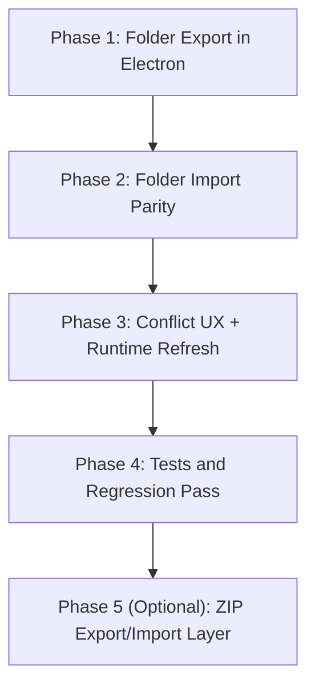

# Architecture Plan: Electron World Import/Export Parity

**Date**: 2026-02-19  
**Related Requirement**: `/Users/esun/Documents/Projects/agent-world/.docs/reqs/2026-02-19/req-electron-world-import-export-parity.md`

## Overview

Implement Electron world save/export and import flows with CLI-parity semantics for folder-based world transfer, then add optional ZIP packaging as a UX layer. Preserve canonical file-storage world structure and existing runtime behavior.

## Architecture Decisions

- Folder-based world format remains canonical (`config.json`, `agents/`, `chats/`, events).
- Electron import/export mirrors CLI data movement semantics (copy world + agents + chats + events) with export constrained to file-storage output.
- Import adds into existing storage and performs conflict checks on both `id` and `name`.
- ZIP support is an optional transport layer built on top of folder import/export, not a schema change.
- Keep implementation inside existing Electron IPC/preload/renderer boundaries.

## AR Review Outcome (AP)

- **Status:** ✅ Approved for phased implementation.
- **Guardrail 1:** Phase 1 must ship complete folder parity before ZIP work starts.
- **Guardrail 2:** No storage schema/version changes.
- **Guardrail 3:** Preserve current world/session selection behavior after save/import operations.
- **Guardrail 4:** Renderer must surface explicit, actionable conflict and validation errors.

## Scope Map

- **In scope:**
  - Electron main-process world import/export handlers.
  - Shared IPC contracts/routes and preload bridge methods.
  - Renderer world-management actions and sidebar controls for export.
  - Electron-focused tests for route wiring, preload bridge, and handler behavior.
- **Out of scope:**
  - Core storage schema changes.
  - CLI behavior changes (only alignment/reference).
  - Non-world backup formats beyond optional ZIP.

## Delivery Flow

## Implementation Phases

### Phase 1: IPC Surface for Export
- [x] Add new world export invoke channel in shared contracts.
- [x] Wire new route in main IPC route builder.
- [x] Add preload bridge method for export action.
- [x] Extend renderer typed API usage for new export method.

### Phase 2: Main-Process Export Implementation (CLI Parity)
- [x] Implement export handler in Electron main-process using storage factory semantics equivalent to CLI `performWorldSave`.
- [x] Use file-storage export and destination directory selection via dialog flow.
- [x] Write world data as `<targetDir>/<worldId>/...` (canonical world folder).
- [x] Copy world config, agents, chats, and events when available.
- [x] Return structured success payload (path, storage type, counts) and structured failure payload.

### Phase 3: Main-Process Import Rework (World Folder Semantics)
- [x] Replace `/.world` marker-based validation with world-folder structure validation (`config.json`, optional `agents/`, optional `chats/`, optional events artifacts).
- [x] Load source world from selected world folder via parent-root mapping:
  - selected folder path = `<sourceRoot>/<worldId>`
  - initialize file storage with `rootPath=<sourceRoot>`
  - load world using `worldId = basename(selected folder path)`
- [x] Copy imported world data into existing runtime storage (do not replace unrelated data).
- [x] Preserve compatibility with current world list/load flows.

### Phase 4: Conflict Detection and UX Consistency
- [x] Add conflict detection for both world `id` and world `name` against target storage.
- [x] Add explicit overwrite/replace confirmation handling path with cancel-safe behavior, identifying the specific existing world that will be replaced.
- [x] Ensure clear conflict messaging indicates conflict type (`id`, `name`, or both).
- [x] Ensure successful import/export updates renderer status and world/session state predictably.

### Phase 5: Renderer Wiring
- [x] Add export action trigger near existing world management controls (same area as import/create).
- [x] Add overwrite dialogs/confirmations required by main handler contract.
- [x] Maintain existing hook/component structure (`useWorldManagement`, layout prop builders, sidebar component).
- [x] Keep UX stable for users who do not use import/export.

### Phase 6: Tests
- [x] Update Electron main IPC route tests for new export channel and payload routing.
- [x] Update preload bridge tests for new export method.
- [ ] Add/extend main handler tests for:
  - valid import from world folder
  - invalid folder structure rejection
  - id/name conflict detection
  - export success/failure payloads
- [x] Keep tests in-memory/mocked per project testing rules.

### Phase 7: Optional ZIP Layer
- [ ] Add export-to-zip packaging over canonical folder output.
- [ ] Add import-from-zip extraction path to temporary location.
- [ ] Reuse the same folder validation and conflict logic after extraction.
- [ ] Add cleanup for temporary extraction paths on success/failure.

## Risks and Mitigations

- **Risk:** Import validation false positives/negatives across world variants.  
  **Mitigation:** Make `config.json` required and keep `agents/`, `chats/`, and event artifacts optional.
- **Risk:** Incorrect storage root mapping when importing a single world folder causes false "world not found".  
  **Mitigation:** Resolve source root as parent directory and source worldId as selected-folder basename.
- **Risk:** Conflict handling ambiguity when `name` differs only by case.  
  **Mitigation:** Normalize and compare with explicit case policy documented in handler behavior.
- **Risk:** Event copy incompatibilities across storage backends.  
  **Mitigation:** Best-effort event transfer with explicit warning payloads, not hard failure.
- **Risk:** Overwrite flow may delete wrong world if conflict target is ambiguous.  
  **Mitigation:** Include concrete existing world ID/name/path in overwrite confirmation and response payload.
- **Risk:** Renderer/main contract drift during IPC expansion.  
  **Mitigation:** Update shared contracts first and enforce via existing route/preload unit tests.
- **Risk:** ZIP extraction introduces filesystem cleanup leaks.  
  **Mitigation:** Confine extraction to temp dir and always cleanup in finally blocks.

## Validation Plan

- [ ] Manual smoke: export file storage from Electron, import into clean workspace, verify agents/chats/events counts.
- [ ] Manual smoke: export file storage from Electron, re-open via imported world folder and verify load.
- [ ] Manual smoke: conflict prompts for duplicate `id` and duplicate `name`.
- [x] Automated: Electron tests covering route/bridge/handler updates pass.
- [ ] Automated: no regressions in existing Electron suite.

## Exit Criteria

- [x] Electron has working world export action with file-storage target.
- [ ] Electron import reads valid world folder structure and imports into existing storage.
- [ ] Import conflict checks include both `id` and `name`, with explicit user confirmation.
- [ ] World/session state remains consistent after import/export.
- [ ] Optional ZIP layer complete (if included in this release scope).

## Progress Notes

- 2026-02-19: Implemented export IPC channel wiring (`world:export`) across shared contracts, routes, preload bridge, and renderer hook/sidebar trigger.
- 2026-02-19: Implemented main-process export flow as file-storage-only, with destination folder picker and overwrite confirmation.
- 2026-02-19: Implemented import parity using world-folder validation (`config.json`), parent-root file storage mapping, and data copy (world/agents/chats/events).
- 2026-02-19: Implemented import conflict checks by both world `id` and `name` with explicit confirmation prompts.
