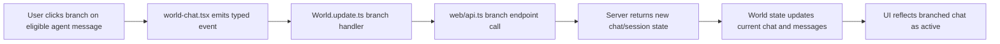

# Architecture Plan: Web MVP for Settings Route, Chat Search, and Chat Branching

**Date**: 2026-02-19  
**Type**: Feature Enhancement  
**Related Requirements**: `.docs/reqs/2026-02-19/req-web-mvp-settings-search-branch.md`

## Overview

Implement the minimum web MVP scope requested:
1. Enable the web `Settings` route.
2. Add chat-session search in web chat history.
3. Add branch-from-message behavior in web chat.

The plan keeps scope narrowly bounded to these three items and preserves existing web message/session behavior.

## Architecture Decisions

### Decision 1: Keep web routing in existing AppRun route table
- Update route registration in `web/src/main.tsx` to include `'/Settings'`.
- Reuse existing `Settings` page component (`web/src/pages/Settings.tsx`) without introducing new routing patterns.

### Decision 2: Implement session search as local UI state in Chat History component
- Add a local search input state inside `web/src/components/world-chat-history.tsx`.
- Filter existing `world.chats` by case-insensitive name match.
- Keep existing click handlers (`load`, `delete`, `new chat`) unchanged.

### Decision 3: Add web branch flow through existing typed-event + API pattern
- Add a typed event for branch action in `web/src/types/events.ts`.
- Add API client method in `web/src/api.ts` for branch endpoint usage.
- Add world update handler in `web/src/pages/World.update.ts` to call API, refresh world data/session state, and surface errors.
- Add branch action control in message UI (`web/src/components/world-chat.tsx`) only for eligible agent messages.

## AR Review Outcome

**Status**: Approved for implementation.

### Assumptions validated
- Web world state already supports chat switch/load behavior via existing events in `World.update.ts`.
- Web API client already centralizes chat mutations (send/edit/delete/stop/HITL), so branch fits the same integration style.
- Typed event union is the correct enforcement point to keep payload and handler contracts coherent.

### Tradeoff options considered
- Option A (selected): Add dedicated branch event + API call in web layer.
  - Pros: Clear behavior, minimal risk to existing flows, aligns with current architecture.
  - Cons: Adds one more event/API path to maintain.
- Option B: Piggyback on existing create/load chat events only.
  - Pros: Fewer new event names.
  - Cons: Blurs responsibilities and makes branch semantics implicit/harder to test.

### High-priority risk checks
- Risk: Branch button appears on non-eligible messages.
  - Mitigation: Reuse existing role/type helper logic in `world-chat.tsx` and gate action by agent-message eligibility only.
- Risk: Chat selection does not switch after successful branch.
  - Mitigation: In handler, update selected/current chat from branch API response and reload world/chat state consistently.
- Risk: Search filtering disrupts click/delete actions.
  - Mitigation: Filter view list only; keep original chat object payloads for action handlers.

## Target Files

- `web/src/main.tsx`
- `web/src/components/world-chat-history.tsx`
- `web/src/components/world-chat.tsx`
- `web/src/types/events.ts`
- `web/src/pages/World.update.ts`
- `web/src/api.ts`
- `web/src/styles.css`
- `server/api.ts`
- `tests/web-domain/*` (add/update focused tests for branching and history search)

## Data Flow

## Implementation Phases

### Phase 1: Routing and UI Search Foundation
- [x] Enable `'/Settings'` route registration in `web/src/main.tsx`.
- [x] Add search input UI to `web/src/components/world-chat-history.tsx`.
- [x] Add local, case-insensitive filter logic for chat titles.
- [x] Verify filtered list still supports load/delete/new chat actions.

### Phase 2: Branching API + Event Contract
- [x] Add branch API method to `web/src/api.ts` with input validation.
- [x] Add typed event variant for branch action in `web/src/types/events.ts`.
- [x] Add branch event handler in `web/src/pages/World.update.ts`.
- [x] Ensure success path selects new chat and refreshes state.
- [x] Ensure failure path preserves current chat and reports error.

### Phase 3: Branch UI Integration
- [x] Add branch action button in `web/src/components/world-chat.tsx`.
- [x] Gate rendering to eligible agent messages only.
- [x] Wire button to emit new typed branch event with required payload.

### Phase 4: Validation and Regression Safety
- [x] Add/update focused tests for chat-history search behavior.
- [x] Add/update focused tests for branch action event/handler behavior.
- [x] Run targeted test suites for changed web-domain behaviors.
- [x] Run typecheck/tests and resolve regressions.

### Phase 5: Post-Implementation Follow-Ups (User Requested)
- [x] Replace message action emoji buttons (edit/delete/branch) with SVG icons.
- [x] Move chat-history new-chat control to the right side of search input and make it icon-only.
- [x] Tune spacing around chat-history search and new-chat controls.
- [x] Update World page sizing to 90% viewport width.
- [x] Implement 75% visual scale behavior and adjust to avoid layout overflow regressions.
- [x] Harden branch endpoint status mapping (`404`/`400`/`500`) while preserving raw error text response.

## Test Strategy

- Unit-level and domain-focused tests in `tests/web-domain` for:
  - search filter behavior (empty query, case-insensitive matching, no-match state),
  - branch handler success/failure behavior,
  - state transition to new chat on success.
- Preserve existing message send/stop/edit/delete coverage and avoid unrelated test rewrites.

## Scope Guardrails

- Do not add workspace/folder management features.
- Do not add full Electron settings parity (theme/storage/skills) in this MVP.
- Do not refactor unrelated components or event domains.

## Completion Notes

- MVP requirements 1+2+3 were implemented and verified.
- Additional user-requested UI refinements (icon actions, right-panel controls, world scaling) were completed after MVP.
- CR follow-up backend hardening was applied to branch endpoint status mapping without changing raw error text behavior.
