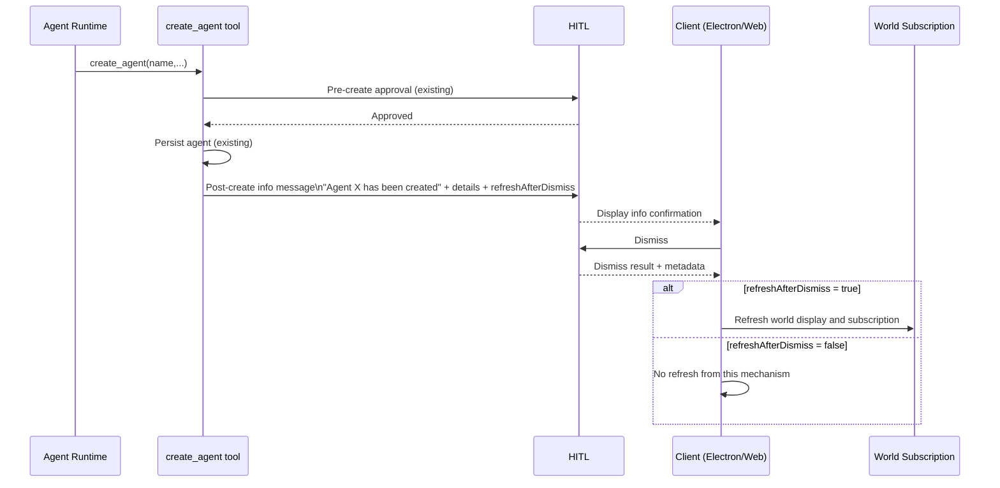

# Plan: `create_agent` Post-Create HITL Info Notice + Refresh Flag

**Requirement:** [req-create-agent-hitl-created-notice-refresh.md](../../reqs/2026-02-20/req-create-agent-hitl-created-notice-refresh.md)
**Date:** 2026-02-20

## Context

`create_agent` already performs pre-create approval and persistence, but does not consistently provide a post-create confirmation interaction that carries an explicit refresh-after-dismiss signal. This plan adds a deterministic post-create HITL info step and wires refresh intent handling end-to-end.

AR refinement: for successful `create_agent` confirmations, `refreshAfterDismiss` is treated as deterministic (`true`) and refresh handling must be idempotent.

## Affected Areas

```
core/create-agent-tool.ts                        — emit post-create HITL informational interaction payload
core/hitl.ts                                     — ensure info interaction type supports dismiss + metadata flag
core/types.ts                                    — typed payload support for refresh-after-dismiss flag
core/events/* (publisher/orchestrator/memory)    — preserve/forward info payload and dismissal outcome
electron/main-process/ipc-handlers.ts            — handle refresh intent after confirmation dismissal
electron/renderer/src/hooks/*                    — trigger world/subscription refresh on dismissal when flagged
web/src/* (if parity required)                   — apply same dismissal refresh behavior for web runtime
tests/core/create-agent-tool.test.ts             — success path includes info confirmation payload contract
tests/electron/main/* + renderer/*               — dismissal with true flag triggers refresh; false does not
```

## Interaction Flow



## Phases and Tasks

### Phase 1 — Define payload contract
- [x] Add/extend typed HITL info payload shape for post-create confirmation details.
- [x] Add explicit boolean field for refresh intent after dismissal (`refreshAfterDismiss`).
- [x] Set `refreshAfterDismiss = true` for successful `create_agent` confirmations.
- [x] Ensure backward compatibility for existing HITL payload consumers.

### Phase 2 — Tool-side post-create info message
- [x] Update `create_agent` success path to enqueue/emit post-create HITL info confirmation.
- [x] Include required message text pattern: `Agent <name> has been created`.
- [x] Include effective creation details in payload (name + key settings used).
- [x] Ensure this info confirmation is emitted only on successful create.
- [x] Ensure this info confirmation is emitted at most once per successful create call.

### Phase 3 — Dismissal and refresh behavior wiring
- [x] Ensure dismissal outcome is observable by client handlers.
- [x] Wire client-side handling to refresh world display/subscription only when `refreshAfterDismiss === true`.
- [x] Ensure `refreshAfterDismiss === false` does not trigger refresh via this path.
- [x] Make refresh invocation idempotent to prevent duplicate subscription resets.
- [x] Keep existing denial/failure behaviors unchanged.

### Phase 4 — Electron integration
- [x] Update Electron main/renderer handlers to consume post-create info payload.
- [x] Trigger existing refresh utilities after dismissal when flagged.
- [x] Preserve current UX flow and avoid duplicate refresh operations.

### Phase 5 — Web parity (if applicable)
- [x] Verify whether web path consumes the same HITL interaction events.
- [x] Implement equivalent refresh-on-dismiss behavior for web when flag is true.
- [x] Confirm no-op behavior when flag is false.

### Phase 6 — Validation
- [x] Add/adjust core tests for `create_agent` success payload and info confirmation emission.
- [ ] Add/adjust client integration tests for dismissal-driven refresh behavior (true vs false).
- [x] Add/adjust tests that assert at-most-once info confirmation emission.
- [ ] Add/adjust tests that validate idempotent behavior when dismissal handling is invoked repeatedly.
- [ ] Run `npm test` and verify no regressions in existing HITL/create-agent flows.

## Risks & Notes

- Existing HITL message schemas may be shared across features; changes should be additive to avoid regressions.
- Refresh can race with in-flight UI updates; refresh triggers should be idempotent/debounced where possible.
- If both runtime events and explicit API callbacks trigger refresh, guard against duplicate subscription resets.
- Keep message text deterministic so tests can assert exact user-visible confirmation behavior.

## Architecture Review Outcome (AR)

- Selected approach: emit a post-create HITL info confirmation with explicit refresh intent, and trigger refresh only after dismissal.
- Key resolved risk: duplicate refresh paths are handled via idempotent refresh logic and at-most-once confirmation emission.
- Scope decision: Electron path is required in this change; web parity remains an explicit follow-up check in Phase 5.
