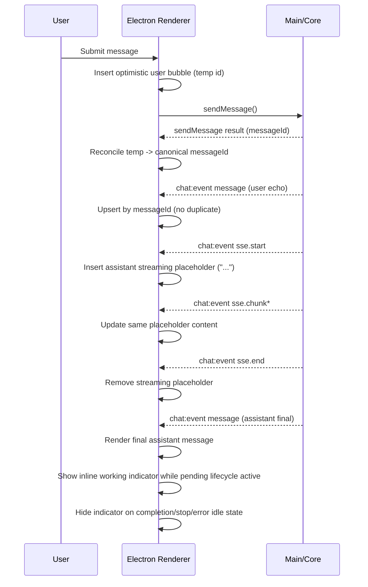

# Plan: Align Electron Message Display Flow with Web (Items 1, 2, 3, 5)

**Requirement:** [req-electron-web-message-display-flow.md](../../reqs/2026-02-20/req-electron-web-message-display-flow.md)  
**Date:** 2026-02-20

## Context

Electron currently differs from web behavior in four targeted areas:
- User message bubble is not shown optimistically on submit.
- Assistant placeholder is not shown on stream start.
- Stream lifecycle does not use the same placeholder start/end semantics as web.
- Inline working indicator is gated to a narrow phase (`calling LLM...`) rather than full pending lifecycle.

## Affected Files

```
electron/renderer/src/hooks/useMessageManagement.ts
electron/renderer/src/hooks/useStreamingActivity.ts
electron/renderer/src/domain/message-updates.ts
electron/renderer/src/domain/chat-event-handlers.ts
electron/renderer/src/App.tsx
electron/renderer/src/components/MessageListPanel.tsx
tests/electron/renderer/message-updates-domain.test.ts
tests/electron/renderer/chat-event-handlers-domain.test.ts
```

## Architecture Review (AR)

### Finding 1: Optimistic user message reconciliation race (high priority)
The backend `message` event and `sendMessage()` response can arrive in either order from the renderer perspective. If reconciliation assumes one fixed order, duplicate user bubbles can appear.

**Decision**
- Use a two-path reconciliation strategy:
  1. Optimistically insert a temporary user message immediately on submit.
  2. Reconcile by canonical backend `messageId` once available from either source:
     - `sendMessage()` response (`messageId`) or
     - realtime `message` event (`message.messageId`).
- If a final-ID message already exists when converting temp → final, remove/merge temp entry instead of duplicating.

### Finding 2: Text-only fallback can mis-handle identical consecutive sends (high priority)
Using message text as primary fallback matching can collapse two distinct user submissions when they have identical content.

**Decision**
- Use deterministic optimistic-message identity tracking (per-chat pending queue/map) as fallback correlation instead of text equality.
- Only use text as a last-resort safety check, never as the primary reconciliation key.

### Finding 3: Stream-end cleanup semantics and final message rendering
Web removes streaming placeholder on `end` and relies on final `message` event for persistent content.

**Decision**
- Mirror web semantics in Electron:
  - `start`: insert assistant placeholder (`...`)
  - `chunk`: update same placeholder
  - `end`: remove placeholder
  - final message comes from canonical `message` event
- Keep end/error handling idempotent so missing/late events do not leave stale state.

### Finding 4: Pending optimistic message actions can trigger invalid backend operations (high priority)
If optimistic user entries are rendered as regular persisted user messages, edit/delete controls can appear before a real backend `messageId` exists.

**Decision**
- Mark optimistic user entries as pending and keep edit/delete actions disabled/hidden until backend confirmation.

### Finding 5: Working indicator visibility scope
Current inline indicator visibility is tied to a phase string, not overall pending state.

**Decision**
- Make inline indicator visibility depend on session pending lifecycle (`hasComposerActivity`) to match web behavior and keep indicator visible through stream/tool phases.

No unresolved major architectural flaws remain after these decisions.

## Target Flow (After Change)



## Implementation Phases

### Phase 1 — Optimistic user bubble on submit
- [x] Add helper(s) in `message-updates.ts` for creating/reconciling optimistic user messages (pure functions).
- [x] In `useMessageManagement.ts`, insert optimistic user message immediately before awaiting `api.sendMessage(...)`.
- [x] Keep optimistic message tied to the active session chat ID.
- [x] Mark optimistic messages with explicit pending metadata to distinguish them from persisted user messages.
- [x] On successful `sendMessage`, reconcile temp entry with canonical `messageId` from invoke result.
- [x] On send failure, remove the optimistic entry and preserve current error handling/status text.

### Phase 2 — Robust user-message dedupe/reconciliation
- [x] Update chat message handling path to prevent duplicate user bubbles when echo and send-result arrive in either order.
- [x] Prefer canonical merge by `messageId`.
- [x] Add deterministic fallback merge path for temporary optimistic entries using pending optimistic identity tracking (not text-first matching).
- [x] Ensure reconciliation remains session-scoped.

### Phase 3 — Web-style assistant streaming placeholder lifecycle
- [x] Update `useStreamingActivity.ts` `onStreamStart` to insert assistant placeholder message (`content: '...'`, `isStreaming: true`).
- [x] Keep `onStreamUpdate` targeting that same `messageId` and progressively replacing placeholder content.
- [x] Update `onStreamEnd` to remove streaming placeholder for the target `messageId`.
- [x] Preserve error path behavior so stream errors clear pending stream state and annotate user-visible error when applicable.

### Phase 4 — Persistent inline working indicator
- [x] In `App.tsx`, change inline indicator visibility condition from phase-text-only gating to lifecycle gating (`selectedSessionId && hasComposerActivity`).
- [x] Ensure inline text falls back to `<agent> is working...` when phase text is unavailable.
- [x] Keep existing status/detail text when available (no regression in richer activity context).

### Phase 4b — Optimistic message action safety
- [x] In `MessageListPanel.tsx`, suppress edit/delete controls for pending optimistic user messages.
- [x] Ensure controls become available automatically once reconciliation marks the message as confirmed.

### Phase 5 — Test updates
- [x] Extend `tests/electron/renderer/message-updates-domain.test.ts` with optimistic-create/reconcile cases.
- [x] Extend `tests/electron/renderer/chat-event-handlers-domain.test.ts` with user-message dedupe scenarios covering both event orders.
- [x] Add test coverage for identical consecutive user-content submissions to ensure no collapse/duplication.
- [x] Verify existing `tests/electron/renderer/streaming-state.test.ts` expectations still pass with unchanged streaming-state core contract.

### Phase 6 — Verification
- [x] Run targeted renderer tests for updated domains.
- [ ] Manual UI verification:
  - [ ] User bubble appears immediately on submit.
  - [ ] Pending optimistic user bubbles hide edit/delete until backend confirmation.
  - [ ] Consecutive identical user messages remain distinct after reconciliation.
  - [ ] Assistant placeholder appears on stream start before first chunk.
  - [ ] Placeholder updates during chunking and does not duplicate on final message.
  - [ ] Inline working indicator stays visible for full pending lifecycle and clears on completion/stop/error.

## Risks & Mitigations

- **Risk:** Duplicate user messages from reconciliation race.
  - **Mitigation:** Canonical messageId merge plus temp-entry fallback merge.
- **Risk:** Distinct same-text user submissions collapse due to text-first matching.
  - **Mitigation:** Prefer deterministic optimistic identity tracking for fallback reconciliation.
- **Risk:** Users can trigger edit/delete against unpersisted optimistic entries.
  - **Mitigation:** Explicit pending flag and UI action suppression until confirmation.
- **Risk:** Indicator remains stuck if pending state is not cleared on edge paths.
  - **Mitigation:** Preserve existing stop/error cleanup paths and verify idle/activity transitions.
- **Risk:** Stream placeholder flicker around end/final message handoff.
  - **Mitigation:** Keep upsert-by-messageId final rendering path and validate ordering in manual checks.
