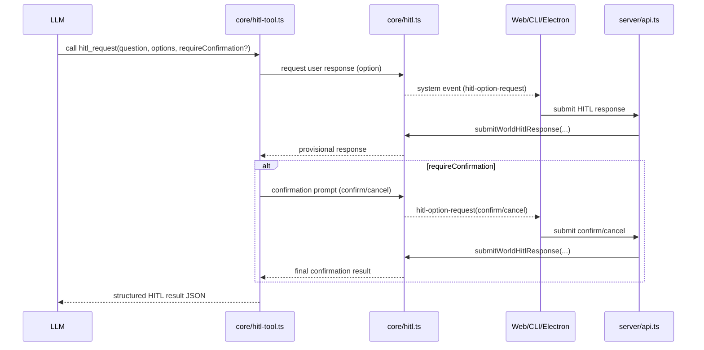

# AP: HITL LLM Tool (Options + Confirmation)

**Date:** 2026-02-20  
**Status:** Completed (implemented in SS)  
**Related REQ:** `.docs/reqs/2026-02-20/req-hitl-tool.md`

## Overview

Implement a built-in, LLM-callable HITL tool that supports:
- asking a human question,
- presenting selectable options,
- requiring explicit confirmation/cancel when requested,
- returning structured results for deterministic LLM continuation.

This plan builds on the existing option-based HITL runtime (`core/hitl.ts`) and preserves current `create_agent`/`load_skill` approval behavior.

Final implemented policy (2026-02-20 update):
- `hitl_request` is options-only (no free-text mode).
- HITL prompts render inline in message flow (not popup modal).
- While HITL prompt queue is non-empty, new chat sends are blocked in Web/Electron.

## Current Baseline

- Core already has option-based pending request runtime:
  - `requestWorldOption(...)`
  - `submitWorldOptionResponse(...)`
- Web/CLI/Electron already render and resolve `hitl-option-request` prompts.
- No built-in generic LLM tool currently exposes this interaction contract end-to-end.
- Existing response path is option-only; no first-class free-form answer submission contract.

## Target Contract

## Tool Name

- Primary built-in tool: `hitl_request`
- Compatibility alias (optional): `human_intervention_request` mapped to `hitl_request` in tool registration.

## Tool Input (WHAT)

- `question: string` (required)
- `options: string[]` (required; user selects one)
- `requireConfirmation?: boolean` (default `false`)
- `confirmationMessage?: string` (optional)
- `timeoutMs?: number` (optional)
- `defaultOption?: string` (optional, only for option mode)
- `metadata?: Record<string, unknown>` (optional audit context)

Validation rules:
- `options.length > 0` is required.
- Unsupported free-text arguments are rejected for `hitl_request`.
- Empty/duplicate options are rejected.
- If `defaultOption` is provided, it must match one option.

## Tool Result (WHAT)

Structured JSON result (stringified in tool output) with:
- `ok: boolean`
- `status: 'confirmed' | 'canceled' | 'timeout' | 'error'`
- `confirmed: boolean`
- `selectedOption: string | null`
- `source: 'user' | 'timeout' | 'system'`
- `requestId: string`
- `message?: string`

## End-to-End Flow

## Implementation Plan

## Phase 1: Core HITL Runtime Hardening

- [x] Keep runtime option-based (`requestWorldOption()`/`submitWorldOptionResponse()`) and avoid introducing free-text pathways.
- [x] Harden pending-request validation for option-only responses (`optionId` must be from allowed set).
- [x] Add request scoping validation to prevent unrelated fulfillment (world + request ID + chat scope checks where available).
- [x] Keep deterministic timeout behavior for option mode (`timeout` status; fallback to resolved default option).

## Phase 2: Built-In LLM Tool

- [x] Add `core/hitl-tool.ts` with `createHitlToolDefinition()` (function-based, no classes).
- [x] Register `hitl_request` in `core/mcp-server-registry.ts` built-in tools.
- [x] Implement tool execution pipeline:
  - collect option response via HITL runtime,
  - optionally run explicit confirmation step,
  - return structured JSON result.
- [x] Ensure invalid args return clear validation errors without side effects.
- [x] Enforce options-only policy by rejecting unsupported free-text arguments.

## Phase 3: API Contract Updates

- [x] Keep server validation schema in `server/api.ts` options-only for HITL responses.
- [x] Keep `POST /worlds/:worldName/hitl/respond` backward compatible for option-only clients.
- [x] Include `chatId` validation against pending request scope when provided.
- [x] Return explicit rejection reasons for invalid request scope or invalid option.

## Phase 4: Web Client Support

- [x] Keep parser support centered on option request envelopes (`hitl-option-request`).
- [x] Extend `web/src/types/index.ts` HITL prompt state for queue rendering.
- [x] Add/update UI in `web/src/pages/World.tsx` + `web/src/pages/World.update.ts` for:
  - inline option prompt card rendering in message flow,
  - confirmation prompt handling.
- [x] Update `web/src/api.ts` generic response call support.
- [x] Preserve existing option-only prompt behavior for current flows.
- [x] Block new message sends while HITL queue is non-empty.

## Phase 5: CLI Client Support

- [x] Extend `cli/hitl.ts` parsers/resolvers for option-based HITL envelopes.
- [x] Update `cli/index.ts` interaction loop to:
  - prompt for option selection when required,
  - handle confirmation/cancel explicitly.
- [x] Keep non-interactive pipeline behavior deterministic and safe (default to cancel for confirmation-required flows).

## Phase 6: Electron Client Parity

- [x] Extend Electron realtime parsing (`electron/main-process/realtime-events.ts`, renderer handlers) for option-based HITL envelopes.
- [x] Move HITL UX from popup modal to inline message-flow card.
- [x] Extend preload/main IPC contracts to support generic HITL responses while preserving option-response signatures.
- [x] Block new message sends while HITL queue is non-empty.

## Phase 7: Test Coverage

- [x] Core tests (`tests/core`) for:
  - option mode and confirmation-required mode,
  - confirmation required path,
  - timeout, cancel, invalid scope, and duplicate request handling.
- [x] Server/API tests for new validation/refinement paths.
- [x] Web domain/UI tests for parsing + queue + submit behavior.
- [x] CLI tests for parsing/selection and confirmation handling.
- [x] Electron tests for IPC payload evolution and renderer prompt handling.
- [x] Composer behavior tests for send-block while HITL is pending.

Unit-test constraints:
- Use in-memory storage only.
- Mock LLM calls (no real provider calls).

## Phase 8: Documentation

- [x] Update `docs/hitl-approval-flow.md` with LLM-callable `hitl_request` flow, route separation, and inline/send-lock behavior.
- [x] Add usage snippets to README/docs for tool input/output examples.

## Architecture Review (AR)

### High-Priority Issues Found

1. Scope integrity gap: current option response path does not strictly enforce chat-scoped fulfillment.
2. Confirmation ambiguity: “show confirmation” can degrade to informational-only unless explicit confirm/cancel semantics are encoded.
3. Non-interactive safety risk: auto-default behavior can unintentionally approve confirmation-required flows.
4. Interaction complexity risk: free-text prompts increase ambiguity and UI branching cost.
5. UX race risk: users can submit unrelated messages while HITL decision is pending.

### Resolutions Applied in This Plan

1. Add scope validation in HITL response resolution (world/request/chat checks).
2. Implement explicit confirmation step with `confirmed`/`canceled` final status when `requireConfirmation` is true.
3. For non-interactive paths, use deterministic safe behavior:
   - confirmation-required requests resolve to canceled/timeout, never implicit confirm.
4. Enforce options-only `hitl_request` contract for deterministic model-to-user decisions.
5. Block composer send actions while HITL queue is pending in Web/Electron.

### Tradeoffs

- Extend existing HITL runtime (selected)
  - Pros: reuse existing cross-client event plumbing and queue UX.
  - Cons: broader compatibility testing required.
- Build separate HITL runtime from scratch (rejected)
  - Pros: cleaner new abstraction.
  - Cons: duplicated infrastructure and higher regression risk.

## Rollout Strategy

- Ship behind a feature toggle if needed (`AGENT_WORLD_ENABLE_HITL_TOOL=true`) for staged validation.
- Keep existing `create_agent`/`load_skill` option flows untouched during initial rollout.
- Remove toggle after parity tests pass across Web/CLI/Electron.

## Acceptance Mapping to REQ

- REQ 1-4: Covered by Phases 1-4.
- REQ 5-9: Covered by Phases 2, 4, 5 (options-only validation and confirmation/cancel semantics).
- REQ 10-12: Covered by Phases 1, 3, and route-separation/runtime-scoping rules.
- REQ 13-14: Covered by Phases 4, 6, 7, and compatibility constraints.
