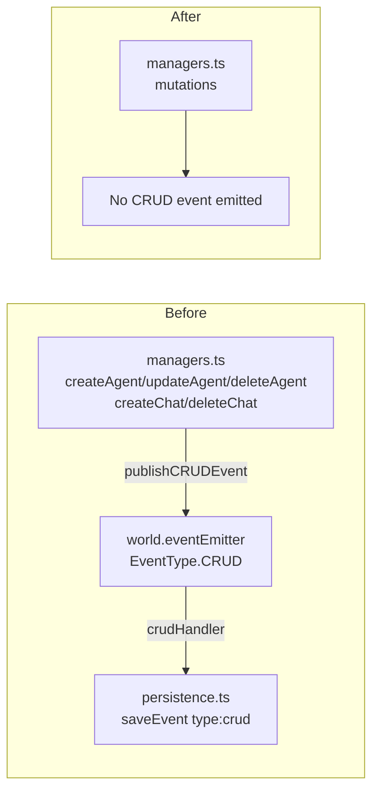

# Plan: Remove CRUD Events

**Requirement:** [req-remove-crud-events.md](../../reqs/2026-02-20/req-remove-crud-events.md)
**Date:** 2026-02-20

## Context

CRUD events (`type: 'crud'`) are emitted into the world's event emitter and persisted to storage, but are never forwarded to SSE clients, subscription clients, or the frontend. They exist solely as a persistence side-effect with no active consumer in the runtime pipeline.

## Affected Files

```
core/types.ts                                        — defines EventType.CRUD, WorldCRUDEvent, EventPayloadMap entry
core/events/publishers.ts                            — exports publishCRUDEvent()
core/events/persistence.ts                           — subscribes to CRUD, persists type:'crud' records
core/managers.ts                                     — 6 call sites (createAgent, updateAgent x2, deleteAgent, createChat, deleteChat)
tests/core/agent-auto-reply-runtime-sync.test.ts     — mocks + asserts publishCRUDEvent was called
tests/core/chatid-edit-isolation.test.ts             — stubs publishCRUDEvent in mock (no assertion)
```

Files with no CRUD involvement (no changes needed): `core/subscription.ts`, `core/events-metadata.ts`, `core/events/subscribers.ts`, `core/events/index.ts`, `server/sse-handler.ts`, `tests/integration/ws-integration.test.ts`

## Architecture Flow (Current vs. After)



## Phases and Tasks

### Phase 1 — Remove type definitions
- [x] `core/types.ts`: Remove `CRUD = 'crud'` from `EventType` enum
- [x] `core/types.ts`: Remove `[EventType.CRUD]: WorldCRUDEvent` entry from `EventPayloadMap`
- [x] `core/types.ts`: Delete `WorldCRUDEvent` interface

### Phase 2 — Remove publisher
- [x] `core/events/publishers.ts`: Remove `WorldCRUDEvent` import
- [x] `core/events/publishers.ts`: Delete `publishCRUDEvent()` function entirely

### Phase 3 — Remove persistence subscription
- [x] `core/events/persistence.ts`: Remove `WorldCRUDEvent` import
- [x] `core/events/persistence.ts`: Delete `crudHandler` function definition
- [x] `core/events/persistence.ts`: Remove `world.eventEmitter.on(EventType.CRUD, crudHandler)` call
- [x] `core/events/persistence.ts`: Remove `world.eventEmitter.off(EventType.CRUD, crudHandler)` call from cleanup
- [x] `core/events/persistence.ts`: Update file-header comment to remove CRUD mention

### Phase 4 — Remove call sites in managers
- [x] `core/managers.ts`: Remove `publishCRUDEvent` from import
- [x] `core/managers.ts`: Remove `publishCRUDEvent(...)` call in `createAgent`
- [x] `core/managers.ts`: Remove `publishCRUDEvent(...)` calls in `updateAgent` (2 call sites)
- [x] `core/managers.ts`: Remove `publishCRUDEvent(...)` call in `deleteAgent`
- [x] `core/managers.ts`: Remove `publishCRUDEvent(...)` call in `createChat`
- [x] `core/managers.ts`: Remove `publishCRUDEvent(...)` call in `deleteChat`

### Phase 5 — Update tests
- [x] `tests/core/agent-auto-reply-runtime-sync.test.ts`: Remove `publishCRUDEvent` vi.fn() declarations
- [x] `tests/core/agent-auto-reply-runtime-sync.test.ts`: Remove `publishCRUDEvent` from `vi.doMock` objects
- [x] `tests/core/agent-auto-reply-runtime-sync.test.ts`: Remove `expect(publishCRUDEvent).toHaveBeenCalled()` assertions
- [x] `tests/core/chatid-edit-isolation.test.ts`: Remove `publishCRUDEvent: vi.fn()` from mock object

### Phase 6 — Verify
- [x] Run `npm test` and confirm all tests pass
- [x] Confirm `grep -r 'EventType.CRUD'` returns no runtime results
- [x] Confirm `grep -r 'publishCRUDEvent'` returns no runtime results

## Risks & Notes

- **No data migration needed:** Removing emission only prevents new CRUD records from being written; existing persisted `type:'crud'` rows in storage are unaffected at query time (no schema drop required).
- **`core/events/index.ts`:** Uses `export *` from `publishers.ts`; once `publishCRUDEvent` is deleted from the source, the re-export disappears automatically — no manual change needed.
- **Test assertions removed:** The two `expect(publishCRUDEvent).toHaveBeenCalled()` assertions guard behavior that is being intentionally removed; they should be deleted entirely rather than replaced.
- **`WorldCRUDEvent` is only referenced by the publisher and persistence layer** — removing it after those two files are updated will leave no dangling type usage.
