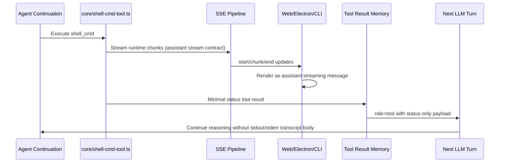

# Architecture Plan: Shell Cmd Assistant SSE Stream + Minimal Tool Result

**Date:** 2026-02-21  
**Type:** Feature Enhancement  
**Status:** SS In Progress (core flow + split stdout/stderr stream persistence + targeted regression tests complete)  
**Related:** [REQ](../../reqs/2026-02-21/req-shell-cmd-sse-assistant-stream-and-minimal-tool-result.md)

## Overview

Implement a split contract for `shell_cmd` execution:
- Runtime output chunks go to clients as assistant-stream content over SSE (not tool-message display payload).
- Final tool result returned to the LLM is reduced to a minimal success/failure status with completion code semantics (for example, exit code).

## Current-State Findings

1. `shell_cmd` currently emits runtime output as SSE `type: 'tool-stream'` from `core/shell-cmd-tool.ts`.
2. Web and Electron consume `tool-stream` through tool-specific rendering paths (tool-style output handling).
3. `shell_cmd` currently returns verbose markdown/json output to the LLM via `formatResultForLLM()` / `formatStructuredResult()` including stdout/stderr bodies.
4. Tool continuation persists this returned tool result into memory (`role: 'tool'`) and feeds it back into LLM continuation.

## Target Architecture

### AD-1: Separate Runtime Stream Contract from LLM Tool Result Contract
- Runtime stream path carries execution chunks to client-facing assistant stream UI.
- Tool result path carries only minimal completion status needed for LLM continuation.

### AD-2: Assistant-Stream Rendering for Shell Chunks
- Shell execution chunk events must be treated as assistant streaming content in client state, not as tool message content.
- Tool lifecycle events (`tool-start`, `tool-result`, `tool-error`) remain for activity/telemetry, but chunk bodies are not rendered as tool-message transcript.

### AD-3: Minimal LLM Tool Result Schema
- Define and use a compact shell tool result payload for LLM memory:
  - `status`: `success` | `failed`
  - `exit_code`: number | null
  - `timed_out`: boolean
  - `canceled`: boolean
  - `reason` (optional): normalized failure reason token
- Exclude stdout/stderr transcript bodies from the final tool result string/object returned to the LLM.

### AD-4: Backward-Compatible Event Transition
- Keep event compatibility where required during migration, but enforce that client-visible chunk transcript is assistant-stream based.
- Timeout extension logic currently tied to `tool-stream` must continue to work for the new assistant-stream route.

## Data Flow

## Implementation Phases

### Phase 1: Minimal Tool Result Contract (Core)

- [x] Add a dedicated formatter for shell status-only result in `core/shell-cmd-tool.ts`.
- [x] Ensure default `shell_cmd` return path uses minimal status contract (success/failure + exit semantics).
- [x] Preserve deterministic failure mapping for non-zero exit, timeout, cancellation, and thrown execution error.
- [x] Keep artifact/verbose output behavior out of LLM-facing default tool result contract for this flow.

### Phase 2: Runtime Chunk Routing as Assistant Stream

- [x] Update shell runtime chunk publishing path so client stream rendering can treat chunks as assistant stream content.
- [x] Ensure shell stream lifecycle has coherent `start`/`chunk`/`end` behavior for each execution/message ID.
- [x] Preserve chunk ordering and per-message isolation.
- [x] Maintain timeout-extension semantics currently dependent on shell stream activity.

### Phase 3: Web Client Rendering Alignment

- [x] Update `web/src/utils/sse-client.ts` handling so shell runtime chunks render through assistant streaming handlers (not tool stream message content path). (No web code change required after core event contract swap to `start/chunk/end`.)
- [x] Update `web/src/domain/sse-streaming.ts` so shell chunk display is not stored as tool-message transcript. (No web code change required after core event contract swap.)
- [x] Ensure no shell chunk transcript is emitted as tool-style display content. (Enforced by removing emitted `tool-stream` chunks from core shell runtime path.)
- [x] Validate stream completion behavior does not drop final shell transcript unexpectedly.

### Phase 4: Electron + CLI Alignment

- [x] Update Electron realtime SSE serialization/handling so shell chunks land in assistant stream rendering flow. (No renderer code change required; existing `start/chunk/end` flow applies after core event swap.)
- [x] Ensure Electron does not present shell chunk transcript as tool-stream message content. (Core no longer emits `tool-stream` chunks for shell runtime output.)
- [x] Update CLI streaming behavior to treat shell runtime chunks as assistant stream output semantics. (Existing chunk handler now receives shell runtime chunks.)
- [x] Keep operational logs/tool lifecycle summaries intact while avoiding transcript-as-tool-message rendering. (Tool lifecycle events preserved; timeout refresh checks updated.)

### Phase 5: Tool Lifecycle Metadata and Result Events

- [x] Keep `tool-result` event publishing but ensure its `result` field carries minimal status summary only.
- [x] Verify no large stdout/stderr body is propagated through tool-result metadata.
- [x] Confirm memory persistence and continuation consume only minimal shell result payload.

### Phase 6: Tests

- [x] Update/add unit tests for minimal shell result formatter (`tests/core/shell-cmd-format.test.ts` or dedicated test file).
- [x] Add/adjust tests for shell execution integration ensuring LLM-facing result is status-only.
- [x] Add event-routing tests for shell runtime chunks rendered as assistant stream and not tool message transcript.
- [x] Add regression tests for non-zero exit, timeout, and cancellation status mapping.

## File Scope (Expected)

- `core/shell-cmd-tool.ts`
- `core/events/memory-manager.ts` (if needed for status propagation consistency)
- `core/types.ts` (only if event contract additions are required)
- `server/sse-handler.ts` (if SSE translation/timeout hooks require updates)
- `web/src/utils/sse-client.ts`
- `web/src/domain/sse-streaming.ts`
- `electron/main-process/message-serialization.ts`
- `electron/renderer/src/domain/chat-event-handlers.ts`
- `electron/renderer/src/streaming-state.ts`
- `cli/stream.ts`
- Related tests under `tests/core`, `tests/e2e`, and UI-domain tests as needed

## Risks and Mitigations

1. **Risk:** Existing flows depend on verbose shell tool results.
   - **Mitigation:** Keep explicit status fields (`status`, `exit_code`, `timed_out`, `canceled`) so downstream logic remains deterministic.
2. **Risk:** Stream lifecycle mismatch causes dropped/removed shell output in UI.
   - **Mitigation:** Validate start/chunk/end behavior per client and add regression tests for completion rendering.
3. **Risk:** Timeout fallback regressions on long-running shell commands.
   - **Mitigation:** Preserve timeout extension trigger on shell chunk activity in server and CLI paths.
4. **Risk:** Duplicate rendering (assistant stream + tool transcript).
   - **Mitigation:** Enforce client rule: shell chunk transcript renders only via assistant stream path.

## Acceptance Mapping

- REQ runtime chunk behavior (`assistant SSE stream, no tool transcript chunk display`) is addressed by Phases 2-4.
- REQ minimal LLM tool result behavior (`success/failure + completion code semantics only`) is addressed by Phases 1 and 5.
- REQ failure state handling is addressed by Phases 1 and 6.

---

## Architecture Review (AR)

### AR Summary

Approved with one strict condition: do not merge until all client renderers and continuation result contracts are aligned, otherwise users will see mixed stream semantics or duplicate shell output.

### Options Considered

1. **Option A: Keep current tool-stream + verbose tool result (reject)**
   - Fails requirement for assistant-stream chunk rendering and minimal LLM result.

2. **Option B: Assistant-stream chunk routing + minimal tool result (recommended)**
   - Meets both runtime UX and continuation-contract requirements.
   - Requires cross-layer updates (core + server + clients + tests).

3. **Option C: Client-only UI remap while keeping verbose LLM tool result (reject)**
   - Partially solves display behavior but violates minimal tool-result contract.

### AR Decision

Proceed with **Option B**.

### AR Exit Criteria

- Shell runtime chunks are displayed as assistant stream content in supported clients.
- No shell runtime chunk transcript is rendered as tool-message transcript.
- LLM-facing `shell_cmd` tool result is status-only and excludes stdout/stderr transcript bodies.
