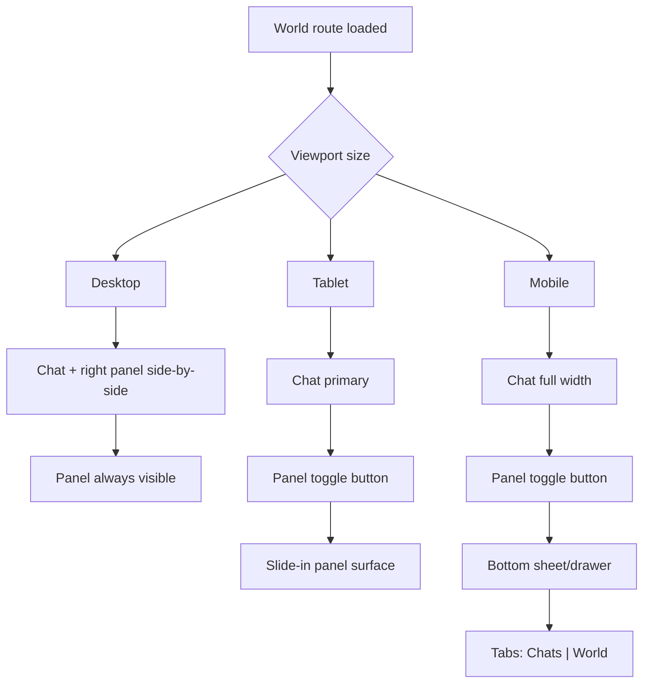

# Plan: Web World Right Panel Mobile-Friendly Behavior

**Requirement:** [req-web-world-right-panel-mobile-friendly.md](../../reqs/2026-02-21/req-web-world-right-panel-mobile-friendly.md)  
**Date:** 2026-02-21

## Context

The World page currently mixes fixed sizing, page-level scaling, and desktop-first column assumptions. This plan introduces a responsive panel architecture that keeps chat primary while preserving panel capabilities across desktop, tablet, and mobile.

## Affected Files

```
web/src/pages/World.tsx
web/src/components/world-chat-history.tsx
web/src/styles.css
web/src/types/index.ts
web/src/types/events.ts
tests/web-domain/* (new/updated responsive behavior tests as available)
```

## Architecture Review (AR)

### Finding 1: Fixed right-panel width and fixed world scaling reduce small-screen usability
Current layout uses fixed/favored desktop sizing patterns and page-scale behavior that can shrink touch targets and constrain chat space.

**Decision**
- Keep side-by-side layout for desktop only.
- Introduce responsive panel modes for tablet/mobile.
- Avoid page-level scale behavior for mobile panel/chat interaction surfaces.

### Finding 2: Mobile stacked layout can dilute panel discoverability and chat focus
Rendering the right panel as just another stacked block on small screens can push key actions below fold and compete with composer space.

**Decision**
- Use a toggleable mobile surface (sheet/drawer) for panel content.
- Keep main chat view dominant when panel is closed.

### Finding 3: Panel functionality split across header controls and history list needs explicit mobile information architecture
Without an explicit mobile structure, users can lose access to either history or world actions.

**Decision**
- Introduce mobile panel tabs/sections (`Chats`, `World`) inside the mobile panel surface.
- Keep behavior parity with desktop actions.

No unresolved major architectural flaws remain after these decisions.

## Target Viewport Behavior



## Implementation Phases

### Phase 1 — State and event model for responsive panel control
- [x] Add right-panel view state in `World.tsx` (`isRightPanelOpen`, `rightPanelTab`, optional `panelMode` derived from viewport).
- [x] Add events for open/close/toggle and tab switching.
- [x] Ensure defaults are viewport-aware (desktop open, smaller viewports closed by default).

### Phase 2 — Desktop layout hardening
- [x] Replace hardcoded panel width usage with responsive width constraints.
- [x] Keep desktop side-by-side behavior in normal layout flow (no overlay).
- [x] Verify chat area retains usable minimum width at desktop breakpoints.

### Phase 3 — Tablet responsive panel
- [x] Add tablet panel toggle affordance in World page top controls.
- [x] Render panel as slide-in surface on tablet when open.
- [x] Add backdrop/close interaction without breaking chat state.

### Phase 4 — Mobile panel surface and information architecture
- [x] Render panel as bottom sheet/drawer on mobile.
- [x] Provide mobile tab switch between `Chats` and `World` sections.
- [x] Ensure chat history actions and world actions remain reachable from mobile panel.

### Phase 5 — CSS cleanup for mobile reliability
- [x] Reduce/remove mobile-hostile fixed sizing and scaling behavior in `styles.css` for World layout.
- [x] Ensure no horizontal overflow at key breakpoints.
- [x] Keep composer visibility and tap usability stable with panel transitions.

### Phase 6 — Verification
- [x] Run static type verification for web workspace (`npm run check --workspace=web`).
- [ ] Manual verification at representative breakpoints:
  - [ ] Desktop: side-by-side layout, panel actions usable.
  - [ ] Tablet: panel toggle/open/close works, chat remains primary.
  - [ ] Mobile: sheet opens, tabs switch, composer remains reachable.
  - [ ] Orientation/resize: active world/chat context remains stable.
- [ ] Add or update targeted tests for panel state transitions and responsive behavior where harness exists.

## Risks and Mitigations

- **Risk:** Panel overlay can obscure composer or interfere with chat scrolling on mobile.
  - **Mitigation:** Constrain panel height and preserve explicit close behavior; validate with manual viewport checks.
- **Risk:** Responsive breakpoints diverge between CSS and component logic.
  - **Mitigation:** Centralize breakpoint assumptions and verify behavior matrix in testing.
- **Risk:** Existing chat history interactions regress when moved into mobile tabs.
  - **Mitigation:** Keep existing handlers/events unchanged and only recompose presentation/container behavior.
