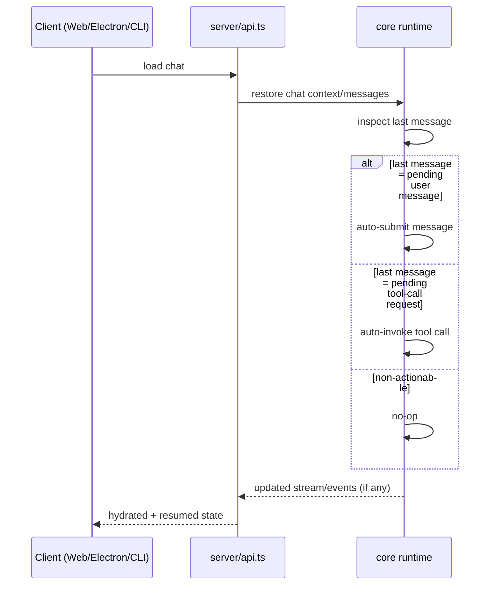

# AP: Auto-resume Pending Last Message on Chat Load

**Date:** 2026-02-24  
**Status:** Implemented  
**Related REQ:** `.docs/reqs/2026-02-24/req-chat-load-auto-resume.md`

**Last Updated:** 2026-02-25

## Overview

Implement deterministic chat-load continuation so the runtime automatically resumes the final pending turn in a loaded chat:
- If the last message is a pending user message, submit it automatically.
- If the last message is a pending tool-call request, invoke the tool automatically.

The change is scoped to load-time continuation behavior and must preserve ordering/history semantics while avoiding duplicate execution.

## Current Baseline

- Chat load/restore rehydrates message history and event context.
- Runtime currently requires manual re-trigger for some pending final states.
- Tool execution and message submission paths already exist for normal live flow.
- Duplicate execution prevention is handled in specific runtime paths but not explicitly enforced for load-time auto-resume.

## Target Behavior

1. On each chat-load event, inspect the loaded chat’s last message.
2. If last message is a pending user message, auto-submit it exactly once for that load event.
3. If last message is a pending tool-call request, auto-invoke it exactly once for that load event.
4. If last message is not actionable, perform no follow-up action.
5. Preserve existing message ordering and event semantics.
6. Do not create duplicate submissions/tool invocations for a single load event.

## End-to-End Flow



## Affected Areas

```
server/api.ts                                  — chat load/restore entry and resume trigger point
core/message-processing-control.ts             — continuation guardrails and submit path integration
core/message-prep.ts / core/events/*           — preserve event ordering/semantics during resume
core/tool-utils.ts / tool-call orchestration   — auto-invoke pending tool-call request path
web/*, electron/*, cli/*                       — verify no client-side duplicate trigger on rehydrate
tests/server/*                                 — load-time auto-resume behavior
tests/core/*                                   — pending-state detection and no-duplicate guarantees
```

## Phases and Tasks

### Phase 1 — Locate authoritative pending-state signals
- [x] Identify where pending user-message state is represented at load time.
- [x] Identify where pending tool-call-request state is represented at load time.
- [x] Define the single authoritative "actionable last message" decision rule.

### Phase 2 — Add load-time auto-resume decision/execution
- [x] Add chat-load hook to inspect last message immediately after restore.
- [x] Route pending user-message case to existing submit pipeline.
- [x] Route pending tool-call-request case to existing tool invocation pipeline.
- [x] Ensure non-actionable last messages are strict no-op.

### Phase 3 — Idempotency and ordering protection
- [x] Enforce once-per-load-event guard for auto-resume action.
- [x] Prevent duplicate execution when clients reconnect/reload rapidly.
- [x] Validate ordering/event-history semantics remain unchanged.

### Phase 4 — Tests
- [x] Server test: load chat with pending user last message auto-submits.
- [x] Server/core test: load chat with pending tool-call-request auto-invokes.
- [x] Regression test: load chat with completed/non-actionable last message no-ops.
- [x] Idempotency test: single load event does not double-submit/double-invoke.

### Phase 5 — Documentation and changelog
- [x] Add/adjust docs describing chat-load auto-resume behavior.
- [ ] Add changelog entry once implementation is complete.

## Implementation Notes (2026-02-25)

- Added restore-time last-message inspection in core and routed actionable cases through existing execution paths.
- Added runtime memory sync before resume checks so persisted pending tool calls are available in-memory during restore.
- Added scoped resume guards and expanded tracing for restore/HITL/continuation timing diagnostics.
- Added/updated tests for pending user-last auto-submit, pending tool-call-last resume, and activation snapshot behavior.

## Verification Executed

- `npx vitest run tests/api/chat-route-isolation.test.ts`
- `npx tsc --noEmit`

## Architecture Review (AR)

### High-Priority Issues

1. **State classification ambiguity**: multiple message/event flags can disagree on whether the last message is actionable.
2. **Duplicate execution risk**: chat load + client reconnect can trigger repeated resume actions.
3. **Ordering drift risk**: resume action may append events/messages in a way that breaks chronology expectations.
4. **Cross-client trigger risk**: server-side auto-resume and client-side rehydrate logic may both trigger continuation.

### Resolutions in Plan

1. Centralize actionable-last-message rule in one runtime decision point.
2. Add once-per-load-event guard and reuse existing execution idempotency keys where available.
3. Reuse existing submit/tool pipelines (no custom fast path) to preserve event semantics.
4. Keep continuation authority server-side for load-time behavior; clients remain passive renderers.

### Tradeoffs

- **Server-side auto-resume (selected)**
  - Pros: single authority, consistent behavior across web/electron/cli.
  - Cons: requires careful dedupe in load/reconnect scenarios.
- **Client-side auto-resume (rejected)**
  - Pros: simpler server changes.
  - Cons: inconsistent behavior and higher duplicate risk across clients.

## Acceptance Mapping to REQ

- REQ 1: Phase 1-2 (last-message inspection and decision).
- REQ 2-3: Phase 2 (auto-submit vs auto-invoke).
- REQ 4: Phase 3 (once-per-load-event guard).
- REQ 5: Phase 3 (ordering/history preservation).
- REQ 6: Phase 2 + 4 (non-actionable no-op with tests).

## Verification Commands (planned)

- `npx vitest run tests/server/*chat*load*`
- `npx vitest run tests/core/*restore* tests/core/*tool*`
- `npm test`
