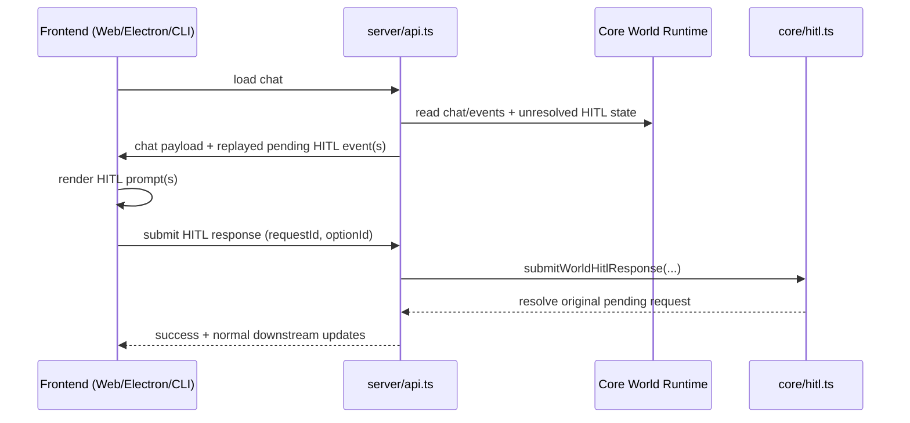

# AP: Remove HITL Timeout/Retry and Replay Pending HITL on Chat Load

**Date:** 2026-02-24  
**Status:** Planned  
**Related REQ:** `.docs/reqs/2026-02-24/req-hitl-no-timeout-replay-on-chat-load.md`

## Overview

Implement a deterministic HITL lifecycle where pending requests are never auto-failed or auto-retried by timeout/retry logic, and unresolved HITL requests are replayed when a chat is loaded so frontend clients can present user input prompts again.

This plan preserves existing option-based HITL contracts and avoids introducing new HITL request identities during replay.

## Current Baseline

- Core HITL runtime supports pending option requests and explicit user responses.
- Server chat-load endpoint returns chat/event context for frontend rehydration.
- Clients already parse/render `hitl-option-request` events and manage local HITL queues.
- Existing timeout/retry patterns may still influence request lifecycle behavior in specific paths.

## Target Behavior

1. Pending HITL requests remain pending until explicit user response/cancel path resolves them.
2. No timeout-driven HITL auto-fail/auto-complete and no automatic HITL retry.
3. On chat load, unresolved HITL requests in the loaded scope are replayed as `hitl-option-request` events.
4. Replay uses original request IDs and does not create duplicate pending records.
5. Replay is strictly scoped to loaded world/chat context and excludes out-of-scope pending requests.
6. When multiple unresolved requests are replayed, replay order is deterministic and stable.
7. Scope of this change is in-process pending HITL state (no restart-persistence behavior changes).

## End-to-End Flow



## Affected Areas

```
core/hitl.ts                                      — remove timeout/retry behaviors from request lifecycle and preserve durable pending state
core/events/* (publishers / adapters if needed)   — replay emission hooks for unresolved HITL requests
server/api.ts                                     — load-chat path to include/replay unresolved HITL requests
web/src/domain/hitl.ts                            — ensure replayed pending events rehydrate queue idempotently
web/src/pages/World*.ts*                          — verify chat-load handling and no duplicate prompt records
electron/main-process/realtime-events.ts          — verify replay event forwarding during chat load/subscription restore
electron/renderer/src/domain/chat-event-handlers.ts — verify replay ingestion + queue dedupe by requestId
cli/hitl.ts / cli/index.ts                        — verify replayed prompts are parsed and resolved against original request IDs
tests/core/hitl*.test.ts                          — no-timeout/no-retry + durable pending behavior
tests/server/*                                    — load-chat replay behavior and idempotency assertions
tests/web/* and tests/electron/*                  — replay prompt visibility + duplicate-protection behavior
```

## Phases and Tasks

### Phase 1 — Remove HITL timeout/retry lifecycle behavior
- [x] Identify all HITL timeout and retry code paths (core + server orchestration).
- [x] Remove/disable timeout-driven HITL auto-fail, auto-cancel, and auto-complete transitions.
- [x] Remove/disable HITL automatic retry logic for unresolved requests.
- [x] Ensure unresolved HITL requests remain pending until explicit response/cancel.
- [x] Preserve backward-compatible behavior for non-HITL timeouts.

### Phase 2 — Add unresolved HITL replay on chat load
- [x] Extend chat-load flow to detect unresolved HITL requests in loaded chat scope.
- [x] Re-emit/replay unresolved requests as `hitl-option-request` with original request IDs.
- [x] Ensure replay payload includes required existing prompt metadata/options.
- [x] Make replay idempotent and side-effect free for persistence (no duplicate pending records).
- [x] Enforce replay scope filter (loaded world/chat only).
- [x] Enforce deterministic replay ordering for unresolved requests.

### Phase 3 — Client ingestion hardening for replay
- [x] Verify web queue dedupe by `requestId` for replayed events.
- [x] Verify electron queue dedupe by `requestId` for replayed events.
- [x] Verify CLI parser/selector accepts replayed events without creating duplicate pending prompts.
- [x] Ensure resolved replayed prompts clear original pending request entries.

### Phase 4 — Tests
- [x] Core tests: pending HITL survives elapsed time without auto-fail/retry.
- [x] Core tests: replayed request resolves original request ID.
- [ ] Server tests: load-chat emits replay events for unresolved HITL requests.
- [ ] Server tests: repeated load-chat does not duplicate pending request records.
- [x] Web/Electron tests: replayed prompt appears and is actionable.
- [x] Regression tests: non-HITL chat load/message flows unchanged.

### Phase 5 — Documentation and changelog
- [x] Update `docs/hitl-approval-flow.md` with durable-pending + chat-load replay behavior.
- [x] Add changelog entry describing HITL timeout/retry removal and replay-on-load recovery.

## Architecture Review (AR)

### High-Priority Issues

1. **Lifecycle ambiguity risk**: timeout/retry can produce inconsistent terminal states for pending HITL requests.
2. **Replay duplication risk**: repeated chat loads can create duplicate UI prompts or duplicate persistence records.
3. **Scope mismatch risk**: replaying unresolved requests outside the loaded chat scope may surface incorrect prompts.
4. **Durability assumption risk**: pending HITL requests are currently process-local, so replay-after-restart is not guaranteed.
5. **Ordering risk**: unresolved requests replayed in unstable order can cause inconsistent frontend UX.

### Resolutions in Plan

1. Normalize HITL lifecycle to explicit resolution only (response/cancel).
2. Require replay idempotency keyed by original `requestId` and no persistence duplication.
3. Scope unresolved request discovery/replay to loaded chat context.
4. Explicitly keep change scoped to in-process pending request recovery.
5. Add deterministic ordering rule for replay of unresolved requests.

### Tradeoffs

- **Durable pending + replay (selected)**
  - Pros: deterministic state model; robust UX recovery after reload/navigation.
  - Cons: requires strict dedupe discipline across clients.
- **Timeout/retry lifecycle (rejected)**
  - Pros: automatic cleanup of stale pending requests.
  - Cons: hidden state transitions and prompt-loss risk.

## Acceptance Mapping to REQ

- REQ 1-3: Phase 1 (remove timeout/retry; durable pending).
- REQ 4-7: Phase 2 (chat-load unresolved detection + replay payload integrity).
- REQ 8-10: Phases 2-3 (idempotent replay; no false resolution; original-ID resolution).
- REQ 11-12: Phases 4-5 (audit/history consistency + non-HITL compatibility/regression).
- REQ 13-15: Phases 2-4 (scope-safe replay, deterministic ordering, frontend-observable replay).

## Verification Commands (planned)

- `npx vitest --run tests/core/hitl.test.ts`
- `npm test`

(Additional targeted web/electron/server test commands will be selected based on existing test file layout during SS.)
