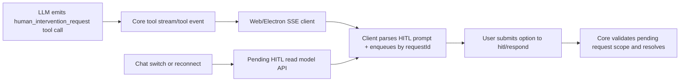

# Architecture Plan: HITL Tool-Call-Driven UI (Remove System-Event Replay Dependency)

## Overview

Refactor HITL prompt delivery so frontend clients derive prompt UI from streamed `human_intervention_request` tool-call data. Replace HITL-specific event replay dependency with a deterministic pending-prompt read model for reconnect/chat-switch restoration.

## Architecture Decisions

- **AD-1:** Tool-call stream is the primary HITL prompt trigger in clients.
- **AD-2:** A stable request identity (`requestId`) is mandatory in tool-call-facing payloads for HITL submissions.
- **AD-3:** Pending prompt restoration uses explicit state read (current pending requests), not historical event replay.
- **AD-4:** Non-HITL system-event handling stays unchanged.

## Target Components

```
core/
  hitl.ts                    (pending HITL state + list/read model)
  hitl-tool.ts               (tool arguments/result identity contract)
  events/publishers.ts       (tool/SSE payload shape as needed)

server/
  api.ts                     (chat switch and pending HITL API payload contract)
  sse-handler.ts             (remove HITL-specific system-event bypass once migrated)

web/src/
  pages/World.update.ts      (derive HITL queue from streamed tool call events)
  domain/hitl.ts             (tool-call parsing + queue dedupe)
  utils/sse-client.ts        (route tool events needed for prompt rendering)
```

## Data Flow



## Implementation Phases

### Phase 1: Contract Definition
- [ ] Define canonical HITL tool-call prompt payload fields required by clients.
- [ ] Guarantee stable `requestId` visibility to frontend from tool-call path.
- [ ] Define/confirm pending HITL read model response for chat-scoped restoration.

### Phase 2: Frontend Prompt Source Migration
- [ ] Add parser for HITL prompt data from tool-call stream/events.
- [ ] Enqueue/dequeue prompts by `requestId` with duplicate protection.
- [ ] Switch prompt display path to tool-call-derived data as primary source.

### Phase 3: Restoration Path Hardening
- [ ] Use pending HITL read model during init/chat switch to restore unresolved prompts.
- [ ] Ensure restoration does not depend on replayed system events.
- [ ] Verify active chat scoping and no cross-chat leakage.

### Phase 4: Event Replay Decoupling
- [ ] Remove HITL-specific system-event replay bypass logic after migration confidence.
- [ ] Remove obsolete HITL replay plumbing in API/frontend paths.
- [ ] Keep non-HITL system events untouched.

### Phase 5: Validation & Regression Tests
- [ ] Add/adjust tests for tool-call-driven prompt rendering.
- [ ] Add/adjust tests for reconnect/chat-switch pending-prompt restoration.
- [ ] Run targeted HITL/web-domain tests, then full `npm test`.

## Risks and Mitigations

| Risk | Mitigation |
|------|------------|
| Tool stream payload lacks enough prompt metadata | Add explicit HITL prompt fields in tool-facing event contract |
| Missing request identity breaks response endpoint | Make `requestId` mandatory and validate contract with tests |
| Prompt duplication from repeated stream chunks | Queue dedupe by `requestId` in client domain helper |
| Regression for non-HITL system events | Scope changes strictly to HITL flow and keep existing system handlers |

## AR Notes (Review Outcome)

- Major flaw checked: removal of replay without state restoration path.
  - Action: restoration is a required phase before replay decoupling.
- Major flaw checked: identity mismatch between tool call id and HITL request id.
  - Action: explicit contract requiring stable request identity exposed to clients.
- Exit condition: no high-priority architecture flaw remains if Phase 1 contract is implemented before frontend cutover.
