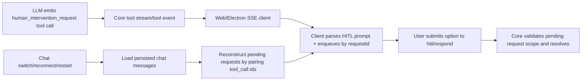

# Architecture Plan: HITL Tool-Call-Driven UI (Remove System-Event Replay Dependency)

**Last Updated:** 2026-02-25  
**Status:** Implemented

## Overview

Refactor HITL prompt delivery so frontend clients derive prompt UI from streamed `human_intervention_request` tool-call data, and restore unresolved prompts by reconstructing pending state from persisted raw tool-call request/response messages. Do not add a dedicated HITL persistence store.

## Architecture Decisions

- **AD-1:** Tool-call stream is the primary HITL prompt trigger in clients.
- **AD-2:** A stable request identity is mandatory and MUST align with tool-call identity (`requestId === toolCallId`, or deterministic reversible mapping).
- **AD-3:** Pending prompt restoration is derived from persisted raw tool-call request/response message pairing, not historical event replay.
- **AD-4:** Non-HITL system-event handling stays unchanged.
- **AD-5:** No dedicated HITL persistence table/store is introduced.

## Target Components

```
core/
  hitl.ts                    (pending HITL state + list/read model)
  hitl-tool.ts               (tool arguments/result identity contract)
  events/memory-manager.ts   (assistant tool_call + tool result persistence semantics)

server/
  api.ts                     (chat switch restore contract based on persisted message parsing)
  sse-handler.ts             (remove HITL-specific system-event bypass once migrated)

web/src/
  pages/World.update.ts      (derive HITL queue from streamed tool call events)
  domain/hitl.ts             (tool-call parsing + queue dedupe + restore parsing)
  utils/sse-client.ts        (route tool events needed for prompt rendering)
```

## Data Flow



## Implementation Phases

### Phase 1: Contract Definition
- [x] Define canonical HITL tool-call prompt payload fields required by clients.
- [x] Enforce request identity alignment (`requestId === toolCallId`) for deterministic submission pairing.
- [x] Define persisted-message pairing contract for pending reconstruction (assistant tool_call id ↔ tool response `tool_call_id`).

### Phase 2: Frontend Prompt Source Migration
- [x] Add parser for HITL prompt data from streamed tool-call events.
- [x] Enqueue/dequeue prompts by request identity with duplicate protection.
- [x] Switch prompt display path to tool-call-derived data as primary source.

### Phase 3: Restoration Path Hardening
- [x] Implement restoration by scanning persisted chat messages and reconstructing unresolved HITL prompts.
- [x] Ensure restoration does not depend on replayed system events or dedicated HITL store.
- [x] Verify active chat scoping and no cross-chat leakage.

### Phase 4: Event Replay Decoupling
- [x] Remove HITL-specific system-event replay bypass logic after migration confidence.
- [x] Remove obsolete HITL replay plumbing in API/frontend paths and move chat activation to core snapshot API.
- [x] Keep non-HITL system events untouched.

### Phase 5: Validation & Regression Tests
- [x] Add/adjust tests for tool-call-driven prompt rendering.
- [x] Add/adjust tests for restore-time reconstruction from persisted messages.
- [x] Add tests proving pending/resolved status is correct from request/response pairing.
- [ ] Run targeted HITL/web-domain tests, then full `npm test`.

## Implementation Notes (2026-02-25)

- Added core `activateChatWithSnapshot` to unify restore + memory + pending HITL prompt selection.
- Updated server/electron chat selection to consume core snapshot output rather than route-local replay reconstruction.
- Added runtime pending HITL replay for Electron chat subscriptions, with persisted-message reconstruction fallback.
- Added persisted synthetic `human_intervention_request` tool-call/tool-result messages for `load_skill` approval flow so prompt state survives reconnect/restart.

## Risks and Mitigations

| Risk | Mitigation |
|------|------------|
| Tool stream payload lacks enough prompt metadata | Add explicit HITL prompt fields in tool-facing event contract |
| Request identity mismatch (`requestId` vs `toolCallId`) breaks response pairing | Enforce identity alignment and add invariants/tests |
| Restored pending prompts diverge from persisted reality | Derive pending from persisted request/response pair scan only |
| Prompt duplication from repeated stream chunks | Queue dedupe by `requestId` in client domain helper |
| Regression for non-HITL system events | Scope changes strictly to HITL flow and keep existing system handlers |

## Rollout Gate

- Enable removal completion only when:
  1) tool-call-driven UI tests pass,
  2) restore-time persisted-message reconstruction tests pass,
  3) request/response pairing tests pass for pending/resolved determination,
  4) no regression is observed in non-HITL system events.

## Rollback Strategy

- If prompt visibility regresses, temporarily keep live tool-call prompt rendering but disable restore reconstruction changes and fall back to prior restore behavior until pairing logic is fixed.

## AR Notes (Review Outcome)

- Major flaw checked: restore path depending on process-local pending state loses unresolved prompts after restart.
  - Action: require persisted raw message reconstruction for restore.
- Major flaw checked: identity mismatch between tool call id and HITL request id can break deterministic pending/resolved checks.
  - Action: enforce identity alignment and cover with tests.
- Major flaw checked: introducing a dedicated HITL store would duplicate authority and increase drift risk.
  - Action: prohibit extra HITL store; use existing persisted raw tool messages as source of truth.
- Exit condition: no high-priority architecture flaw remains when pending/resolved determination is reproducible from persisted raw request/response pairs.

## SS Notes (Solution Strategy)

- SS-1: Keep streamed tool events as the only live prompt source.
- SS-2: On restore, parse persisted assistant `human_intervention_request` tool calls and match with persisted tool-role responses by `tool_call_id`.
- SS-3: Treat unmatched requests as pending and enqueue them in client UI.
- SS-4: Keep submission endpoint contract stable while enforcing identity alignment internally.
