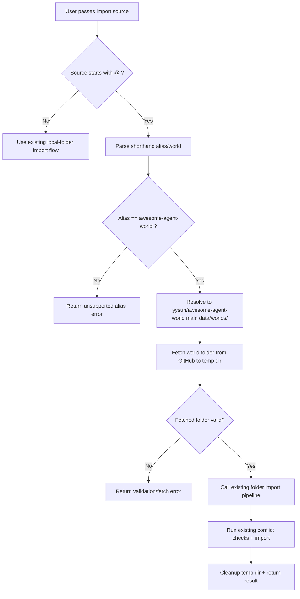

# Architecture Plan: Import World from GitHub Shorthand

**Date**: 2026-02-25  
**Type**: Feature Enhancement  
**Status**: SS Complete (core implementation), optional validation tasks remaining  
**Related Requirement**: `../reqs/2026-02-25/req-import-world-from-github.md`

## Overview

Implement GitHub shorthand world import support for `@awesome-agent-world/<world-name>` by adding a deterministic shorthand resolver and a GitHub fetch-to-temp-folder stage that feeds the existing local-folder import pipeline unchanged.

## Architecture Decisions

- Reuse existing world-folder import validation and conflict handling as the canonical import path.
- Add a narrow resolver for one approved alias only: `awesome-agent-world -> yysun/awesome-agent-world`.
- Fetch source world files from GitHub into a temporary local folder, then invoke current folder import path.
- Keep local-folder import behavior unchanged.
- Keep implementation function-based and scoped to existing import surfaces.

## AR Review Outcome (AP)

- **Status:** ✅ Approved for implementation.
- **Guardrail 1:** Do not create a separate import codepath that bypasses current validation/conflict logic.
- **Guardrail 2:** Restrict shorthand alias mapping to approved repository mapping from REQ.
- **Guardrail 3:** Ensure temp files are cleaned up on both success and failure.
- **Guardrail 4:** Return explicit user-facing errors for shorthand parse failures and GitHub fetch/path failures.
- **Guardrail 5:** Harden remote materialization against path traversal/symlink abuse before handing off to import logic.
- **Guardrail 6:** Enforce bounded fetch limits (file count/bytes) and return explicit limit-exceeded errors.
- **Guardrail 7:** Emit source traceability metadata (repo/branch/path + commit SHA when available).

## Scope Map

- **In scope:**
  - Parsing and resolving `@awesome-agent-world/<world-name>`.
  - GitHub fetch of `data/worlds/<world-name>` from `yysun/awesome-agent-world` branch `main`.
  - Temp-folder staging and handoff to existing folder import flow.
  - Error handling and tests for resolver/fetch/integration.
- **Out of scope:**
  - Arbitrary GitHub shorthand support for any repo.
  - World schema/versioning changes.
  - Auto-sync/update of imported remote worlds.

## Delivery Flow

## Implementation Phases

### Phase 1: Locate and Isolate Import Entry Points
- [x] Identify all world import entry points (CLI/API/Electron/web integration points).
- [x] Define a single source-type discriminator (`local-folder` vs `github-shorthand`) at import boundary.
- [x] Keep existing local-folder pathway behavior and signatures unchanged.

### Phase 2: Shorthand Resolver Module
- [x] Add resolver utility for `@awesome-agent-world/<world-name>` parsing.
- [x] Validate format and world name segment presence.
- [x] Resolve to `{ owner, repo, branch, worldPath }` with fixed mapping:
  - `owner: yysun`
  - `repo: awesome-agent-world`
  - `branch: main`
  - `worldPath: data/worlds/<world-name>`
- [x] Emit structured error reasons for invalid format and unsupported alias.

### Phase 3: GitHub Fetch + Temp Staging
- [x] Add fetch utility to retrieve resolved world folder contents from GitHub.
- [x] Materialize fetched files into a temp directory preserving world folder shape.
- [x] Validate presence/readability of fetched folder before import handoff.
- [x] Reject unsafe fetched entries (path traversal, absolute paths, unsupported symlinks).
- [x] Enforce max downloaded bytes and max file-count limits.
- [x] Capture commit SHA from fetch response when available for diagnostics.
- [x] Ensure cleanup of temp resources in `finally` path.

### Phase 4: Import Pipeline Integration
- [x] Pipe staged folder into the existing folder import function.
- [x] Reuse existing world validation and conflict handling unchanged.
- [x] Preserve existing import result payload shape where possible.
- [x] Add source metadata in non-breaking way for diagnostics (optional fields only).

### Phase 5: UX/Error Surface
- [x] Map resolver/fetch errors to actionable user messages.
- [x] Include resolved source context in debug-friendly detail (repo/branch/path).
- [x] Include resolved commit SHA in diagnostics/result metadata when available.
- [x] Ensure unsupported shorthand alias errors are explicit and safe.

### Phase 6: Tests
- [x] Add resolver unit tests:
  - valid shorthand parse
  - invalid format
  - unsupported alias
  - missing world segment
- [ ] Add fetch/integration tests with mocked GitHub responses.
- [x] Add import-path tests proving shorthand goes through existing validation/conflict path.
- [x] Add regression tests proving local-folder imports are unchanged.
- [x] Keep tests in-memory/mocked per project unit test rules.

## Expected File Scope

- `core/` import orchestration files (existing world import path)
- `core/` new resolver/fetch helper utilities (if introduced)
- `cli/` command import source handling (if CLI path requires parsing support)
- `server/` import endpoint handling (if API path requires parsing support)
- `electron/main-process/` import bridge wiring (if Electron calls import boundary directly)
- `web/src/` only if request payload/UI source handling needs update
- `tests/` resolver + import integration/regression tests

## Risks and Mitigations

1. **Risk:** GitHub API/rate-limit/network instability.
   - **Mitigation:** fail fast with clear retryable errors; keep local import unaffected.
2. **Risk:** Temp staging leaks files on failure.
   - **Mitigation:** mandatory `finally` cleanup with best-effort deletion.
3. **Risk:** Divergent logic between shorthand import and local import.
   - **Mitigation:** funnel shorthand into existing folder import function only.
4. **Risk:** Ambiguous user expectations for custom aliases.
   - **Mitigation:** explicit unsupported-alias error plus guidance to use local-folder import.
5. **Risk:** Malicious archive/content entry escapes temp root or uses symlink tricks.
  - **Mitigation:** canonical path checks + symlink rejection before file write.
6. **Risk:** Large remote payload causes resource pressure or partial import behavior.
  - **Mitigation:** enforce strict file-count/byte limits and fail before import handoff.
7. **Risk:** Non-reproducible troubleshooting when `main` changes between attempts.
  - **Mitigation:** capture and surface commit SHA when fetch source provides it.

## Validation Plan

- [x] Unit: shorthand resolver behavior matrix.
- [ ] Unit: fetcher failure/success mapping (mocked responses).
- [x] Unit: unsafe path/symlink rejection in fetch materialization.
- [ ] Unit: file-count and byte-limit enforcement.
- [x] Integration: shorthand import of `infinite-etude` path resolves and enters existing import pipeline.
- [x] Regression: local-folder import behavior unchanged.
- [ ] Manual smoke (optional): run import with `@awesome-agent-world/infinite-etude` in primary user flow.

## Exit Criteria

- [x] `@awesome-agent-world/infinite-etude` imports successfully through the standard import semantics.
- [x] Invalid shorthand/unsupported alias/fetch failures return clear actionable errors.
- [x] Local-folder import path remains behaviorally unchanged.
- [ ] Tests cover resolver, fetch integration, and regression surface.

## Progress Notes

- 2026-02-25: Implemented `core/storage/github-world-import.ts` with shorthand resolution, GitHub contents traversal, path safety checks, byte/file limits, temp staging, and cleanup.
- 2026-02-25: Integrated shorthand source handling in CLI `loadWorldFromFile` flow; remote shorthand imports auto-stage then import through existing folder pipeline.
- 2026-02-25: Added CLI fallback so non-existent local source input automatically attempts `@awesome-agent-world/<input>` before failing.
- 2026-02-25: Extended Electron `world:import` contract/route/handler to accept optional source payload and reuse the same secure staging path without changing existing UI invocation.
- 2026-02-25: Added `tests/core/github-world-import.test.ts` and ran targeted Electron IPC + utility tests successfully.
