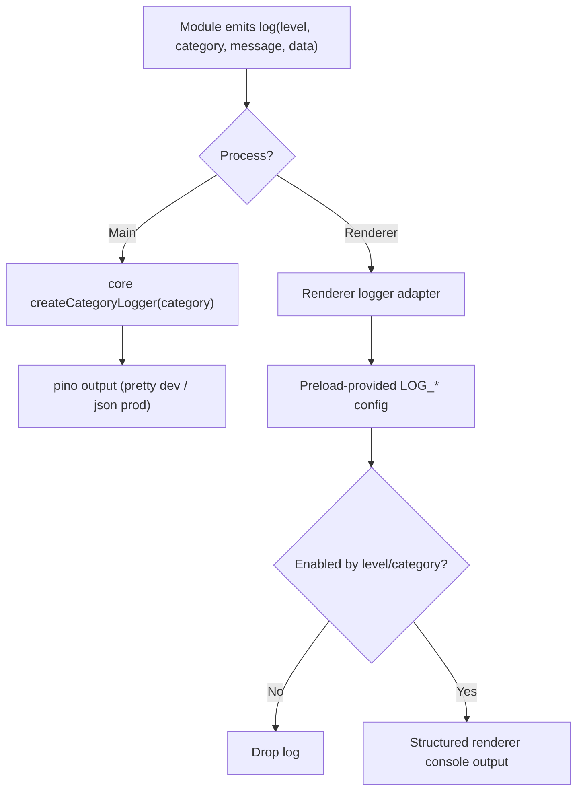

# AP: Electron Main/Renderer Env-Controlled Categorized Logging

**Date:** 2026-02-26  
**Status:** Implemented  
**Related REQ:** `.docs/reqs/2026-02-26/req-electron-logging-controls.md`

## Overview

Replace ad-hoc Electron `console.*` traces with structured, categorized logging in both main and renderer, while keeping runtime behavior unchanged and log verbosity fully environment-controlled.

## Current Baseline

1. Core/API already use `pino`-backed category logging (`core/logger.ts`) with `LOG_LEVEL` + `LOG_{CATEGORY}` hierarchical resolution.
2. Electron main currently has several raw `console.log|warn|error` traces in IPC/session/realtime paths.
3. Electron renderer currently has raw `console.log|warn|error` traces in app/session/subscription hooks.
4. Renderer cannot safely depend on direct `process.env` reads in app code; runtime config must be bridged safely.

## Architecture Decisions

- **AD-1:** Reuse existing core logger contract for Electron main (`createCategoryLogger`) so level semantics and structured output match API/core behavior.
- **AD-2:** Introduce explicit Electron category taxonomy aligned with current hierarchy:
  - Main examples: `electron.main.ipc`, `electron.main.realtime`, `electron.main.lifecycle`
  - Renderer examples: `electron.renderer.session`, `electron.renderer.subscription`, `electron.renderer.messages`
- **AD-3:** Keep environment control on existing `LOG_*` keys and hierarchical matching behavior (no separate logging config system).
- **AD-4:** Provide renderer log-config through preload-safe bridge data (not direct renderer `process.env` access), preserving context isolation.
- **AD-5:** Use a renderer logger adapter with structured payloads and category/level filtering; use `pino/browser` only where it cleanly fits bundling/runtime constraints.
- **AD-6:** Apply shared sanitization rules for sensitive fields before emitting structured metadata.

## Target Flow

## Implementation Phases

### Phase 1: Shared Contract and Category Map
- [x] Define Electron logging category map and naming rules in shared/electron-local constants.
- [x] Define minimal shared log-event shape (`level`, `category`, `message`, `data`, `process`).
- [x] Define shared redaction utility for common sensitive keys.

### Phase 2: Main Process Migration
- [x] Wire main logging helpers with `createCategoryLogger` from core exports.
- [x] Replace targeted raw `console.*` traces in:
  - `electron/main-process/ipc-handlers.ts`
  - `electron/main-process/realtime-events.ts`
  - (Any remaining main startup/runtime traces in `electron/main.ts` touched by this scope)
- [x] Preserve existing message content while converting to structured fields.

### Phase 3: Renderer Logging Runtime
- [x] Add preload-exposed logging config read model derived from environment (`LOG_LEVEL`, `LOG_*`).
- [x] Add renderer logger adapter with category + level filtering and structured output.
- [x] Migrate targeted renderer traces in:
  - `electron/renderer/src/App.tsx`
  - `electron/renderer/src/hooks/useSessionManagement.ts`
  - `electron/renderer/src/hooks/useChatEventSubscriptions.ts`

### Phase 4: Bridge and Typing Updates
- [x] Extend shared bridge typings/contracts for renderer-safe log config access.
- [x] Update preload bridge tests for new contract surface.
- [x] Ensure no security regression (context isolation remains intact, no unrestricted env exposure).

### Phase 5: Tests
- [x] Main tests: validate converted paths log through injected/category logger behavior (not raw console usage).
- [x] Preload tests: validate log-config exposure contract and shape.
- [x] Renderer tests: validate category/level gating and structured output behavior.
- [x] Regression: verify no user-visible behavior changes beyond logging output.

### Phase 6: Docs and Config
- [x] Update `.env.example` with Electron category examples.
- [x] Update `docs/logging-guide.md` category table with Electron categories and usage.

## Expected File Scope

- `electron/main-process/ipc-handlers.ts`
- `electron/main-process/realtime-events.ts`
- `electron/main.ts` (if residual trace conversion is needed)
- `electron/preload/bridge.ts`
- `electron/shared/ipc-contracts.ts`
- `electron/renderer/src/App.tsx`
- `electron/renderer/src/hooks/useSessionManagement.ts`
- `electron/renderer/src/hooks/useChatEventSubscriptions.ts`
- New Electron logging utility files under `electron/preload/*` and/or `electron/renderer/src/utils/*`
- `tests/electron/main/*`
- `tests/electron/preload/preload-bridge.test.ts`
- `tests/electron/renderer/*` (new/updated)
- `.env.example`
- `docs/logging-guide.md`

## Verification Plan

- `npx vitest run tests/electron/main/main-ipc-handlers.test.ts tests/electron/main/main-realtime-events.test.ts tests/electron/preload/preload-bridge.test.ts`
- `npm run check --prefix electron`
- `npm run check`

## Architecture Review (AR)

### High-Priority Issues Found

1. Renderer log-level control can fail if implementation depends on direct renderer `process.env`.
2. Category names can drift between main and renderer, breaking `LOG_*` filter predictability.
3. Sensitive payloads may leak if ad-hoc object logging is migrated without redaction.
4. Introducing `pino` in renderer blindly can create bundling/runtime friction.

### AR Fixes Applied

1. Updated REQ to require renderer env-derived config without direct renderer `process.env` access.
2. Updated REQ to require `LOG_*` compatibility and hierarchical overrides for Electron logging.
3. Added explicit AD/phase tasks for shared category map and redaction.
4. Chose adapter strategy for renderer with `pino/browser` as conditional fit, avoiding hard coupling where unnecessary.

### Options and Tradeoffs

1. **Option A: Pino in main + pino/browser in renderer (selected with guardrails)**
   - Pros: closest parity with API/core semantics.
   - Cons: renderer bundling/type integration must be verified.
2. **Option B: Pino in main + console wrapper in renderer**
   - Pros: lower renderer dependency risk.
   - Cons: weaker parity with structured logger behavior.
3. **Option C: Forward all renderer logs to main for centralized logging**
   - Pros: single logging backend and config authority.
   - Cons: extra IPC overhead and potential event-volume noise.

### AR Exit Condition

No unresolved high-priority architecture flaw remains for AP stage; move to SS once approved.
