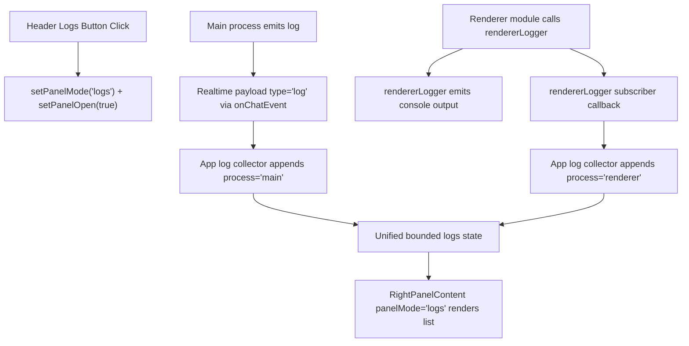

# AP: Electron Header Logs Button and Unified Right-Panel Logs View

**Date:** 2026-02-27  
**Status:** Draft (AP)  
**Related REQ:** `.docs/reqs/2026-02-27/req-electron-header-logs-panel.md`

## Overview

Replace the header refresh button with a logs button that opens the right panel in a new `logs` mode and displays a unified in-app log stream composed of both Electron `main` process logs and `renderer` process logs.

## Current Baseline

1. Header refresh action is wired in `MainHeaderBar` and currently calls `onRefreshWorldInfo`.
2. Left sidebar world info has its own refresh action (`WorldInfoCard`) and already refreshes world details via `onRefreshWorldInfo`.
3. Main-process logs already enter renderer through realtime payloads of `type: 'log'` via `api.onChatEvent(...)`.
4. Renderer logs are emitted through `rendererLogger` to console only and are not exposed to UI state.
5. Right panel supports mode-based rendering (`settings`, `import-world`, `edit-world`, `create-agent`, `edit-agent`, `create-world`) but has no logs mode.

## Architecture Decisions

- **AD-1:** Keep world refresh behavior unchanged in left sidebar (`WorldInfoCard`), and only replace the header refresh affordance.
- **AD-2:** Introduce a new right-panel mode: `logs`.
- **AD-3:** Use a unified renderer-side log-entry model for panel rendering:
  - `process` (`main` | `renderer`)
  - `level`, `category`, `message`, `timestamp`, optional `data`
- **AD-4:** Capture main logs from existing realtime `type: 'log'` events without coupling to selected chat message rendering.
- **AD-5:** Extend `rendererLogger` with listener/subscription capability so renderer logs can be surfaced to UI while preserving existing console output behavior.
- **AD-6:** Use bounded in-memory buffering (ring/cap) for log entries to avoid unbounded growth and UI slowdown.

## Target Flow

## Implementation Phases

### Phase 1: Panel Mode and Header Action Wiring
- [ ] Add `logs` panel mode support in right-panel title and mode handling.
- [ ] Replace header refresh icon/button behavior with a logs button that opens logs mode.
- [ ] Add/route `onOpenLogsPanel` action from app action handlers into header props.
- [ ] Ensure left-sidebar `WorldInfoCard` refresh remains untouched and functional.

### Phase 2: Unified Logs State in App Orchestration
- [ ] Introduce app-level logs state for panel rendering.
- [ ] Define normalized log entry type/shape for UI rendering.
- [ ] Add bounded append helper (cap, e.g. 300–1000 entries) to control memory/paint cost.

### Phase 3: Main-Process Log Ingestion for Panel
- [ ] Extend global log event handling path to also publish main logs into unified logs state.
- [ ] Remove active-session dependency for the panel log collector path so main logs are visible even when no chat is selected.
- [ ] Keep existing chat message log behavior intact (session filtering and suppression logic for message timeline remains unchanged).

### Phase 4: Renderer Log Ingestion for Panel
- [ ] Add `rendererLogger` subscribe/unsubscribe API for UI consumers.
- [ ] Emit normalized renderer log events to subscribers after category/level gating and sanitization.
- [ ] Subscribe in App lifecycle and append renderer logs to unified logs state; clean up on unmount.

### Phase 5: Right-Panel Logs UI
- [ ] Add a `logs` render branch in `RightPanelContent`.
- [ ] Render unified logs with source-process, level, timestamp, category, and message.
- [ ] Render structured data payload safely (`JSON.stringify` guarded) with readable formatting.
- [ ] Add minimal controls needed for diagnostics usability (for example clear list) if low-risk.

### Phase 6: Verification and Regression Coverage
- [ ] Update/add tests for main-log collector behavior in `chat-event-handlers` domain tests.
- [ ] Update/add tests for renderer logger subscriptions and emitted payload shape.
- [ ] Verify header action now opens logs panel and no longer triggers world refresh.
- [ ] Verify left sidebar world refresh still triggers `onRefreshWorldInfo`.

## Expected File Scope

- `electron/renderer/src/components/MainHeaderBar.tsx`
- `electron/renderer/src/components/RightPanelShell.tsx`
- `electron/renderer/src/components/RightPanelContent.tsx`
- `electron/renderer/src/hooks/useAppActionHandlers.ts`
- `electron/renderer/src/hooks/useChatEventSubscriptions.ts`
- `electron/renderer/src/domain/chat-event-handlers.ts`
- `electron/renderer/src/utils/logger.ts`
- `electron/renderer/src/utils/app-layout-props.ts`
- `electron/renderer/src/App.tsx`
- `tests/electron/renderer/chat-event-handlers-domain.test.ts`
- `tests/electron/renderer/renderer-logger.test.ts`

## Risks and Mitigations

1. **Risk:** Main logs tied only to selected session are missing in panel.
   - **Mitigation:** Add dedicated panel log collector path independent of chat session filters.
2. **Risk:** Renderer log subscription causes duplicate/noisy entries.
   - **Mitigation:** Emit once at logger adapter boundary and keep bounded buffer with deterministic append logic.
3. **Risk:** High-volume logging degrades panel rendering.
   - **Mitigation:** Cap log buffer and keep rendering lightweight.
4. **Risk:** Replacing header refresh could remove useful refresh behavior.
   - **Mitigation:** Preserve left-sidebar refresh behavior and explicitly verify it.

## Validation Plan

- [ ] Manual: Click header logs button -> right panel opens in logs mode.
- [ ] Manual: Confirm left sidebar world refresh still refreshes world info.
- [ ] Manual: Trigger known renderer log and confirm it appears in logs panel with `process=renderer`.
- [ ] Manual: Trigger known main log and confirm it appears in logs panel with `process=main`.
- [ ] Automated: renderer domain tests pass for log collector + renderer logger subscriber behavior.

## AR Review (AP Stage)

### High-Priority Issues Found

1. Existing global log handler currently drops logs when there is no active session, which conflicts with unified diagnostics visibility.
2. Renderer logs are only emitted to console and have no UI-observable channel.
3. Header refresh replacement risks accidental removal of world refresh access if sidebar path is changed unintentionally.

### AR Fixes Applied to Plan

1. Added dedicated panel log ingestion path independent of selected-session constraints.
2. Added renderer logger subscription channel as explicit phase and test target.
3. Constrained change scope so only header action is replaced; sidebar world refresh remains intact and verified.

### AR Exit Condition

No unresolved high-priority architecture flaw remains for implementation start. Ready for SS after approval.
