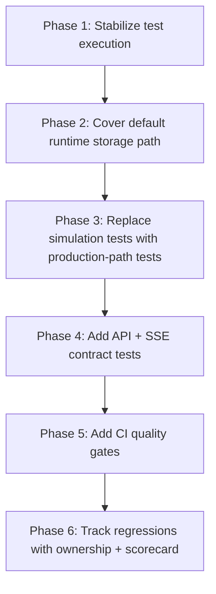

# Architecture Plan: Targeted Test Coverage Hardening

**Date:** 2026-02-27  
**Status:** Planning  
**Owner:** Core Platform / Runtime Reliability

## Objective

Increase confidence in critical runtime behavior by replacing simulation-style tests with direct behavioral tests, repairing broken integration suites, and covering default runtime paths (SQLite + MCP + SSE).

## Scope

In scope:
- Unit/integration test architecture and execution wiring
- Core runtime modules with low behavioral confidence
- API/streaming behavior tests for production handlers
- CI gating for coverage and failing suites

Out of scope:
- Product feature changes
- UI redesign
- Broad refactors unrelated to testability

## Current Risk Summary

- Integration suites are not part of default `npm test` and currently failing.
- SQLite path is default runtime backend but has near-zero behavioral execution in coverage runs.
- Queue and MCP tests include simulation/documentation tests that do not execute production logic.
- Several API tests validate copied schemas instead of live route handlers, enabling drift.
- Coverage is scoped to `core/**` only with no enforced thresholds.

## Architecture Strategy

1. Stabilize execution pipeline first (integration suites runnable and deterministic).
2. Cover default runtime path next (SQLite + storage factory + migration + event storage).
3. Convert simulation tests to production-path behavioral tests.
4. Add contract-level API/SSE tests that exercise real handlers.
5. Add quality gates (coverage thresholds + suite wiring) last, after flake-free baseline.

## AR Review Notes (AP -> AR loop)

Major risk checks and decisions:

1. **Integration determinism risk**: Current WebSocket integration flow assumes a manually started server.
   - Decision: Prefer an in-process harness for CI determinism; keep manual smoke scripts optional.
2. **Storage confidence gap**: Default SQLite runtime path is under-tested.
   - Decision: Treat SQLite/storage-factory/event-storage coverage as release-blocking for this plan.
3. **False confidence risk**: Simulation-style tests can pass while production logic regresses.
   - Decision: Replace simulation tests on runtime-critical modules with direct module execution tests.
4. **Gate timing risk**: Turning on strict thresholds too early can block migration work.
   - Decision: Introduce thresholds after stabilization phases and ratchet upward incrementally.

No blocking architecture flaw remains for proceeding to implementation (`SS`) after approval.

## Implementation Plan

### Phase 1: Stabilize Test Execution (Highest Priority)

- [x] Fix integration suite imports and runtime dependencies.
- [x] Make `tests/integration/mcp-config.test.ts` vitest-compatible (imports + test globals).
- [x] Resolve `ws` dependency path for `tests/integration/ws-integration.test.ts` (or replace with deterministic local transport strategy if intentionally unsupported).
- [x] Align script naming/documentation mismatch (`README` currently references `test:integration`, package exposes `integration`).
- [x] Ensure integration suites can run in CI without manual server preconditions.

Acceptance criteria:
- [x] `npm run integration` passes consistently on clean checkout.
- [x] No manual external process required for integration runs.

### Phase 2: Cover Default Runtime Storage Path (Highest Priority)

- [x] Add targeted tests for `core/storage/storage-factory.ts` backend selection and initialization behavior.
- [x] Expand `core/storage/storage-factory.ts` branch coverage for wrapper fallbacks/error normalization and mocked sqlite delegation paths.
- [x] Add behavioral SQLite tests for `core/storage/sqlite-storage.ts` using in-memory SQLite only.
- [x] Add behavioral event storage tests for `core/storage/eventStorage/sqliteEventStorage.ts` with real module execution.
- [x] Add migration runner tests for `core/storage/migration-runner.ts` covering success, idempotency, and failure rollback expectations.
- [x] Add secure staging behavior tests for `core/storage/github-world-import.ts` (success path, limits, and cleanup on failure).
- [x] Expand `core/storage/agent-storage.ts` behavioral coverage for integrity/repair/retry/batch/delete-memory flows.
- [x] Expand `core/storage/eventStorage/fileEventStorage.ts` behavioral coverage for filtering/dedup/deletion/compaction flows.
- [x] Add direct behavioral tests for `core/storage/eventStorage/memoryEventStorage.ts` (sequence/filter/range/delete/stats paths).
- [x] Expand `core/storage/sqlite-storage.ts` branch coverage for agent/list/batch/delete/migration-path fallback edge behaviors.
- [x] Reactivate/replace stale suffixed legacy tests (`*.test.ts_`) with vitest-native suites.

Acceptance criteria:
- [x] SQLite-related modules are executed by tests (no 0% modules in these paths).
- [x] Critical CRUD and migration flows are validated through production code.

### Phase 3: Replace Simulation Tests With Production-Path Tests (High Priority)

- [x] Refactor queue tests to directly exercise `createMemoryQueueStorage` in `core/storage/queue-storage.ts`.
- [x] Replace MCP type-correction simulation tests with tests invoking exported production paths in `core/mcp-server-registry.ts`.
- [ ] Convert documentation-only manager tests into behavior/assertion tests with meaningful state transitions.
- [ ] Preserve unit-test constraints: in-memory storage and mocked LLM providers only.

Acceptance criteria:
- [ ] Tests fail when production logic regresses (not only when copied test logic changes).
- [ ] Queue and MCP confidence is based on real module execution.

### Phase 4: API + SSE Contract Testing (High Priority)

- [x] Add route-level tests that exercise real `server/api.ts` handlers instead of copied schema fragments.
- [x] Deepen `server/api.ts` route contracts for world/agent/chat/message/HITL/MCP error/success branches.
- [x] Add dedicated tests for `server/sse-handler.ts`:
  - [x] scoped chat filtering
  - [x] response lifecycle (`response-start`/`idle`/timeouts)
  - [x] tool/log forwarding and disconnect cleanup
- [x] Add non-streaming `/messages` event collection tests to verify chat scoping and contamination prevention.

Acceptance criteria:
- [x] API schema changes in production handlers are caught by tests automatically.
- [x] SSE behavior is validated by contract-level assertions.

High-value extension outcome:
- `server/api.ts` improved to ~63% line coverage with direct route-stack behavior tests.
- `core/events/memory-manager.ts` improved to ~76% line coverage through targeted continuation/persistence branch tests.

### Phase 5: Coverage and CI Gates (Medium Priority)

- [x] Expand coverage accounting beyond `core/**` for audit visibility (`server`, selected `web-domain`, selected `electron` domain utilities).
- [x] Introduce minimum thresholds for `core` statements/branches/functions and ratchet over time.
- [x] Fail CI on integration suite failures and threshold regressions.
- [x] Publish a small coverage scorecard per subsystem.

Acceptance criteria:
- [x] Coverage regressions fail CI.
- [x] Subsystem-level confidence is visible and actionable.

### Phase 6: Governance and Regression Control (Medium Priority)

- [ ] Add ownership mapping for critical test suites (storage, MCP, API, SSE).
- [ ] Add a “no simulation-only tests for runtime-critical paths” rule to testing docs.
- [ ] Create triage labels for flaky/slow/high-risk tests and weekly review cadence.

Acceptance criteria:
- [ ] Clear maintainers and escalation path for failing critical suites.
- [ ] New high-risk code paths include behavioral test additions by policy.

## Key Tradeoffs

- Adding deterministic integration coverage may slightly increase CI runtime.
- Stricter quality gates may initially block merges until baseline gaps are fixed.
- Converting simulation tests to production-path tests increases setup complexity but materially improves confidence.

## Dependencies

- Stable in-memory SQLite testing approach.
- Agreement on integration test strategy for WebSocket behavior (embedded harness vs external process).
- CI pipeline update access.

## Milestones

- M1: Integration suite green and deterministic.
- M2: SQLite + storage factory + migration paths covered with behavioral tests.
- M3: Queue/MCP simulation tests replaced.
- M4: API/SSE contract suite added.
- M5: Coverage thresholds active in CI.

## Exit Criteria

- No critical runtime module remains unexecuted in targeted domains.
- Integration tests are runnable and required in CI.
- Test failures map to production regressions, not copied/simulated logic drift.
